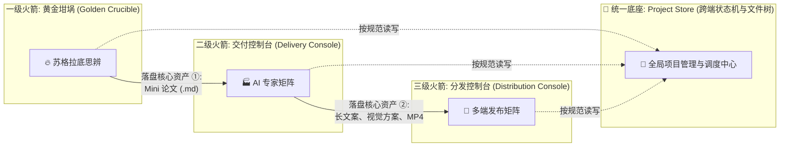

# 🚀 MindHikers 创作者工具矩阵 — 三级火箭系统架构总纲 (V3 版)

> **版本**: V3 Master
> **状态**: 持续演进的根文档 (Living Document)
> **目的**: 确立三级火箭的整体边界、全局数据契约、以及对开发团队 (OpenCode/GLM-5) 的工程约束。
> **阅读指南**: 本文档只规定全局契约。关于"写作大师怎么渲染 UI"、"发布流水线怎么校验状态"等**子模块的详细设计，请参阅本文档底部的子模块索引。**

---

## 1. 核心模型：三级火箭的边界拆分与“指控分离”

基于"高内聚、低耦合"的第一性原理，MindHikers 内容流转分为三大独立产品体系，并遵循**严苛的“大脑与双手分离 (Brain vs. Hands)”原则**（详见渲染解耦需求）：
- **大脑 (AI Agent 沙盒)**：只负责纯智力劳动，修改代码、生成配置 JSON。绝不允许越权操作系统物理资源。
- **双手 (Console 宿主进程)**：作为中场指挥部，监听指令并派发本地子进程执行高耗时渲染任务。



### 为什么这样拆分？
为确保**"随开新窗，按块讨论"**的工作模式可行，三大系统之间**不直接传参数**。
系统 A 只要把符合规范的文件丢到指定目录，系统 B 就能在它的生命周期里接手。哪怕系统 B 崩溃，系统 A 的产出依然安全。

---

## 2. 全局数据契约：统一目录树 (Unified Output Directory)

任何子模块的开发，都必须严格遵守以下目录结构规范。绝对禁止子模块将数据写在自己私有的数据库或内存中而不落盘。

```text
Projects/
└── 📂 [项目名称] (例如: CSET-OpenAI-Sora)
    ├── 📜 delivery_store.json    # [核心] 项目全局状态黑匣子 (各模块的进度/报错信息)
    ├── 📂 01_Crucible/           # 【一级火箭】记录苏格拉底对话日志与用户偏好参数
    ├── 📂 02_Script/             # 【一二级交接点】Mini 论文，以及写作大师生成的自媒体文案定稿
    ├── 📂 03_Thumbnail_Plan/     # 【二级火箭】存放封面大师生产的缩略图变体与提示词
    ├── 📂 04_Visuals/            # 【二级火箭】存放导演大师生产的分镜脚本、Visual Audit JSON
    ├── 📂 04_Music_Plan/         # 【二级火箭】存放音乐大师生产的音效、BGM、歌词卡点文件
    ├── 📂 05_Marketing/          # 【二级火箭】存放营销大师生成的 SEO、标题组合、推广图文
    ├── 📂 05_Shorts_Output/      # 【二三级交接点】存放渲染完成的长视频、短视频 (.mp4)
    └── 📂 .tasks/                # 【中间态隐藏目录】用于前端与 Python Skill 异步交互的任务文件
```

> **协同示例**：
> "导演大师"如果要生成带有歌词卡点的长分镜素材，它不需要知道"音乐大师"是怎么工作的，它只需要去 `04_Music_Plan/` 目录读取 `music_plan.json` 即可。

---

## 3. 全局技术底座选型

为了保证 OpenCode 中 GLM-5 接手时有清晰的脚手架：
- **前端页面基调**：深色工业风，克制极简，微量白噪音（参考 v0 / Stitch 风格线框图）。React + Tailwind CSS。
- **项目创建向导 (Project Initialization)**: 所有三个控制台（一、二、三级）共用一套项目列表扫描逻辑（读取统一目录树）。
- **LLM 连接器规范 (OpenCode 模式)**：
  - 代码库中硬编码各主流模型（DeepSeek/GLM/Claude/OpenAI）的 `BaseURL` 与基础模型名。
  - 用户只需在一个全局的"系统设置"界面**填入 API Key**。
  - 密钥存储：仅存在本地 `.env` 或加密 localStorage。
  - **动态 Skill 自动同步**：系统每次启动，强制对比 Antigravity 源目录更新最新的 Python 脚本。

---

## 4. 给开发团队 (GLM-5) 的工程契约 ⚠️

在实施具体的某个子模块时，GLM-5 必须遵守以下四条天条：

### 4.1 颗粒化执行日志与审计树 (Fine-grained Logging Trail)
- 任何核心函数（Controller / Skill Executor）的入口与出口，必须包含**毫秒级日志打点**。
- **模板**：`[时间戳] [模块名] [阶段名] 状态 -> Request/Response 数据体积/摘要`
- **报错原则**：抛出异常必须附带前后上下文及完整的 Stack Trace，严禁只输出“任务失败”，确保老卢能拿着日志切回 Antigravity 排障。

### 4.2 开发步骤原子化与界面 Mock
- 不允许一步到位写全栈。前端页面必须先用 Mock 数据渲染出**高保真静态 UI**，让老卢确认无误后，再接入后端逻辑。
- 每个子产品的 `package.json` 要能独立启动。

### 4.3 数据结构强校验 (Strict Schema Defense)
- 对于 `delivery_store.json` 的读写，必须经过 **Zod** 强类型校验。残缺或脏数据坚决拦截。

### 4.4 模块完全解耦 (Decoupling)
- 开发"大师 A"时，不要修改"大师 B"的代码。通过文件系统传递状态。

---

## 5. 子模块详细设计文档索引 (待逐个拆解)

以下模块在宏观架构上已就位。每次新开一个对话窗口探讨时，**请将本文档与对应的子模块设计文档**一并丢给 AI 作为 Context：

### 一级火箭
- [ ] **[SD-101] 黄金坩埚 (Golden Crucible) 对话界面与状态机设计** 

### 二级火箭 (Delivery Console)
- [ ] **[SD-201] 写作大师 (Writing Master)**：将 Mini 论文转化为自媒体长文案的交互逻辑。
- [ ] **[SD-202] 专家接力调度器**：如何一键唤醒多路专家，并在他们之间解决依赖锁（如：导演依赖音乐）。
- [ ] **[SD-203] B-Roll 渲染与 Visual Audit**：带有强截断点的 UI 审核流。
- [ ] **[SD-204] 本地渲染农场 (Render Farm) 与进程调度中心**：
  - **核心**：彻底解耦 AI 与渲染引擎。AI 落盘 `render_queue.json`。
  - **机制**：Node.js 后端暴露 `POST /api/jobs/render`，通过 `child_process.spawn` 在 Host 唤起 Remotion 进程。
  - **UI**：展示任务队列、实时渲染流式进度条百分比，及成功/报警状态。
- [ ] **[SD-205] 老杨 (Old Yang / CodingMaster)**：创作者工具的首席工程师，负责逻辑资产的构建、第三方轮子魔改与技术思辨。遵循奥卡姆剃刀与安全沙盒底线。

### 三级火箭 (Distribution Console)
- [ ] **[SD-301] 长短视频灵活组装层 (Assembly Line)**：三种视频组合切片渲染流。
- [ ] **[SD-302] 全域三圈层分发矩阵**：多平台 Auth 管理与图文/长/短媒介的发布投递状态机。

---
*Created by Antigravity (Opus 4.6), Ready for Detail Breakdown.*
