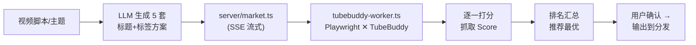

# SD-207: 市场大师 — TubeBuddy SEO 优化器 (Market Master)

> **设计方**: Antigravity (Opus 4.6)
> **状态**: V2 概念设计定稿

## 背景与目标

在 DeliveryConsole 中集成 TubeBuddy 的 **Keyword Explorer** 功能，为「市场大师 (MarketingMaster)」赋能。

- **Phase 1 (本期)**：**后置 SEO** — 视频完成后分发前，LLM 批量生成标题/标签方案 → TubeBuddy 自动打分 → 选最优组合
- **Phase 2 (远期)**：前置选题发现，用 TubeBuddy 数据反向指导选题

### 已确认参数
| 项             | 值                                                  |
| -------------- | --------------------------------------------------- |
| TubeBuddy 等级 | **Pro** (支持 Weighted Score)                       |
| 运行环境       | **本地 Mac only**                                   |
| 模块编号       | **SD-207**                                          |
| 前端入口       | 已注册 `MarketingMaster` in `src/config/experts.ts` |

---

## 技术方案核心结论

**TubeBuddy 没有公开 API**，是纯 Chrome 扩展。自动化必须通过 **Playwright 驱动浏览器 UI**。

优点：合规不易封号、可维护（随 UI 变化调整选择器即可）、可以拿到你的 Pro 账号个性化分数 (Weighted Score)。

## 整体数据流

## 核心组件设计

### 1. `server/workers/tubebuddy-worker.ts`
- 启动 `chromium.launchPersistentContext()`
- 暴露函数 `scoreKeyword(keyword: string) → TubeBuddyScore` 返回 `overallScore` (1-100) 及雷达指标。

### 2. `server/market.ts` 
- 提供 `/api/market/generate-seo` 和 `/api/market/score-stream` SSE 接口。

### 3. `src/components/MarketSection.tsx`
前端 3 Phase HITL 架构：
1. **Generate**: 提取脚本特征，调用 LLM
2. **Score**: SSE 接收，渲染分数仪表盘卡片
3. **Confirm**: 用户微调并确认输出到 `05_Marketing/seo_final.json`

## 前置条件提醒
由于依赖头浏览器 (headed brower)，需在 `.env` 中指定本地 TubeBuddy 扩展路径，并做一次首次手动扫码登录。
