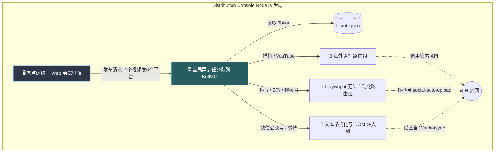

# 🛠️ Distribution Console: 开源项目融合策略 (Fusion Strategy)

> **目标**：回答老卢的问题：“这部分我们是需要融合几个开源项目是吗？”
> **核心逻辑**：是的。但我们**绝对不是**把这几个庞大的开源项目全都 clone 下来跑在一起（那样会变成屎山）。我们要做的是“吸星大法”——**只抽取代马的核心器官，套上我们自己极简的外壳**。

---

## 1. 我们要融合哪三个“器官”？

未来的 `Distribution Console` 只有一个唯一的入口、唯一的界面。但它的后台，缝合了三个顶尖开源项目的核心机制：

### 🫀 核心调度心脏：借鉴 `Mixpost` / `Postiz`
- **我们抽取的器官**：异步任务队列（Task Queue）管理模型，以及各平台的 Token 流转方案。
- **融合方式**：我们自己写一层基于 `BullMQ` (Node.js) 的简单队列调度器。把账号 Token 统一存在 `auth.json`，发帖时丢进队列里排队执行。摒弃他们复杂的 SaaS 计费图表和多余页面。

### 🦾 机械手臂 1 (国内视频分发库)：移植 `social-auto-upload`
- **我们抽取的器官**：它里面关于“如何用 Playwright 绕过 Bilibili、抖音、视频号的反爬虫并成功上传视频”的几千行底层脚本代码。
- **融合方式**：把这些脚本封装成纯粹的 Typescript 类（例如 `BilibiliUploader.ts`），抹掉它原来丑陋的 GUI。当队列调度器碰到 B 站任务时，直接唤醒这个 `BilibiliUploader`，让它在后台默默去跑无头浏览器上传。

### 🦾 机械手臂 2 (国内图文分发库)：研究 `Wechatsync`
- **我们抽取的器官**：它把 Markdown 转换为微信公众号和微博所需格式的转换器（Formatter）方案。
- **融合方式**：把格式化逻辑剥离出来，写成一个 `MarkdownToWechat.ts` 的工具函数。

---

## 2. 融合后的终极形态 (系统架构透视)

对老卢来说，你只启动了一个叫 `distribution-console` 的全新 Web 界面。
在这个界面背后，发生着这样的事情：

## 3. 下一步：从 UI 骨架开始

既然底层是把别人的内核缝合进我们的壳子，我们需要先把这个**壳子（UI 骨架）** 定义清楚。

通常来说，一个分发控制台只需要以下 3 个核心页面：
1. **📌 社交账号授权管家 (Accounts Hub)**：左边一排社交媒体图标，右边显示“已绑定/扫码登录中/Cookie过期告警”。
2. **🚀 跨平台提稿机 (Publish Composer)**：左边选刚才做好的视频/图文资产，中间写一段配文，右边勾选要同时发送到哪几个平台（支持各平台单独定制标题）。
3. **📊 队列航线图 (Timeline / Queue)**：一个列表，显示今天排队的 10 个任务。谁成功了（绿灯），谁被风控拦截了（红灯报错日志）。

老卢，这三个页面的交互逻辑，我们现在是要用 markdown 先写线框图草案，还是你已经在脑子里有画面了？
