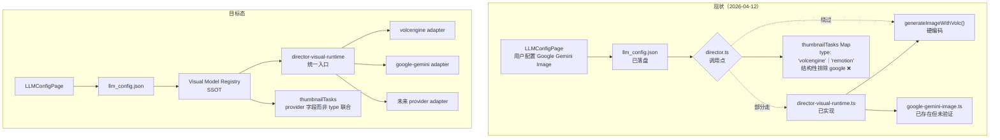

# Director 模块全景治理与未闭环收口

> 本文档是 ce-brainstorm 阶段产出的轻量 PRD，作为 ce-plan 的输入。
> 不含具体实现细节、文件路径、接口签名 —— 那些归 implementation plan。
> 例外：少数与"产品决策不可分割的架构方向"会显式列出（标注 **[架构决策]**）。

## Problem Frame

**谁受影响**：DeliveryConsole 项目下导演大师（Director）模块的所有使用者 —— 包括内部主用户老卢和后续接管的研发。

**正在变化的事实**：Director 模块经过 2026-02 至 2026-03 的快速迭代，已从最初的 mock 实现进化到具备 Phase1-3 全链路、Chatbox bridge、Skill 注入、批量渲染队列的复杂系统。但同时也累积了一批"已发现但未闭环"的设计断层：

1. **配置即所得**（2026-03-27 plan）落地度只有 ~80%，最关键的视觉服务商扩展能力被一行类型联合堵死
2. **状态层三处非原子双写**（`delivery_store` ↔ `expert_state` ↔ `selection_state`），已造成多次"工具执行成功但 UI 没变"的真实漂移
3. **批量任务进度仅在内存 Map**，server 重启即丢
4. **多处静默 fallback、硬编码超时、日志泄漏隐患、any 滥用**
5. **`server/director.ts` 已膨胀到 2242 行**，phase1/2/3 + 队列 + bridge 全堆在一个文件，进一步演化的边际成本陡升

**为什么现在收**：再不收，下一轮专家系统扩容（MusicDirector / ShortsMaster / ThumbnailMaster / MarketingMaster）会把同一批坑再挖 4-5 次。Director 是范式样板，必须先把样板压平。

## Director 视觉模型执行链路 — 当前 vs 目标

## Requirements

> 优先级图例：**P0** = 不收就破口；**P1** = 影响下一轮专家扩容；**P2** = 长期可维护性
> 行号是 2026-04-12 基线快照，plan 阶段需重新对齐

### A. 视觉模型配置即所得（2026-03-27 plan 的延续与补完）

- **R1. [P0] 消除 Director 视觉链路所有硬编码 provider 假设**
  - `server/director.ts` 当前在第 665 / 938 / 1020 / 1125 / 1143 行存在 5 处 `'volcengine'` 字面量假设。其中第 665 行的 `thumbnailTasks` Map 类型联合 `type: 'volcengine' | 'remotion'` 是结构性堵点 —— 即便 runtime router 已实现，task 追踪层无法表达 Google
  - 改造后所有视觉任务必须由 `director-visual-runtime` 决策，task 追踪用 provider 字段（已存在的 `sourceProvider/sourceModel`）取代或包含原 `type` 判别
  - 不能再有 "if x then 火山" 的散落分支

- **R2. [P0] Visual Model Registry 必须升级为后端 SSOT**
  - 当前 `src/schemas/visual-models.ts` 仅是前端 schema，没有满足 2026-03-27 plan §5.1 提出的"显式视觉模型目录"职责
  - 后端必须有一个可被 `director-visual-runtime` 直接读取的 registry，回答"当前 model 属于哪个 provider / 支持 image 还是 video / 当前是否真实可用"
  - **[架构决策]** registry 物理位置（共享于 server+前端 / 仅 server / 跨双端）放到 plan 阶段决定

- **R3. [P0] 视频运行时路由必须落地**
  - 当前视频生成（Phase3 video render）完全没进 runtime router，写死调用 Volcengine
  - 即便本轮只接入一个 video provider（Volcengine），也必须经过 router 走 dispatch，为未来扩展留接口
  - 视频路由层必须支持"配置存在但 provider 未实现该能力"的明确报错，禁止静默回退

- **R4. [P0] 6 条铁证验收必须全部跑通**（2026-03-27 plan §12 原文复用）
  - i. 在配置页配置 Google Gemini Image key 并测试通过
  - ii. Director 专家配置页中可见并可选择 `gemini-3-pro-image-preview`
  - iii. Director Phase2 任一图生缩略图请求实际走 Google
  - iv. Director Phase3 任一底图生成实际走 Google
  - v. 切换回火山后，同一条入口实际改走火山
  - vi. 日志中能明确看到本次请求使用的 provider + model

- **R5. [P1] UI 仅展示运行时真实可执行的视觉模型**
  - 配置页与专家配置页的下拉框必须读取 R2 的 registry，而非静态硬编码数组
  - 未配置 `GOOGLE_API_KEY` 时不出现 Gemini 模型；火山未通时不出现 Seedream 模型

### B. 状态层原子化与一致性

- **R6. [P0] Director 必须收敛到单一状态真相源（SSOT）**
  - 当前并存 `delivery_store.json` / `04_Visuals/director_state.json` / `04_Visuals/selection_state.json` 三份相互覆盖的状态
  - 已多次发生"chat tool 改了 delivery_store 但 expert_state 漂移、UI 不刷新"的 bug
  - **[架构决策]** SSOT 选哪一份、其他两份退化为派生视图还是冷归档，放到 plan 阶段决定
  - 不接受"加同步代码包住症状"的补丁式方案；必须从设计上让漂移结构性不可能

- **R7. [P0] 状态写入必须是原子操作**
  - 多文件落盘的过程必须保证中途崩溃后不出现"半改半未改"
  - 任何写入路径都必须先做"读 → 改 → 校验 → 写"四步链，或采用单一真相源后从根上消除多写

### C. 任务持久化与超时治理

- **R8. [P1] 批量任务进度必须在 server 重启后可恢复**
  - 当前 `thumbnailTasks` 仅是内存 Map，server 重启或 dev 热更新即丢失正在进行的批量任务
  - 改造后必须能从磁盘恢复 pending/processing/completed 的所有 task 状态，让用户可继续查看
  - 不要求"恢复时主动重跑"，但要求"恢复时能看到上次进度并提供手动重跑入口"

- **R9. [P1] 所有外部调用的超时与轮询阈值必须集中可配**
  - 当前 LLM 超时已统一到 `LLM_REQUEST_TIMEOUT_MS`（2026-03-27 已收）
  - 但视觉任务的 poll interval / poll maxPolls / video timeout 仍硬编码分散在多处
  - Phase3 video 实测约 153s 但代码部分位置写 120s（rules.md #87 已记录）
  - 改造后必须有一份显式的"超时与轮询配置表"集中管理

- **R10. [P1] 重试策略必须显式而非依赖字符串匹配**
  - 当前 `errorMsg.includes('timeout')` 这类英文字符串匹配会漏掉非英文错误（rules.md 已警告类似问题）
  - 必须用错误类型 / 错误码而非字符串判别是否可重试
  - 视频链路当前完全无 retry，改造后至少支持"超时一次自动重试"的基础策略

### D. 代码质量、可维护性与安全

- **R11. [P1] `safeParseLLMJson` 不能再静默丢字段**
  - 当前 LLM 返回 SVG 字段冲突时会被悄悄删除，用户和开发者都无感知
  - 改造后必须显式 warn（前端可见 + 服务端日志）；或在解析层从根上避免冲突

- **R12. [P1] 涉及 prompt 与 API key 的日志必须脱敏**
  - 当前 `volcengine.ts` 等位置的 `console.log` 直接打印 prompt 全文
  - prompt 可能包含用户敏感内容；API key 已经明确禁止落盘日志
  - 改造后所有 prompt 日志必须截断到首尾各 100 字符 + 中段省略；key 必须仅保留前 4 后 4

- **R13. [P2] 消除 Director 链路的 `any` / `as any` 滥用**
  - 当前至少 5 处显式 `as any`：fallback options、buildRemotionPreview 返回值、actionArgs 等
  - 改造后必须用真实类型替换，不接受"暂时 any 后续再改"

- **R14. [P2] `server/director.ts` 必须按 phase 拆分**
  - 当前已膨胀到 **2242 行**，phase1 / phase2 / phase3 / 队列 / bridge / state 全堆在一个文件
  - 改造后按 phase 与职责拆为多个文件，单文件不得超过 600 行
  - 拆分必须保持对外 API 完全兼容，禁止顺手改接口
  - **[架构决策]** 拆分目标目录结构（`server/director/` 子目录 vs 平铺）由 plan 决定

- **R15. [P2] 残留备份文件必须清理**
  - `server/director.ts.backup` 等历史残留必须 git rm
  - 引入 lint/CI 规则禁止再出现 `*.backup` `*.bak` 类文件提交

### E. 测试与验收（不属于功能需求但必须随本轮一并交付）

- **R16. [P0] 配置即所得 6 条铁证必须有自动化或半自动化验收脚本**
  - R4 的 6 条标准必须可通过命令行或 OpenCode request 重跑，不能依赖人肉点击
  - **[架构决策]** 用 vitest / opencode-testing / agent-browser 中的哪种由 plan 决定

- **R17. [P1] 状态原子化必须有故意中断的故障注入测试**
  - 验证"写入半截被 kill -9"不会留下漂移状态
  - 不要求是 chaos 工程级别，只要求一两个针对性测试用例

## Success Criteria

本次治理完成的判定标准（每条都必须可验证）：

1. **R4 的 6 条铁证 100% 通过** —— 这是 P0 不可妥协项
2. **`server/director.ts` 行数从 2242 降到 2000 以下**（拆分后），且 phase1/2/3 入口已分文件
3. **`grep -n "'volcengine'" server/director.ts` 不再出现** —— 所有 provider 决策走 router
4. **执行任意 Director chat tool 后，三份 state 文件查询同一字段返回完全一致**
5. **dev server 在 Phase2 批量渲染中途 kill 并重启，重启后能看到上次的任务状态**（不要求恢复执行）
6. **`grep -n "as any" server/director.ts` 计数从基线降到 0**
7. **`safeParseLLMJson` 删除字段时前端可见 toast 或 chat 系统消息**
8. **CI 阻止 `*.backup` 文件被合入**

## Scope Boundaries

**本轮明确不做**（等同于 2026-03-27 plan §13 + 本轮新增）：

- ❌ 不扩散到 MusicDirector / ShortsMaster / ThumbnailMaster / MarketingMaster
- ❌ 不引入 Google video 生成（Google 仅做 image）
- ❌ 不重写 ChatPanel 的 SSE 协议
- ❌ 不引入新的数据库或远程配置中心
- ❌ 不重写 Remotion 模板本体
- ❌ 不抽象通用 ExpertModule 合约（这是后续 PRD 的事）
- ❌ 不动 Phase1 LLM concept 阶段的 prompt 工程

**本轮明确做**：

- ✅ Director 视觉路由"配置即所得"全链路收口（R1-R5）
- ✅ Director 状态层 SSOT 与原子化（R6-R7）
- ✅ 任务持久化与超时治理（R8-R10）
- ✅ 代码质量、安全、可维护性（R11-R15）
- ✅ 验收脚本与故障注入（R16-R17）

## Key Decisions

| 决策 | 选择 | 理由 |
|---|---|---|
| 是否一次性收 10 个未闭环点 | **是** | 用户在 Q1 明确选择"全量"。分批收会导致同样的代码反复改 N 遍，边际成本更高 |
| 本会话是否动代码 | **否** | 本会话定位为 PRD + plan + 审计 + Linear 清单。代码落地排到下个 sprint |
| 视频 provider 本轮是否扩多家 | **否，但必须经过 router** | 火山仍是唯一 video provider，但调用必须经 dispatch，为未来扩展留接口（R3） |
| 状态层 SSOT 选哪一份 | **延后到 plan 阶段** | 这是技术决策不是产品决策，需要 plan 阶段读完三份状态的实际字段使用情况后再选 |
| Linear 治理是否本会话动手 | **否** | 用户在 Q2 明确选择"输出动作清单文档让我事后手动执行" |

## Dependencies / Assumptions

- **依赖 1**：2026-03-27 plan 的设计目标（§3 五原则、§4 三层架构）作为 R1-R5 的直接输入，本 PRD 不重新论证
- **依赖 2**：rules.md #84-107 中已明确的 Director 教训（特别是 #88 系统提示词、#92-93 Skill/Bridge 边界）作为 R6-R7 的设计护栏
- **假设 1**：用户在下一个 sprint 有 1-2 周可分配给 Director 重构落地
- **假设 2**：当前 `node_modules` arm64 / x64 架构问题（rules.md #108-111）已解决，本 PRD 不复盘这条
- **假设 3**：Director Skill (`skills/Director/SKILL.md`) 本身的内容质量在本轮不评审，只评审 DeliveryConsole 这一侧的桥接

## Outstanding Questions

### Resolve Before Planning

无 —— Q1/Q2 已在 brainstorm 阶段对齐，其余问题属于技术决策可在 plan 阶段处理。

### Deferred to Planning

- **[Affects R2][架构]** Visual Model Registry 应该放在 `server/visual-model-registry.ts` 重建一份，还是把 `src/schemas/visual-models.ts` 升级为可被 server import 的双端共享文件？plan 阶段需读两端实际依赖关系再定
- **[Affects R6][架构]** Director SSOT 选 `delivery_store.json`（与其他专家共享）还是 `director_state.json`（专家独立）？plan 阶段需读两份文件的实际字段使用情况
- **[Affects R8][技术]** `thumbnailTasks` 持久化用 SQLite / JSON 文件 / 现有 delivery_store 嵌套字段？plan 阶段评估 I/O 性能与并发安全
- **[Affects R14][技术]** `server/director.ts` 拆分目标结构 —— 平铺 `server/director-phase1.ts` 等还是 `server/director/` 子目录？plan 阶段评估 import 影响面
- **[Affects R16][需要研究]** 验收脚本走 vitest / opencode-testing / agent-browser 哪种？plan 阶段需读 testing/README.md 与现有 director 测试基线
- **[Affects R10][技术]** 重试策略落到调用方还是统一在 runtime router？plan 阶段评估
- **[Affects ALL][技术]** Director 重构 PR 是否需要拆为多个独立 commit？plan 阶段评估代码评审成本
- **[Forward looking]** 是否在 plan 阶段顺手把 Director 的桥接抽象也设计成 ExpertModule 合约的种子？这超出本 PRD 范围但 plan 可以勘察可行性

## Next Steps

→ `/prompts:ce-plan` for structured implementation planning
