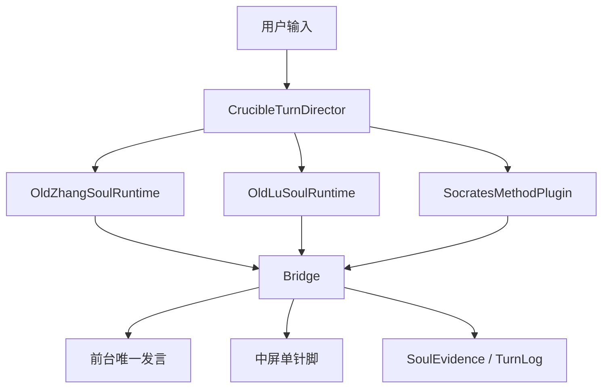

# SD218 Soul Runtime 最小接口草案

> 日期：2026-03-13
> 工作目录：`/Users/luzhoua/DeliveryConsole`
> 分支：`codex/sd208-golden-crucible`
> 状态：方案草案，等待人工审核
> 作者：Codex（按 OldYang 协议落盘）

## 1. 本稿目的

这份文档不讨论 UI，不讨论具体 prompt 文案，不进入代码实现。

它只做一件事：

**把黄金坩埚 v1 的 `Soul Runtime` 收成最小可执行接口。**

这里的“最小”不是指玩具级，而是指：

- 足以支撑 `老卢 / 老张 + Socrates` 的第一阶段主链
- 足以支撑 `7 = B-lite`
- 足以支撑未来季度升级
- 但不把 v1 过早拖进复杂多 Agent 社会模拟

---

## 2. 设计目标

这个最小接口必须同时满足六个目标：

1. **人格独立**
   - 老卢和老张不能再共用一个混合脑
2. **方法独立**
   - `Socrates` 不写成前台人设，而是后台方法插件
3. **回合可编排**
   - Director 可以决定谁参与、谁上前台
4. **状态可沉淀**
   - 每个 soul 有独立 session，每轮有证据可写
5. **升级可插拔**
   - 换模型、换方法、加新灵魂时不推倒主骨架
6. **复杂度可控**
   - v1 只做窄腰 runtime，不做泛化宇宙引擎

---

## 3. 最小对象图

第一阶段建议只引入 8 类核心对象：

1. `SoulCore`
2. `SoulSession`
3. `SoulRuntime`
4. `SoulPlugin`
5. `MethodPlugin`
6. `CrucibleTurnDirector`
7. `Bridge`
8. `Repositories`

它们的关系可以简化成：

---

## 4. 最小接口集合

## 4.1 `SoulCore`

`SoulCore` 是人格母体，慢变。

第一阶段最小字段建议：

- `id`
- `version`
- `displayName`
- `roleLabel`
- `mission`
- `values`
- `voice`
- `tactics`
- `mustPreserve`
- `failureSignals`
- `methodAffinity`
- `knowledgeBindings`

职责：

- 定义“这个人格是谁”
- 定义它长期稳定的价值与表达
- 定义它容易跑偏的地方

明确不承载：

- 当前会话动态
- 临时笔记
- 本轮候选回复

## 4.2 `SoulSession`

`SoulSession` 是人格在当前会话中的活体状态。

第一阶段最小字段建议：

- `sessionId`
- `soulId`
- `projectId`
- `scriptPath`
- `topicId`
- `workingGoal`
- `privateNotes`
- `openLoops`
- `recentTurnSummary`
- `currentIntent`
- `lastForegroundTurnAt`
- `updatedAt`

职责：

- 保留人格自己的私有思路
- 记录它当前正在追的切口
- 维持多轮连续性

## 4.3 `SoulPlugin`

`SoulPlugin` 是可前台发言的人格插件接口。

第一阶段建议最小方法：

- `getCore(): SoulCore`
- `createSession(input): SoulSession`
- `hydrateSession(snapshot): SoulSession`
- `runPrivateTurn(context): SoulPrivateTurn`
- `proposePublicTurn(privateTurn): PublicTurnCandidate`
- `proposeBoardPin(privateTurn): BoardPinCandidate | null`
- `emitEvidence(privateTurn, outcome): SoulEvidenceItem[]`

解释：

- `runPrivateTurn()` 只做后台私有思考
- `proposePublicTurn()` 才输出可前台发言候选
- `proposeBoardPin()` 只产出中屏针脚候选，不直接写 UI
- `emitEvidence()` 负责把本轮值得沉淀的东西吐出来

## 4.4 `MethodPlugin`

`MethodPlugin` 是后台方法裁判接口。

第一阶段最小方法建议：

- `id`
- `runMethodReview(input): MethodReview`
- `suggestNextQuestion(input): QuestionCandidate[]`
- `emitEvidence(review): SoulEvidenceItem[]`

对于 `SocratesMethodPlugin`，它的职责应限定为：

1. 检查前台候选是否贴着用户刚才那句
2. 检查有没有追到定义、前提、边界
3. 给出下一问候选
4. 标出空话、偷换概念、滑走风险

它不直接生成前台人物消息。

## 4.5 `CrucibleTurnDirector`

这是回合编排器，不是人格，也不是作者。

第一阶段最小方法建议：

- `planTurn(input): TurnPlan`
- `selectParticipants(plan): ParticipantSet`
- `decideStage(context): RuntimeStage`
- `decideMethodPlugins(plan): MethodPluginRef[]`

职责：

- 判断当前回合属于什么阶段
- 决定谁参与后台推理
- 决定需要哪些方法插件

禁止事项：

- 不直接写前台内容
- 不直接持有人格文案
- 不直接拼出最终 UI 文本

## 4.6 `Bridge`

`Bridge` 是前台选择器与中屏收束器。

第一阶段最小方法建议：

- `selectForegroundTurn(input): ForegroundTurn`
- `selectBoardPin(input): BoardPin | null`
- `buildOutcome(input): TurnOutcome`

职责：

- 从老张/老卢候选中选唯一前台发言
- 根据候选与方法审查意见保一条中屏针脚
- 给出本轮 outcome，供前端渲染与日志落盘

第一阶段不允许：

- 中屏保多条
- 前台多人格同轮同时发言

## 4.7 `Repositories`

第一阶段建议的最小仓储接口：

- `SoulCoreRepository`
- `SoulSessionRepository`
- `SoulEvidenceRepository`
- `SoulDeltaRepository`
- `TurnLogRepository`

目标：

- 让本地存储与未来云端存储解耦
- 让 runtime 不感知底层是 SQLite 还是 Postgres

---

## 5. 最小数据结构建议

## 5.1 `SoulPrivateTurn`

这是一位人格在后台私下跑出来的结果。

最小字段建议：

- `soulId`
- `sessionId`
- `focus`
- `privateAnalysis`
- `candidateReply`
- `candidateBoardPin`
- `nextQuestionTarget`
- `confidence`
- `warnings`

## 5.2 `PublicTurnCandidate`

最小字段建议：

- `speakerId`
- `speakerName`
- `utterance`
- `focus`
- `tone`
- `confidence`

## 5.3 `BoardPinCandidate`

最小字段建议：

- `title`
- `summary`
- `content`
- `reason`
- `confidence`

第一阶段要求：

- 只能是文字针脚
- 不强制图表
- 不允许“用文字描述一张并不存在的图”

## 5.4 `MethodReview`

最小字段建议：

- `pluginId`
- `alignmentScore`
- `boundaryRisk`
- `emptyTalkRisk`
- `suggestedQuestionCuts`
- `notes`

## 5.5 `TurnOutcome`

最小字段建议：

- `foregroundTurn`
- `boardPin`
- `methodReviews`
- `evidenceItems`
- `traceId`
- `timing`

---

## 6. 一轮对话的最小时序

## 6.1 标准时序

建议第一阶段严格按下列顺序运行：

1. 用户消息进入 `CrucibleTurnDirector`
2. Director 决定当前阶段与参与者
3. 加载或创建：
   - `OldZhangSoulSession`
   - `OldLuSoulSession`
4. 老张运行 `runPrivateTurn()`
5. 老卢运行 `runPrivateTurn()`
6. `SocratesMethodPlugin` 读取候选，执行 `runMethodReview()`
7. `Bridge` 根据：
   - 两位人格候选
   - 方法裁判意见
   - 当前阶段目标
   选择唯一前台发言
8. `Bridge` 选择唯一中屏针脚
9. 写入：
   - `TurnLog`
   - `SoulEvidence`
   - 最新 `SoulSession`
10. 返回前端渲染结果

## 6.2 第一阶段的重要纪律

这条时序必须附带四条硬纪律：

1. 每轮只有一个前台说话人
2. 中屏只保一条针脚
3. `Socrates` 不直接上前台
4. Director 与 Bridge 不代替人格本身写内容

---

## 7. `7 = B-lite` 在接口层如何体现

## 7.1 必须有的演化接口

第一阶段即使不重做演化，也必须从接口层预留：

- `emitEvidence()`
- `SoulDeltaRepository.saveProposal()`
- `SoulVersion` 的 version 引用位

这样系统从第一天开始就具备“未来会成长”的骨架。

## 7.2 第一阶段不应强推的演化行为

接口预留，不等于在线重负载运行。

第一阶段不建议：

- 每轮自动生成 Delta
- 每轮自动更新 Soul Core
- 在线执行大规模人格蒸馏

第一阶段只建议：

- 自动沉淀最小 `Evidence`
- 在关键轮次或离线评估时手动触发少量 `Delta`

## 7.3 为什么这就够了

因为第一阶段真正要证明的不是“系统会自己成长”，而是：

- 人格是独立的
- 方法是可插的
- 状态是可积累的
- 升级路径是可成立的

只要这四件事成立，季度升级时就能自然接上更强 LLM、更细人格分析和更成熟的外部方法插件。

---

## 8. 第一阶段与未来阶段的接口兼容

这个最小接口必须允许后续平滑扩展到：

1. 更多方法插件
   - `ScientificReasoningPlugin`
   - `PsychologyLensPlugin`
   - `BiasAuditPlugin`
2. 更多人格插件
   - 外部专家灵魂
   - 未来用户自定义人格
3. 更丰富的评测与版本管理
   - 离线评测集
   - Delta 审核流
   - 版本升级比较

也就是说：

**v1 的接口必须小，但不能封死未来。**

---

## 9. 第一阶段的接口成功标准

这套最小接口如果设计正确，应该带来五个可观察结果：

1. 老张和老卢的连续性明显增强
2. 同一轮里两人不会再像同一段 prompt 的变体
3. `Socrates` 的方法张力能显著影响前台质量，但不会破坏人格统一性
4. 每轮结果可回放、可审计、可对比
5. 后续新增方法插件或更强模型时，不需要重写主流程

---

## 10. 最终结论

黄金坩埚 v1 的 `Soul Runtime` 不需要从第一天就做成宇宙引擎。

它只需要先成为一个：

**能让前台人格独立运行、让后台方法裁判发挥作用、让状态与证据开始沉淀的最小人格运行时。**

因此第一阶段最小接口的关键不是“多”，而是：

- 人格与方法分离
- 状态与人格分离
- 编排与作者分离
- 升级接口与在线主链分离

只要这四个分离做对，后续季度升级就能是“往卡槽里换更强的东西”，而不是“重建整套坩埚”。
