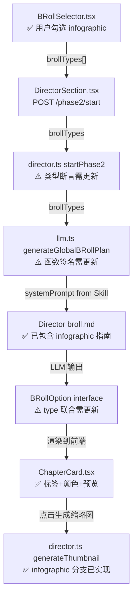

# Infographic 全链路联调改动计划 (v3)

> [!IMPORTANT]
> 上一轮只完成了 Skill 安装 + 部分后端/前端改动，但漏掉了 **Phase 2 选项面板**和 **LLM 生成链路**中所有硬编码的 BRoll 类型联合。本轮需要彻底打通全链路。

## 已完成 ✅

| 文件                                        | 改动                                    |
| ------------------------------------------- | --------------------------------------- |
| `BaoyuInfographic/SKILL.md` + `references/` | **新创建** - 完整 Skill                 |
| `Director/SKILL.md`                         | 决策矩阵 + 协作规范新增 infographic     |
| `Director/prompts/broll.md`                 | JSON Schema + 场景指南新增 infographic  |
| `src/types.ts`                              | `BRollType` 联合 + `SceneOption` 3 字段 |
| `src/components/director/ChapterCard.tsx`   | 颜色/标签/预览按钮/字段传递             |
| `server/director.ts` → `generateThumbnail`  | 新增 infographic 生图分支               |

---

## 待改动清单（7 个文件）

### 🔴 前端（影响用户可见的选项面板）

#### [MODIFY] [BRollSelector.tsx](file:///Users/luzhoua/DeliveryConsole/src/components/director/BRollSelector.tsx)

Phase 2 用户选择 B-Roll 类型的**核心 UI 组件**。`BROLL_OPTIONS` 数组缺少 `infographic`。

```diff
 import { Check, Code, Video, Film, Globe, Camera } from 'lucide-react';
+import { BarChart3 } from 'lucide-react';

 const BROLL_OPTIONS = [
   { type: 'remotion', label: 'A. Remotion 动画', icon: Code, description: '代码驱动动画' },
   { type: 'seedance', label: 'B. 文生视频', icon: Video, description: 'AI生成视频' },
   { type: 'artlist', label: 'C. Artlist 实拍', icon: Film, description: '素材库实拍' },
   { type: 'internet-clip', label: 'D. 互联网素材', icon: Globe, description: '真实片段建议' },
   { type: 'user-capture', label: 'E. 用户截图/录屏', icon: Camera, description: '自行采集素材' },
+  { type: 'infographic', label: 'F. 信息图', icon: BarChart3, description: '结构化高质量信息图' },
 ];
```

---

#### [MODIFY] [Phase2View.tsx](file:///Users/luzhoua/DeliveryConsole/src/components/director/Phase2View.tsx)

L41: 默认选中 `brollSelections` 不含 `infographic`，需加入默认值。

```diff
-const [brollSelections, setBrollSelections] = useState<BRollType[]>(['remotion', 'seedance', 'artlist']);
+const [brollSelections, setBrollSelections] = useState<BRollType[]>(['remotion', 'seedance', 'artlist', 'infographic']);
```

---

### 🟡 后端 LLM 生成管线（影响 Phase 2 LLM 调用能否产出 infographic 方案）

#### [MODIFY] [llm.ts](file:///Users/luzhoua/DeliveryConsole/server/llm.ts)

**3 处关键改动**：

**① BRollOption 接口** (L238-247)
```diff
 export interface BRollOption {
   name: string;
-  type: 'remotion' | 'generative' | 'artlist' | 'internet-clip' | 'user-capture';
+  type: 'remotion' | 'generative' | 'artlist' | 'internet-clip' | 'user-capture' | 'infographic';
   template?: string;
   props?: Record<string, any>;
   quote: string;
   prompt: string;
   imagePrompt?: string;
   rationale?: string;
+  // Infographic specific
+  infographicLayout?: string;
+  infographicStyle?: string;
+  infographicUseMode?: 'cinematic-zoom' | 'static';
 }
```

**② generateGlobalBRollPlan + generateGlobalBRollPlanWithRetry + generateBRollOptions 函数签名** (L265, L290, L473)

所有 `brollTypes` 参数联合类型需加 `| 'infographic'`：
```diff
-brollTypes: ('remotion' | 'generative' | 'artlist' | 'internet-clip' | 'user-capture')[]
+brollTypes: ('remotion' | 'generative' | 'artlist' | 'internet-clip' | 'user-capture' | 'infographic')[]
```

**③ generateFallbackOptions** (L521-534)

函数签名 + `typeLabels` 映射：
```diff
 export function generateFallbackOptions(
-  types: ('remotion' | 'generative' | 'artlist' | 'internet-clip' | 'user-capture')[],
+  types: ('remotion' | 'generative' | 'artlist' | 'internet-clip' | 'user-capture' | 'infographic')[],
   scriptText: string = ''
 ): BRollOption[] {
   const typeLabels: Record<string, string> = {
     remotion: '数据可视化', generative: '概念意象', artlist: '空镜',
-    'internet-clip': '互联网素材', 'user-capture': '截图录屏'
+    'internet-clip': '互联网素材', 'user-capture': '截图录屏',
+    'infographic': '信息图'
   };
```

---

#### [MODIFY] [director.ts](file:///Users/luzhoua/DeliveryConsole/server/director.ts)

**2 处改动**：

**① Phase3RenderState 接口** (L82) - externalAssets 类型联合：
```diff
-type: 'artlist' | 'internet-clip' | 'user-capture';
+type: 'artlist' | 'internet-clip' | 'user-capture' | 'infographic';
```

**② startPhase2 中 brollTypes 类型断言** (L406)：
```diff
-brollTypes as ('remotion' | 'generative' | 'artlist' | 'internet-clip' | 'user-capture')[]
+brollTypes as ('remotion' | 'generative' | 'artlist' | 'internet-clip' | 'user-capture' | 'infographic')[]
```

---

#### [MODIFY] [pipeline_engine.ts](file:///Users/luzhoua/DeliveryConsole/server/pipeline_engine.ts)

L19: `VisualPlanScene.type` 联合缺少 `infographic`：
```diff
-type: 'remotion' | 'seedance' | 'artlist';
+type: 'remotion' | 'seedance' | 'artlist' | 'infographic';
```

---

### 🔵 可选 / 低优先级

#### [INFO] [assets.ts](file:///Users/luzhoua/DeliveryConsole/server/assets.ts)

L47 和 L233 有 `'artlist' | 'internet-clip' | 'user-capture'` 类型联合。这些是外部资产管理接口，infographic 不需要用户手动上传外部资产，所以**暂不改动**。

#### [INFO] [llm_backup.ts](file:///Users/luzhoua/DeliveryConsole/server/llm_backup.ts)

`llm.ts` 的旧备份文件，建议不动，避免无用改动。

---

## LLM → infographic 数据流对照



## Verification Plan

| 测试项             | 验证方法                       | 预期                                    |
| ------------------ | ------------------------------ | --------------------------------------- |
| BRollSelector 显示 | 打开 Phase 2 UI                | 看到第 6 个选项"F. 信息图"              |
| 默认选中           | Phase2View 首次加载            | infographic 默认选中                    |
| LLM 生成           | 选中 infographic 后生成 B-Roll | LLM 输出含 `type: 'infographic'` 的方案 |
| schema 验证        | infographic 方案正确解析       | 无 VALIDATION_FAILED 错误               |
| 缩略图预览         | 点击信息图方案的"生成预览"     | 正常生成并显示 PNG                      |
| TypeScript         | `tsc --noEmit`                 | 无类型错误                              |
