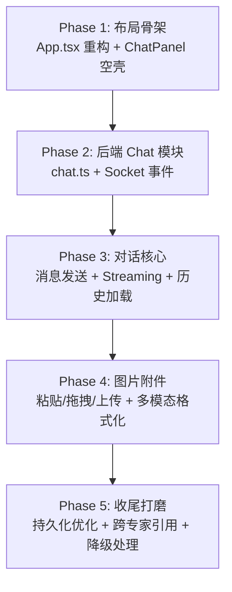

# SD-207: 右侧 Chat Panel — 实施规范 (For GLM)

> **模块编号**: SD-207
> **前置文档**: [right_panel_chatbot_assessment.md](file:///Users/luzhoua/.gemini/antigravity/brain/ed7503f1-6d42-46fd-bb6f-29034d15f858/right_panel_chatbot_assessment.md)
> **目标**: 在 DeliveryConsole 右侧新增可折叠对话面板，支持流式输出 + 图片附件

---

## 概要

在 Delivery 模块的专家页面右侧新增一个可折叠抽屉式 Chat Panel，作为 Expert Co-pilot。面板采用「路径悬置 + 懒加载」策略节省 Token，支持 Streaming（Socket.IO chunk）和图片粘贴/上传（多模态）。聊天记录 Per-Expert × Per-Project 落盘。

---

## Proposed Changes

### 前端 — 新增组件

---

#### [NEW] [ChatPanel.tsx](file:///Users/luzhoua/DeliveryConsole/src/components/ChatPanel.tsx)

核心对话面板组件。

**Props**:

```typescript
interface ChatPanelProps {
  isOpen: boolean;
  onToggle: () => void;
  expertId: string;         // 当前激活的专家 ID
  projectId: string;        // 当前项目名
  socket: any;              // 复用 useDeliveryStore 中的 socket 实例
}
```

**内部状态**:

```typescript
const [messages, setMessages] = useState<ChatMessage[]>([]);
const [inputText, setInputText] = useState('');
const [attachments, setAttachments] = useState<Attachment[]>([]);
const [isStreaming, setIsStreaming] = useState(false);
const [contextLoaded, setContextLoaded] = useState(false);  // 路径悬置标记
const messagesEndRef = useRef<HTMLDivElement>(null);
```

**关键行为**:

1. **路径悬置**：组件挂载/expertId 切换时，不加载上下文。仅在用户首次发送消息时调用 `POST /api/chat/context` 加载专家产出
2. **Streaming 监听**：通过 `socket.on('chat-chunk')` 逐字拼接 AI 回复；`socket.on('chat-done')` 标记完成
3. **专家切换**：`expertId` 变化时，保存当前对话（emit `chat-save`），加载新专家的历史（`GET /api/chat/history`），重置 `contextLoaded = false`
4. **图片附件**：支持剪贴板粘贴（`onPaste`）、拖拽（`onDrop`）、📎按钮点击上传，预览为缩略图，发送时转 base64
5. **Auto-scroll**：新消息时自动滚动到底部

**UI 结构**:

```
┌──────────────────────────┐
│ 💬 {expertName}  [✕ 关闭] │  ← Header，显示当前专家名
├──────────────────────────┤
│                          │
│   消息列表区域            │  ← 滚动容器，flex-1
│   (MessageBubble 组件)   │
│                          │
├──────────────────────────┤
│ [📎] [图片预览缩略图...]  │  ← 附件预览条（有附件时才显示）
├──────────────────────────┤
│ [  输入框...       ] [➤] │  ← 输入区域，支持 Enter 发送
└──────────────────────────┘
```

**样式要点**:
- 宽度 `w-[360px]`，暗色风格 `bg-[#0a1220]`，与主题一致
- 消息气泡：用户右对齐蓝色底，AI 左对齐深灰底
- AI 回复中的文本支持简易 Markdown 渲染（加粗、列表、代码块即可）
- Streaming 时在最后一条 AI 消息末尾显示闪烁光标 `▋`

---

#### [NEW] [ChatToggleButton.tsx](file:///Users/luzhoua/DeliveryConsole/src/components/ChatToggleButton.tsx)

折叠状态时右下角的浮动按钮。

```typescript
interface ChatToggleButtonProps {
  onClick: () => void;
  hasUnread?: boolean;  // 预留：未读消息红点
}
```

- 圆形按钮，`fixed bottom-6 right-6`，💬 图标
- 有未读时显示红色小圆点 badge

---

### 前端 — 类型定义

---

#### [MODIFY] [types.ts](file:///Users/luzhoua/DeliveryConsole/src/types.ts)

在文件末尾新增以下类型：

```typescript
// --- SD-207: Chat Panel Types ---

export interface ChatMessage {
  id: string;
  role: 'user' | 'assistant' | 'system';
  content: string;
  timestamp: string;
  attachments?: Attachment[];
}

export interface Attachment {
  type: 'image';
  name: string;
  base64: string;       // data URI: "data:image/png;base64,..."
  previewUrl: string;   // 用于本地预览的 object URL
}

export interface ChatHistory {
  expertId: string;
  projectId: string;
  messages: ChatMessage[];
  lastUpdated: string;
}

export interface ExpertContextMap {
  [expertId: string]: {
    outputDir: string;
    keyFiles: string[];   // 该专家的核心产出文件列表
  };
}
```

---

### 前端 — 布局重构

---

#### [MODIFY] [App.tsx](file:///Users/luzhoua/DeliveryConsole/src/App.tsx)

**改动范围**: L113-186 的 return 语句。

**改动要点**:

1. 新增 state: `const [isChatOpen, setIsChatOpen] = useState(false);`
2. 将 delivery 模块的 `<main>` 包进 flex 容器
3. 条件渲染 `ChatPanel`（仅在 `activeModule === 'delivery'` 时显示）
4. 通过 `useDeliveryStore` 暴露的 socket 实例传递给 ChatPanel

```diff
 // Delivery 模块部分（L128-177）
 ) : activeModule === 'delivery' ? (
-  <>
+  <div className="flex flex-1 overflow-hidden">
+    <div className="flex-1 flex flex-col overflow-hidden">
       <ExpertNav ... />
-
-      {activeExpertId === 'VisualAudit' ? (
-        <main className="max-w-7xl mx-auto px-6 py-8">
+      <main className="flex-1 overflow-y-auto px-6 py-8">
+        <div className="max-w-7xl mx-auto">
+        {activeExpertId === 'VisualAudit' ? (
           <VisualAuditPage />
-        </main>
-      ) : /* ...其他专家... */ }
-  </>
+        ) : /* ...其他专家，去掉各自的 <main> wrapper... */ }
+        </div>
+      </main>
+    </div>
+    {isChatOpen ? (
+      <ChatPanel
+        isOpen={isChatOpen}
+        onToggle={() => setIsChatOpen(false)}
+        expertId={activeExpertId}
+        projectId={state.projectId}
+        socket={socket}
+      />
+    ) : (
+      <ChatToggleButton onClick={() => setIsChatOpen(true)} />
+    )}
+  </div>
```

> [!IMPORTANT]
> **布局核心变化**：外层 `div` 从 `min-h-screen` 改为 `h-screen flex flex-col`。
> Delivery 模块从 Fragment `<>` 改为 `flex` 行布局。内容区 `flex-1 overflow-y-auto`。
> 非 Delivery 模块（crucible / distribution）保持原有居中布局不变。

---

#### [MODIFY] [useDeliveryStore.ts](file:///Users/luzhoua/DeliveryConsole/src/hooks/useDeliveryStore.ts)

暴露 socket 实例供 ChatPanel 使用：

```diff
- return { state, isConnected, updateState, selectScript };
+ return { state, isConnected, updateState, selectScript, socket };
```

---

### 后端 — Chat API

---

#### [NEW] [chat.ts](file:///Users/luzhoua/DeliveryConsole/server/chat.ts)

独立的 chat 模块，包含：

**1. `callLLMStream` 流式调用函数**

```typescript
export async function* callLLMStream(
  messages: LLMMessage[],
  provider: string,
  model: string,
  baseUrl?: string | null
): AsyncGenerator<string> {
  // 根据 provider 拼接 URL 和 headers
  // body 中添加 stream: true
  // 逐行解析 SSE 格式 "data: {json}\n"
  // yield delta content
  // Anthropic 特殊处理（不同的 SSE 事件格式）
}
```

**2. Context 加载函数**

```typescript
export function loadExpertContext(
  projectRoot: string,
  expertId: string
): { systemPrompt: string; contextMap: ExpertContextMap } {
  // 根据 EXPERTS_CONFIG 找到 outputDir
  // 读取该目录下的核心产出文件（限制总 token 量，如前 5000 字符）
  // 构建 system prompt: "你是{expertName}的助手，当前产出如下：xxx"
  // 同时返回 contextMap 供跨专家引用
}
```

**3. Chat history 读写**

```typescript
export function loadChatHistory(projectRoot: string, expertId: string): ChatMessage[]
export function saveChatHistory(projectRoot: string, expertId: string, messages: ChatMessage[]): void
// 路径: {PROJECT_ROOT}/.tasks/chat_history/{expertId}.json
```

**4. 多模态消息格式化**

```typescript
export function formatMultimodalMessages(
  messages: ChatMessage[],
  provider: string
): any[] {
  // 将含附件的 ChatMessage 转为各 provider 的 API 格式：
  // OpenAI: content: [{type: "text", text: "..."}, {type: "image_url", image_url: {url: "data:..."}}]
  // Anthropic: content: [{type: "text", text: "..."}, {type: "image", source: {type: "base64", ...}}]
  // 不支持图片的 provider (DeepSeek): 忽略图片，仅保留文本，返回 warning flag
}
```

---

#### [MODIFY] [index.ts](file:///Users/luzhoua/DeliveryConsole/server/index.ts)

**改动 1**: 顶部导入

```typescript
import { callLLMStream, loadExpertContext, loadChatHistory, saveChatHistory, formatMultimodalMessages } from './chat';
```

**改动 2**: 在 `io.on('connection')` 块内（约 L395-447）新增 Socket 事件

```typescript
// --- Chat Panel Socket Events ---

// 加载上下文（懒加载，用户首次发言时触发）
socket.on('chat-load-context', async ({ expertId, projectId }) => {
  const projectRoot = path.resolve(PROJECTS_BASE, projectId);
  const ctx = loadExpertContext(projectRoot, expertId);
  socket.emit('chat-context-loaded', { expertId, systemPrompt: ctx.systemPrompt });
});

// 加载聊天历史
socket.on('chat-load-history', ({ expertId, projectId }) => {
  const projectRoot = path.resolve(PROJECTS_BASE, projectId);
  const messages = loadChatHistory(projectRoot, expertId);
  socket.emit('chat-history', { expertId, messages });
});

// 流式对话
socket.on('chat-stream', async ({ messages, expertId, projectId }) => {
  const config = loadConfig();
  const { provider, model, baseUrl } = config.global;
  const projectRoot = path.resolve(PROJECTS_BASE, projectId);

  // 格式化多模态消息
  const formatted = formatMultimodalMessages(messages, provider);

  try {
    for await (const chunk of callLLMStream(formatted, provider, model, baseUrl)) {
      socket.emit('chat-chunk', { chunk, expertId });
    }
    socket.emit('chat-done', { expertId });

    // 保存对话历史
    saveChatHistory(projectRoot, expertId, messages);
  } catch (err: any) {
    socket.emit('chat-error', { error: err.message, expertId });
  }
});

// 保存对话历史（手动触发，如切换专家时）
socket.on('chat-save', ({ expertId, projectId, messages }) => {
  const projectRoot = path.resolve(PROJECTS_BASE, projectId);
  saveChatHistory(projectRoot, expertId, messages);
});
```

**改动 3**: 新增 REST 端点（作为 Socket 的 fallback）

```typescript
// Chat context (REST fallback)
app.post('/api/chat/context', (req, res) => {
  const { expertId, projectId } = req.body;
  const projectRoot = path.resolve(PROJECTS_BASE, projectId || currentProjectName);
  const ctx = loadExpertContext(projectRoot, expertId);
  res.json(ctx);
});

// Chat history (REST fallback)
app.get('/api/chat/history/:expertId', (req, res) => {
  const { expertId } = req.params;
  const projectId = req.query.projectId as string || currentProjectName;
  const projectRoot = path.resolve(PROJECTS_BASE, projectId);
  const messages = loadChatHistory(projectRoot, expertId);
  res.json({ messages });
});
```

---

### 数据层

---

#### Chat History 落盘格式

路径: `Projects/{projectName}/.tasks/chat_history/{expertId}.json`

```json
{
  "expertId": "Director",
  "projectId": "CSET-SP3",
  "lastUpdated": "2026-02-25T08:30:00Z",
  "messages": [
    {
      "id": "msg_001",
      "role": "system",
      "content": "你是影视导演大师的助手...",
      "timestamp": "2026-02-25T08:30:00Z"
    },
    {
      "id": "msg_002",
      "role": "user",
      "content": "第3个分镜配色太暗了",
      "timestamp": "2026-02-25T08:30:15Z",
      "attachments": [
        {
          "type": "image",
          "name": "reference.png",
          "base64": "data:image/png;base64,..."
        }
      ]
    }
  ]
}
```

#### Context Map

路径: `Projects/{projectName}/.tasks/chat_history/_context_map.json`

自动生成，格式：

```json
{
  "Director": {
    "outputDir": "04_Visuals",
    "keyFiles": ["visual_plan.json", "concept_proposal.md"]
  },
  "MusicDirector": {
    "outputDir": "04_Music_Plan",
    "keyFiles": ["music_plan.json"]
  }
}
```

---

## 约束与注意事项（天条）

> [!CAUTION]
> 以下规则必须遵守，违反视为 Bug。

1. **不修改现有专家的任何代码**：`DirectorSection.tsx`、`ShortsSection.tsx` 等不能有一行改动（Architecture V3 §4.4 模块解耦）
2. **不预加载上下文**：`contextLoaded` 标志位严格控制，只有用户发送消息才触发加载
3. **不破坏非 Delivery 模块布局**：Crucible 和 Distribution 模块保持原有居中布局
4. **附件 base64 不落盘**：聊天历史中的图片 base64 字段，落盘时用 `"[image: {name}]"` 占位替代，避免 JSON 文件膨胀
5. **Streaming 可降级**：如果 `callLLMStream` 抛异常，自动 fallback 到普通 `callLLM()`，用户不会看到白屏
6. **provider 不支持图片时给出提示**：如当前 global provider 是 DeepSeek（纯文本），用户贴图时前端 toast 提示 "当前模型不支持图片输入，已忽略附件"

---

## 开发顺序



每个 Phase 完成后先用 Mock 数据跑通 UI，确认后再接真实后端。

---

## Verification Plan

### Automated Tests

已有测试框架：Vitest + jsdom，配置在 [vitest.config.ts](file:///Users/luzhoua/DeliveryConsole/vitest.config.ts)。

**新增测试**:

1. **`src/__tests__/chat/chat-types.test.ts`** — 验证 `ChatMessage`、`ChatHistory` 类型的 Zod schema 校验（参考已有 [llm-config.test.ts](file:///Users/luzhoua/DeliveryConsole/src/__tests__/schemas/llm-config.test.ts) 的模式）

2. **`src/__tests__/chat/format-multimodal.test.ts`** — 验证 `formatMultimodalMessages()` 对各 provider 的消息格式化：
   - OpenAI 格式含 image_url
   - Anthropic 格式含 base64 source
   - DeepSeek 纯文本 fallback（图片被剥离）

运行命令: `npm run test:run`

### Browser Tests（开发者自测）

Phase 1 完成后:
1. 启动 `npm run dev`
2. 打开 `http://localhost:5173`
3. 确认 Delivery 模块右下角出现 💬 浮动按钮
4. 点击按钮，确认 360px Chat Panel 从右侧滑出
5. 点击关闭按钮，确认 Panel 收回
6. 切换到 Crucible / Distribution 模块，确认**不显示** Chat Panel

Phase 3 完成后:
7. 在 Chat Panel 输入文字并发送，确认流式打字机效果
8. 切换专家（如 Director → Music），确认对话历史独立切换
9. 刷新页面，确认之前的对话记录被恢复

Phase 4 完成后:
10. 复制一张图片，在输入框 Ctrl+V 粘贴，确认出现缩略图预览
11. 发送带图片的消息，确认 AI 能基于图片内容回复（需 OpenAI/Anthropic/Gemini provider）
12. 切换到 DeepSeek provider，贴图后确认出现 toast 提示
