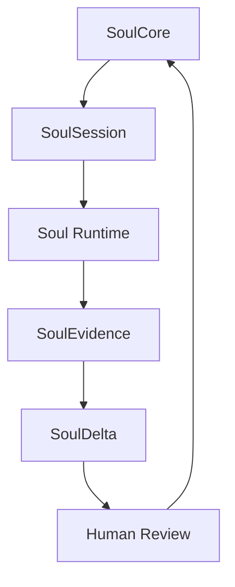

# SD223 Soul Inference Schema v0.1

> 日期：2026-03-19
> 当前工作目录：`/Users/luzhoua/MHSDC/GoldenCrucible-SSE`
> 历史落盘分支：`codex/sd208-golden-crucible`
> 状态：统一 schema 定稿 / 作为后续实施手册基础
> 作者：Codex（按 OldYang 协议落盘）
> 迁移说明：schema 内容仍有效，但涉及本地绝对路径时应以 `MHSDC` worktree 新目录为准。

## 1. 本稿定位

这份文档是黄金坩埚后续 `Soul Runtime / Soul Evolution / Proxy Review` 的统一事实来源。

它不负责：

- 讨论 UI
- 讨论 prompt 文案
- 讨论具体模型厂商
- 讨论某一版实现细节

它只负责一件事：

**把 `Soul Inference` 相关的核心对象、字段边界、更新纪律和审核规则收成统一 schema。**

后续如果要写：

- `implementation manual`
- `repository interface`
- `DB schema`
- `YAML / JSON schema`
- `eval harness`

都应以本稿为基础，而不是再回到零散讨论稿。

---

## 2. 为什么需要这份 schema

如果没有统一 schema，`Soul` 很容易退化成三种坏形态：

1. 一段会漂移的人设 prompt
2. 一份没有证据来源的自我想象文档
3. 一个无法升级、无法审核、无法比较版本的黑箱

因此本稿要解决四个根问题：

1. 什么是稳定人格母体，什么不是
2. 什么能作为人格证据，什么不能
3. 什么叫更新提案，如何避免自动漂移
4. 运行时、演化层、审核层如何共用同一套对象边界

---

## 3. 总体对象图

`Soul Inference Schema v0.1` 统一定义 4 个核心对象，1 个辅助对象：

1. `SoulCore`
2. `SoulSession`
3. `SoulEvidence`
4. `SoulDelta`
5. `SoulVersionRef`

它们的关系可以概括为：

一句话解释：

- `SoulCore` 是人格母体
- `SoulSession` 是当下会话状态
- `SoulEvidence` 是证据池
- `SoulDelta` 是演化提案
- `SoulVersionRef` 用来把版本演化串起来

---

## 4. 核心原则

## 4.1 稳定层与变化层分离

必须分开：

- 长期稳定的人格母体
- 当前轮次的临时状态
- 证据沉淀
- 升级提案

禁止把这些混进一个对象里。

## 4.2 证据先于结论

任何关于人格的更新、修正、强化，都必须能回指到 `SoulEvidence`。

没有证据支撑的内容，不应写入 `SoulCore`。

## 4.3 提案不能直接生效

`SoulDelta` 只是提案，不是升级结果。

任何模型、外部分析器、自动化流程都不能直接改写 `SoulCore`。

## 4.4 运行时与演化层解耦

`Soul Runtime` 只消费：

- `SoulCore`
- `SoulSession`

它可以产出：

- `SoulEvidence`

但不直接决定：

- `SoulDelta` 是否生效
- `SoulCore` 如何升级

## 4.5 通用性优先

这套 schema 应同时适用于：

- 老卢 / 老张
- 用户自己的数字分身
- 专家 archetype
- 历史人物的概率化 profile

不同对象的区别在于证据质量和来源，不在于 schema 形状。

---

## 5. `SoulCore`

## 5.1 定义

`SoulCore` 是人格母体，是相对稳定、慢变、可版本化的高层人格对象。

它回答的问题是：

**“这个灵魂是谁，它长期坚持什么，它如何判断，它容易如何跑偏。”**

## 5.2 它应该承载什么

- 价值排序
- 红线
- 审美偏好
- 判断偏好
- 表达风格
- 角色使命
- 方法偏好
- 失败信号
- 版本信息

## 5.3 它不应该承载什么

- 当前轮次状态
- 临时私有笔记
- 某一轮的候选回复
- 自动化更新结果
- 未经审核的外部分析结论

## 5.4 最小字段定义

### 身份与版本

- `id`
  - 稳定主键
- `slug`
  - 运行时短名
- `displayName`
  - 前台显示名
- `roleLabel`
  - 前台角色标签
- `archetype`
  - 例如 `carbon-soul / silicon-soul / scientist / philosopher`
- `owner`
  - 所属主体
- `version`
  - 当前版本号
- `previousVersion`
  - 上一个版本引用，可空

### 人格使命

- `mission`
  - 这个灵魂在系统中的长期使命
- `primaryFunctions`
  - 它主要负责什么
- `nonGoals`
  - 它明确不负责什么

### 价值与红线

- `values`
  - 价值排序，建议保留有序列表或权重结构
- `absoluteNo`
  - 不可跨越的红线
- `alwaysYes`
  - 长期稳定坚持的倾向

### 判断与审美

- `judgmentRules`
  - 它如何判断一件事值不值得继续、值不值得发布、值不值得合作
- `aestheticTaste`
  - 它偏好的表达、结构、气质
- `antiPatterns`
  - 它典型反感和拒绝的模式

### 表达与策略

- `voice`
  - 语气、句式、密度、表达禁忌
- `tactics`
  - 常用推进动作、介入条件、让位条件
- `methodAffinity`
  - 对 `Socrates / Researcher / BiasAudit` 等方法插件的偏好

### 守恒与风险

- `mustPreserve`
  - 一旦运行就必须保住的精神特征
- `failureSignals`
  - 它开始跑偏时会出现什么症状

### 绑定与出处

- `knowledgeBindings`
  - 绑定的 soul 文档、来源材料、参考档案
- `provenance`
  - 这个 Core 是如何生成的，来自哪些大类证据

## 5.5 规范要求

1. `SoulCore` 必须可版本化。
2. `SoulCore` 中每一条关键判断都应能被 `SoulEvidence` 追溯。
3. `SoulCore` 的字段要尽量偏“判断规则”，少写空泛形容词。
4. `SoulCore` 是运行时主输入，不应过度膨胀成资料仓库。

---

## 6. `SoulSession`

## 6.1 定义

`SoulSession` 是人格在当前项目 / 当前议题 / 当前会话中的活体状态。

它回答的问题是：

**“这个灵魂在这次讨论里，当前正在追什么、卡在哪里、下一步准备怎么走。”**

## 6.2 它应该承载什么

- 当前工作目标
- 私有笔记
- 尚未闭合的问题
- 最近若干轮的压缩记忆
- 当前意图
- 上次前台发言情况

## 6.3 它不应该承载什么

- 长期人格定义
- 跨项目长期偏好
- 未审核的永久性人格变更

## 6.4 最小字段定义

- `sessionId`
- `soulId`
- `soulVersion`
- `projectId`
- `scriptPath`
- `topicId`
- `workingGoal`
- `privateNotes`
- `openLoops`
- `recentTurnSummary`
- `currentIntent`
- `lastForegroundTurnAt`
- `updatedAt`

## 6.5 规范要求

1. 每个前台 soul 必须有独立 `SoulSession`。
2. `SoulSession` 生命周期从属于会话，不属于人格长期定义。
3. 会话结束后，`SoulSession` 可以归档，但不能反向污染 `SoulCore`。
4. `SoulSession` 是 `Soul Runtime` 的私有工作内存，不直接给用户看。

---

## 7. `SoulEvidence`

## 7.1 定义

`SoulEvidence` 是人格证据池，是对 `SoulCore` 的依据层和对 `SoulDelta` 的提案材料层。

它回答的问题是：

**“为什么系统认为这个灵魂应该更像这样。”**

## 7.2 它应该承载什么

### 运行时证据

- 高质量历史轮次
- 前台最终发言
- 被保留的中屏针脚
- 方法裁判意见
- fallback 记录

### 人类反馈证据

- 用户明确认可的表达
- 用户明确否决的表达
- 人工编辑痕迹
- 审核批注
- 发布后复盘

### 外部人格证据

- 文章
- 视频转录
- 访谈
- 回忆录
- 书信
- 公共档案
- 高质量二手传记

## 7.3 它不应该承载什么

- 直接生效的人格升级
- 与人格无关的噪音日志
- 未标来源的结论性判断

## 7.4 最小字段定义

### 身份字段

- `evidenceId`
- `soulId`
- `soulVersionAtCapture`
- `sessionId`
- `traceId`

### 来源字段

- `sourceType`
  - 例如 `runtime_turn / user_feedback / manual_edit / article / interview / biography`
- `sourceRef`
  - 指向文件、链接、turn log、片段位置
- `capturedAt`
- `capturedBy`
  - `runtime / human / external-analyzer`

### 内容字段

- `summary`
- `rawExcerpt`
- `signalType`
  - 例如 `affirmation / rejection / preference / redline / tactic / failure`
- `dimension`
  - 对应 `values / judgment / voice / tactics / narrative / methodAffinity`

### 质量字段

- `reliability`
  - 来源可靠性
- `stakes`
  - 这条证据的 stakes 高低
- `confidence`
  - 采集方对其有效性的置信
- `crossContextScore`
  - 是否跨情境重复出现

### 关系字段

- `linkedCoreFields`
- `linkedDeltaIds`
- `reviewStatus`
  - `raw / reviewed / accepted / rejected / archived`

## 7.5 规范要求

1. `SoulEvidence` 必须可追溯到原始出处。
2. `SoulEvidence` 应优先保存“高信号证据”，而不是海量原始垃圾。
3. `SoulEvidence` 是证据池，不是全文仓库；全文可外链存储。
4. `SoulEvidence` 必须允许被后续 `SoulDelta` 引用。

---

## 8. `SoulDelta`

## 8.1 定义

`SoulDelta` 是人格演化提案，是对 `SoulCore` 的候选修订，不是升级结果。

它回答的问题是：

**“根据这些证据，系统建议把这个灵魂的哪一部分改成什么样。”**

## 8.2 它应该承载什么

- 提案类型
- 候选修改内容
- 证据引用
- 风险等级
- 审核状态
- 审核备注

## 8.3 它不应该承载什么

- 自动生效的新 Core
- 没有证据支撑的猜测
- 直接混入运行时上下文

## 8.4 最小字段定义

- `deltaId`
- `soulId`
- `baseVersion`
- `proposalType`
  - 例如 `add_rule / revise_rule / weaken_rule / strengthen_redline / adjust_priority`
- `candidateChange`
  - 结构化改动建议
- `evidenceRefs`
  - 一组 `evidenceId`
- `rationale`
  - 为什么提出这个改动
- `confidence`
- `riskLevel`
  - `low / medium / high`
- `status`
  - `draft / pending_review / approved / rejected / superseded`
- `reviewNotes`
- `reviewedBy`
- `reviewedAt`

## 8.5 规范要求

1. `SoulDelta` 必须显式引用 `baseVersion`。
2. `SoulDelta` 必须引用至少一条 `SoulEvidence`。
3. `SoulDelta` 只能由审核流推动进入新版本，不能直接改写 `SoulCore`。
4. 一条 Delta 可以被拒绝、合并、替代，但必须留下状态痕迹。

---

## 9. `SoulVersionRef`

## 9.1 定义

`SoulVersionRef` 是辅助对象，用于把 `SoulCore` 的演化链串起来。

## 9.2 最小字段定义

- `soulId`
- `version`
- `previousVersion`
- `createdAt`
- `createdBy`
- `changeSummary`
- `deltaRefs`

## 9.3 作用

1. 支持版本回放
2. 支持前后版本比较
3. 支持评测时按版本回归

---

## 10. 对象间的更新纪律

## 10.1 标准流

标准的演化链必须是：

1. `Soul Runtime` 消费 `SoulCore + SoulSession`
2. 每轮产出或沉淀 `SoulEvidence`
3. 外部分析器或离线流程读取 `SoulEvidence`
4. 生成 `SoulDelta`
5. 人工审核 `SoulDelta`
6. 审核通过后生成新 `SoulCore version`

## 10.2 明确禁止

明确禁止以下行为：

1. 模型每轮自动改写 `SoulCore`
2. 外部分析器跳过 `SoulEvidence` 直接生成新 Core
3. `SoulSession` 直接作为长期人格定义保存
4. 运行时 fallback 结果未经筛选直接写入 Core

---

## 11. 运行时、演化层、审核层的职责边界

## 11.1 运行时层

只负责：

- 读取 `SoulCore`
- 挂载 `SoulSession`
- 运行人格
- 产出回合结果
- 沉淀 `SoulEvidence`

## 11.2 演化层

只负责：

- 读取 `SoulEvidence`
- 发现长期稳定模式
- 生成 `SoulDelta`

## 11.3 审核层

只负责：

- 审核 `SoulDelta`
- 决定是否升级版本
- 回写 `reviewNotes`

这三层必须分离，否则系统会失控。

---

## 12. Phase 1 到 Future 的实施边界

## 12.1 Phase 1 必须实现的

- `SoulCore`
- `SoulSession`
- `SoulEvidence`
- `SoulDelta` 对象定义
- `SoulVersionRef` 基础引用位

## 12.2 Phase 1 可简化的

- `SoulEvidence` 只沉淀高信号条目
- `SoulDelta` 只支持手动或离线少量生成
- 评测先不做大规模自动闭环

## 12.3 Future 再做的

- 高频 Delta 提案
- 更复杂的多分析器融合
- 用户级 Personal Soul 自动提纯
- 更细的统计评分与 drift 检测

---

## 13. 对应到后续代码和手册时的建议文件边界

如果后续进入实现，建议至少分成这些文件或模块：

- `soul-core.schema.ts`
- `soul-session.schema.ts`
- `soul-evidence.schema.ts`
- `soul-delta.schema.ts`
- `soul-version.schema.ts`
- `soul-repositories.ts`
- `soul-runtime.md`
- `soul-evolution-manual.md`
- `soul-review-manual.md`

这样：

- schema 是 schema
- repository 是 repository
- runtime 手册是 runtime 手册
- 演化与审核流程手册单独维护

---

## 14. 最终结论

`Soul Inference Schema v0.1` 的目标不是把人格神秘化，而是把它工程化。

它真正要保住的，是四个分离：

1. `SoulCore` 与 `SoulSession` 分离
2. `SoulEvidence` 与 `SoulCore` 分离
3. `SoulDelta` 与升级结果分离
4. 运行时、演化层、审核层分离

只要这四个分离立住，后续不管是：

- 黄金坩埚自己的灵魂系统
- 未来用户的数字分身
- 交付与分发的代理审核
- 面向 agent economy 的 human-in-the-loop 替身层

都能在同一套坚实基础上继续长。

一句话总结：

**Soul 不是一段 prompt，而是一套“人格母体、证据池、提案流、审核流”共同组成的可演化系统。**
