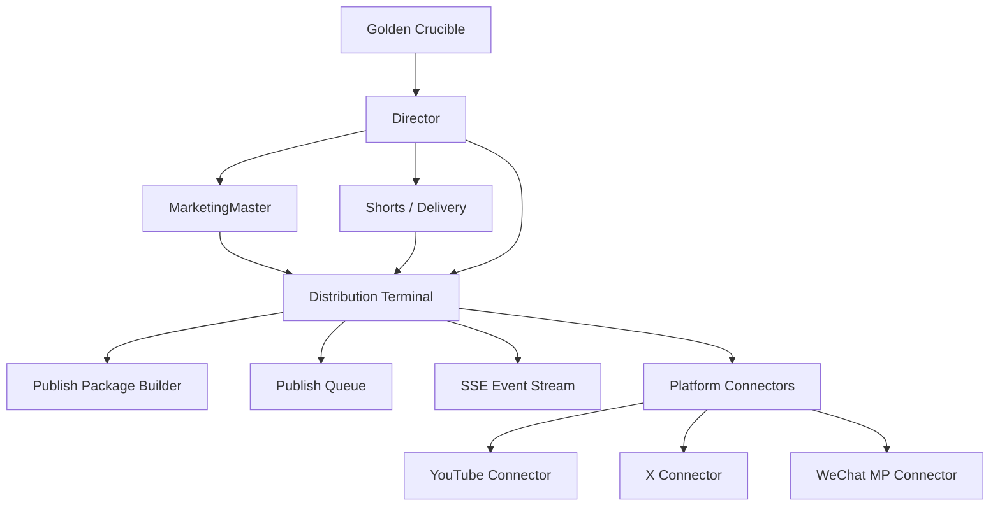

# MHSDC Distribution Terminal 总体设计方案与一期实施方案

> 日期：2026-03-20
> 分支：`MHSDC-DT`
> 目标：在尽量复用现有 Delivery/Director 资产的前提下，尽快上线 `YouTube + X + 微信公众号` 的一期可用分发能力，并为后续多平台扩展与黄金坩埚 SSE 化留出统一底座。

---

## 1. 设计结论

本次不建议把 Distribution Terminal 做成一个完全脱离 `Director / Delivery Console` 的新系统，也不建议继续沿用当前“从 Director 母体整仓复制出来”的形态。

**推荐路线**：

1. **架构上独立**：Distribution Terminal 作为独立模块与独立 worktree 演进。
2. **产物上依赖**：一期继续消费 `Director / Marketing / Shorts` 产出的项目资产与元数据。
3. **通信上统一**：全系统逐步向 `SSE-first` 收敛，作为后续黄金坩埚、分发终端、营销终端共享的实时任务协议。
4. **平台上分层**：平台能力必须拆成 `Official API Connector` 与 `Browser/Draft Connector` 两条通道。
5. **范围上收敛**：一期只做 `YouTube + X + 微信公众号`，先打通一条稳定主链路，再扩平台。

---

## 2. 为什么必须综合考虑 Director

Distribution Terminal 不是凭空发布，它天然位于整条内容生产链末端：

`Golden Crucible -> Director -> Marketing -> Shorts/Delivery -> Distribution`

其中 `Director` 是一期最关键的上游，因为它决定了：

1. **视频主资产来源**：长视频、竖版视频、封面、章节信息。
2. **结构化元数据来源**：标题候选、片段说明、章节摘要、视觉主题。
3. **分发候选包来源**：哪些内容适合长视频平台，哪些适合图文平台，哪些适合二次包装。

所以总体设计不能把 Director 当成“外部系统”，而要把它定义为 Distribution 的首要供料方。

**一期边界建议**：

- `Director` 继续负责内容生成与渲染。
- `MarketingMaster` 继续负责标题/摘要/标签候选。
- `Distribution Terminal` 只负责：
  - 读取项目资产
  - 组装发布包
  - 账号鉴权
  - 队列调度
  - 平台发布
  - 结果回写

也就是说，一期不在 Distribution 内重复实现 Director 的内容理解逻辑。

---

## 3. 总体架构方案

### 3.1 架构定位

Distribution Terminal 应被定义为：

**“项目级发布编排器 + 平台连接器宿主 + 发布状态回写中心”**

而不是“另一个巨石 Console”。

### 3.2 目标形态



### 3.3 后端分层

后端建议拆成 6 层：

1. **API Layer**
   - 接收创建任务、查询任务、鉴权、重试、取消请求
   - 建议继续保留在 `Express`

2. **Application Layer**
   - `DistributionOrchestrator`
   - 负责把项目资产转成统一发布任务

3. **Domain Layer**
   - `PublishJob`
   - `PublishPackage`
   - `PlatformAccount`
   - `PublishResult`
   - `PlatformCapability`

4. **Connector Layer**
   - `YouTubeConnector`
   - `XConnector`
   - `WechatMpConnector`
   - 后续扩展到 Bilibili / Douyin / Video Account

5. **Runtime Layer**
   - Queue / Retry / Backoff / Timeout / Dead Letter
   - SSE Event Bus

6. **Storage Layer**
   - 项目内状态文件
   - 全局 auth 凭据
   - 发布日志与结果落盘

---

## 4. 与现有代码的关系

### 4.1 直接复用

以下能力建议一期直接复用或轻改：

1. [server/youtube-auth.ts](/Users/luzhoua/MHSDC/Distribution%20Terminal/server/youtube-auth.ts)
   - 已有 YouTube OAuth 和上传雏形
   - 需要从 `shorts/upload` 抽成通用 `YouTubeConnector`

2. [server/project-paths.ts](/Users/luzhoua/MHSDC/Distribution%20Terminal/server/project-paths.ts)
   - 继续作为项目路径真相来源

3. [server/market.ts](/Users/luzhoua/MHSDC/Distribution%20Terminal/server/market.ts)
   - 已验证 SSE 写法，可沉淀为分发事件流公共 helper

4. [server/distribution.ts](/Users/luzhoua/MHSDC/Distribution%20Terminal/server/distribution.ts)
   - 现有 Auth/Queue 原型可作为过渡骨架
   - 但需要拆成更细的 service / connector / store

### 4.2 必须逐步拆离

以下耦合如果不拆，一期能跑，但二期会变慢、变脆：

1. [src/App.tsx](/Users/luzhoua/MHSDC/Distribution%20Terminal/src/App.tsx)
   - 当前仍然是 Delivery/Director 为主体，Distribution 只是一个页签
   - 建议保留一期兼容入口，但二期要把 Distribution 升级为真正独立应用壳

2. [src/types.ts](/Users/luzhoua/MHSDC/Distribution%20Terminal/src/types.ts)
   - 当前类型以 Delivery/Director 为主
   - 应补一组独立的 Distribution Domain Types

3. 全局 `delivery_store` 思维
   - 分发状态不能继续依附巨石宿主
   - 应逐步转成项目内独立 `distribution_state/queue/history`

---

## 5. 一期的数据与状态设计

### 5.1 项目内落盘结构

一期建议新增：

```text
<ProjectRoot>/
  06_Distribution/
    distribution_queue.json
    distribution_history.json
    publish_packages/
      pkg-*.json
    outbound/
      youtube/
      x/
      wechat_mp/
```

### 5.2 全局凭据

继续沿用：

```text
~/.mindhikers/auth.json
```

但结构建议扩成：

- 平台
- 鉴权方式
- 账号标识
- 过期时间
- 可用能力范围
- 上次验证时间

### 5.3 统一领域模型

一期先定义四个核心模型：

```ts
interface PublishPackage {
  packageId: string;
  projectId: string;
  source: 'director' | 'marketing' | 'shorts' | 'manual';
  assets: {
    video169?: string;
    video916?: string;
    coverImage?: string;
    articleMarkdown?: string;
  };
  content: {
    title: string;
    summary?: string;
    body?: string;
    tags: string[];
  };
}

interface PublishJob {
  jobId: string;
  packageId: string;
  platform: 'youtube' | 'x' | 'wechat_mp';
  mode: 'immediate' | 'scheduled' | 'draft';
  status: 'queued' | 'running' | 'waiting_retry' | 'succeeded' | 'failed';
}
```

---

## 6. SSE-first 设计

### 6.1 为什么一期就上 SSE

因为你已经明确提出：

1. 黄金坩埚未来可能切到 SSE
2. 分发终端要支持更多平台
3. 用户需要看到实时发布进度与失败原因

如果现在继续以“普通 REST 提交 + 轮询列表”为主，后续很快会重复造协议。

### 6.2 一期 SSE 使用范围

一期先把 SSE 用在三个地方：

1. **创建发布任务后的进度流**
2. **单平台发布时的日志回传**
3. **失败重试 / 成功回写时的状态广播**

事件建议统一为：

- `job_created`
- `job_started`
- `job_progress`
- `job_waiting_retry`
- `job_succeeded`
- `job_failed`
- `job_log`

### 6.3 与 Socket.IO 的关系

不要求一期全面去掉 Socket.IO。

建议策略：

- `Chat / 专家协作` 暂保留 Socket.IO
- `分发任务流` 新增 SSE
- 后续成熟后，再评估是否统一到更简洁的事件层

这能最大化降低一期改造成本。

---

## 7. 平台策略：为什么一期选 YouTube + X + 微信公众号

这个组合不是随意选的，而是最适合一期稳定上线的三角结构：

1. **YouTube**
   - 已有代码基础
   - 官方 API 清晰
   - 适合验证长视频/Shorts 资产分发链

2. **X**
   - 国际文本/图文分发代表
   - 文案、摘要、封面能力很适合验证 Marketing -> Distribution 的桥

3. **微信公众号**
   - 国内图文阵地代表
   - 能验证 Markdown/长文草稿生成链路
   - 即便初期不能全自动正式发布，也可先做到“高质量草稿入库/待确认”

这三个平台刚好覆盖：

- 国际视频
- 国际图文
- 国内图文

从验证价值和工程风险看，是一期最好的切法。

---

## 8. 一期实施方案

### Phase 0：骨架治理（2-3 天）

目标：先把当前“复制来的 Director 母体”调整到可承载 Distribution 演进。

任务：

1. 梳理 Distribution 专属类型与状态文件
2. 把 [server/distribution.ts](/Users/luzhoua/MHSDC/Distribution%20Terminal/server/distribution.ts) 拆出：
   - `distribution-store.ts`
   - `distribution-auth-service.ts`
   - `distribution-queue-service.ts`
3. 抽公共 SSE helper
4. 将分发队列路径改为项目内 `06_Distribution/distribution_queue.json`

交付标准：

- 不再把队列存到全局 `_distribution_queue.json`
- SSE helper 可被分发模块直接复用

### Phase 1：YouTube Connector 上线（3-4 天）

目标：优先打通最稳的一条视频发布链。

任务：

1. 从 `youtube-auth.ts` 提取 `YouTubeConnector`
2. 支持：
   - 鉴权
   - 上传视频
   - 设置标题/描述/tags
   - 定时发布
3. 将结果回写到：
   - `distribution_history.json`
   - `publish_packages/pkg-*.json`

交付标准：

- 可从 Publish Composer 选择项目视频资产
- 可发 YouTube
- UI 可实时看到上传状态

### Phase 2：X Connector 上线（2-3 天）

目标：补齐国际图文/短宣发能力。

任务：

1. 新增 `XConnector`
2. 一期支持：
   - 纯文本推文
   - 带封面图的单帖发布
3. 从 Marketing/Director 产物里自动装填文案候选

交付标准：

- 可以从同一发布包派生 X 任务
- 支持单独定制 X 标题/正文

### Phase 3：微信公众号 Draft Connector（3-4 天）

目标：尽快上线国内图文分发，不被全自动正式发布卡死。

任务：

1. 新增 `WechatMpConnector`
2. 一期模式定义为：
   - **优先：草稿箱写入**
   - **次选：标准化素材包导出 + 一键复制**
3. 输入源：
   - 项目 Markdown
   - Marketing 文案
   - Director 摘要/封面图

交付标准：

- 用户能从项目产物生成公众号草稿内容
- 即使正式自动发布受限，也能稳定完成“待发送稿件准备”

### Phase 4：统一 Publish Package Builder（2 天）

目标：把 Director / Marketing / Shorts 的上游输入标准化，减少前端人工拼装。

任务：

1. 自动扫描项目下可发布资产
2. 自动识别：
   - 16:9 视频
   - 9:16 视频
   - 营销文案
   - Markdown 图文
3. 生成默认发布包候选

交付标准：

- Publish Composer 不再只是“手填表单”
- 至少能自动装填 60%-70% 的信息

---

## 9. 一期明确不做什么

为了保证尽快上线，一期明确不做：

1. 不做多租户 SaaS 级权限体系
2. 不做 Redis/BullMQ 强依赖，先用文件状态 + 进程内调度跑稳
3. 不做 Bilibili / 抖音 / 视频号正式接入
4. 不做 Distribution 单独完整重写 UI 壳
5. 不做平台能力“大一统”，保留 connector 差异

---

## 10. 风险与对策

### 风险 1：公众号自动发布链不稳定

对策：

- 一期以“草稿能力上线”作为验收标准
- 正式发布作为二期增强

### 风险 2：当前代码基线仍带大量 Director 包袱

对策：

- 先容忍宿主壳复用
- 但分发服务、状态文件、事件协议必须从一开始就独立

### 风险 3：SSE 和现有 Socket.IO 并行导致复杂度上升

对策：

- 划边界，不混用
- Chat 走 Socket.IO
- 分发任务走 SSE

### 风险 4：平台扩展后任务模型失控

对策：

- 一期先固化领域模型
- 平台 connector 只实现接口，不直接侵入页面逻辑

---

## 11. 一期验收标准

上线验收以以下主链路为准：

1. 从某个项目中选中可发布资产
2. 自动生成一个发布包
3. 选择 `YouTube + X + 微信公众号`
4. 创建三个子任务
5. 页面以 SSE 实时显示任务状态
6. YouTube 成功上传
7. X 成功发帖
8. 微信公众号成功生成草稿或标准化待发稿
9. 所有结果回写到项目 `06_Distribution/`

---

## 12. 推荐开工顺序

建议严格按下面顺序推进：

1. 队列与状态文件迁移到项目内
2. SSE helper 与任务状态流
3. YouTube Connector 抽象化
4. X Connector
5. 微信公众号 Draft Connector
6. Publish Package Builder
7. UI 收口与验收

这是当前“尽快、健壮、方便扩”的最优实现路径。
