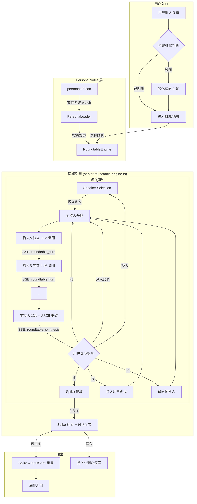

(注:我希望你把方案尽可能细化,我想让opencode团队执行,请协助输出尽可能详细的实施颗粒度的方案给我)

# feat: Roundtable Discussion Engine + GUI Style Alignment

## Overview

为 GoldenCrucible 新增圆桌讨论引擎 — 多位哲人/专家基于结构化人格档案进行辩证对话，用户以"有干预权的导演"身份旁观+控制，最终产出 Spike 列表（结构化命题）+ 讨论全文。Spike 可导入深聊，也可独立使用。同步将 GUI 风格微调至 Claude Code 极简美学。

## Problem Frame

用户直接带着未经碰撞的议题进入深聊（老卢+老张），起点质量受限于个人认知边界。需要一个前置发散层让多视角先碰撞，暴露用户看不到的裂缝。(see origin: `docs/brainstorms/2026-04-09-roundtable-and-gui-redesign-requirements.md`)

## Requirements Trace

| Req | Description | Unit(s) |
|-----|-------------|---------|
| R1-R5 | PersonaProfile 合同 + 热插拔 + 7 预制人物 | 1 |
| R6-R8 | 命题锐化 | 2 |
| R9-R13 | 圆桌编排引擎 + 主持人 + ASCII 框架 | 3 |
| R14-R16 | 用户导演指令（可/止/深入/换人/投/？） | 3 |
| R17-R18 | Spike 提取 + 讨论全文 | 4 |
| R19-R20 | 三条路径平权 | 6 |
| R21-R22 | Spike→深聊桥接 | 5 |
| R23 | 未选中 Spike 持久化 | 4 |
| R24-R25 | 前置对比约束 + 记忆锚定 | 3 |
| R26 | 人格引擎独立调研（不在本期） | — |
| R27-R28 | 信息采集/灵魂文件接口预留 | 5 |
| R29-R33 | GUI 风格微调 + 侧边栏 | 7 |
| R34-R35 | 多发言人 SSE 协议 | 3, 6 |

## Scope Boundaries

- **不做**：人格提取引擎、3-4 层人格模型、后置 cosine 校验、信息采集模块、灵魂文件筛选、CLI、内容改编、大规模 UI 重构、Fine-tuning/LoRA
- **做**：PersonaProfile 合同 + 圆桌引擎 + Spike 提取 + 桥接 + 接口预留 + GUI 微调

## Context & Research

### Relevant Code and Patterns

**Server 扩展点：**
- `server/crucible-orchestrator.ts` — `buildSocratesPrompt()` 是 prompt 构建核心，需要为圆桌场景新增 `buildRoundtablePrompt()`
- `server/crucible.ts` — `resolveCrucibleTurn()` + `streamCrucibleTurn()` 是 turn 处理主线，需要分支到圆桌逻辑
- `server/crucible-persistence.ts` — 会话持久化，`StoredCrucibleConversation` 需要扩展支持多发言人
- `docs/02_design/crucible/souls/` — 现有 soul 文件模式，PersonaProfile 类似但用 JSON 格式

**Frontend 扩展点：**
- `src/components/crucible/CrucibleWorkspaceView.tsx` — 主工作区，需要支持"导演模式"视图
- `src/components/crucible/types.ts` — `CrucibleEngineMode` 枚举已有 `roundtable_discovery`
- `src/components/crucible/sse.ts` — SSE 解析器，需要处理新的多发言人事件
- `src/components/Header.tsx` + `src/App.tsx` — 布局重构目标

**数据类型扩展：**
- `DialoguePayload` — 需要支持多 speaker
- `CrucibleTurnEvent` — 需要新增圆桌专用事件类型
- `PresentableDraft` — 可复用于 Spike 展示

**现有 CSS 变量体系（`src/index.css`）：**
- `--shell-bg`, `--surface-0/1/2/3`, `--ink-1/2/3`, `--accent` — 改为 Claude Code 配色即可

### Institutional Learnings

- **Rule 7**: orchestrator 不做业务判断，只路由 — 圆桌编排逻辑应在 skill 层而非 orchestrator
- **Rule 23-25**: 每种 SSE type 必须有对应前端处理，不能静默忽略
- **Rule 6**: 默认直路由苏格拉底 — 圆桌是新增路由，不改默认行为
- **Rule 89**: Skill 业务逻辑不在后端硬编码
- **Branch strategy**: 圆桌应在独立分支开发，同步 SSE 和 SaaS

## Key Technical Decisions

- **PersonaProfile 用 JSON 文件 + 文件系统热插拔**：不用数据库，奥卡姆剃刀。`personas/` 目录下一个文件一个人物，启动时扫描+watch，新增即生效。理由：最简单、最好维护、与 soul 文件模式一致
- **圆桌引擎作为新的 skill 模块**：不在 orchestrator 中硬编码，而是新增 `server/roundtable-engine.ts`。orchestrator 只负责路由到它。理由：遵循 Rule 7（orchestrator 不做业务判断）(注:确保吃到ljg原版skill精髓)
- **每个哲人独立 LLM 调用**：不在一次调用中生成所有发言。理由：独立上下文 = 更好的角色差异性，且前置对比约束需要将前一位的论点传给下一位 
- **Spike 复用 Presentable 协议**：新增 `spike` 类型到 `PresentableDraft.type`。理由：复用现有黑板展示管道，不造新轮子
- **GUI 微调只改 CSS 变量**：不改组件结构，只改 `--shell-bg` 等变量值 + 字体。理由：最小改动、最小风险(注:在确保与SAAS和SSE兼容的情况下,尽量往claudecode风格调整,且后续要便于摘樱桃把这部分UI优化迁移到SSE&SAAS)

## Open Questions

### Resolved During Planning

- **Q: 圆桌多发言人如何在 SSE 中表示？** → 每位哲人的发言作为独立 `roundtable_turn` 事件推送，包含 `speakerName` 和 `roundNumber`。主持人综合作为 `roundtable_synthesis` 事件。前端逐个渲染。
- **Q: Spike 如何持久化？** → 复用 `CrucibleConversationArtifact` 机制，`type: 'spike'`，存储在对应会话的 artifacts 数组中。侧边栏命题库通过 API 聚合所有会话的 spike artifacts。
- **Q: 命题锐化如何判断"已明确"？** → LLM 判断。将用户输入连同"这是一个可辩论的命题吗？"的 meta-prompt 一起发给 LLM，返回 `{ isSharp: boolean, sharpened?: string, clarifyingQuestions?: string[] }`。

### Deferred to Implementation

- 7 位预制人物 PersonaProfile 的具体参数值（LLM 生成 + 人工审核）
- ASCII 思维框架的具体模板（矩阵/光谱/因果环路，可迭代优化）
- 导演指令 `投`/`？` 的具体 prompt 注入方式（需要实验调优）
- 前置对比约束的最优 prompt 措辞（需要实验验证效果）

## High-Level Technical Design

> *This illustrates the intended approach and is directional guidance for review, not implementation specification. The implementing agent should treat it as context, not code to reproduce.*



## Implementation Units

- [ ] **Unit 1: PersonaProfile Contract + Loader + 7 Personas**

**Goal:** 建立人格档案的数据合同和热插拔加载机制，预制 7 位哲人档案
(注:本版先独立生成哲人提示词以保证工期,但需要确保系统的可扩展性, 以便今后可以根据更好的人格引擎甚至微调LLM引擎哲人代入替换)
**Requirements:** R1, R2, R3, R4, R5

**Dependencies:** None — 纯数据层，无外部依赖

**Files:**
- Create: `server/persona-loader.ts`
- Create: `server/persona-types.ts`
- Create: `personas/socrates.json`
- Create: `personas/nietzsche.json`
- Create: `personas/wang-yangming.json`
- Create: `personas/hannah-arendt.json`
- Create: `personas/charlie-munger.json`
- Create: `personas/feynman.json`
- Create: `personas/herbert-simon.json`
- Test: `server/__tests__/persona-loader.test.ts`

**Approach:**
- `persona-types.ts` 定义 `PersonaProfile` 接口（必填 identity/values/rhetoric/meta + 可选 mental_models/heuristics/expression_dna/personality_traits/argumentation/honest_boundaries）
- `persona-loader.ts` 实现：启动时扫描 `personas/` 目录 → 加载所有 JSON → Zod schema 校验 → 内存缓存。支持运行时 `fs.watch` 热重载。提供 `getAllPersonas()`, `getPersonaBySlug()`, `getPersonasByDomain()` API
- 7 个 JSON 文件用 LLM 基于学术共识生成必填字段，人工审核。values 层用 Haidt MFT 6 foundations 的 0-1 浮点值，rhetoric 层用 Ethos/Pathos/Logos 三维归一化向量 + 文体关键词

**Patterns to follow:**
- `server/skill-loader.ts` — 现有的文件加载模式
- `docs/02_design/crucible/souls/` — soul 文件的组织方式

**Test scenarios:**
- Happy path: 加载 `personas/` 目录下所有合法 JSON，返回正确数量的 PersonaProfile 对象
- Happy path: `getPersonaBySlug('socrates')` 返回苏格拉底的完整 profile
- Happy path: `getPersonasByDomain('philosophy')` 过滤返回相关人物
- Edge case: JSON 文件只有必填字段（无可选扩展），加载成功且可选字段为 undefined
- Edge case: JSON 文件包含未知字段，加载成功（忽略多余字段）
- Error path: JSON 文件缺少必填字段 → 校验失败，跳过该文件并 warn log
- Error path: `personas/` 目录为空 → 返回空数组，不崩溃
- Integration: 热插拔 — 运行时新增一个 JSON 文件后，下次 `getAllPersonas()` 包含新人物

**Verification:**
- 启动服务后，调用内部 API 确认 7 位人物全部加载
- 手动放入一个新 JSON 文件，确认无需重启即可在 API 中获取

---

- [ ] **Unit 2: Proposition Sharpening Module**

**Goal:** 实现命题锐化 — 模糊议题→可辩论命题的快速追问

**Requirements:** R6, R7, R8

**Dependencies:** Unit 1（需要 persona-types 中的通用类型定义）

**Files:**
- Create: `server/proposition-sharpener.ts`
- Modify: `server/crucible.ts` — 新增 `/api/roundtable/sharpen` 端点
- Test: `server/__tests__/proposition-sharpener.test.ts`

**Approach:**
- 接收用户输入 topic，先调 LLM 做 meta 判断（`isSharp`），若已明确则直接返回
- 若模糊，LLM 生成 2-3 个针对性问题，前端展示给用户
- 用户回答后，LLM 综合产出锐化后的命题
- 整个过程最多 1 轮交互，不做多轮
- 返回结构：`{ isSharp: boolean, sharpened?: string, clarifyingQuestions?: string[], originalTopic: string }`

**Patterns to follow:**
- `server/crucible-research.ts` — `detectCrucibleSearchIntent()` 的 LLM 判断模式

**Test scenarios:**
- Happy path: 输入"AI会改变教育" → 返回 `isSharp: false` + 2-3 个 clarifying questions
- Happy path: 输入"大语言模型是否应该被赋予法律人格" → 返回 `isSharp: true, sharpened: ...`
- Edge case: 极短输入（1-2 个字）→ `isSharp: false` + 引导性问题
- Error path: LLM 返回格式异常 → fallback 为 `isSharp: true`（让用户直接进入圆桌，不阻塞）

**Verification:**
- 通过 HTTP 调用 `/api/roundtable/sharpen` 传入模糊议题，确认返回 clarifying questions
- 传入明确命题，确认直接返回 sharpened

---

- [ ] **Unit 3: Roundtable Engine Core**

**Goal:** 实现圆桌讨论的完整编排引擎 — 多哲人独立 LLM 调用 + 主持人综合 + 导演指令 + SSE 多发言人流式输出

**Requirements:** R9, R10, R11, R12, R13, R14, R15, R16, R24, R25, R34, R35

**Dependencies:** Unit 1（PersonaLoader）, Unit 2（锐化后的命题作为输入）

**Files:**
- Create: `server/roundtable-engine.ts`
- Create: `server/roundtable-types.ts`
- Modify: `server/crucible-orchestrator.ts` — 扩展 `engineMode` 路由逻辑
- Modify: `server/crucible.ts` — 新增 `/api/roundtable/turn/stream` 端点
- Test: `server/__tests__/roundtable-engine.test.ts`

**Approach:**

*Speaker Selection*: 接收命题 + 所有 PersonaProfile，LLM 选择 3-5 位最适合产生张力的人物。选择 prompt 包含"最大化立场多元性"的指令。

*每轮编排*:
1. 主持人（系统角色）生成开场/聚焦 — 1 次 LLM 调用
2. 每位哲人独立 LLM 调用（关键设计）：
   - system prompt = PersonaProfile 必填字段展开 + 可选字段增强
   - 对比锚点注入："你必须与 [其他哲人名及其核心立场] 形成张力"
   - 靶子传递：将前一位哲人的核心论点作为"必须回应/挑战的靶子"
   - 轮内记忆：上一轮自己说了什么（防漂移）
3. 主持人综合 — 1 次 LLM 调用，提取争议焦点 + 生成 ASCII 思维框架
4. 等待用户导演指令

*导演指令处理*:
- `可` → 进入下一轮循环
- `止` → 触发 Spike 提取（Unit 4）
- `深入此节` → 下一轮 prompt 中锁定当前争议点
- `换人` → 重新走 Speaker Selection（保留已有对话上下文）
- `投` → 将用户观点注入下一轮所有哲人的 prompt 中作为"来自旁观者的输入"
- `？` → 对指定哲人发起追问，该哲人额外做一次 LLM 调用回应

*SSE 事件类型*:
- `roundtable_turn` — 单个哲人的发言 `{ speaker, utterance, action, briefSummary }`
- `roundtable_synthesis` — 主持人综合 `{ focusPoint, asciiFramework, nextLayerQuestion }`
- `roundtable_awaiting` — 等待用户导演指令
- `roundtable_error` / `roundtable_done` — 错误和完成

**Technical design:**

> *Directional guidance, not implementation specification.*

```
RoundtableEngine {
  startRound(proposition, selectedPersonas, history) → SSE stream
    1. moderator.openRound(proposition, history) → SSE:roundtable_synthesis
    2. for each persona in selectedPersonas:
         buildPersonaPrompt(persona, contrastAnchors, previousTarget, roundMemory)
         callLLM(prompt) → SSE:roundtable_turn
         updateRoundMemory(persona, response)
    3. moderator.synthesize(allResponses) → SSE:roundtable_synthesis
    4. emit SSE:roundtable_awaiting
  
  handleDirectorCommand(command, payload) → next action
}
```

**Patterns to follow:**
- `server/crucible.ts:streamCrucibleTurn()` — SSE 流式输出模式
- `server/crucible-orchestrator.ts:buildSocratesPrompt()` — prompt 构建模式
- ljg-roundtable 的编排逻辑（主持人引导 → 参与者回应 → 综合）

**Test scenarios:**
- Happy path: 传入命题 + 3 位哲人，引擎完成 1 轮讨论，SSE 推送 3 个 `roundtable_turn` + 1 个 `roundtable_synthesis` + 1 个 `roundtable_awaiting`
- Happy path: 导演指令 `可` 后进入第 2 轮，第 2 轮的哲人 prompt 包含第 1 轮的靶子传递
- Happy path: 导演指令 `投 "我认为AI不具备真正的意向性"` 后，下一轮哲人发言中引用了此观点
- Happy path: 导演指令 `？ 苏格拉底 "你如何定义意向性"` 后，苏格拉底额外回应
- Edge case: 导演指令 `换人` 后，新选入的哲人获得已有讨论上下文摘要
- Edge case: 只选 2 位哲人（最少人数边界）仍能正常讨论
- Error path: 某位哲人的 LLM 调用超时 → 跳过该哲人本轮发言，log warning，继续其他人
- Error path: 主持人综合调用失败 → fallback 为简单的论点罗列
- Integration: 对比约束验证 — 同一轮中苏格拉底和尼采的发言在立场上应有明显差异

**Verification:**
- 通过 HTTP 调用圆桌 API，SSE 客户端收到完整的一轮讨论事件序列
- 检查不同哲人的发言在修辞风格和立场上是否有可感知差异

---

- [ ] **Unit 4: Spike Extraction + Persistence**

**Goal:** 讨论结束时自动提取 Spike 列表（2-3 个结构化命题），持久化存储讨论全文和所有 Spike

**Requirements:** R17, R18, R23

**Dependencies:** Unit 3（圆桌引擎产出的讨论数据）

**Files:**
- Create: `server/spike-extractor.ts`
- Create: `server/roundtable-types.ts`（如未在 Unit 3 创建）
- Modify: `server/crucible-persistence.ts` — 扩展 `CrucibleConversationArtifact` 支持 spike 类型
- Test: `server/__tests__/spike-extractor.test.ts`

**Approach:**
- 用户发送 `止` 指令后，引擎将所有轮次的讨论文本传给 LLM，要求提取 2-3 个 Spike
- 每个 Spike 结构：`{ id, proposition, supporters[], opposers[], keyArguments[], tensionScore: 1-5, sourceRoundIndices[] }`
- Spike 作为 `CrucibleConversationArtifact` 存储，`type: 'spike'`
- 讨论全文作为另一个 artifact，`type: 'roundtable_transcript'`
- 未选中的 Spike 保留在 artifacts 中，状态标记为 `pending`，选中的标记为 `selected`

**Patterns to follow:**
- `server/crucible-persistence.ts` — `appendTurnToCrucibleConversation()` 的 artifact 追加模式
- `PresentableDraft` 的 type 扩展模式

**Test scenarios:**
- Happy path: 传入 3 轮讨论文本，提取出 2-3 个 Spike，每个包含完整结构
- Happy path: Spike 持久化后，通过 conversation API 能读回所有 spike artifacts
- Edge case: 讨论只有 1 轮就 `止` → 仍然尝试提取，可能只产出 1 个 Spike
- Edge case: 标记某 Spike 为 `selected` 后，其余自动变为 `pending`
- Error path: LLM Spike 提取失败 → 返回空列表 + warning，不阻塞讨论全文保存

**Verification:**
- 完成一场圆桌讨论后，API 返回 Spike 列表且每个 Spike 结构完整(注:如何对接黄金坩埚,我可能要看到spike列表才能确定,能否形成一个模拟的列表看看?)
- 在 runtime 目录中确认 conversation JSON 包含 spike 和 transcript artifacts

---

- [ ] **Unit 5: Spike→Deep-Chat Bridge + Interface Contracts**

**Goal:** 实现 Spike 到深聊的桥接（结构化摘要注入），并定义未来模块的接口契约

**Requirements:** R21, R22, R27, R28

**Dependencies:** Unit 4（Spike 数据结构）

**Files:**
- Create: `server/roundtable-bridge.ts`
- Create: `server/roundtable-interfaces.ts`
- Modify: `server/crucible-orchestrator.ts` — `buildSocratesPrompt()` 增加圆桌上下文注入
- Test: `server/__tests__/roundtable-bridge.test.ts`

**Approach:**

*Spike→InputCard 桥接*:
- `convertSpikeToInputCard(spike)` — 将 Spike 转为 `InputCard` 格式，proposition 作为 prompt，keyArguments 摘要作为 answer 的前置上下文
- 深聊启动时，如果来源是 Spike，在 `buildSocratesPrompt()` 中注入圆桌碰撞上下文：
  - "此命题来自一场圆桌讨论，以下是关键争议点：[supporters] vs [opposers]，核心论据：[keyArguments]"
  - 老卢和老张可引用哲人的论点来追问用户

*接口契约*:
- `TopicIngestionInterface` — 初命题入口：`{ topic: string, context?: string, source: 'user' | 'rss' | 'wechat' | 'x' }`
- `SoulFilterInterface` — 灵魂文件筛选：`{ candidates: TopicCandidate[], soulProfile: SoulProfile } → FilteredTopics[]`
- 两个接口只定义 TypeScript interface，本期不实现

**Patterns to follow:**
- `server/crucible-orchestrator.ts:buildSocratesPrompt()` — prompt 上下文注入方式

**Test scenarios:**
- Happy path: `convertSpikeToInputCard(spike)` 返回合法 InputCard，包含 proposition 和 keyArguments 摘要
- Happy path: 从 Spike 启动深聊后，`buildSocratesPrompt()` 输出中包含圆桌碰撞上下文
- Edge case: Spike 的 keyArguments 为空 → 仍能转换，只包含 proposition
- Integration: 完整流程 — 圆桌产出 Spike → 选择 → 导入深聊 → 老卢第一句追问引用了圆桌中的论点

**Verification:**
- API 调用：选择 Spike → 启动深聊 → 检查深聊第一轮 prompt 包含圆桌上下文
- TypeScript 编译通过，接口定义可被其他模块引用

---

- [ ] **Unit 6: Frontend — Sidebar Restructure + Roundtable Director UI**

**Goal:** 前端支持三条路径入口、圆桌导演模式界面、Spike 命题库展示

**Requirements:** R19, R20, R29, R30, R31, R32, R33, R34, R35

**Dependencies:** Unit 3（SSE 事件类型定义），Unit 4（Spike 数据结构）

**Files:**
- Create: `src/components/Sidebar.tsx`
- Create: `src/components/roundtable/RoundtableView.tsx`
- Create: `src/components/roundtable/SpikeLibrary.tsx`
- Create: `src/components/roundtable/DirectorControls.tsx`
- Create: `src/components/roundtable/types.ts`
- Modify: `src/App.tsx` — 布局从 header 导航改为侧边栏导航
- Modify: `src/components/crucible/sse.ts` — 处理新的圆桌 SSE 事件类型
- Modify: `src/index.css` — Claude Code 风格配色
- Test: 手动测试（UI 组件）

**Approach:**

*侧边栏*:
- 新建 `Sidebar.tsx` 替代 `Header.tsx` 中的导航功能
- 侧边栏分三个区域：功能入口（圆桌/深聊/分发）、命题库（历史 Spike）、项目/设置
- 可折叠，折叠时只显示图标
- `Header.tsx` 保留但精简，只放标题和最少控制

*圆桌导演视图*:
- `RoundtableView.tsx` — 主容器，SSE 实时渲染哲人发言
- 每位哲人发言显示：人物头像/名称 + 行动标签（陈述/质疑/反驳）+ 发言内容 + 简言之
- 主持人综合区域：争议焦点 + ASCII 框架
- 底部导演控制条：`可` `止` `深入此节` `换人` `投` `？`

*命题库*:
- `SpikeLibrary.tsx` — 侧边栏中的命题列表
- 显示：命题文本、张力度星级、来源圆桌、时间
- 点击 Spike → 弹出选项：导入深聊 / 查看详情

*三条路径*:
- 入口页面清晰呈现三个选项（可用卡片式布局）
- 路径 A（推荐）标记为 recommended

**Patterns to follow:**
- `src/components/crucible/CrucibleWorkspaceView.tsx` — 现有的 SSE 消费和状态管理模式
- `src/components/ExpertNav.tsx` — 现有的侧边导航模式
- Tailwind CSS 工具类的使用习惯

**Test scenarios:**
- Happy path: 侧边栏展示圆桌/深聊/分发三个入口，点击圆桌进入 RoundtableView
- Happy path: 圆桌讨论中 SSE 事件实时渲染，每位哲人发言逐个出现
- Happy path: 导演指令按钮点击后发送对应 API 请求
- Happy path: 讨论结束后 Spike 列表展示，点击"导入深聊"切换到深聊模式
- Happy path: 侧边栏命题库显示历史所有 Spike
- Edge case: 侧边栏折叠时图标可识别
- Edge case: 移动端/窄屏下侧边栏自动折叠

**Verification:**
- 启动前端，确认三条路径入口清晰可见
- 执行完整圆桌讨论，确认 SSE 实时渲染、导演指令可用、Spike 产出并显示在命题库

---

- [ ] **Unit 7: GUI Style Alignment — Claude Code Theme**

**Goal:** 将现有配色和字体对齐至 Claude Code 极简风格

**Requirements:** R29

**Dependencies:** Unit 6（侧边栏布局完成后再调风格）

**Files:**
- Modify: `src/index.css` — 更新 CSS 变量值
- Modify: `tailwind.config.ts`（如需字体配置）

**Approach:**
- 只改 CSS 变量值，不改组件结构
- `--shell-bg` → Claude Code 的深色背景（接近 `#1a1a2e` 或 `#0d1117`）
- `--surface-0/1/2/3` → Claude Code 的层级灰
- `--ink-1/2/3` → Claude Code 的文字色阶
- `--accent` → Claude Code 的强调色
- 字体：等宽字体为主（`JetBrains Mono` / `Fira Code` / `SF Mono`），正文可用 `Inter`
- 去除现有的暖色调装饰

**Patterns to follow:**
- `src/index.css` 中现有的 CSS 变量体系

**Test scenarios:**
- Test expectation: none — 纯视觉变更，通过人眼审查

**Verification:**
- 截图对比：改动前 vs 改动后 vs Claude Code 界面，确认风格趋近

## System-Wide Impact

- **Interaction graph:** 新增 `roundtable-engine.ts` 被 `crucible.ts` 的新端点调用；`persona-loader.ts` 被 roundtable-engine 消费；`spike-extractor.ts` 被 roundtable-engine 在 `止` 指令时调用；`roundtable-bridge.ts` 被 `crucible-orchestrator.ts` 在深聊启动时调用
- **Error propagation:** 单个哲人 LLM 调用失败不应阻塞整轮讨论（跳过 + warn）；Spike 提取失败不应丢失讨论全文
- **State lifecycle risks:** 圆桌讨论中用户刷新页面 → 需要从 persistence 恢复讨论状态（轮次、已有发言、当前等待的导演指令）
- **API surface parity:** 新增的圆桌 API 端点不影响现有深聊端点；`CrucibleEngineMode` 枚举扩展向后兼容
- **Unchanged invariants:** 现有深聊流程（老卢+老张）完全不变；现有 Presentable 协议不变（只新增 spike 类型）；现有 SSE 事件类型不变（只新增 roundtable_* 类型）

## Risks & Dependencies

| Risk | Mitigation |
|------|------------|
| 多哲人独立 LLM 调用导致延迟过高（5人×每人2-3秒=10-15秒/轮） | 并行调用非依赖关系的哲人；前端逐个 SSE 渲染制造"实时辩论"感觉 |
| 前置对比约束不足以保证角色差异性 | 一期先用 prompt 对比锚点+靶子传递；收集实际数据后在二期人格引擎调研中评估是否需要更强机制 |
| 7 位预制人物的 PersonaProfile 参数值主观性强 | LLM 生成 + 人工审核 + 用户反馈迭代；接口开放性保证后续可替换 |
| 侧边栏布局改动影响现有深聊 UI | 先在独立分支验证，不碰现有布局代码直到侧边栏完成 |
| LLM token 消耗较高（每轮 5+ 次调用） | 监控 token 使用量；主持人综合用更短 prompt；考虑可配置的轮数上限 |

## Phased Delivery

### Phase 1: Foundation (Unit 1, 2)
先落地 PersonaProfile 合同和命题锐化，这是独立可测试的基础设施。

### Phase 2: Engine Core (Unit 3, 4)
圆桌引擎 + Spike 提取，可通过纯 API 测试（无需 UI）。

### Phase 3: Integration + UI (Unit 5, 6, 7)
桥接 + 前端 + 风格微调，端到端打通。

## Sources & References

- **Origin document:** [docs/brainstorms/2026-04-09-roundtable-and-gui-redesign-requirements.md](docs/brainstorms/2026-04-09-roundtable-and-gui-redesign-requirements.md)
- **Persona engine research:** [docs/brainstorms/2026-04-09-persona-engine-research-brief.md](docs/brainstorms/2026-04-09-persona-engine-research-brief.md)
- Related code: `server/crucible-orchestrator.ts`, `server/crucible.ts`, `server/crucible-persistence.ts`
- Related architecture: `docs/dev_logs/2026-03-12_SD210_DualStage_Skeleton_And_Blackboard_Refactor.md`
- External reference: [ljg-skill-roundtable](https://github.com/lijigang/ljg-skill-roundtable), [nuwa-skill](https://github.com/alchaincyf/nuwa-skill)
