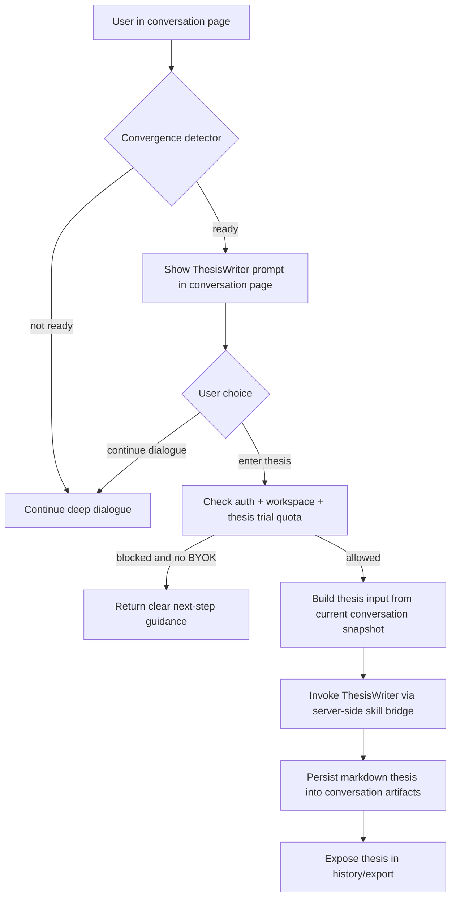
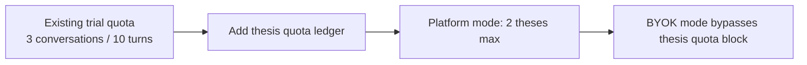

# feat: Golden Crucible SaaS V1 Implementation

## Overview

本计划用于收敛 GoldenCrucible-SaaS 一期上线实施路径，目标是在**不重写现有底座**的前提下，补齐 PRD 中仍缺失的核心功能与验收链路，完成可注册、可试用、可 BYOK、可生成 ThesisWriter 论文、可在 staging / production 验收的 SaaS v1。

当前仓内已经具备多账号、workspace-aware persistence、trial、BYOK、SSE 主链、历史与导出等关键底座。一期实施重点不是"从 0 到 1 搭系统"，而是基于既有实现完成以下收口：

1. ThesisWriter 真接线
2. 话题收敛检测与对话页入口
3. trial 论文额度限制
4. BYOK 轻引导增强
5. staging / production 多账号与主链 smoke 补线
6. 将现有 Linear 早期 issue 口径整理成可执行的一期 Unit 结构

## Problem Frame

PRD 明确将 GoldenCrucible-SaaS 一期定义为：面向早期小规模真实体验的多账号轻量 SaaS，让用户在 workspace 隔离下进行单人深度对谈、查看历史、导出产物，并在话题收敛后生成结构化 Markdown 论文（见 origin: `docs/plans/2026-04-11_GoldenCrucible_SaaS_PRD.md`）。

仓内实际能力已经覆盖了账号、workspace、试用额度、BYOK、SSE 对谈、历史与导出，但 PRD 的一期核心新增功能 `ThesisWriter` 尚未真正接入，且 PRD 要求的环境验收、BYOK 轻引导、trial 论文额度、workspace 隔离 smoke 也未形成完整执行包。

因此本计划的核心问题不是"设计新产品"，而是：

1. 如何基于现有主链，以最小增量方式把 ThesisWriter 接入 conversation / artifact / trial / BYOK / SSE 体系
2. 如何把 PRD 要求映射为可独立执行、可独立验收、可映射到 Linear 的工作包
3. 如何在不扩大一期边界的情况下，完成 staging / production 的可复现验收

## Requirements Trace

- R1. 支持 Google 登录与邮箱登录进入产品主链，并保持登录态（PRD 5.1.1）
- R2. 多账号与 workspace 强隔离；对话、历史、导出、论文产物都归属当前 workspace（PRD 5.1.2）
- R3. 对谈主链在 trial 与 BYOK 模式下都可稳定使用，且在 staging / production 可验收（PRD 5.1.3）
- R4. 历史列表、active conversation 恢复、`bundle-json` 与 `markdown` 导出可用（PRD 5.1.4）
- R5. 系统在满足收敛条件时提示 ThesisWriter；用户进入后可生成 Markdown 论文并保存到当前 conversation artifacts（PRD 5.1.5）
- R6. trial 用户论文生成限 2 次；超限后需给出清晰下一步提示，并允许 BYOK 继续使用（PRD 5.1.5）
- R7. BYOK 支持 `Base URL / API Key / Model` 保存、清除、连通性测试，并补齐轻引导、轻诊断、provider 推荐（PRD 5.1.6）
- R8. staging 与 production 至少各完成一条主链 smoke；不同账号之间历史与产物不可见（PRD 5.3, 7）
- R9. 一期不纳入 Roundtable、轻协作、正式计费、Director / Shorts / Marketing 主工作台（PRD 3, 6）

## Scope Boundaries

- 不把 Roundtable 纳入一期交付或阻塞条件
- 不在一期实现轻协作、workspace 邀请、成员管理
- 不实现正式订阅 / 计费系统，仅保留 trial 超限后的提示口径
- 不实现真 BYOK（key 永不进云端）；继续沿用现有"用户级云端加密存储 BYOK"口径
- 不重做现有 auth、workspace、SSE、history/export 底座，只在必要点位补强
- 不新增全局 ThesisWriter 入口；入口仅出现在对话页
- 不把 ThesisWriter 扩展为独立工作台或跨 conversation 功能

## Context & Research

### Relevant Code and Patterns

- `server/auth/workspace-store.ts`
  - 已实现 `workspace` / `workspace_member` / `active_workspace`
  - `ensurePersonalWorkspace()` 已覆盖 personal workspace 自动创建与 active workspace 写入
- `src/auth/AuthProvider.tsx`
  - 已能在前端拿到 session 与 workspace context
- `server/crucible-persistence.ts`
  - `resolveCruciblePersistenceContext()` 已把 conversation persistence 绑定到当前 workspace
  - `appendTurnToCrucibleConversation()` 已有 artifact 持久化模式，可直接复用保存 thesis artifact
  - `buildCrucibleArtifactExport()` 已支持 `bundle-json` 与 `markdown`
- `server/crucible-trial.ts`
  - 已实现 3 conversations / 10 turns 配额、VIP bypass、BYOK bypass
  - 可作为新增"论文额度"限制的主入口
- `server/crucible-byok.ts`
  - 已实现 AES-256-GCM 加密存储、读取、保存、清除、测试
- `src/components/SaaSLLMConfigPage.tsx`
  - 已有完整 BYOK 配置页与 Kimi 默认模板
  - 适合作为 PRD 5.1.6 的轻引导增强载体
- `server/index.ts`
  - 已暴露 `/api/crucible/trial-status`、`/api/crucible/byok*`、conversation/history/export 路由
  - ThesisWriter 最自然的新增面也应落在该路由域下
- `server/skill-sync.ts`
  - 已将 `ThesisWriter` 作为同步目标注册
- `skills/ThesisWriter/SKILL.md`
  - 仅有 skill 定义，尚未形成服务端触发流程
- `docs/02_design/crucible/souls/oldzhang_soul.profile.yml`
  - `disallowed_stages` 明确禁止 `thesis_finalization`
- `docs/02_design/crucible/souls/oldlu_soul.profile.yml`
  - `handoff_targets` 已包含 `thesis_writer`
- `server/chat.ts`
  - 存在通用聊天流与 provider stream pattern，可借鉴对 ThesisWriter 的非流式 / 流式接法，但不应直接把 SaaS ThesisWriter 接到旧聊天主线

### Institutional Learnings

- `docs/04_progress/rules.md`
  - 宿主层允许保留账号、workspace、SSE 生命周期、持久化、额度 / BYOK / 访问控制，但不应替 skill 做业务语义判断
  - 对本计划的含义是：收敛检测、入口提示、配额判定可以在宿主；论文正文内容组织应交给 ThesisWriter
- `docs/02_design/crucible/2026-03-30_GoldenCrucible_SaaS_Trial_Quota_And_BYOK.md`
  - 现有 trial 与 BYOK 设计已经与仓内代码基本一致，可直接作为扩展"论文额度"的设计基底
- `docs/dev_logs/HANDOFF.md`
  - 当前项目主线应从治理与总纲写作转向实际实施与验收，不再重写第二套治理文档

### External References

- SSE 生命周期中 `retry` 与 comment/heartbeat 都是标准能力，适合作为流式交付与重连测试的依据
- 多租户系统需要明确 cross-tenant controls，支持将 workspace 隔离 smoke 提升为一期验收显式工作包
- 用量/额度型系统应采用幂等与可审计的计数口径，这支持将"trial 论文额度"设计成独立、可追踪的数据记录而不是仅前端计数

## Key Technical Decisions

- 采用"**在现有 Crucible 路由域内新增 ThesisWriter 子链**"而不是新工作台
  - 理由：PRD 明确入口仅在对话页，且论文产物必须绑定当前 conversation artifacts
- 采用"**显式论文生成 API + 可选 SSE 输出**"而不是把 ThesisWriter 继续埋在后台工具链中
  - 理由：PRD 要求用户在收敛提示后主动进入论文编写环节，后台隐式工具不足以满足可见入口与试用额度控制
- 采用"**宿主负责收敛检测结果与额度判定，ThesisWriter 负责正文生成**"
  - 理由：符合 host boundary；避免让 skill 反向承担账号/额度/权限职责
- 采用"**论文额度单独建账**"而不是把论文生成塞进现有 conversation / turn 配额
  - 理由：PRD 将其定义为独立的 2 次额度，不应与对话轮次混用
- 采用"**优先扩展现有 artifact/export 模式**"而不是为论文另建平行存储
  - 理由：现有 artifacts、history、export 已可复用，增量最小
- 采用"**TDD / characterization-first**"实施姿态
  - 理由：涉及多模块、验收链路长、环境差异大，先锁定 contract 与回归保护可降低 SaaS v1 风险
- 采用"**复用现有 MIN-105 / MIN-107 / MIN-108 / MIN-109，并新增 PRD 缺口 Unit issue**"
  - 理由：减少重复建卡，同时把早期 demo issue 口径升级为 PRD 一期口径

## Open Questions

### Resolved During Planning

- 话题收敛入口是否做全局入口
  - 结论：不做。仅在对话页出现，符合 PRD 5.1.5
- ThesisWriter 产物是否独立于 conversation 存储
  - 结论：不独立。保存到当前 conversation artifacts，直接复用现有 export 体系
- 论文额度是否复用现有 turn/conversation 配额
  - 结论：不复用。单独计数，避免计费 / 提示语义混乱
- Soul profile 如何处理 ThesisWriter 阶段
  - 结论：老张不进入 `thesis_finalization`；老卢可 handoff 到 `thesis_writer`，保持既有 soul 约束
- BYOK 一期是否升级为真 BYOK
  - 结论：不升级，继续沿用轻量 BYOK 口径

### Deferred to Implementation

- 收敛检测具体阈值与特征组合
  - 原因：规划阶段可确定接口与测试边界，但具体启发式阈值需要结合现有对话样本做校准
- ThesisWriter 是否默认使用同步返回还是流式返回全文
  - 原因：两种实现都可行；优先在实现阶段根据复用成本与 UX 细节决定
- thesis artifact 的精确 type 命名
  - 原因：规划阶段确认需要扩展 artifact 分类即可，最终命名由实现时与现有导出结构统一
- staging / production 具体 smoke request 文件编号
  - 原因：应在执行阶段按测试目录现状落号

## High-Level Technical Design

> 这部分用于说明方案形状，属于评审导向的设计草图，不是实现规格。执行时应把它视为上下文，而不是照抄代码。

## Implementation Units

- [ ] **[Unit 1] Core Path Readiness**
  
**Goal:** 在不改变产品边界的前提下，收稳一期上线的基础主链，明确哪些现有能力直接复用，哪些能力成为后续 Unit 的依赖前提。

**Requirements:** R1, R2, R3, R4, R8

**Dependencies:** None

**Files:**
- Reference: `server/auth/workspace-store.ts`
- Reference: `server/crucible-persistence.ts`
- Reference: `server/crucible-trial.ts`
- Reference: `server/crucible-byok.ts`
- Test: `testing/golden-crucible/requests/`
- Test: `testing/golden-crucible/reports/`

**Approach:**
- 以 PRD 为唯一 origin，把现有 auth/workspace/history/export/trial/BYOK/SSE 主链登记为"已可复用基础能力"
- 把 staging / production 主链、workspace 隔离、BYOK 切换、历史导出补线纳入一期实施结构，而不是分散为临时验收项
- 为后续 ThesisWriter Unit 固定依赖前提：conversation 必须 workspace-aware、artifact/export 必须沿用既有结构、trial/BYOK 必须成为单一准入层

**Execution note:** 先补 characterization 与 smoke request，再进入新增功能开发。

**Patterns to follow:**
- `server/crucible-persistence.ts` 的 workspace-aware persistence context
- `src/SaaSApp.tsx` 的 SaaS hash-route 页面结构
- `testing/golden-crucible/` 现有 request/report 组织方式

**Test scenarios:**
- Integration: 已登录用户进入 SaaS 首页后，能够读取 trial status、history、active conversation，不出现未授权串链
- Integration: 在 staging 环境完成一次"登录 -> 新建对话 -> 导出 markdown"的完整链路
- Integration: 在 production 环境完成一次"登录 -> 恢复 active conversation -> 再问 1 轮"的完整链路

**Verification:**
- 一期已实现能力与待实现能力边界被固定下来
- 后续所有 Unit 都能明确复用基础代码，而不是另开平行实现
- 至少形成可复现的 staging / production 主链 smoke 框架

---

- [ ] **[Unit 2] Thesis Convergence Gate**

**Goal:** 为对话页建立"话题收敛检测 + ThesisWriter 入口提示"能力，只在满足条件时出现论文生成入口。

**Requirements:** R5, R9

**Dependencies:** Unit 1

**Files:**
- Modify: `server/crucible.ts`
- Modify: `server/crucible-orchestrator.ts`
- Modify: `server/crucible-persistence.ts`
- Modify: `src/components/ChatPanel.tsx`
- Modify: `src/components/CrucibleWorkspace.tsx`
- Modify: `src/components/crucible/types.ts`
- Test: `server/__tests__/crucible-thesis-convergence.test.ts`
- Test: `src/components/__tests__/crucible-thesis-entry.test.tsx`

**Approach:**
- 在现有对话生成链中增加"收敛状态"判定结果，作为 conversation-level metadata 或 snapshot 扩展字段
- 不让 orchestrator 直接写 ThesisWriter 正文，只输出"已达到可写论文条件"的信号
- 前端仅在对话页渲染 ThesisWriter CTA，不在 history 页、全局导航或其他页面暴露入口
- 保持 soul boundary：老张不进入 `thesis_finalization`；收敛提示应更多承接老卢结构化 handoff 语义

**Execution note:** 先写服务端 convergence contract 测试，再写前端入口显示条件测试。

**Patterns to follow:**
- `server/crucible.ts` 现有 trial / byok gating 方式
- `src/components/ChatPanel.tsx` 现有 trial banner / warning 呈现方式
- `docs/02_design/crucible/souls/oldzhang_soul.profile.yml`
- `docs/02_design/crucible/souls/oldlu_soul.profile.yml`

**Test scenarios:**
- Happy path: 对话达到定义的收敛条件后，服务端返回 `thesis-ready` 信号，前端在当前对话页显示 ThesisWriter 入口
- Edge case: 收敛条件未满足时，前端不显示 ThesisWriter 入口
- Edge case: 已显示入口后继续对话，若后续状态回退为未收敛，入口处理符合既定规则而不出现错乱
- Error path: 服务端无法生成收敛信号时，不阻断普通对谈主链，仅隐藏 ThesisWriter 入口并保留可排障信息
- Integration: 老张参与阶段不进入 `thesis_finalization`；老卢阶段允许向 `thesis_writer` handoff
- Integration: 刷新页面后，已收敛 conversation 的 ThesisWriter 入口状态可恢复

**Verification:**
- 对话页出现受控的 ThesisWriter 入口
- 入口状态与 conversation snapshot 绑定，可刷新恢复
- 不引入全局入口或超出 PRD 的 UI 扩展

---

- [ ] **[Unit 3] ThesisWriter API And Artifact Persistence**

**Goal:** 将 `skills/ThesisWriter/SKILL.md` 真正接入 SaaS 主链，支持从当前 conversation 生成 Markdown 论文并保存到 artifacts。

**Requirements:** R5, R7

**Dependencies:** Unit 2

**Files:**
- Modify: `server/index.ts`
- Modify: `server/crucible.ts`
- Modify: `server/crucible-persistence.ts`
- Modify: `server/skill-sync.ts`
- Modify: `server/chat.ts`
- Modify: `src/components/ChatPanel.tsx`
- Modify: `src/components/crucible/CrucibleHistorySheet.tsx`
- Modify: `src/components/crucible/types.ts`
- Reference: `skills/ThesisWriter/SKILL.md`
- Test: `server/__tests__/crucible-thesis-generation.test.ts`
- Test: `server/__tests__/crucible-thesis-artifact-export.test.ts`
- Test: `src/components/__tests__/crucible-thesis-flow.test.tsx`

**Approach:**
- 在 `/api/crucible/*` 下新增 ThesisWriter 专属生成接口，保持与 conversation / artifact / auth / workspace 同域
- 生成输入以当前 conversation snapshot、messages、artifacts 为主，不新建平行数据源
- 论文输出固定为 Markdown，并以 artifact 形式追加到当前 conversation
- 导出链路沿用 `buildCrucibleArtifactExport()`，确保 thesis artifact 可被 `bundle-json` 与 `markdown` 导出带出
- `server/chat.ts` 中已有 provider / stream pattern 可借鉴，但 ThesisWriter 不应走历史通用专家聊天入口

**Execution note:** 从 failing integration test 开始，先锁定"生成成功 -> artifact 落盘 -> 导出可见"的 contract。

**Technical design:** *(directional only)*
- 请求：`conversationId + projectId/scriptPath context`
- 服务端：
  - 校验 auth / workspace / thesis quota / byok mode
  - 读取 conversation detail
  - 组装 ThesisWriter 输入
  - 调用 skill / LLM
  - 保存 markdown artifact
  - 返回 artifact summary + content preview
- 前端：
  - 在对话页触发论文生成
  - 渲染 loading / success / blocked / error 状态
  - 将新 artifact 反映到 history/export

**Patterns to follow:**
- `server/index.ts` 现有 `/api/crucible/byok*`、conversation routes 的路由组织
- `server/crucible-persistence.ts` 的 artifact append 与 export builder
- `server/skill-sync.ts` 的 skill registration 方式

**Test scenarios:**
- Happy path: 已收敛的 conversation 触发 ThesisWriter 后，返回 Markdown 正文并保存为当前 conversation artifact
- Happy path: thesis artifact 在 history / detail 中可见，并且导出 `bundle-json` 时包含该 artifact
- Happy path: 导出 `markdown` 时包含 thesis artifact 内容或明确的结构化引用
- Edge case: 同一 conversation 已有 thesis artifact，再次生成时遵循既定覆盖 / 追加策略
- Error path: ThesisWriter 调用失败时，前端展示清晰错误，不破坏原 conversation 数据
- Error path: 未认证或 workspace 不匹配时，接口拒绝访问
- Integration: 在 BYOK 模式下，ThesisWriter 走用户自己的模型配置
- Integration: 论文生成后刷新页面，artifact 仍可恢复
- Integration: 不通过 history 页或全局页面触发 ThesisWriter

**Verification:**
- ThesisWriter 从"skill 文件存在"升级为"真实可调用的 SaaS 能力"
- 论文产物稳定进入当前 conversation artifacts
- 导出链路不需要新建平行实现即可带出论文结果

---

- [ ] **[Unit 4] Thesis Trial Quota**

**Goal:** 为论文生成建立独立的 trial 额度限制与提示链路，满足"trial 用户限 2 次论文生成，BYOK 可继续"的 PRD 口径。

**Requirements:** R6, R7

**Dependencies:** Unit 3

**Files:**
- Modify: `server/crucible-trial.ts`
- Modify: `server/index.ts`
- Modify: `server/crucible-persistence.ts`
- Modify: `src/SaaSApp.tsx`
- Modify: `src/components/ChatPanel.tsx`
- Modify: `src/components/SaaSLLMConfigPage.tsx`
- Test: `server/__tests__/crucible-thesis-trial-quota.test.ts`
- Test: `src/components/__tests__/crucible-thesis-quota-banner.test.tsx`

**Approach:**
- 在现有 trial status 结构上增加 thesis quota 字段，而不是另起一套前端状态接口
- 论文额度单独持久化，避免删除 conversation 或重置 turn 后规避额度
- 平台模式下累计 2 次后阻止继续论文生成；若用户已配置 BYOK，则继续允许生成
- 提示语要明确区分"对话额度"和"论文额度"，避免用户误解

**Execution note:** 先写 quota domain 测试，锁定平台模式 / BYOK 模式 / VIP 模式三种分支。

**Patterns to follow:**
- `server/crucible-trial.ts` 现有 conversation/turn 限制与 `CrucibleTrialLimitError`
- `src/SaaSApp.tsx` / `src/components/ChatPanel.tsx` 现有 trialStatus banner 呈现逻辑

**Test scenarios:**
- Happy path: trial 用户前 2 次论文生成成功，第 3 次被正确限制
- Happy path: BYOK 用户超过 2 次后仍可继续生成论文
- Happy path: VIP 用户不受论文额度限制
- Edge case: 不同 conversation 下生成 thesis 也会累计到同一用户的 2 次额度
- Edge case: 刷新页面后论文额度状态保持一致
- Error path: 额度写入失败时，不应错误扣减；需有可审计恢复路径
- Integration: 论文额度状态出现在 trial status 响应中，并被前端正确解释为 CTA / banner / next-step 提示
- Integration: 对话额度未耗尽但论文额度已耗尽时，只阻止 ThesisWriter，不阻止普通对谈

**Verification:**
- 论文额度成为独立、可追踪、可恢复的限制项
- 平台 / BYOK / VIP 三种模式语义清晰
- PRD 所要求的"2 次后清晰提示"可以被稳定复现

---

- [ ] **[Unit 5] BYOK Guided Onboarding**

**Goal:** 在不改变现有 BYOK 数据结构的前提下，补齐 PRD 5.1.6 要求的引导文案、轻量错误诊断和 2-3 个 provider 推荐。

**Requirements:** R7

**Dependencies:** Unit 1

**Files:**
- Modify: `src/components/SaaSLLMConfigPage.tsx`
- Modify: `server/crucible-byok.ts`
- Modify: `src/SaaSApp.tsx`
- Test: `server/__tests__/crucible-byok-diagnostics.test.ts`
- Test: `src/components/__tests__/saas-llm-config-guidance.test.tsx`

**Approach:**
- 保留现有 `Base URL / API Key / Model` 保存结构，不扩大到 provider 全量目录
- 在前端明确三类内容：
  - 默认推荐：Kimi 原厂 k2.5
  - 何时需要切换 BYOK
  - 2-3 个候选 provider 方向
- 在服务端 `testCrucibleByokConfig()` 现有返回值基础上，将错误归类为可读的轻诊断：
  - 配置不完整
  - 请求超时
  - API 错误
  - 模型不可用
  - Key 无效
- 保持一期边界：不做高级诊断向导，不做图生 / 视生统一配置

**Execution note:** 先为错误归类写测试，再做 UI 文案与 provider 卡片渲染。

**Patterns to follow:**
- `src/components/SaaSLLMConfigPage.tsx` 现有 Kimi 默认模板与 notice/error 呈现
- `server/crucible-byok.ts` 现有 10s timeout 与 API text 回传模式

**Test scenarios:**
- Happy path: 用户看到默认推荐 Kimi 与候选 provider 建议，并理解何时切换 BYOK
- Happy path: 保存 BYOK 后刷新页面，配置状态与引导状态仍正确
- Edge case: Base URL / API Key / Model 缺失时，前端直接阻止提交并给出清晰提示
- Error path: timeout 被识别为"连接超时"
- Error path: 非 2xx API 响应被识别为"API 错误"或更细分的轻诊断
- Error path: 明显的 key invalid / model not found 文本被映射到可读提示
- Integration: BYOK 配置成功后，trial 状态提示切换为 BYOK 模式
- Integration: ThesisWriter 入口与论文生成在 BYOK 模式下可继续使用

**Verification:**
- BYOK 从"可配置"升级为"可理解、可自助排障"
- 不引入超出一期边界的 provider 管理复杂度
- 配置完成后，对谈与 ThesisWriter 均可继续使用

---

- [ ] **[Unit 6] Auth And Workspace Isolation Acceptance**

**Goal:** 将已存在的 auth + workspace 隔离能力补成可验收的一期证据链，覆盖受控邀请 / 开放注册并列口径中的"一般注册用户主链"。

**Requirements:** R1, R2, R8

**Dependencies:** Unit 1

**Files:**
- Modify: `testing/golden-crucible/README.md`
- Create: `testing/golden-crucible/requests/TREQ-2026-04-12-GC-SAAS-001-auth-and-workspace-smoke.md`
- Create: `testing/golden-crucible/requests/TREQ-2026-04-12-GC-SAAS-002-cross-account-isolation-smoke.md`
- Test expectation: none -- 本 Unit 以环境 smoke / evidence 为主，不新增仓内单测文件

**Approach:**
- 把 PRD 的登录与 workspace 验收口径转化为明确 smoke request
- 覆盖：Google 登录、邮箱登录/注册、personal workspace 自动创建、不同账号历史与产物不可见
- 重点不是重做 BetterAuth，而是形成 staging / production 证据

**Execution note:** 该 Unit 偏验收与 characterization，先生成 request，再由执行阶段走 browser / environment smoke。

**Patterns to follow:**
- `testing/golden-crucible/` 现有 request / report 模板
- `server/auth/index.ts`
- `server/auth/account-router.ts`
- `server/auth/workspace-store.ts`

**Test scenarios:**
- Happy path: Google 登录成功并进入对话主链
- Happy path: 邮箱注册 / 登录成功并进入对话主链
- Happy path: 首次登录后自动拥有 personal workspace
- Edge case: 刷新页面后 session 与 active workspace 仍可恢复
- Error path: 登录失败时返回可理解提示，不暴露敏感信息
- Integration: A 账号产生的 conversation / artifacts 对 B 账号不可见
- Integration: B 账号无法通过任何已知 URL 或 active pointer 恢复 A 账号 conversation

**Verification:**
- 登录与 workspace 隔离验收从"架构上应该成立"升级为"有 staging / production 证据"
- 一期验收的 auth/workspace 部分具备可复现 request/report

---

- [ ] **[Unit 7] Staging And Production Acceptance Rail**

**Goal:** 形成一期完整 smoke 路径与验收证据包，覆盖对谈主链、历史与导出、ThesisWriter、BYOK、workspace 隔离。

**Requirements:** R3, R4, R5, R6, R7, R8

**Dependencies:** Unit 2, Unit 3, Unit 4, Unit 5, Unit 6

**Files:**
- Create: `testing/golden-crucible/requests/TREQ-2026-04-12-GC-SAAS-003-core-dialogue-smoke.md`
- Create: `testing/golden-crucible/requests/TREQ-2026-04-12-GC-SAAS-004-history-and-export-smoke.md`
- Create: `testing/golden-crucible/requests/TREQ-2026-04-12-GC-SAAS-005-thesiswriter-smoke.md`
- Create: `testing/golden-crucible/requests/TREQ-2026-04-12-GC-SAAS-006-byok-smoke.md`
- Create: `testing/golden-crucible/reports/`
- Create: `docs/dev_logs/2026-04-12.md`
- Modify: `docs/dev_logs/HANDOFF.md`
- Test expectation: none -- 本 Unit 以环境验收、报告与交接回写为主

**Approach:**
- 以 PRD 5.3 的 6 条必测链路为 smoke request 骨架
- 明确 staging 与 production 各至少一条主链 smoke
- 每条 smoke 都要求对应 report / artifact / status 记录
- 将验收结果回写到 dev log 与 handoff，形成上线收口面

**Execution note:** 这是验收封口 Unit，必须在实现 Unit 全部落地后执行。

**Patterns to follow:**
- `testing/README.md`
- `testing/OPENCODE_INIT.md`
- `testing/golden-crucible/` 现有 report 口径
- `docs/dev_logs/HANDOFF.md` 的覆盖写规范

**Test scenarios:**
- Happy path: 新建对话后完成至少 3 轮有效问答
- Happy path: 刷新页面后恢复 active conversation 并继续 1 轮问答
- Happy path: 任意对话可导出 `bundle-json`
- Happy path: 任意对话可导出 `markdown`
- Happy path: 收敛后进入 ThesisWriter，成功生成 Markdown 论文并保存为 artifacts
- Happy path: 填写 BYOK 后通过连通性测试，并在 BYOK 模式下完成对谈与论文生成
- Edge case: trial 用户论文生成达到 2 次后被正确限制，并获得清晰下一步提示
- Error path: 网络异常 / 模型异常 / timeout 时，主链可见明确错误提示并支持重试
- Integration: staging 与 production 若行为存在差异，report 中给出环境差异解释

**Verification:**
- 一期 PRD 的 6 条验收链路均有 request / report / artifacts
- staging / production 均完成至少一条主链 smoke
- handoff 与 dev log 完成收口回写

## Linear Mapping

### Parent Issue

- 父 issue 继续使用：`MIN-94` 黄金坩埚 SAAS 安全上线（可注册可试用）

### Existing Issues To Reuse

| 现有 Issue | 建议操作 | 映射到 Unit |
|-----------|---------|------------|
| `MIN-105` | 重命名为 `[Unit 1] Core Path Readiness`，更新描述 | Unit 1 |
| `MIN-109` | 重命名为 `[Unit 5] BYOK Guided Onboarding`，更新描述 | Unit 5 |
| `MIN-107` | 重命名为 `[Unit 6] Auth And Workspace Isolation Acceptance`，更新描述 | Unit 6 |
| `MIN-108` | 重命名为 `[Unit 7] Staging And Production Acceptance Rail`，更新描述 | Unit 7 |

### New Issues To Create

| 新 Issue | 映射到 Unit |
|---------|------------|
| `[Unit 2] Thesis Convergence Gate` | Unit 2 |
| `[Unit 3] ThesisWriter API And Artifact Persistence` | Unit 3 |
| `[Unit 4] Thesis Trial Quota` | Unit 4 |

### Issues To Keep As Historical

- `MIN-95`, `MIN-96`, `MIN-97`, `MIN-98`, `MIN-99` — 保留 Duplicate 历史状态，不再回填一期主线内容

## Atomic Commit Strategy

1. `refs MIN-105 harden saas v1 core path contracts` — Unit 1
2. `refs MIN-XXX add thesis convergence gate` — Unit 2
3. `refs MIN-XXX add thesiswriter generation api and artifact persistence` — Unit 3
4. `refs MIN-XXX add thesis trial quota enforcement` — Unit 4
5. `refs MIN-109 improve byok guidance and diagnostics` — Unit 5
6. `refs MIN-107 add auth and workspace isolation smoke coverage` — Unit 6
7. `refs MIN-108 add staging production acceptance evidence` — Unit 7

约束：
- 不把新功能代码与环境 smoke 结果混在同一个提交
- 不把 ThesisWriter 接线与论文额度限制混在同一个提交
- 不把 BYOK UX 强化与 ThesisWriter 逻辑耦合提交
- 只有用户明确要求时才执行实际 commit

## TDD Strategy

### Per-Unit Testing Posture

- Unit 1: characterization + smoke request first
- Unit 2: server contract test first, then UI visibility test
- Unit 3: integration test first for generate -> persist -> export
- Unit 4: domain quota tests first for platform / byok / vip branches
- Unit 5: diagnostics mapping tests first, then UI guidance rendering
- Unit 6: environment smoke requests first
- Unit 7: acceptance execution and evidence aggregation last

## System-Wide Impact

- **Interaction graph:** auth session -> workspace context -> persistence context -> trial status -> BYOK mode -> ThesisWriter API -> artifact export
- **Error propagation:** ThesisWriter 生成失败、BYOK 测试失败、trial 论文额度超限，都必须以用户可操作提示回到对话页，不得吞错
- **State lifecycle risks:** 收敛状态、论文额度、artifact append 都会跨刷新 / 跨 conversation 持续存在，必须避免部分写入与重复扣减
- **API surface parity:** `/api/crucible/*` 下新增 ThesisWriter 后，trial status、history、export 需要同步认识 thesis artifact 与 thesis quota
- **Integration coverage:** 仅靠 unit test 不能证明 workspace 隔离与 staging / production 行为一致，必须补 browser / environment smoke
- **Unchanged invariants:** 现有 auth / workspace schema 不重构；现有 conversation history/export 主链不改为 DB-only 或新服务；Roundtable 不进入一期主链

## Dependencies / Prerequisites

- BetterAuth 与 PostgreSQL 在 staging / production 可用
- `server/skill-sync.ts` 能稳定同步 `ThesisWriter`
- 现有 SSE 主链继续作为唯一主对谈流
- 测试协议继续沿用 `testing/README.md` 与 `testing/OPENCODE_INIT.md`
- 需要一个稳定的环境 smoke 执行窗口用于 staging / production 验收

## Risk Analysis & Mitigation

| Risk | Likelihood | Impact | Mitigation |
|------|-----------|--------|------------|
| 收敛检测阈值过松，导致 ThesisWriter 入口过早出现 | Medium | Medium | 先做保守阈值与显式 CTA，不把入口自动执行化 |
| 收敛检测阈值过严，导致用户难以进入论文生成 | Medium | Medium | 保留继续对话路径，并在实现阶段校准样本 |
| 论文额度记录不独立，导致删除对话可绕过限制 | High | High | 单独建立 thesis quota 账本，不从 conversation 数量反推 |
| ThesisWriter artifact 结构与现有 export 不兼容 | Medium | High | 复用现有 artifact/export builder，先以 integration test 锁定 |
| BYOK 轻诊断覆盖不足，导致支持成本上升 | High | Medium | 在现有 test 接口上做错误分类，先覆盖 PRD 明确列出的 5 类 |
| staging / production 环境差异导致 smoke 不一致 | High | High | 把环境 smoke 作为独立 Unit，要求 request/report 显式记录差异 |
| 把 ThesisWriter 接到旧 chat 主线导致职责混乱 | Medium | High | 仅在 `/api/crucible/*` 域内新增 SaaS ThesisWriter 能力 |

## Phased Delivery

### Phase 1
- Unit 1 Core Path Readiness
- Unit 6 Auth And Workspace Isolation Acceptance（request 先行）
- Unit 5 BYOK Guided Onboarding

### Phase 2
- Unit 2 Thesis Convergence Gate
- Unit 3 ThesisWriter API And Artifact Persistence
- Unit 4 Thesis Trial Quota

### Phase 3
- Unit 7 Staging And Production Acceptance Rail
- dev log / handoff 回写
- 准备进入 `ce:work` 执行

## Documentation / Operational Notes

- 实施完成后需要回写：
  - `docs/dev_logs/2026-04-12.md`
  - `docs/dev_logs/HANDOFF.md`
- 如执行过程中发现既有 `docs/02_design/crucible/` 中关于 ThesisWriter 的旧描述与实现冲突，应在功能落地后做一次文档对齐，但不单独扩成一期主线
- 若 staging / production 需要额外环境变量支撑 ThesisWriter 或 BYOK 测试，应记录到环境验收报告而不是静默修改计划边界

## Sources & References

- **Origin document:** `docs/plans/2026-04-11_GoldenCrucible_SaaS_PRD.md`
- 相关实现：
  - `server/auth/workspace-store.ts`
  - `server/auth/account-router.ts`
  - `src/auth/AuthProvider.tsx`
  - `server/crucible.ts`
  - `server/crucible-trial.ts`
  - `server/crucible-byok.ts`
  - `server/crucible-persistence.ts`
  - `server/index.ts`
  - `src/components/SaaSLLMConfigPage.tsx`
  - `src/components/crucible/CrucibleHistorySheet.tsx`
  - `server/skill-sync.ts`
  - `server/chat.ts`
  - `skills/ThesisWriter/SKILL.md`
  - `docs/02_design/crucible/souls/oldzhang_soul.profile.yml`
  - `docs/02_design/crucible/souls/oldlu_soul.profile.yml`
- 相关设计文档：
  - `docs/02_design/crucible/2026-03-30_GoldenCrucible_SaaS_Trial_Quota_And_BYOK.md`
- 相关测试入口：
  - `testing/README.md`
  - `testing/OPENCODE_INIT.md`
  - `testing/golden-crucible/README.md`
