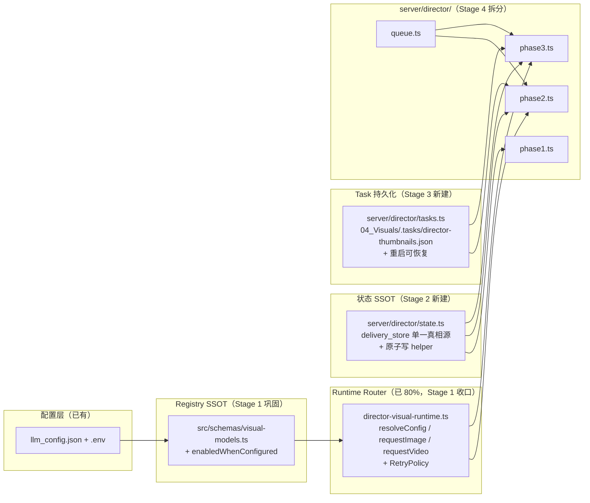
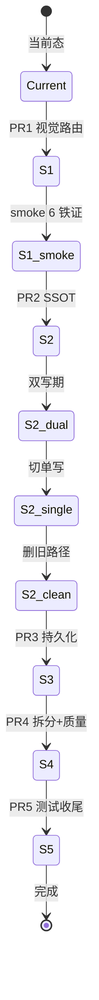

# Director 模块全景治理与未闭环收口 Plan

## Overview

把 Director 模块在 2026-02 至 2026-03 累积的 10 个未闭环点（17 条原子需求）一次性收齐：完成"配置即所得"的最后一公里、把状态层从三处漂移收敛到单一真相源、补齐任务持久化与超时治理、消除 5 处硬编码 provider 假设、把 2242 行的 `server/director.ts` 拆为按职责分组的子目录。本 plan 不写代码，只产出可执行单元、技术决策与验收标准。

> **2026-04-12 重要修订**：ce-review 子代理审计发现 6 条 Critical 安全洞构成完整的"远程攻击链"（C1 路径穿越 + C2 socket 无授权 + C4 LAN 暴露 + C5 API key 泄漏 + C6 .env 注入）。在原 5 个 Stage 之前**新增 Stage 0 — Security Hotfix（PR0）**，作为**阻断式前置阶段**，必须先于 Stage 1 完成。完整 audit 见 `docs/reviews/2026-04-12_director-code-audit.md`。

## Problem Frame

详见 origin 文档 §"Problem Frame"。一句话：Director 是范式样板，再不收，下一轮专家扩容会把同样的坑复制到 4-5 个新模块。

## Requirements Trace

完整 17 条 R 见 origin 文档。本 plan 按优先级分组：

**P0（不可妥协，8 条）**
- R1 消除 5 处硬编码 `'volcengine'`（含 `director.ts:665` 的 type 联合堵点）
- R2 Visual Model Registry 升级为后端可消费 SSOT
- R3 视频运行时路由必须落地（已存在但未被调用侧使用）
- R4 6 条铁证验收必须全部跑通
- R6 Director 收敛到单一状态真相源
- R7 状态写入必须原子
- R16 6 条铁证有自动化或半自动化脚本

**P1（影响下一轮专家扩容，7 条）**
- R5 UI 仅展示运行时真实可执行模型
- R8 thumbnailTasks 持久化
- R9 超时与轮询阈值集中可配
- R10 重试策略显式而非字符串匹配
- R11 `safeParseLLMJson` 不再静默丢字段
- R12 prompt / API key 日志脱敏
- R17 故障注入测试

**P2（长期可维护性，3 条）**
- R13 消除 `any` / `as any`
- R14 `server/director.ts` 拆分（≤600 行/文件）
- R15 清理 `*.backup` 残留 + CI 拦截

## Scope Boundaries

完全继承 origin 文档 §"Scope Boundaries"。不重复列出。补充一条：

- ❌ 不重写 `director-visual-runtime.ts` —— 该文件已 80% 完成且质量良好，本 plan 仅扩展，不重建

## Context & Research

### Relevant Code and Patterns

| 角色 | 文件 | 用途 |
|---|---|---|
| Runtime Router（已存在，质量好） | `server/director-visual-runtime.ts:1-271` | 已实现 `resolveDirectorVisualConfig` / `requestDirectorImage` / `pollDirectorImage` / `generateDirectorImage` / `requestDirectorVideo` / `pollDirectorVideo`。Stage 1 主要是接通调用侧 |
| Registry（已 shared，物理位置在 src/） | `src/schemas/visual-models.ts:1-86` | 提供 `VISUAL_MODEL_REGISTRY` + 6 个 helper。已被 server 端 import，事实上就是双端共享 |
| Provider Adapters | `server/volcengine.ts`、`server/google-gemini-image.ts` | 输出格式已统一为 router 期望的 `image_url`/`task_id`/`error` 三元组 |
| 反模式样板 | `server/expert_state_manager.ts:1-71` | `data: any` opaque、parse 失败会**重置 state**、非原子 `writeFileSync`。本 plan 的 Stage 2 必须把这套机制替代掉 |
| 主问题文件 | `server/director.ts`（2242 行） | 5 处硬编码 `'volcengine'` 在 665/938/1020/1125/1143。Stage 1 + Stage 4 联合处理 |
| Shared Helper 模板 | `server/project-paths.ts` | L-015 修复后建立的"集中管理"模式。Stage 2 的原子写 helper、Stage 3 的超时配置 helper 都应复用这套约定 |
| Phase2 批量队列已实现 | `server/director.ts:1330-1500` 区间 + `sd204.1` 设计文档 | 不动队列编排，只把队列里的 provider 决策点引到 runtime router |

### Institutional Learnings

- **L-011** Phase2 Seedance thumbnail polling fix —— 提醒轮询逻辑必须有 maxPolls 上限和明确终止条件。Stage 3 的超时治理必须保持这条
- **L-012** Volcengine polling fix —— 确认成功态判定必须是 `succeeded` + `content.video_url`，不能只看 `completed`。Stage 1 的 router 已遵守
- **L-013** LLM timeout fix —— `AbortController + setTimeout + clearTimeout` 三件套。Stage 3 的视觉调用 retry/timeout 必须复用此模板
- **L-015** Project path centralization —— "跨模块共享的路径解析必须集中管理"。Stage 2 状态原子写 helper、Stage 3 timeout config 都应建独立 module，禁止散落
- **rules.md #84-107** —— 全部 Director 教训作为 Stage 2/4 的设计护栏。特别注意 #88（Skill 单一注入链路）、#92-93（Skill/Bridge 边界）、#117（generateGlobalBRollPlan 必须有硬超时，已收）

### External References

无。本 plan 不依赖外部 best-practices；所有模式都在 repo 内已有先例。

## Key Technical Decisions

> 7 个 origin 文档 deferred 到 plan 阶段的技术决策，全部在 planning 阶段 resolved。

### Q1 [Affects R2] — Visual Model Registry 物理位置

**决策**：保留在 `src/schemas/visual-models.ts`，**不移动**，但做 3 件事：
1. 在 README / AGENTS.md 显式声明 `src/schemas/` 是 server + 前端共享目录
2. 把 `src/schemas/llm-config.ts` 中遗留的 `IMAGE_MODELS` / `VIDEO_MODELS` 静态数组**改为派生于 `VISUAL_MODEL_REGISTRY`**
3. 给 registry 添加 `enabledWhenConfigured: boolean` 字段（来自 origin §5.1 设计），让 UI 能根据凭证状态过滤

**理由**：
- 物理移动会影响 30+ 个 import 点，纯属仪式性改造
- 当前 server 端已经 import（`director-visual-runtime.ts:11,15`），证明双端共享在事实上工作
- 真正的问题不是位置，而是**第二份过期数组散落在别处**——把那些消除即可

### Q2 [Affects R6] — Director SSOT 选哪份

**决策**：**SSOT = `delivery_store.json.modules.director`**。`director_state.json` 退化为只读派生视图，并在 PR2 完成后从代码中删除写入路径，只保留兼容期读路径用于平滑迁移。`selection_state.json` 同样并入 `delivery_store.modules.director.selection`。

**理由**：
- `delivery_store` 是项目级 SSOT，所有专家共享，未来 Music/Shorts/Thumbnail/Marketing 都会使用同一份
- `director_state.json` 的 `data: any` 是 opaque blob，**parse 失败时直接 reset state** —— 这是 footgun，不能作为 SSOT
- rules.md #86 已明确禁止 "expert_state 和 delivery_store 各自漂移"，本决策从根上消除漂移类
- 切换路径：先双写一段时间（PR2 第一阶段），再切单写（PR2 第二阶段），最后删读路径（PR2 收尾）。三阶段在同一个 PR 内通过 commit 拆分

### Q3 [Affects R8] — thumbnailTasks 持久化技术

**决策**：**项目级 JSON 文件**，路径 `<projectRoot>/04_Visuals/.tasks/director-thumbnails.json`。原子写入用"写 .tmp → fsync → rename"标准模式。

**理由**：
- SQLite 是 over-engineering：Director 不需要事务、不需要并发查询、单个 task 更新频率不高
- `delivery_store.json` 是热路径：把高频 task 状态塞进去会污染 chat / state 写入路径，相互冲突
- 项目级 JSON 文件与现有 `04_Visuals/director_state.json` 等约定一致，便于人肉检查和恢复
- 原子写模式与 `project-paths.ts` 同源、可建 `server/director/atomic-fs.ts` helper 复用

### Q4 [Affects R14] — `server/director.ts` 拆分目标结构

**决策**：拆为子目录 `server/director/`，结构如下：

```
server/director/
├── index.ts          # 路由注册 + re-export，对外接口完全兼容旧 director.ts
├── phase1.ts         # 概念提案：script 解析 + LLM concept
├── phase2.ts         # B-roll 规划 + 缩略图调度 + 选择持久化
├── phase3.ts         # 批量渲染 + 最终成品
├── queue.ts          # Remotion 3-worker 队列 + Volc Promise.all 队列
├── state.ts          # delivery_store 读写 + 原子写 helper（Stage 2）
├── tasks.ts          # thumbnailTasks 持久化（Stage 3）
└── types.ts          # 跨 phase 共享类型
```

**理由**：
- 子目录比平铺干净：6+ 个文件平铺会污染 `server/` 根目录
- `director-visual-runtime.ts` **不**进入子目录 —— 它是通用能力，应留在 `server/` 根
- `index.ts` 提供 re-export 屏障，让外部 `import './director'` 完全无感
- 拆分顺序：Stage 4 PR 单独执行，**禁止与 Stage 1-3 混合**（拆分 PR 不引入行为变更）

### Q5 [Affects R16] — 验收脚本走哪个测试框架

**决策**：**三层栈**：
- **Vitest**（单元）—— state 原子性、registry lookup、type guard、retry policy 决策树
- **OpenCode-testing**（半自动 E2E）—— 6 条铁证由 `testing/director/requests/` 下的 request YAML 驱动
- **Agent Browser**（UI 验证）—— 配置页 / 专家配置页 / Phase2 缩略图刷新等需要看 DOM 的环节

**理由**：
- vitest 已存在（`vitest.config.ts`），无新增依赖
- OpenCode 是项目既有协议（rules.md #120-127）
- Agent Browser 是项目硬性规则（rules.md #120 #127）
- 三层各负其责，不互相替代

### Q6 [Affects R10] — 重试策略落在调用方还是 router

**决策**：**集中在 router 里**。新增 `RetryPolicy` 类型，作为 `generateDirectorImage` / `generateDirectorVideo` 的可选参数，默认 `{ maxAttempts: 1, backoffMs: 0 }`。

**理由**：
- 单一策略点，便于未来加 backoff/jitter
- 不同 provider 的 retry shape 不同（火山是 task pattern，Google 是同步），调用方不应感知
- 重试判定**不依赖字符串匹配** —— 用错误类型枚举 `'timeout' | 'rate_limit' | 'transient' | 'fatal'`，由 adapter 返回

### Q7 [Affects ALL] — PR 拆分策略

**决策**：**6 个 PR，按 Stage 拆**，PR0 强制先于 PR1，每个 PR 之间强制 smoke test。

| PR | Stage | 覆盖 | 风险 | 回滚 |
|---|---|---|---|---|
| **PR0** | **Stage 0 Security Hotfix** ⛔ 阻断式前置 | **C1-C6（6 Critical 安全洞）** | **中**（涉及网络监听 + socket 协议变更） | 每 Unit 单独 commit，可逐条 revert |
| PR1 | Stage 1 视觉路由收口 | R1-R5, R16(部分) | 低（runtime 已存在） | revert 即可 |
| PR2 | Stage 2 状态原子化 | R6-R7, R17(部分) | **高**（数据迁移） | 三阶段 commit 内回滚 |
| PR3 | Stage 3 持久化与超时 | R8-R10 | 中 | revert 即可 |
| PR4 | Stage 4 质量与安全 + 拆分 | R11-R15 | 低（机械改造） | 拆分 commit 单独回滚 |
| PR5 | Stage 5 测试与验收 | R16-R17(收尾) | 极低（仅新增测试） | 不回滚 |

**理由**：
- **PR0 必须先 merge**：在 PR1 视觉路由扩展之前修好攻击链，否则 Stage 1 会让更多代码路径承载用户输入，放大攻击面
- PR0 内部 6 个 Unit 每个独立 commit（0.1 → 0.6），便于单独 revert
- Stage 1 单独可发布，立即解除当前用户痛点
- Stage 2 风险最高 → 必须独立 PR + 回滚预案（双写阶段是关键）
- Stage 4 是机械改造 → 容易 review，不与逻辑改动混合
- Stage 5 只增不改 → 风险最低，作为收尾兜底

## Open Questions

### Resolved During Planning

- **Q1-Q7** 全部见上文 Key Technical Decisions

### Deferred to Implementation

- **director.ts 拆分时的循环依赖** —— phase2.ts 依赖 queue.ts，queue.ts 依赖 phase2.ts 中的 thumbnailTasks。实际拆分时可能需要把 thumbnailTasks 上移到 tasks.ts。等 PR4 实际拆分时根据 import graph 决定
- **delivery_store.modules.director 的实际 schema** —— 需要在 PR2 第一个 commit 用 zod 把现有 shape 反向工程出来，然后再做 SSOT 切换
- **OpenCode request YAML 的具体编写** —— 6 条铁证如何拆为 6 个独立 request，与 testing 协议作者对齐细节
- **`safeParseLLMJson` 显式 warn 的传递路径** —— 是走 SSE error 事件还是 chat history 系统卡片？取决于 PR4 实施时与前端的对齐
- **配置页 UI 过滤逻辑** —— `enabledWhenConfigured` 的实际判断时机：每次渲染调 API 还是订阅 config 变更？等 PR1 实施时根据现有配置页架构决定

## High-Level Technical Design

> *本节是方向性设计指引，不是实现规范。实施 agent 应将其作为上下文，不要照搬。*

### 目标态总览



### Stage 切换时的状态机



## Implementation Units

> **2026-04-12 修订**：ce-review 子代理审计发现 6 条 Critical 安全洞构成完整远程攻击链（详见 `docs/reviews/2026-04-12_director-code-audit.md`）。在原 Stage 1-5 之前**新增 Stage 0 — Security Hotfix（PR0）**，作为治理主线的强制前置阶段。
>
> 共 17 个单元（Stage 0 = 6 + Stage 1-5 = 11），分 6 个 PR。每个 Unit 标注覆盖 R 编号 + 依赖 + 文件 + 测试场景。

---

### Stage 0 — Security Hotfix（PR0）⛔ 阻断式前置

**触发原因**：ce-review 发现 C1+C2+C4+C5+C6 五条互相串联，达成"路径穿越 → 无授权 socket → LAN 暴露 → API key 泄漏 → env 注入"完整攻击链。任何同 LAN/WiFi 浏览器即可远程攻击开发机。

**强制规则**：
- PR0 必须先于 PR1 merge，否则 Stage 1 视觉路由扩展会放大攻击面
- 6 个 Critical 必须全数完成才能关闭本 Stage
- 不允许 cherry-pick 部分 Critical 进 PR1
- 修复期间禁止把任何新 API 暴露到 0.0.0.0

**Source**：`docs/reviews/2026-04-12_director-code-audit.md` C1-C6

---

#### - [ ] **Unit 0.1: 网络收口 — 默认 127.0.0.1 + Origin 白名单 CORS**

**Goal**：消除 C4「0.0.0.0 + 全通 CORS」入口洞，把 LAN 开放改为显式 opt-in。

**Critical**：C4

**Files**：
- Modify: `server/index.ts`（行 40, 161, 1525）
- New: `server/security/cors-policy.ts`（统一 origin 白名单）
- Test: `src/__tests__/security/cors-policy.test.ts`

**Approach**：
- `httpServer.listen(PORT, '0.0.0.0')` → `httpServer.listen(PORT, process.env.LISTEN_HOST || '127.0.0.1')`
- `app.use(cors())` 两处 → `app.use(cors({ origin: corsAllowlist }))`
- 白名单：`http://localhost:5173`、`http://127.0.0.1:5173`、`process.env.FRONTEND_ORIGIN`（如有）
- Socket.IO 同步收口：`io.on('connection')` 中校验 `socket.handshake.headers.origin`，不在白名单的连接立即 disconnect
- README + HANDOFF 提示开发者如何 opt-in `LISTEN_HOST=0.0.0.0`（仅在受信网络）

**Test scenarios**：
- 默认启动只监听 127.0.0.1，外网 fetch 拒绝
- 设置 `LISTEN_HOST=0.0.0.0` 后才接受外部连接
- 跨域 fetch 来自 `https://evil.example` 被 CORS 拒绝
- Socket.IO 来自非白名单 origin 的握手被立即断开

**Verification**：
- `lsof -iTCP:3005 -sTCP:LISTEN` 应只显示 127.0.0.1
- `curl -H 'Origin: https://evil' http://localhost:3005/api/...` 返回 CORS 错误

---

#### - [ ] **Unit 0.2: 路径穿越闭合 — 强制全部 path join 走 `assertProjectPathSafe`**

**Goal**：消除 C1「`assertProjectPathSafe` 写了但从未被调用」的彻底性疏漏，让任何 req 入参拼接的路径都被强校验。

**Critical**：C1

**Files**：
- Modify: `server/director.ts`
  - `serveVideoFile`（行 1639-1672）
  - `phase4ReadSrt`（行 2217-2242）
  - `generatePhase1` `scriptPath`（行 243-258）
  - `startPhase2` `scriptPath`（行 359-399）
  - `phase3DownloadXml`（行 1571-1586）
- Modify: `server/project-paths.ts`（如需补 helper）
- Test: `src/__tests__/security/path-traversal.test.ts`

**Approach**：
- 所有由 `req.params/body/query` 进来的相对路径，`path.join` 之后**必须**调用 `assertProjectPathSafe(joined, projectRoot)`
- `phase4ReadSrt` 与 `serveVideoFile` 的 `filename` 额外加白名单正则：`^[\w\-. ]+\.(srt|mp4|mov)$`
- `scriptPath` 字段：必须落在 `projectRoot/01_Scripts/` 之下
- 引入 ESLint 自定义 rule（或 grep CI check）：禁止 `path.join` 直接使用 `req.params/body/query` 字段而不经过 `assertProjectPathSafe`

**Test scenarios**：
- `..%2F..%2Fetc%2Fpasswd` 穿越被拒绝（GET phase4/read-srt）
- 绝对路径 `/etc/passwd` 被拒绝
- 合法 `chapter1.srt` 通过
- 软链接逃逸被 `realpath` 检测拒绝
- 大小写绕过 `..%2F` `..%5C` `..%252f` 全被拦截

**Verification**：
- `grep -nE "path\.join\([^,]*req\." server/director.ts` 输出为空（所有用法都先 assert 再 join，或 join 后立即 assert）
- 单元测试 100% 覆盖 5 个原洞点

---

#### - [ ] **Unit 0.3: 引入 pending confirm 表，关闭 `chat-action-execute` 授权缺失**

**Goal**：消除 C2「客户端可绕过 Bridge 直接执行任意 action」，让 socket 端只能消费服务端预先创建的 pending 表。

**Critical**：C2

**Files**：
- Modify: `server/index.ts`（行 942-1021 chat-action-execute；以及 `emitAndPersistActionConfirm` 调用点）
- New: `server/security/pending-confirm-store.ts`（in-memory 表 + TTL + 单次消费）
- Test: `src/__tests__/security/pending-confirm.test.ts`

**Approach**：
- `emitAndPersistActionConfirm` 生成 `confirmId` 时，把 `{actionName, actionArgs, expertId, projectId, createdAt, consumed: false}` 写进 pending 表
- 表项 TTL 30 分钟（`setInterval` 每 5 分钟扫一次过期）
- `chat-action-execute` 必须携带 `confirmId`，从 pending 表里取 `actionArgs / projectId / actionName`，**永不信任客户端回传的 args**
- 取出后立即 `consumed=true`，单次消费
- `actionName` 不在 pending 表中或 `consumed=true` 或 TTL 过期 → 立即拒绝并日志告警
- 与 Stage 0.1 联动：恶意 origin 的 socket 已被 0.1 切断，pending 表是第二道防线

**Test scenarios**：
- 携带合法 `confirmId` → 执行成功
- 不携带 `confirmId` → 拒绝
- 已 consumed 的 `confirmId` 重放 → 拒绝
- TTL 过期 → 拒绝
- 客户端篡改 `actionArgs` → 服务端忽略，使用 pending 表里的原值
- 跨用户 `confirmId` 借用 → 拒绝（如有多用户，校验 expertId/projectId 隔离）

**Verification**：
- 直接 `socket.emit('chat-action-execute', { actionName, actionArgs, ... })` 不带 confirmId 全部失败
- pending 表生命周期 trace 写入日志

---

#### - [ ] **Unit 0.4: API key 与凭证收口 — Gemini key 走 header + 错误响应脱敏**

**Goal**：消除 C5「Google API key 写 URL query string + 错误时回传前端」的凭证泄漏面。

**Critical**：C5

**Files**：
- Modify: `server/google-gemini-image.ts`（行 48-73）
- New: `server/security/redact.ts`（统一 `redactSecrets` helper）
- Modify: `server/llm.ts`（已有的 `fetchWithTimeout` helper 提取并复用）
- Test: `src/__tests__/security/redact.test.ts`

**Approach**：
- Gemini v1beta endpoint 移除 `?key=...`，改用 `X-Goog-Api-Key: ${apiKey}` header
- 错误响应文本进入 `{error}` 返回前端前，统一过 `redactSecrets(text)`：扫除任何匹配 `(AIza[\w-]{30,}|Bearer\s+[\w.-]+|key=[\w-]+)` 的子串
- 复用 `server/llm.ts` 的 `fetchWithTimeout` 模式（L-013），所有 Gemini fetch 加 AbortController + 默认 60s 超时
- `console.log` 任何包含 endpoint 的语句也走 redactSecrets

**Test scenarios**：
- 正常请求 key 不出现在任何 stdout 日志
- 错误响应包含 `?key=AIza...` 时被脱敏为 `?key=[REDACTED]`
- 超时触发后 task 进入 failed 状态，errorMsg 不含 key
- header 模式下 401 仍能正常返回错误

**Verification**：
- `grep -n "key=\${" server/google-gemini-image.ts` 输出为空
- 模拟 401 响应的测试断言 returned error 不含 `AIza`

---

#### - [ ] **Unit 0.5: `update_option_fields` 白名单化 + 原型污染防护**

**Goal**：消除 C3「黑名单过窄 + 无类型校验 + 原型污染」三重风险。

**Critical**：C3

**Files**：
- Modify: `server/expert-actions/director.ts`（行 186-213）
- Modify: tool schema 定义（同文件 `update_option_fields` 的 schema）
- Test: `src/__tests__/security/update-option-fields.test.ts`

**Approach**：
- `IMMUTABLE_FIELDS` 黑名单删除，改为显式白名单 `ALLOWED_FIELDS = new Set(['type','name','prompt','imagePrompt','template','props','quote','rationale','svgPrompt','previewUrl','phase3'])`
- 任何不在白名单的 key 一律忽略（含 `__proto__` / `constructor` / `prototype`）
- `updates.type` 强制走 `BRollType` zod 枚举校验，不合法立即返回 `{success:false, error:'invalid type'}`
- 用 `Object.create(null)` 做 updates 的中转容器，杜绝原型链触达
- tool schema 的 `updates` 改为固定 shape `additionalProperties: false`（与白名单同步）
- 顺手统一 `opt.props = undefined` 与 `opt.template = null` 的 reset 语义为 `null`（review 报告 P5 提到）

**Test scenarios**：
- `updates: {__proto__: {polluted: true}}` 不污染 `Object.prototype`
- `updates: {type: 'invalid_value'}` 被拒绝
- `updates: {type: 'remotion'}` 正常应用
- `updates: {randomField: 'x'}` 被忽略（白名单外）
- 切换 type 时 props/template/previewUrl 被一致 reset 为 `null`

**Verification**：
- `Object.prototype.polluted` 在测试运行结束时仍为 `undefined`
- `BRollType` 枚举所有合法值在测试中正向覆盖

---

#### - [ ] **Unit 0.6: `saveApiKey` 输入校验 — 阻止 .env 注入**

**Goal**：消除 C6「.env 写入未过滤换行 → env 变量注入 → PROJECTS_BASE 劫持」。

**Critical**：C6

**Files**：
- Modify: `server/llm-config.ts`（行 116-156，`saveApiKey` 与 `updateLine`）
- Modify: 调用 `saveApiKey` 的 API route（如 `/api/llm-config/api-key`）
- Test: `src/__tests__/security/save-api-key.test.ts`

**Approach**：
- `saveApiKey(provider, apiKey)` 入口立即：
  ```ts
  apiKey = String(apiKey).trim();
  if (!apiKey) return { success: false, error: 'apiKey required' };
  if (apiKey.length > 4096) return { success: false, error: 'apiKey too long' };
  if (/[\r\n\0]/.test(apiKey)) return { success: false, error: 'apiKey contains illegal chars' };
  ```
- POST `/api/llm-config/api-key` 路由必须先做 origin / referer 校验（与 Unit 0.1 的 CORS 白名单一致），同站才允许
- （可选加固）写 .env 时也对 value 做 shell-escape 等价处理

**Test scenarios**：
- `apiKey = "legit\nPROJECTS_BASE=/tmp/evil"` → 被拒绝
- `apiKey = "legit"` → 写入 .env 单行
- `apiKey = ""` / 4097 字符 → 被拒绝
- `\r\n` / `\0` 各种组合 → 被拒绝
- 跨域 POST → 被 CORS 拒绝（与 0.1 联动）

**Verification**：
- 攻击 payload 测试后，`.env` 内行数与攻击前一致
- 单元测试覆盖所有非法字符组合

---

**Stage 0 验收标准（必须全部通过才能进 Stage 1）**：
- [ ] 6 个 Unit 全部 merge
- [ ] 6 个 Critical 在 audit 报告里被勾销并写入 lessons（`docs/04_progress/lessons/L-019-director-security-hotfix.md`）
- [ ] `rules.md` 新增条目：「任何 req.params/body/query 中的路径字段必须走 assertProjectPathSafe」「socket 事件必须先经过 pending confirm 表」「API key 不得出现在 URL query string」「.env 写入必须校验换行」
- [ ] 在受信 LAN 之外的设备上从浏览器尝试连本机 socket.io 应被拒绝
- [ ] HANDOFF.md 标注 Stage 0 完成，Stage 1 解锁

---

### Stage 1 — 视觉路由收口（PR1）

#### - [ ] **Unit 1: 消除 director.ts 全部硬编码 `'volcengine'`，统一走 runtime router**

**Goal**：把 `server/director.ts` 中 5 处硬编码 provider 假设全部替换为对 `director-visual-runtime` 的调用，让 task 追踪层支持任意 provider。

**Requirements**：R1, R3, R4

**Dependencies**：无（runtime router 已存在）

**Files**：
- Modify: `server/director.ts`（重点行：665, 938, 1020, 1125, 1143）
- Modify: `server/director-visual-runtime.ts`（如需暴露 `pollDirectorImage` 的 sourceProvider 注入）
- Test: `src/__tests__/director-visual-runtime-callsites.test.ts`（新建）

**Approach**：
- `director.ts:663-672` 的 `thumbnailTasks` Map：把 `type: 'volcengine' | 'remotion'` 改为 `type: 'visual' | 'remotion'`，新增 `provider: GenProvider` 字段记录实际 provider
- 4 处构造 task 的位置（938/1020/1125/1143）：`type: 'volcengine'` → `type: 'visual', provider: resolved.sourceProvider`
- 调用侧改用 `requestDirectorImage(prompt)` 的返回值取代直接 `generateImageWithVolc`
- 视频侧（如 director.ts:1330+ 的 phase3 video）改用 `requestDirectorVideo()` —— **router 已存在**，只需接通

**Patterns to follow**：
- `director-visual-runtime.ts` 内已有 `requestDirectorImage` / `requestDirectorVideo` 完整签名
- 错误处理沿用 router 的 `success: false, error: string` 形态

**Test scenarios**：
- Happy path: 配置火山时，`thumbnailTasks` 中条目的 `provider` 字段为 `'volcengine'`
- Happy path: 切换为 Google 后，新建条目的 `provider` 为 `'google'`
- Edge case: 缺失凭证时，runtime router 抛出明确错误而非 task 静默 stuck
- Error path: registry 中不存在的 model 配置时，调用立即失败，不进入轮询
- Integration: Phase2 批量渲染中，火山+Google 混合配置不会互相覆盖 task 记录

**Verification**：
- `grep -n "'volcengine'" server/director.ts` 输出为空（除注释外）
- `grep -n "generateImageWithVolc\|generateVideoWithVolc" server/director.ts` 仅出现在 router 的 import 中（如有）
- 单元测试覆盖 5 个原硬编码点的等价行为

---

#### - [ ] **Unit 2: 升级 visual-models.ts 为完整 SSOT，消除遗留静态数组**

**Goal**：让 `src/schemas/visual-models.ts` 成为视觉模型的唯一目录，前端 / 后端 / Director / 配置页全部从这一份派生。

**Requirements**：R2, R5

**Dependencies**：无

**Files**：
- Modify: `src/schemas/visual-models.ts`
- Modify: `src/schemas/llm-config.ts`（消除 IMAGE_MODELS / VIDEO_MODELS 遗留数组）
- Modify: `src/components/LLMConfigPage.tsx`（dropdown 数据源切换）
- Modify: `server/llm-config.ts`（如有 model 列表硬编码）
- Modify: `AGENTS.md` 或 `README.md`（声明 src/schemas 为 server+前端共享）
- Test: `src/__tests__/visual-models-registry.test.ts`（新建）

**Approach**：
- 给 `VisualModelDescriptor` 添加 `enabledWhenConfigured: boolean` 与 `requiredEnvVar: string`
- 新增 helper `getEnabledVisualModels(taskType, currentEnv)`，UI 组件用此函数过滤
- 删除 `llm-config.ts` 中的遗留 IMAGE_MODELS / VIDEO_MODELS 数组，改为 `getVisualModelsByProvider()` 派生
- 在 AGENTS.md 增加一行："`src/schemas/` is shared between server and frontend; do not duplicate types"

**Patterns to follow**：
- 现有 `getVisualModelsByProvider` / `getVisualModelDescriptor` 风格保持一致
- 类似 `llm-config.ts` 中的 schema-driven 模式

**Test scenarios**：
- Happy path: 仅配火山时，`getEnabledVisualModels('image')` 不包含 google 模型
- Happy path: 配置 GOOGLE_API_KEY 后，`getEnabledVisualModels('image')` 包含 gemini 模型
- Edge case: 同时配火山和 Google 时，两边模型都存在
- Edge case: 配置但凭证为空字符串时，按未配置处理
- Integration: LLMConfigPage 渲染的 dropdown 选项数与 `getEnabledVisualModels()` 一致

**Verification**：
- `grep -n "IMAGE_MODELS\s*=\s*\[" src/schemas/llm-config.ts` 输出为空
- LLMConfigPage 在未配 Google 时下拉框无 Gemini 选项
- 单元测试覆盖凭证缺失、部分配置、全配置三种情况

---

#### - [ ] **Unit 3: 6 条铁证验收脚本（Stage 1 出口闸）**

**Goal**：把 origin §"Success Criteria" 第 1 条和 2026-03-27 plan §12 的 6 条铁证落为可重跑的 OpenCode request + agent-browser 验证。

**Requirements**：R4, R16（image 部分）

**Dependencies**：Unit 1, Unit 2

**Files**：
- Create: `testing/director/requests/2026-04-12-visual-config-as-truth-iron-6.yml`
- Create: `testing/director/visual-config-as-truth/README.md`
- Create: `scripts/verify-visual-routing.ts`（可选 helper）
- Test: 该 request 本身就是测试

**Approach**：
- 6 条铁证拆为 6 个独立 step：
  1. 配置 GOOGLE_API_KEY 并测试通过
  2. 在 Director 专家配置页观察 gemini 模型出现
  3. Phase2 触发缩略图，检查日志含 `[Director Visual Runtime] image -> google/gemini-...`
  4. Phase3 触发图生，同样检查日志
  5. 切回火山，重复 step 3 检查日志含 volcengine
  6. 比对前后两次日志，确认 provider 切换被正确记录
- 用 agent-browser 完成 step 1/2/5 的 UI 操作（rules.md #120 强制）
- 用日志 grep 完成 step 3/4/6 的运行时验证

**Patterns to follow**：
- `testing/director/requests/` 下的现有 YAML
- `testing/README.md` + `testing/OPENCODE_INIT.md` 协议

**Test scenarios**：
- Happy path: 全部 6 条 PASS
- Edge case: GOOGLE_API_KEY 配置错误时，step 1 应明确失败，不继续
- Error path: 切换 provider 后 30 秒内日志未出现新 provider，判定 step 3-5 失败

**Verification**：
- 该 request 在干净环境下完整执行返回 6/6 PASS
- request artifacts 落盘到 `testing/director/artifacts/`，含截图与日志

---

### Stage 2 — 状态原子化（PR2）

> ⚠️ 本 Stage 风险最高。必须按"双写 → 切单写 → 删旧路径"三个 commit 推进，每个 commit 之间手动 smoke。

#### - [ ] **Unit 4: 反向工程 delivery_store.modules.director 的实际 schema 并落 zod**

**Goal**：在做 SSOT 切换之前，先把当前 `delivery_store.json` 中 Director 模块的实际字段结构用 zod schema 显式化，作为后续切换的契约护栏。

**Requirements**：R6（前置）

**Dependencies**：无

**Files**：
- Read：随机抽 3 个真实项目的 `delivery_store.json` （CSET-Seedance2、CSET-SP1、CSET-EP4）
- Read：`04_Visuals/director_state.json` 与 `selection_state.json` 的实际字段
- Create: `src/schemas/director-state.ts`
- Test: `src/__tests__/director-state-schema.test.ts`

**Approach**：
- 读 3 个真实项目的 state 文件，列出所有字段及其类型
- 对每个字段写 zod schema，处理可选/兼容/旧版本
- schema 必须能 parse 现有所有 state 文件，且禁止 `z.any()` 兜底
- schema 同时为 server 与前端使用，放在 `src/schemas/`

**Patterns to follow**：
- `src/schemas/llm-config.ts` 已有的 zod 模式
- `src/schemas/visual-models.ts` 的导出风格

**Test scenarios**：
- Happy path: 3 个真实项目 state 文件全部能 parse 成功
- Edge case: 字段缺失 / 类型为 null 的旧版本 state 仍能 parse（兼容字段标 optional）
- Error path: 故意构造非法 state，schema 应明确拒绝
- Integration: schema 既能在 server 端使用又能在前端 import 而不引入 server 依赖

**Verification**：
- `npx vitest run src/__tests__/director-state-schema.test.ts` 全部通过
- `grep -n "z.any" src/schemas/director-state.ts` 输出为空

---

#### - [ ] **Unit 5: 建立 Director state SSOT 模块 + 原子写 helper**

**Goal**：新建 `server/director/state.ts`，提供以 `delivery_store.json` 为 SSOT 的 Director 状态读写 API，所有写操作走原子模式（write-tmp-rename）。删除 `expert_state_manager.ts` 对 Director 的写路径，改为 SSOT 派生的兼容性读路径。

**Requirements**：R6, R7

**Dependencies**：Unit 4

**Files**：
- Create: `server/director/state.ts`
- Create: `server/director/atomic-fs.ts`（write-tmp-rename helper）
- Modify: `server/expert_state_manager.ts`（保留兼容性读，删除 Director 写路径）
- Modify: `server/director.ts`（所有写 state 的位置改为调用 `server/director/state.ts`）
- Modify: `server/expert-actions/director.ts`（同上）
- Test: `src/__tests__/director-state-ssot.test.ts`
- Test: `src/__tests__/atomic-fs.test.ts`

**Approach**：
- `atomic-fs.ts` 提供 `atomicWriteJson(path, data)`：写 `path.tmp.<pid>.<ts>` → fsync → rename → fsync 父目录
- `state.ts` 提供 `loadDirectorState(projectRoot)` / `saveDirectorState(projectRoot, mutator)`，mutator 是函数式更新（避免 race）
- 写入双 sink：阶段一向 `delivery_store.json` 与 `director_state.json` 同时写（兼容期，commit 1）
- 阶段二仅写 `delivery_store.json`，但 `loadDirectorState` 仍兼容旧 `director_state.json` 读路径（commit 2）
- 阶段三删除 `director_state.json` 写路径与读路径，`expert_state_manager.ts` 中 Director 相关代码删除（commit 3）
- `selection_state.json` 同步迁移并入 `delivery_store.modules.director.selection`

**Execution note**: characterization-first —— 在改动 director.ts 之前，先用 Unit 4 的 schema 写覆盖现有行为的特性化测试，确保切换不破坏既有 state shape。

**Patterns to follow**：
- `server/project-paths.ts` 的 shared helper 风格
- L-015 的"集中管理"模式

**Test scenarios**：
- Happy path: 写入后立即读出字段一致
- Happy path: 双写阶段，两份文件字段一致
- Edge case: 写入过程中 process kill，旧文件保持完整（无半写状态）
- Edge case: 同一进程并发 saveDirectorState，最后一次写入胜出且不丢字段
- Error path: 父目录无写权限时明确报错而非静默
- Error path: schema 校验失败时拒绝写入并保持旧 state
- Integration: chat tool 修改 option 后，三处旧 state 文件读到的数据完全一致

**Verification**：
- 单元测试全过
- `grep -n "writeFileSync.*director_state" server/` 在阶段三完成后输出为空
- 真实项目里手动跑一次 chat tool 修改后 `delivery_store.json` 与（兼容期的）`director_state.json` 字段 diff 为空

---

#### - [ ] **Unit 6: 故障注入测试 —— 写入过程被 kill -9 不留漂移**

**Goal**：用受控测试验证 Unit 5 的原子性宣称真实成立。

**Requirements**：R17

**Dependencies**：Unit 5

**Files**：
- Create: `src/__tests__/director-state-crash-injection.test.ts`
- Optional: `scripts/crash-injection-runner.ts`

**Approach**：
- 用 child_process spawn 一个写入子进程
- 在子进程开始写 .tmp 后、rename 前 SIGKILL
- 父进程检查：原 `delivery_store.json` 必须保持完整且未被修改；`.tmp` 文件可残留但不影响读
- 反向测试：rename 完成后 SIGKILL，新文件应已落地

**Test scenarios**：
- Happy path: 不 kill 时正常写入
- Edge case: 写 .tmp 中途 kill —— 旧文件无变动
- Edge case: rename 中途 kill —— 二选一（旧或新），不出现混合
- Edge case: rename 后 kill —— 新文件已落地

**Verification**：
- 测试在本机和 CI 环境都能稳定通过

---

### Stage 3 — 持久化与超时治理（PR3）

#### - [ ] **Unit 7: thumbnailTasks 持久化层**

**Goal**：把 `server/director.ts:663` 的内存 Map 替换为项目级持久化任务表，server 重启后能恢复任务状态（不要求重跑，只要求可见）。

**Requirements**：R8

**Dependencies**：Unit 5（复用 atomic-fs helper）

**Files**：
- Create: `server/director/tasks.ts`
- Modify: `server/director.ts`（删除 `thumbnailTasks` Map，替换为对 `tasks.ts` 的调用）
- Test: `src/__tests__/director-tasks-persistence.test.ts`

**Approach**：
- 文件位置：`<projectRoot>/04_Visuals/.tasks/director-thumbnails.json`
- API：`getTask(taskKey)` / `setTask(taskKey, data)` / `listTasks()` / `gcCompletedTasks(olderThanMs)`
- 写入走 `atomicWriteJson`
- 启动时自动加载已存在的任务表
- 不主动重跑 in-progress 任务，但 UI 可见旧状态并提供"重跑"按钮（按钮本身留待后续 sprint，本 unit 只保证数据可见）

**Patterns to follow**：
- Unit 5 的 atomic-fs
- 现有 `thumbnailTasks` Map 的 API 形态

**Test scenarios**：
- Happy path: setTask + getTask 一致
- Happy path: 重启后 listTasks 恢复全部 task
- Edge case: 文件不存在时返回空表，不报错
- Edge case: 文件损坏时 fallback 到空表 + 警告日志（不抛错）
- Error path: 同时写入超过 1000 个 task 不死锁
- Integration: Phase2 批量渲染中途 dev server 重启，重启后能看到上次的 task 状态

**Verification**：
- 单元测试全过
- 手动 smoke：开始 Phase2 批量渲染 → kill server → 重启 → tasks 表中能看到上次的进度

---

#### - [ ] **Unit 8: 集中超时与重试配置 + 显式 retry policy**

**Goal**：把分散在各处的 poll interval / poll maxPolls / video timeout 收到一个 helper，并把 `errorMsg.includes('timeout')` 的字符串匹配改为基于错误类型的判别。

**Requirements**：R9, R10

**Dependencies**：无（不阻塞其他 unit）

**Files**：
- Create: `server/director/timeouts.ts`
- Modify: `server/director-visual-runtime.ts`（接入 RetryPolicy）
- Modify: `server/volcengine.ts`（错误返回结构化 `errorType`）
- Modify: `server/google-gemini-image.ts`（同上）
- Modify: `server/director.ts`（引用集中配置）
- Test: `src/__tests__/director-retry-policy.test.ts`
- Test: `src/__tests__/director-timeouts.test.ts`

**Approach**：
- `timeouts.ts` 导出 `TIMEOUTS = { imagePoll: { interval, maxPolls }, videoPoll: { ... }, llmRequest: { ... } }`，可被 env 覆盖
- 给 adapter 返回结构 `{ success: false, errorType: 'timeout' | 'rate_limit' | 'transient' | 'fatal', error: string }`
- runtime router 根据 `errorType` 决定 retry：`timeout` 和 `transient` 重试一次，`rate_limit` 等待后重试，`fatal` 不重试
- L-013 的 AbortController 模板必须复用

**Patterns to follow**：
- L-013 LLM timeout 模式
- `server/llm.ts` 的 `fetchWithTimeout` 已有结构

**Test scenarios**：
- Happy path: 正常请求一次成功
- Edge case: timeout 错误自动重试一次，成功后返回
- Edge case: rate_limit 错误等待后重试，超过 maxAttempts 后失败
- Edge case: fatal 错误立即返回，不重试
- Edge case: 中文错误消息也能正确分类（不依赖字符串匹配）
- Integration: env override TIMEOUTS 实际生效

**Verification**：
- 单元测试全过
- `grep -rn "errorMsg.includes\|message.includes" server/director*` 输出为空
- 所有 maxPolls / interval 字面量集中在 `timeouts.ts`

---

### Stage 4 — 代码质量与安全（PR4）

#### - [ ] **Unit 9: `safeParseLLMJson` 显式 warn + 日志脱敏 + 清理 any**

**Goal**：消除 LLM JSON 解析的静默 fallback、prompt/key 日志泄漏、以及 Director 链路 `any` 滥用。

**Requirements**：R11, R12, R13

**Dependencies**：无

**Files**：
- Modify: `server/llm.ts`（`safeParseLLMJson` 改为返回 `{ data, warnings: string[] }`）
- Modify: `server/volcengine.ts`（prompt 日志截断）
- Modify: `server/google-gemini-image.ts`（同上）
- Modify: `server/llm-config.ts`（API key 脱敏）
- Modify: `server/director.ts`（消除 any / as any）
- Modify: `server/expert-actions/director.ts`（actionArgs 类型化）
- Modify: `server/chat.ts`（把 warnings 转发给前端 SSE）
- Modify: `src/components/ChatPanel.tsx`（warning toast）
- Test: `src/__tests__/safe-parse-llm-json-warnings.test.ts`
- Test: `src/__tests__/log-redaction.test.ts`

**Approach**：
- `safeParseLLMJson(input)` 返回 `{ data, warnings }`，删除字段时 `warnings.push(...)`
- chat stream 新增 `warning` SSE event，前端弹 toast 或挂在 chat history 系统卡片
- 日志脱敏 helper：`redactPrompt(s)` 截首尾各 100 字符 + 中段省略；`redactKey(k)` 仅留前 4 后 4
- `any` 清理：先 grep 出全部 `as any`，逐个替换为真实类型（用 Unit 4 的 zod schema 推导）

**Patterns to follow**：
- 现有 SSE 事件结构
- `src/schemas/director-state.ts`（Unit 4）的类型

**Test scenarios**：
- Happy path: 正常 JSON 不产生 warning
- Edge case: SVG 字段冲突时 warning 包含具体被删字段名
- Error path: 完全不可解析时按现有错误链路抛错
- Integration: 前端 toast 实际显示 warning（agent-browser 验证）
- Happy path: prompt 日志仅显示前 100 + ... + 后 100
- Edge case: 短 prompt 不被截断
- Edge case: API key 在日志中仅显示 `354e****4973`

**Verification**：
- `grep -n "as any\|: any" server/director.ts server/expert-actions/director.ts` 输出为空
- 单元测试全过
- 手动 smoke：故意构造 SVG 冲突 prompt → 前端能看到 warning toast

---

#### - [ ] **Unit 10: `server/director.ts` 拆分到 `server/director/` 子目录**

**Goal**：纯机械重构，把 2242 行的单文件按职责拆为 7 个子文件，保持对外 API 完全兼容。

**Requirements**：R14

**Dependencies**：Unit 1, 5, 7, 8（这些都已经在自己的 PR 中改过 director.ts，避免合并冲突）

**Files**：
- Create: `server/director/index.ts`（re-export 旧路由）
- Create: `server/director/phase1.ts`
- Create: `server/director/phase2.ts`
- Create: `server/director/phase3.ts`
- Create: `server/director/queue.ts`
- Create: `server/director/types.ts`
- Delete: `server/director.ts`
- Delete: `server/director.ts.backup`（清理残留备份）
- Modify: `server/index.ts`（import 路径变更）

**Execution note**: pure refactor —— 禁止在拆分 PR 中夹带任何行为变更。任何"顺手优化"都要回退到 Unit 9 或新 unit 中处理。

**Approach**：
- 先建 `server/director/types.ts`，把跨函数共享类型挪过去
- 再建 `index.ts`，re-export 现有 director.ts 的全部对外 API
- 然后逐步把函数从 director.ts 移到对应子文件，每移完一组就跑 build + smoke
- 每次移动作为单独 commit，便于二分回溯
- 单文件不得超过 600 行
- 拆分后通过 `import { foo } from './director'`（由 index.ts re-export）让外部调用零变更

**Patterns to follow**：
- 已有的 `server/distribution.ts` 等模块结构
- `server/expert-actions/` 子目录（已是子目录组织的样板）

**Test scenarios**：
- Test expectation: behavior preservation —— 现有所有 vitest 单元测试 + Unit 1-9 新增的测试全部继续通过，不新增也不修改
- Integration: 整个 dev server 启动 + Phase1/2/3 主链路冒烟无回归

**Verification**：
- `wc -l server/director/*.ts` 每个文件 ≤600 行
- `npm run build` 通过
- 所有既有测试通过
- `ls server/director.ts*` 不再有 .backup 文件

---

#### - [ ] **Unit 11: CI 拦截 `*.backup` 与 lint 规则**

**Goal**：建立机制防止历史残留文件再次提交，配套 lint 规则禁止新的 `as any`。

**Requirements**：R13, R15

**Dependencies**：Unit 9, Unit 10

**Files**：
- Modify: `eslint.config.js`（新增 no-explicit-any 仅对 server/director/）
- Modify: `.gitignore` 或 `package.json` 的 pre-commit hook
- Create: `scripts/check-no-backup-files.sh`
- Modify: CI 配置（如 `.github/workflows/` 或现有 npm script）

**Approach**：
- pre-commit hook：`find server/ src/ -name '*.backup' -o -name '*.bak'` 不为空则拒绝提交
- ESLint 对 `server/director/**` 启用 `@typescript-eslint/no-explicit-any: error`
- `npm run lint` 加入 CI gate

**Test scenarios**：
- Happy path: 干净仓库 lint 通过
- Edge case: 故意添加 .backup 文件，pre-commit 拒绝
- Edge case: 故意写 `as any`，lint 报错

**Verification**：
- 故意构造违规文件，CI 阻止合入

---

### Stage 5 — 测试与验收收尾（PR5）

#### - [ ] **Unit 12: E2E 验收套件 —— 6 铁证 + 状态原子化 + 持久化**

**Goal**：把 Stage 1-4 的验收点统一成可重跑的测试矩阵，作为本次治理的"完工证明"。

**Requirements**：R16, R17（最终收尾）

**Dependencies**：Stage 1-4 全部完成

**Files**：
- Create: `testing/director/requests/2026-04-12-governance-acceptance.yml`
- Create: `testing/director/governance-acceptance/README.md`
- Create: `scripts/run-director-acceptance.sh`（编排入口）
- Modify: `testing/README.md`（注册新 acceptance suite）

**Approach**：
- request YAML 编排 12 个 step，覆盖：
  - 6 条铁证（Unit 3 已建，此处复用）
  - 状态写入崩溃恢复（Unit 6 的故障注入跑一次真机）
  - thumbnailTasks 重启恢复（Unit 7 的 smoke 跑一次真机）
  - retry policy 在故意 timeout 下生效
  - log redaction 在 dev server 真实日志中生效
- 用 agent-browser 完成 UI 验证步骤（rules.md #120 强制）
- 用 OpenCode runner 完成 server 端 step
- 全部 12 step 必须 PASS 才算治理收尾

**Test scenarios**：
- 12/12 step PASS = 完工
- 任一 step FAIL = 阻断本次治理标记为 done

**Verification**：
- 在干净 worktree 上跑 `scripts/run-director-acceptance.sh` 返回 0
- artifacts 落到 `testing/director/artifacts/2026-04-XX-governance-acceptance/`
- HANDOFF.md 中显式记录该 acceptance suite 的最近一次执行时间与结果

---

## System-Wide Impact

- **Interaction graph**：本 plan 改动集中在 server/director 链路，但对 chat.ts、SSE event flow、前端 ChatPanel 有 surface 影响（Unit 9 新增 warning event）。其他专家（Music/Shorts/Thumbnail/Marketing）**不受影响**，因为本轮明确不扩散
- **Error propagation**：runtime router → adapter → caller 三层，所有错误必须以 `{ success: false, errorType, error }` 形态向上传播。Unit 8 的 errorType 枚举是新合约
- **State lifecycle risks**：Stage 2 的"双写 → 切单写 → 删旧"是最大风险点。必须严格按三个 commit 推进，每个 commit 独立可回滚
- **API surface parity**：`server/director.ts` 拆分（Unit 10）必须通过 `index.ts` re-export 保证对外 API 完全兼容，禁止顺手改接口
- **Integration coverage**：Unit 12 的 E2E 套件覆盖跨层场景（runtime router + state + tasks + UI + log redaction）
- **Unchanged invariants**：
  - Director Phase1-3 对外 API 不变
  - 前端 DirectorSection / Phase1View / Phase2View / Phase3View 组件接口不变（仅消费 SSE 时多一种 warning 类型）
  - Skill 注入链路（`skills/Director/SKILL.md`）不变
  - chat-stream 协议向前兼容
  - delivery_store.json 在 PR2 完成后字段更丰富但不删除既有字段

## Risks & Dependencies

| 风险 | 影响 | 缓解 |
|---|---|---|
| PR0 之前任何延迟都让攻击链继续暴露 | **高** | PR0 阻断式前置；6 个 Unit 各自独立 commit；Unit 0.1 网络收口最先合入即可移除 LAN 暴露 |
| Stage 0 网络收口（Unit 0.1）改默认 host 后开发体验受影响 | 低 | 提供 `LISTEN_HOST=0.0.0.0` opt-in；HANDOFF.md 与 README 提示开发者 |
| Stage 0 pending confirm 表（Unit 0.3）引入额外往返延迟或 race | 低-中 | TTL 30 分钟 + 单次消费幂等 + 集成测试覆盖并发场景 |
| Stage 2 SSOT 切换造成现有项目 state 破损 | **高** | 三阶段双写 + Unit 4 的 zod schema 兜底 + Unit 6 的故障注入测试 |
| `director.ts` 拆分（Unit 10）与 Unit 1/5/7/8 的合并冲突 | 中 | 严格按 PR 顺序推进，Unit 10 在最后一个 PR；拆分前 git rebase 上游 |
| Google Gemini Image API 速率/可用性问题导致 Unit 3 的 6 铁证不稳定 | 中 | 在 OpenCode request 中加 retry-once；明确标记 Google 侧故障 vs 本地集成故障 |
| `safeParseLLMJson` 改造引入前端 toast 后导致 chat 体验噪音 | 低 | warning 严格限于"删字段"场景，并提供 dismiss/聚合机制 |
| 新增 4 个 server/director/ 文件后 import 路径变更影响其他未列出的调用方 | 低 | Unit 10 的 `index.ts` re-export 保兜底；CI build 检测 |
| 本 plan 11 个 unit 与下个 sprint 时间不匹配 | 中 | 5 个 PR 可独立发布，Stage 1 单独发布即解除主要痛点 |
| Linear 治理与 plan 失同步 | 中 | 本会话紧接的 Linear governance 文档（或直连）会按 R 编号建 issue，每个 PR 关联对应 issue |

## Documentation / Operational Notes

- **HANDOFF.md** 更新：本 plan 落盘后 + 每个 PR 完成后必须刷新
- **rules.md** 更新：Stage 2 完成后追加 1-2 条新规则（例如"Director 状态唯一来自 delivery_store"）
- **dev_progress.md** 更新：每个 PR 合入时追加版本表一行
- **lessons/L-021+** 预留：Stage 2 切换过程中如出现有教学价值的问题，记入新 lesson
- **Operational**：PR2 合入前必须备份现有项目的 `delivery_store.json` 与 `director_state.json`，作为回滚兜底
- **Rollout**：每个 PR 合入后在内部跑一次 `scripts/run-director-acceptance.sh` 子集（PR1 跑 6 铁证、PR2 跑 SSOT 切换 smoke、PR3 跑持久化恢复 smoke 等）

## Sources & References

- **Origin document**: `docs/brainstorms/2026-04-12-director-module-governance-requirements.md`
- **Security audit (Stage 0 来源)**: `docs/reviews/2026-04-12_director-code-audit.md`
- **Linear governance actions**: `docs/governance/2026-04-12_linear-director-actions.md`
- **关联设计文档**:
  - `docs/plans/2026-03-27_director-visual-model-config-as-truth.md`（视觉路由原始草案）
  - `docs/02_design/delivery/sd202_director_master.md`（V3 Phase1-3 骨架）
  - `docs/02_design/delivery/sd204.1_director_phase2_batch_render.md`（Phase2 批量队列）
  - `docs/plans/2026-03-19_Director_First_Runtime_Path_Governance_Plan.md`
  - `docs/plans/2026-03-15_project-path-resolution-unification.md`（L-015 修复 plan）
  - `docs/plans/2026-03-12_SD210_Director_Bridge_Layer_Rework.md`
- **关联 lessons**:
  - `docs/04_progress/lessons/L-011-phase2-seedance-thumbnail-polling-fix.md`
  - `docs/04_progress/lessons/L-012-volcengine-polling-fix.md`
  - `docs/04_progress/lessons/L-013-llm-timeout-fix.md`
  - `docs/04_progress/lessons/L-015-project-path-centralization.md`
- **关联代码地图**:
  - `server/director.ts:663-672`（type 联合堵点）
  - `server/director.ts:938,1020,1125,1143`（4 处构造硬编码 task）
  - `server/director-visual-runtime.ts:218-247`（已存在的 video router）
  - `src/schemas/visual-models.ts:19-29`（registry 主体）
  - `server/expert_state_manager.ts:60-71`（反模式样板）
  - `server/project-paths.ts`（shared helper 模板）
- **rules.md** 强约束：#84-107 全部 Director 教训、#117 Phase2 LLM 硬超时、#120-127 测试协议
