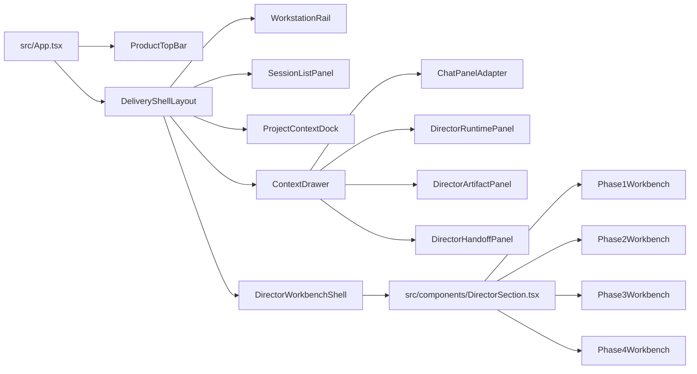

# Director UI 深化实施计划（Shell 对齐 + Director 工作台落地）

## Overview

本计划承接 `docs/plans/2026-04-17_director-ui-revamp-plan.md` 的方向稿，把它收紧成一份可以直接开工的实施计划。

这次工作的目标不是再做一个更精美的 demo，而是把当前 `DeliveryConsole` 的 `Header + ExpertNav + 主区 + ChatPanel 侧栏` 结构，升级成一套能承载 `Director` 正式业务的共享壳层，并让 `Director` 成为第一块真实接线的工作台样板。

本轮坚持两个边界：

1. 先做 UI 架构升级，不重写 Director 既有后端流程与状态协议。
2. 先把 `Director` 做透，其他模块只接入共享壳层占位，不在本轮同时做完整业务重构。

## Problem Frame

当前实现里，产品层、模块层、阶段层和上下文层混在一起：

- `src/components/Header.tsx` 同时承载产品切换、项目切换、文稿切换、LLM 配置入口。
- `src/components/ExpertNav.tsx` 仍是横向专家条，和 `DirectorSection` 内部 `P1/P2/P3/P4` 再次形成层级竞争。
- `src/components/ChatPanel.tsx` 以右侧抽拉栏存在，但只承载对话，日志、产物、handoff 仍散落在各阶段。
- `src/components/DirectorSection.tsx` 同时负责状态编排、阶段切换和页面结构，导致后续视觉升级必须动到业务逻辑。

而 live demo 已给出更清晰的结构答案：

- Screen 1 空态：三栏为 `260 / 976 / 44`，右栏可折叠为窄条。
- Screen 2/4 工作态：三栏为 `260 / 660 / 360`。
- 顶栏高度统一为 `44px`。
- 空态大标题使用 `Fraunces 56 / 61.6`。
- 论文态标题使用 `Fraunces 40 / 44.8`。
- 抽屉 tab 使用 `12px` 小号标签，圆角 `4px`。
- 主按钮高度为 `34px`，圆角 `6px`，强调色与正文色分离。

这说明我们真正要迁移的是：

- 壳层信息架构
- 视觉 token
- 右侧 drawer 的职责边界
- 阶段工作台的密度与层次

不是把 demo 里的文案和模块名直接替换成 Director 文案。

## Requirements Trace

- R1. `DeliveryConsole` 在 `delivery` 模块下必须形成稳定的三栏共享壳层，层级清晰区分产品层、工作站层、阶段层。
- R2. `Director` 必须对齐 live demo 的关键视觉约束，包括栏宽、顶栏高度、标题字号、暖纸面内容区与右侧抽屉结构。
- R3. `Chat / Logs / Artifact / Handoff` 必须统一进入右侧 drawer 体系，不再分散在各阶段主体中。
- R4. `Director` 现有 Phase 1-4 业务流程、状态切换与接口契约必须保持可用，不因 UI 重构引入主链路回归。
- R5. 新壳层必须允许 `Shorts / Thumbnail / Music / Marketing` 后续平滑接入，避免再做第二套导航系统。
- R6. 页面验收、截图和关键交互检查必须优先采用 `agent-browser`。
- R7. 在正式业务改造前，保留 `MIN-122` 作为外部前置阻塞，不在计划中默认其已完成。

## Scope Boundaries

- 不在本轮引入全新的 Director session 后端模型；先使用当前 `projectId + scriptPath + state.lastUpdated` 派生轻量会话感。
- 不在本轮迁移 `useHashRoute` 到新路由体系；维持现有哈希路由，避免把 Director UI 任务扩大成全仓路由重写。
- 不在本轮同步重做 `Shorts / Thumbnail / Music / Marketing` 的业务页面；这些模块只接共享壳层与入口位。
- 不在本轮改动 Director 的 Phase 1/2/3/4 API 语义与 SSE 协议，除非 UI 重构必须增加只读聚合字段。
- 不在本轮解决 `npm run build` 已知的仓库历史 TypeScript 问题；验收以受影响范围内的类型、构建和浏览器链路为主。

## Context & Research

### Relevant Code and Patterns

- `src/App.tsx`
  当前 `delivery` 模块由 `Header`、`ExpertNav`、主内容区和 `ChatPanel` 侧栏拼装，是本次壳层改造的主入口。
- `src/components/Header.tsx`
  当前顶部栏承载过多职责，需收敛为产品级顶栏。
- `src/components/ExpertNav.tsx`
  当前横向专家导航将改造成左侧工作站 rail。
- `src/components/DirectorSection.tsx`
  当前同时管理状态、Phase 切换和布局；本次应保留数据编排，剥离出新的壳层与阶段容器。
- `src/components/director/Phase1View.tsx`
  当前仍是深色卡片式空态/提案页，需要重做成概念工作台。
- `src/components/director/Phase2View.tsx`
  当前把调试日志和筛选区放在同一中栏，需要拆成 summary strip + 工作区 + drawer。
- `src/components/director/Phase3View.tsx`
  已具备渲染轮询和反馈修订逻辑，适合保留行为、重做外层编排。
- `src/components/director/Phase4View.tsx`
  已具备 SRT 扫描与 XML 导出逻辑，适合重做为交付确认页而非单卡片表单。
- `src/components/ChatPanel.tsx`
  已具备历史恢复、系统卡片、确认卡、附件释放逻辑；本次重点是容器迁移，不是重写聊天协议。
- `src/components/DirectorUIDemoPage.tsx`
  已有一版 Director demo，可作为命名、信息块和工作台语义的参考草稿。
- `src/components/DirectorUIDemoPage.css`
  已积累暖纸面配色和排版变量，可作为正式 token 提炼的起点，而不是继续只服务 demo 页面。

### Institutional Learnings

- `docs/04_progress/rules.md`
  页面验收优先 `agent-browser`；交给用户前必须先自测主链路；不要把系统提示伪装成聊天内容；Chatbox 附件 `blob URL` 必须释放。
- `docs/dev_logs/HANDOFF.md`
  已明确当前方向：以 `http://localhost:5273/` live demo 作为唯一视觉源头，先做精细审计，再出实施方案。
- `testing/README.md`
  UI 改造后的浏览器验收应进入 `testing/director` 协议，不应只停留在本地肉眼判断。

### External References

- live demo 运行态基准：`http://localhost:5273/`
- 2026-04-17 `agent-browser` 审计事实：
  - 空态三栏：`260 / 976 / 44`
  - 工作态三栏：`260 / 660 / 360`
  - 顶栏高度：`44px`
  - 空态标题：`Fraunces 56 / 61.6`
  - 论文标题：`Fraunces 40 / 44.8`
  - 抽屉 tab：`12px`、圆角 `4px`
  - 主按钮：高度 `34px`、圆角 `6px`

## Key Technical Decisions

- 决策 1：先新增共享壳层组件，再逐步接管现有页面，而不是直接在 `Header`、`ExpertNav`、`DirectorSection` 里硬改。
  - 理由：现有实现把布局和业务逻辑耦合得太紧，直接修改会让 Director 真实流程和 UI 重构同时爆炸。

- 决策 2：本轮保留 `DirectorSection` 作为状态 orchestrator，只把“壳层、阶段头、阶段布局”从中抽离。
  - 理由：当前 Phase 1-4 的状态切换、SSE 读取、批量操作和轮询逻辑已经存在，应该先保护主链路，再重构页面结构。

- 决策 3：正式页面 token 从 demo 中提炼到共享样式文件，不继续把视觉规则埋在 `DirectorUIDemoPage.css`。
  - 理由：如果视觉 token 继续只存在 demo 页面，后续 `Shorts / Thumbnail / Music / Marketing` 无法复用。

- 决策 4：右侧 drawer 采用统一 tab 容器，先承接 `Chat / Logs / Artifact / Handoff` 四类内容。
  - 理由：这是 live demo 最值得迁移的结构，也是当前 Director 使用时最影响焦点切换的问题。

- 决策 5：阶段升级按 `壳层 -> P1/P2 -> P3/P4 -> 其他模块占位` 顺序推进。
  - 理由：这样可以更早得到可运行的共享架构，并把高风险改造拆成多个可回归的切片。

- 决策 6：其他模块本轮只接“工作站入口 + 空态容器 + Context Dock 占位”，不做业务细化。
  - 理由：计划目标是让 Director 成为样板，而不是让多个模块一起半成品上线。

- 决策 7：维持现有 hash route，不把本轮 UI 改造扩成全仓路由重构。
  - 理由：当前用户要求是先做 Director 精细实施计划，不是重开 GoldenCrucible 那一套全栈架构迁移。

## Open Questions

### Resolved During Planning

- 是否继续把 `DirectorUIDemoPage` 当正式页面直接扩展？
  - 结论：不直接转正；它保留为视觉参考和 token 草稿，正式页面仍以现有 `delivery` 主壳与 `DirectorSection` 为接入点。

- 是否本轮就做真实后端 session 化？
  - 结论：不做；先用当前项目/文稿/更新时间派生轻量 session 感，等共享壳层稳定后再补 session 模型。

- 是否要同时重做所有专家模块？
  - 结论：不做；只让它们接入新 rail 和空态占位。

### Deferred to Implementation

- `MIN-122` 当前是否已完成解锁？
  - 说明：这是正式业务改造的外部前置，需要实施前再次确认。

- 是否需要新增只读聚合接口为左侧轻量 session 列表提供更稳定数据？
  - 说明：若前端派生策略不够稳定，可在实施时补一个轻量只读接口，但不预设为必须项。

- 是否将 `VisualAudit` 本轮下沉为工具位还是先保留原 expert 位置？
  - 说明：建议本轮先下沉到工具组，但如影响当前用户流程，可做一次过渡保留。

## High-Level Technical Design

> 下面是结构性设计图，用于帮助评审理解改造边界；它表达的是组件职责和依赖关系，不是实现代码说明书。

## Alternative Approaches Considered

- 方案 A：直接在现有 `Header`、`ExpertNav`、`DirectorSection` 中增量调整样式
  - 不选原因：会让视觉改造和状态编排继续耦合，后续其他模块仍无法复用。

- 方案 B：把 `DirectorUIDemoPage` 直接变成正式页面并回接业务逻辑
  - 不选原因：demo 组件是静态语义样板，不具备对现有 Director 流程的最小侵入改造边界。

- 方案 C：先做全模块统一 shell，再一起改 `Shorts / Thumbnail / Music / Marketing`
  - 不选原因：范围过大，难以及时回归 Director 主链路，也会推迟用户可用结果。

## Implementation Units

- [ ] **Unit 1: 共享壳层与视觉 token 落地**

**Goal:** 建立 Delivery 共享壳层、视觉 token 和三栏布局基础，不碰 Director 业务逻辑。

**Requirements:** R1, R2, R5

**Dependencies:** None

**Files:**
- Create: `src/components/delivery-shell/DeliveryShellLayout.tsx`
- Create: `src/components/delivery-shell/ProductTopBar.tsx`
- Create: `src/components/delivery-shell/WorkstationRail.tsx`
- Create: `src/components/delivery-shell/SessionListPanel.tsx`
- Create: `src/components/delivery-shell/ProjectContextDock.tsx`
- Create: `src/components/delivery-shell/ContextDrawer.tsx`
- Create: `src/styles/delivery-shell.css`
- Modify: `src/App.tsx`
- Modify: `src/components/Header.tsx`
- Modify: `src/components/ExpertNav.tsx`
- Modify: `src/components/DirectorUIDemoPage.css`
- Test: `src/components/delivery-shell/DeliveryShellLayout.test.tsx`
- Test: `src/components/delivery-shell/WorkstationRail.test.tsx`

**Approach:**
- 提炼 demo 中可复用的颜色、边框、字号、圆角和栏宽到共享样式文件。
- 让 `Header` 收敛为产品级顶栏；`ExpertNav` 的职责迁移到左侧 rail。
- `delivery` 模块主界面改成真正的三栏布局；其他模块先以占位方式挂载。

**Patterns to follow:**
- `src/App.tsx`
- `src/components/DirectorUIDemoPage.tsx`
- `src/components/DirectorUIDemoPage.css`

**Test scenarios:**
- Happy path: 打开 `delivery` 页面后，出现三栏结构，左栏工作站列表、中心工作区、右栏抽屉同时存在。
- Happy path: 在右栏收起态下，主区宽度扩展；展开态恢复为 `260 / main / 360` 的工作态布局。
- Edge case: 切换 `crucible / delivery / distribution` 时，只有 `delivery` 使用新壳层，其余模块不受影响。
- Integration: 缩放到常用桌面宽度时，顶栏、左栏、右栏不发生重叠或遮挡。

**Verification:**
- 共享壳层可独立承载 Director，且视觉 token 不再只依赖 demo 页面私有样式。

- [ ] **Unit 2: Context Drawer 接管 Chat / Logs / Artifact / Handoff**

**Goal:** 把当前散落的对话、日志、产物和 handoff 入口统一到右侧 drawer 中。

**Requirements:** R3, R4

**Dependencies:** Unit 1

**Files:**
- Create: `src/components/delivery-shell/drawer/DrawerTabs.tsx`
- Create: `src/components/director/drawer/DirectorRuntimePanel.tsx`
- Create: `src/components/director/drawer/DirectorArtifactPanel.tsx`
- Create: `src/components/director/drawer/DirectorHandoffPanel.tsx`
- Modify: `src/components/ChatPanel.tsx`
- Modify: `src/App.tsx`
- Modify: `src/components/director/Phase2View.tsx`
- Test: `src/components/ChatPanel.test.tsx`
- Test: `src/components/director/drawer/DirectorRuntimePanel.test.tsx`

**Approach:**
- 保留 `ChatPanel` 内部消息协议、确认卡、附件释放逻辑，只改变其承载容器和标题/关闭行为。
- 新增运行态、产物和 handoff 面板作为独立 tab。
- 从 `Phase2View` 中移除主日志区，把调试和运行细节下沉到 drawer。
- `DirectorHandoffPanel` 动画约束：时长 `280ms`，只用 opacity + translate，translate 幅度 `≤ 8px`。

**Patterns to follow:**
- `src/components/ChatPanel.tsx`
- `src/components/ChatPanel.test.tsx`

**Test scenarios:**
- Happy path: 切换 drawer tab 时，Chat 历史不丢失，运行态日志和产物面板可独立切换。
- Edge case: 在切换 expert、关闭 drawer、重新打开 drawer 后，ChatPanel 的 pending action 卡仍可恢复。
- Edge case: 发送附件后切换 tab 或关闭组件，`blob URL` 被正确释放，没有重复对象泄漏。
- Integration: Phase2 生成过程中，日志从中区迁移到 drawer 后，仍能看到最新运行信息。

**Verification:**
- 右侧 drawer 成为 Director 的统一辅助容器，中区不再同时承担聊天、日志、产物展示。

- [ ] **Unit 3: Director 工作台壳层与阶段导航重构**

**Goal:** 为 Director 引入真正的 `StageHeader + PhaseStepper + PhaseWorkspace` 结构，同时保留现有状态编排。

**Requirements:** R1, R2, R4

**Dependencies:** Unit 1, Unit 2

**Files:**
- Create: `src/components/director/DirectorWorkbenchShell.tsx`
- Create: `src/components/director/DirectorStageHeader.tsx`
- Create: `src/components/director/DirectorPhaseStepper.tsx`
- Create: `src/components/director/DirectorSessionSummary.tsx`
- Modify: `src/components/DirectorSection.tsx`
- Test: `src/components/DirectorSection.test.tsx`
- Test: `src/components/director/DirectorPhaseStepper.test.tsx`

**Approach:**
- 保留 `DirectorSection` 的状态源、Phase 切换、数据更新和 API 调用。
- 把顶部黑色卡片头和小号 `P1/P2/P3/P4` 按钮升级为工作台阶段导航。
- 把当前项目、文稿、模型、输出路径持续展示为 stage 头部与 context dock 的组合信息。

**Patterns to follow:**
- `src/components/DirectorSection.tsx`
- `src/components/DirectorUIDemoPage.tsx`

**Test scenarios:**
- Happy path: 进入 Director 后，始终能看到项目、文稿、模型、当前阶段信息，不需要再依赖全局 header 右侧读取上下文。
- Happy path: Phase 按钮仍遵守现有解锁规则，未达到的阶段不可跳转。
- Edge case: 页面冷启动从空脚本 hydrate 到真实脚本时，不触发误清空重置。
- Integration: 项目切换或脚本切换后，工作台外层结构保留，但 Phase 与本地临时态按原规则重置。

**Verification:**
- DirectorSection 成为“状态 orchestrator + 阶段内容入口”，不再直接承担最终页面结构。

- [ ] **Unit 4: Phase 1 / Phase 2 重做为概念台与视觉筛选台**

**Goal:** 按 live demo 的工作密度重做 P1 和 P2，使它们成为真正的概念台与方案筛选台。

**Requirements:** R2, R3, R4

**Dependencies:** Unit 2, Unit 3

**Files:**
- Create: `src/components/director/phase-layouts/PhasePanel.tsx`
- Create: `src/components/director/phase-layouts/StoryboardSummaryStrip.tsx`
- Create: `src/components/director/phase-layouts/ChapterRail.tsx`
- Modify: `src/components/director/Phase1View.tsx`
- Modify: `src/components/director/Phase2View.tsx`
- Test: `src/components/director/Phase1View.test.tsx`
- Test: `src/components/director/Phase2View.test.tsx`

**Approach:**
- P1 改为双区工作台：左侧概念正文和修订动作，右侧为当前上下文与输入来源卡。
- P2 改为“顶部 summary strip + 章节 rail + 中区镜头卡/表格 + 右侧 drawer”的分工。
- 保留 `Phase2View` 既有的批量勾选、过滤和生成逻辑，但把日志和调试主体移出中区。

**Patterns to follow:**
- `src/components/director/Phase1View.tsx`
- `src/components/director/Phase2View.tsx`
- `src/components/DirectorUIDemoPage.tsx`

**Test scenarios:**
- Happy path: P1 在选择项目和文稿后展示概念工作台，生成、修订、批准动作保持可用。
- Happy path: P2 可以继续筛选 B-roll、全选当前视图、进入 Phase 3。
- Edge case: `concept` 为空、占位文案或生成中时，P1 空态与 loading 态仍清晰可分。
- Edge case: P2 过滤条件为空和有筛选时，统计数字分别显示当前视图与全局总计，不互相污染。
- Integration: P2 生成中时，日志在 drawer 中持续可见，中区不因流式更新出现布局跳闪。

**Verification:**
- P1/P2 的工作重心从“黑色大卡片”升级为“暖纸面工作台 + 侧向辅助信息”。

- [ ] **Unit 5: Phase 3 / Phase 4 重做为渲染编排台与交付页**

**Goal:** 保留 Phase3/4 既有业务能力，但把它们升级为更像执行台和交付页的结构。

**Requirements:** R2, R3, R4

**Dependencies:** Unit 3, Unit 4

**Files:**
- Create: `src/components/director/phase-layouts/RenderPipelineBoard.tsx`
- Create: `src/components/director/phase-layouts/ExportChecklistPanel.tsx`
- Modify: `src/components/director/Phase3View.tsx`
- Modify: `src/components/director/Phase4View.tsx`
- Test: `src/components/director/Phase3View.test.tsx`
- Test: `src/components/director/Phase4View.test.tsx`

**Approach:**
- P3 强化“待渲染项 / 当前媒体 / 修订反馈 / 批量审批”的编排感，弱化散卡式堆叠。
- P4 强化“找到 SRT -> 对齐 -> 生成 XML -> 下载 -> 下一步 handoff”的交付序列。
- 把交付成功、缺失项、下一站 handoff 明确展示，而不是只停留在功能按钮。

**Patterns to follow:**
- `src/components/director/Phase3View.tsx`
- `src/components/director/Phase4View.tsx`

**Test scenarios:**
- Happy path: P3 已勾选方案可以继续渲染、审批、重试，且完成态仍可进入 P4。
- Happy path: P4 能扫描现有 SRT、手动上传、生成 XML 并下载输出。
- Edge case: 没有勾选任何可渲染选项时，P3 给出正确提示，不误触发渲染。
- Edge case: P4 无 SRT、SRT 读取失败、对齐为空时，错误信息清晰且不会卡死页面。
- Integration: P3 产物状态与 P4 交付清单在 drawer/页面间保持一致，不出现“页面显示已完成但交付区仍空”的割裂。

**Verification:**
- P3/P4 从“功能卡片集合”升级为“渲染执行台 + 交付确认页”。

- [ ] **Unit 6: 浏览器验收、回归测试与交接更新**

**Goal:** 为这次 UI 架构升级建立最小但可信的验收闭环。

**Requirements:** R4, R6, R7

**Dependencies:** Unit 1, Unit 2, Unit 3, Unit 4, Unit 5

**Files:**
- Create: `testing/director/requests/TREQ-2026-04-17-DIRECTOR-UI-shell-workbench.md`
- Modify: `testing/director/README.md`
- Modify: `docs/dev_logs/HANDOFF.md`
- Modify: `docs/dev_logs/2026-04-17.md`
- Test: `src/components/ChatPanel.test.tsx`
- Test: `src/components/DirectorSection.test.tsx`

**Execution note:** Browser acceptance must use `agent-browser` for primary UI verification.

**Approach:**
- 组件级测试覆盖结构切换、阶段导航、drawer 恢复和关键空态。
- 浏览器级验收使用 `agent-browser` 进行屏幕截图、主按钮点击、阶段切换和 drawer 核验。
- 交付前补写 handoff，明确哪些模块已接共享壳层，哪些仍是占位。

**Patterns to follow:**
- `testing/README.md`
- `testing/OPENCODE_INIT.md`
- `testing/director/README.md`

**Test scenarios:**
- Happy path: 从首页进入 Director 后，能看到新壳层、工作站 rail、context dock、drawer 和当前阶段工作台。
- Happy path: 切换 `P1 -> P2 -> P3 -> P4` 时，页面结构、标题和 drawer 内容跟随变化。
- Edge case: 切换项目、切换脚本、关闭并重开 drawer 后，主结构稳定且状态符合原有规则。
- Integration: 通过 `agent-browser` 截图对比新壳层与 live demo 的栏宽、标题层级和右栏结构是否一致。

**Verification:**
- 这次 UI 改造拥有组件测试和真实页面验收两层证据，不靠“肉眼看起来差不多”交接。

## System-Wide Impact

- **Interaction graph:** `src/App.tsx` 的 `delivery` 入口、`Header`、`ExpertNav`、`ChatPanel`、`DirectorSection` 和四个 phase 视图都会被新的壳层重新编排。
- **Error propagation:** 生成失败、SRT 读取失败、聊天错误等仍由原组件负责产生用户错误态，但展示位置可能从中区迁移到 drawer 或阶段头部。
- **State lifecycle risks:** 项目切换、脚本 hydrate、drawer 开关、附件释放和 phase 解锁逻辑是本次最容易回归的状态面。
- **API surface parity:** Director 的 `/api/director/phase1/*`、`phase2/*`、`phase3/*`、`phase4/*` 仍保持现有协议；本轮尽量不新增行为型 API。
- **Integration coverage:** 单元测试无法证明栏宽、drawer 体验和阶段切换密度，需要 `agent-browser` 做浏览器回归。
- **Unchanged invariants:** Director 的生成、修订、审批、批量勾选、轮询渲染、SRT 对齐和 XML 导出行为不在本轮重新定义。

## Phased Delivery

### Phase A

- 先落共享壳层、视觉 token、产品顶栏、左 rail、右 drawer 框架。
- Director 先挂入新壳层，但阶段内容可以暂时沿用旧视图。

### Phase B

- 接管 Director 工作台头部和阶段导航。
- 重做 P1 和 P2，使其达到主流程可用。

### Phase C

- 重做 P3 和 P4 的页面结构。
- 打通产物、handoff 和交付确认的可见性。

### Phase D

- 让其他专家模块接共享 rail 的占位与基础空态。
- 进行视觉收口、截图回归和 handoff 更新。

## Risks & Dependencies

| Risk | Mitigation |
|------|------------|
| `MIN-122` 仍未解锁，正式业务改造被阻塞 | 实施前先做一次显式确认；若未解锁，仅允许落 demo/壳层不接正式业务切换 |
| 项目/脚本切换时误触发 Director 状态重置 | 保留现有 `DirectorSection` 重置逻辑，先抽布局再改结构，并补相应测试 |
| `ChatPanel` 迁入 drawer 后历史恢复、确认卡、附件释放回归 | 容器迁移优先于协议改造；直接复用现有测试并新增 drawer 场景 |
| 视觉 token 散落在 demo 样式和正式页面之间，导致双份设计语言 | 从第一单位开始就把 token 提炼到共享样式文件，demo 反向消费共享变量 |
| P2 日志下沉后，用户找不到运行态反馈 | drawer 默认提供显眼的 `运行态` tab；生成期间自动切到相关 tab 或高亮提示 |
| 一次性改动过大，影响其他模块可用性 | 分阶段提交：壳层、P1/P2、P3/P4、占位接入分别落地并验证 |

## Success Metrics

- 用户一眼能区分产品层、工作站层、阶段层和上下文层。
- `Director` 页面在桌面态能稳定呈现接近 `260 / main / 360` 的工作态结构。
- `Chat / Logs / Artifact / Handoff` 不再分散在多个位置。
- Director 主链路不因 UI 改造失去生成、筛选、渲染和导出能力。
- 其他模块可以复用共享壳层入口，而不必再设计第二套导航骨架。

## Documentation / Operational Notes

- 实施开始前，先确认 `MIN-122` 状态，再决定是否允许正式页面接线。
- 实施结束后，必须更新 `docs/dev_logs/HANDOFF.md`，写清已落地的壳层范围和未完成模块。
- 页面验收截图统一落到 `testing/director/artifacts/`。
- 若进入 OpenCode 测试协作，仍遵循 `testing/README.md`、`testing/OPENCODE_INIT.md` 和 `testing/director/README.md` 的流程。

## Sources & References

- Related plan: `docs/plans/2026-04-17_director-ui-revamp-plan.md`
- Handoff: `docs/dev_logs/HANDOFF.md`
- Rules: `docs/04_progress/rules.md`
- Main entry: `src/App.tsx`
- Current shell surfaces: `src/components/Header.tsx`, `src/components/ExpertNav.tsx`, `src/components/ChatPanel.tsx`
- Director runtime surfaces: `src/components/DirectorSection.tsx`, `src/components/director/Phase1View.tsx`, `src/components/director/Phase2View.tsx`, `src/components/director/Phase3View.tsx`, `src/components/director/Phase4View.tsx`
- Demo reference: `src/components/DirectorUIDemoPage.tsx`, `src/components/DirectorUIDemoPage.css`
- Browser testing protocol: `testing/README.md`, `testing/OPENCODE_INIT.md`, `testing/director/README.md`
