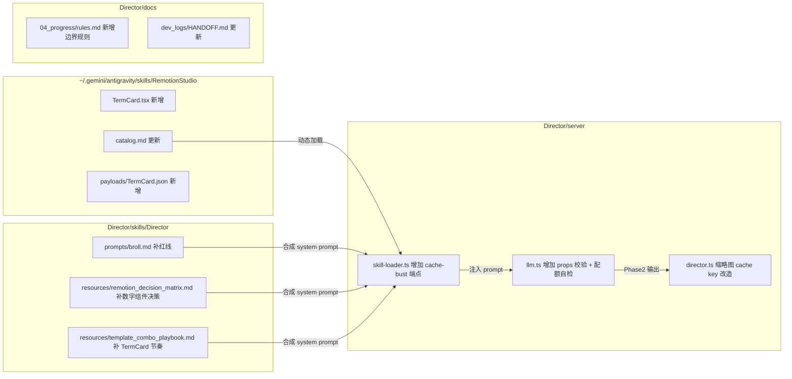

# Remotion Broll 扩充与 Phase2-Phase3 协同优化方案

## ⚠️ 执行前置：UI 重构方案必须先完成

**本方案是两份文档"一揽子方案"中的第 2 棒**。

- 第 1 棒：`docs/plans/2026-04-17-001-refactor-director-ui-implementation-plan.md`（UI 重构，外包团队先执行）
- 第 2 棒：本方案（Remotion Broll 扩充，UI 方案全部合并后再启动）

### 为什么要这个顺序

1. **避免 Phase2View.tsx 双改**：本方案 Unit 4（缩略图 hash 化）需要在 Phase2View 的缩略图请求调用点加 hash 参数。UI 方案 Unit 4 会整体重做 Phase2View。若先做本方案 Unit 4，UI 重构会把改动冲掉，产生返工。
2. **SSE 事件天然落位**：本方案 Unit 3（props 校验器）新增的 `broll_validation_error` / `broll_reroll_triggered` SSE 事件，需要前端有一个容器呈现。UI 方案 Unit 2 新建的 Drawer "运行态" tab 就是这个容器。先做 UI，本方案的 SSE 事件直接接进现成 tab，零前端返工。
3. **TermCard 天然用新 UI 验收**：UI 方案 Unit 4 的"镜头卡"组件读的是通用 `template + props` 字段。本方案新增的 TermCard 不引入新 `type` 枚举值，自动能被新 UI 展示，免费获得可视化验收。

### 启动前的前置检查清单

外包团队启动本方案 Unit 1 之前，必须确认以下 3 项全部 ✅：

- [ ] `docs/plans/2026-04-17-001-refactor-director-ui-implementation-plan.md` 的 Unit 1-6 **全部标记为已完成**
- [ ] `docs/dev_logs/HANDOFF.md` 记录 UI 重构的收尾，且 Director 新壳层（Shell / Drawer / Workbench）在 `agent-browser` 下可见可用
- [ ] 新 Phase2View（暖纸面工作台版）在本地 dev 下跑通 Phase1→Phase2→Phase3 主链路无回归

任一项未 ✅，**停下来**等 UI 方案收尾，不要强行开工本方案。

---

## Overview

本计划源于对 `op7418/Video-Wrapper-Skills` 仓库的借鉴评估。扫描后发现：

1. Video-Wrapper 的 **8 类组件分类**（Lower Third / Chapter Title / Fancy Text / Term Card / Quote Callout / Animated Stats / Bullet Points / Social Bar）对我们 Broll 组件体系有参考价值。
2. RemotionStudio 现有 33 个模板已覆盖其中 **7 类**，唯一结构性缺口是 **Term Card（术语定义卡）**。
3. Video-Wrapper 的"花字 vs 术语卡"红线值得作为 Broll prompt 的新规则吸收。
4. Director Phase2→Phase3 链路存在 5 处可优化缝隙：props 无前置校验、缩略图失效不完整、配额规则无运行时 guard、catalog 缓存无法手动 bust、渲染失败无降级。

本方案在 UI 重构方案 `2026-04-17-001` 全部合并之后启动，**所有改动建立在新 UI 架构之上**，无文件冲突、无 SSE 容器缺位、无缩略图请求路径迁移问题。

## Problem Frame

### 为什么要做

- **Broll 维度缺口**：当前 33 个模板里没有"名词 + 简短定义"形态。当口播内容出现专业术语时，LLM 只能被迫走 infographic（重成本）或普通 TextReveal（信息密度低）。
- **LLM 组件选择混淆**：Video-Wrapper 踩过的坑——LLM 会把"解释名词"和"摘要观点"混为一谈——我们目前的 Broll prompt 也没有明确这条边界。
- **Phase2→Phase3 容错薄弱**：LLM 输出的 `props` 字段错写、配额超限、缩略图失效等问题目前都要等到渲染环节才暴露，浪费算力与用户耐心。
- **catalog 动态加载链路不完善**：5 分钟缓存导致 RemotionStudio 端更新后调试延迟明显，也无法在 Director 端观测当前加载状态。

### 不做什么

- **不再建设 AnimatedStats**。原计划基于误判：RemotionStudio 已有 NumberCounter / SegmentCounter / GaugeChart / StatDashboard / MetricRings 五个数字类组件，重复造轮子违反 rules.md 里的"最小影响"原则。替代方案是在 Broll prompt 里补强这五者的**决策决策矩阵**。
- **不触碰 UI 层任何文件**。所有改动限定在 `RemotionStudio/` skill、`Director/skills/Director/prompts/`、`Director/server/` 三个后端区域。
- **不引入新的 `BRollOption.type` 枚举值**。TermCard 作为新 `template` 归属现有 `type='remotion'`，保证 UI 改造无需感知。
- **不在本轮实装 Phase3 失败降级**。该改动涉及 infographic/seedance 跨 provider 链路，先等 PR0 (MIN-122) 解锁再单独立项。

## Requirements Trace

- **R1.** 新增 TermCard 模板到 RemotionStudio，能独立渲染成标准 Remotion 输出，与现有 33 个模板的工程风格（theme 参数、imageUrl 底图注入、overlay 规范）保持一致。
- **R2.** RemotionStudio `catalog.md` 必须同步更新，包含 TermCard 完整 props schema、使用场景、节奏配额建议。
- **R3.** Director `skills/Director/prompts/broll.md` 必须新增"花字（TextReveal 观点短语）vs 术语卡（TermCard 名词解释）"的红线条款，以及五个数字类组件的决策决策规则。
- **R4.** Phase2 LLM 输出后必须增加一层 **结构化 props 校验**：按 catalog.md 中每个模板的 props schema 做字段名与类型核对，不匹配阻断并记录到运行态日志。
- **R5.** Phase2 LLM 输出后必须增加 **配额自检**：imagePrompt 占比、单模板重复次数、TextReveal+ConceptChain 合计次数，超限自动触发一次 reroll（最多一次，避免死循环）。
- **R6.** 缩略图 cache key 必须包含"渲染输入 hash"（template + props + imagePrompt + type），输入变化自动失效旧图。
- **R7.** Director 必须暴露 admin 端点强制清空 catalog 缓存，不依赖 5 分钟 TTL。
- **R8.** rules.md 必须新增一条永久规则，明确"Broll 组件扩展改动只动 RemotionStudio + Director 后端 + prompts，不动任何前端 View 组件"，预防未来类似方案意外和 UI 改造冲突。

## Scope Boundaries

- 本方案**只涉及 Broll 后端链路 + 必要的前端调用点微调**；UI 架构层不重复劳动，直接复用 `2026-04-17-001` 落地的新 Shell / Drawer / Workbench。
- 本方案**不改动 `BRollOption` 类型定义的枚举值**；`type` 字段可选值保持现状（`remotion | generative | artlist | infographic | internet-clip | user-capture`），只扩充 `template` 下的可选字符串，保证 UI 方案落地的"镜头卡"组件无需感知 TermCard 的存在。
- 本方案**不重构 Phase3 渲染引擎**；只在 Phase2 出口增加校验层，失败路径暂不改动。
- 本方案**不等待 PR0 (MIN-122)**；所有改动均不触及 PR0 涉及的安全热修面（Admin 端点明确 127.0.0.1 白名单）。
- 本方案**不引入新的三方依赖**；TermCard 使用 RemotionStudio 现有 React + Remotion 工具链。
- 本方案**不再动 UI 层的布局/样式/token**；所有前端改动仅限于在 UI 方案落地的新 Phase2View 上做缩略图请求调用的参数追加，以及在新 Drawer "运行态" tab 上确认新 SSE 事件被正确消费。

## Context & Research

### Relevant Code and Patterns

- `~/.gemini/antigravity/skills/RemotionStudio/src/`
  现有 33 个模板源码，TermCard 新组件应与 `Callout.tsx` / `QuoteCard.tsx` 风格保持一致（同属"文字/氛围"A 级）。
- `~/.gemini/antigravity/skills/RemotionStudio/catalog.md`
  单一事实来源。所有模板的 props schema、使用场景、配额建议都在此文件。
- `~/.gemini/antigravity/skills/RemotionStudio/payloads/`
  每个模板的测试 payload，TermCard 需同步新增 payload 用于自测渲染。
- `server/skill-loader.ts` (line 132-151, 222)
  catalog.md 动态加载逻辑、`buildDirectorSystemPrompt('broll')` 入口。
- `server/llm.ts` (line 348-482)
  `BRollOption` 接口定义、`generateGlobalBRollPlan` 调用链。R4/R5 的校验层插入点。
- `server/director.ts` (line 444, 1903, thumbnailTasks Map)
  Phase3 渲染入口、缩略图任务管理。R6 的 cache key 改造位置。
- `skills/Director/prompts/broll.md`
  Broll 任务 prompt。R3 红线与决策规则写入位置。
- `skills/Director/resources/remotion_decision_matrix.md`
  既有决策矩阵。TermCard 与五个数字组件的决策条目加到这里。
- `skills/Director/resources/template_combo_playbook.md`
  既有节奏编排手册。TermCard 的节奏配额建议加到这里。

### Institutional Learnings

- `docs/04_progress/rules.md` #85: chat action 修改 props/prompt/type 时必须按渲染输入失效旧图，当前只写在规则里，没有代码层保障。R6 把它落实到代码。
- `docs/04_progress/rules.md` #88: Director Chatbox 不能维护第二套手写系统提示词——本方案严格遵守此规则，所有 prompt 改动只改 skill 文件。
- `docs/04_progress/rules.md` #117: Phase2 LLM 必须有硬超时——已实现；R4 的结构校验不会叠加新的等待时间。
- `docs/04_progress/rules.md` #118: "卡死 → 兜底方案"是进展——说明我们已有失败可恢复机制；R4/R5 是进一步把"兜底"变成"更少触发兜底"。

### External References

- `op7418/Video-Wrapper-Skills` 8 类组件分类与红线规范（借鉴源）
- Video-Wrapper 的"theme token + 组件解耦"工程模式——RemotionStudio 已有 5 套 theme 预设（deep-space|warm-gold|sci-fi-purple|forest-green|crimson-red），无需再抽一套
- `docs/plans/2026-04-17-001-refactor-director-ui-implementation-plan.md` Unit 4（P2 重做）是本方案的并行战线，关注其"镜头卡/表格"组件必须能容纳 TermCard 的渲染输出

## Key Technical Decisions

### 决策 1：TermCard 放 RemotionStudio，不放 Director
- **理由**：catalog.md 是单一事实来源，Director 只消费。把组件放 Director 会形成第二条事实链，违反架构约定。
- **代价**：跨仓库改动（用户 home 目录下的 skill + 当前项目），需要在完成后验证 catalog 缓存 bust + Director 重启后 LLM 能感知。

### 决策 2：AnimatedStats 撤销，改为 prompt 层决策矩阵
- **理由**：NumberCounter / SegmentCounter / GaugeChart / StatDashboard / MetricRings 已覆盖所有数字表达需求。LLM 选错不是缺组件，是缺决策规则。
- **代价**：需要在 `remotion_decision_matrix.md` 补齐五组件的适用边界描述，工作量比造新组件小。

### 决策 3：props 校验器基于 catalog.md 动态生成，不硬编码 schema
- **理由**：硬编码会产生第二事实源。校验器在 LLM 输出后按模板名查 catalog 中对应段落的 props 字段清单做字段名核对。
- **代价**：catalog.md 的格式必须结构化到机器可解析（或至少可稳定正则）；初期可先做字段名白名单核对（不核对类型），后续再加强。

### 决策 4：reroll 预算限定为 1 次
- **理由**：防止 LLM 反复违规导致死循环。一次 reroll 后仍违规，记录警告但放行。
- **代价**：极端情况下用户看到的方案可能轻微违规，接受这个概率在初期。

### 决策 5：缩略图 cache key 引入渲染输入 hash
- **理由**：rules.md #85 已识别问题，是时候从"规则提醒"升级到"代码层保障"。
- **代价**：现有 thumbnailTasks Map 的 key 需要迁移；兼容策略是新旧 key 并存一个周期再下线旧 key。

### 决策 6：admin 端点不做鉴权
- **理由**：本端点仅在本地开发环境使用，生产部署不暴露。
- **代价**：需要在路由注册时通过 `NODE_ENV` 或配置开关限制；MIN-123 CORS 治理完成前，默认只绑 127.0.0.1。

### 决策 7：不触碰前端，与 UI 重构方案零交叉
- **理由**：两条战线并行推进需要强隔离。UI 改 View 组件，我们改 RemotionStudio + server + prompts，零文件冲突。
- **代价**：TermCard 在新 UI 下的卡片呈现效果要等 UI Unit 4 完成后才能验证——接受这个延后验收。

## Open Questions

### Resolved During Planning

- **是否同时新建 TermCard + AnimatedStats？**
  - 结论：只建 TermCard。AnimatedStats 与现有五个数字组件重复，改为 prompt 决策矩阵。

- **校验器用硬编码 schema 还是从 catalog 解析？**
  - 结论：从 catalog 解析（字段名白名单初版）。硬编码会产生双事实源。

- **本方案是否等 PR0 (MIN-122) 解锁？**
  - 结论：不等。本方案改动不触及安全热修面，可并行推进。

### Deferred to Implementation

- **TermCard 是否支持 `imageUrl` 底图注入？**
  - 倾向：支持。遵循现有 11 个支持底图的模板规范，overlay 强度定为 0.6（文字型）。
  - 最终决定：在 Unit 1 实现前对齐 RemotionStudio 现有 Callout.tsx 的规范。

- **catalog.md 结构化程度是否足够让校验器可解析？**
  - 说明：需要在 Unit 3 实现时抽样核查。若格式散乱，退化为"字段名提取 + 软警告"，不阻断。

- **Phase3 失败降级是否纳入后续版本？**
  - 说明：本计划明确不做。建议等 PR0 解锁后单独立项（Linear 另开 issue）。

## High-Level Technical Design

## Alternative Approaches Considered

- **方案 A：把 TermCard 与 AnimatedStats 都建在 Director 项目内的 Remotion 组件目录**
  - 不选原因：Director 没有本地 Remotion 组件目录。唯一事实源是 RemotionStudio catalog，建在 Director 会形成双事实源。

- **方案 B：只补 prompt，不建任何新组件**
  - 不选原因：TermCard 确实有结构性缺口；只靠 prompt 让 LLM 用 TextReveal 假装术语卡，效果会不稳定。

- **方案 C：把 Phase3 失败降级也纳入本方案**
  - 不选原因：跨 provider 降级是独立的大工程，会把本方案战线拉长 3 倍以上，违反单一职责。

- **方案 D：与 UI 重构计划合并成一份整合方案**
  - 不选原因：两条战线的技术栈、验收标准、负责人都不同。强行合并会让任一条线的阻塞蔓延到另一条。分开推进反而更快。

## Implementation Units

- [ ] **Unit 1: RemotionStudio 侧 TermCard 组件建设**

**Goal:** 在 RemotionStudio skill 仓库新增 TermCard 模板，风格对齐现有 Callout / QuoteCard。

**Requirements:** R1, R2

**Dependencies:** None

**Files:**
- Create: `~/.gemini/antigravity/skills/RemotionStudio/src/TermCard.tsx`
- Create: `~/.gemini/antigravity/skills/RemotionStudio/payloads/TermCard.json`
- Modify: `~/.gemini/antigravity/skills/RemotionStudio/catalog.md`
- Modify: `~/.gemini/antigravity/skills/RemotionStudio/Root.tsx` (或等效组合注册入口)

**Approach:**
- 组件结构：术语标题（大号 Fraunces）+ 定义正文（中号 body 字体）+ 可选 imageUrl 背景 + overlay 0.6
- 动画：标题字符级淡入（200ms stagger）+ 定义正文整体淡入（delay 600ms）+ 尾部 fade out
- Props schema：`term: string`（必需）、`definition: string`（必需）、`imageUrl?: string`、`theme?: ThemePreset`、`duration?: number`（默认 90 帧 = 3s）
- catalog.md 条目：归入"A 级（文字/氛围）"，使用场景明确为"解释单个专业名词"，配额建议"全片 ≤3 次"

**Patterns to follow:**
- `~/.gemini/antigravity/skills/RemotionStudio/src/Callout.tsx` （文字型组件风格）
- `~/.gemini/antigravity/skills/RemotionStudio/src/QuoteCard.tsx` （overlay + 底图模式）

**Test scenarios:**
- Happy path: 给定 term + definition + 默认 theme，渲染 90 帧输出无报错
- Edge case: definition 超过 80 字时自动缩放或换行，不溢出画面
- Edge case: imageUrl 为空时，背景使用 theme 预设的纯色渐变
- Integration: Remotion CLI 直接跑 `payloads/TermCard.json` 能出 mp4

**Verification:**
- Remotion Studio 预览页能看到 TermCard
- catalog.md 条目格式与其他模板一致
- 渲染输出符合"标题醒目 + 定义易读"的视觉目标

---

- [ ] **Unit 2: Director Broll Prompt 补红线与决策规则**

**Goal:** 在 Broll 任务 prompt 里明确 TermCard 使用边界，同时补齐五个数字组件的决策矩阵。

**Requirements:** R3

**Dependencies:** Unit 1

**Files:**
- Modify: `Director/skills/Director/prompts/broll.md`
- Modify: `Director/skills/Director/resources/remotion_decision_matrix.md`
- Modify: `Director/skills/Director/resources/template_combo_playbook.md`

**Approach:**
- broll.md 新增条款："**术语卡 vs 花字的职责不可互换**：TermCard 负责解释**单个专业名词**；TextReveal/KineticTypography 负责强调**观点短语**。凡是台词中出现观众可能不理解的专业词汇，优先用 TermCard；凡是需要强调说话人观点的短句，用 TextReveal。"
- remotion_decision_matrix.md 新增"数字表达决策"章节：
  - 单个数字强调 → NumberCounter
  - 赛博/极客风数字 → SegmentCounter
  - 0-100 百分比/完成率 → GaugeChart
  - 多指标对比 → StatDashboard / MetricRings
- template_combo_playbook.md 新增 TermCard 节奏条目："全片出现 ≤3 次；相邻两个术语卡间隔 ≥15 秒；不与 QuoteCard 紧邻"

**Patterns to follow:**
- 现有 broll.md 的规则书写风格
- 现有决策矩阵的三列表格（组件名 / 适用场景 / 反例）

**Test scenarios:**
- Happy path: 跑一次 Phase2 生成，LLM 在含专业术语的章节输出 TermCard 提案
- Edge case: 台词全是观点不含术语时，LLM 不应滥用 TermCard
- Integration: 跑 10 次 Phase2，统计 TermCard 出现次数是否符合节奏配额

**Verification:**
- 新的 broll.md 与 resources 文件在 skill-loader 日志里可见加载
- LLM 输出的 BRollOption 中能观察到 TermCard 的使用（A/B 对比加规则前后）

---

- [ ] **Unit 3: Phase2 输出 Props 校验 + 配额自检**

**Goal:** 在 LLM 输出 BRollOption[] 后增加结构校验与配额自检，降低 Phase3 无效渲染。

**Requirements:** R4, R5

**Dependencies:** Unit 2

**Files:**
- Create: `Director/server/broll-validator.ts`
- Modify: `Director/server/llm.ts` (generateGlobalBRollPlan 出口接入校验器)
- Test: `Director/server/broll-validator.test.ts`

**Approach:**
- Validator 分两层：
  - **Schema 层**：从 catalog.md 解析每个模板的 props 字段白名单，核对 LLM 输出的 props keys。字段名不匹配 → 记录错误，触发 reroll。
  - **配额层**：统计整体 imagePrompt 占比、单模板重复次数、TextReveal+ConceptChain 合计次数。违规 → 记录警告，触发 reroll。
- Reroll 预算：每次 Phase2 调用最多 1 次 reroll。reroll 后仍违规则放行并在日志中标红。
- 所有校验事件通过现有 SSE 通道推送到 UI 方案已落地的 Drawer "运行态" tab：
  - 新增事件类型 `broll_validation_error`：载荷含 `optionId / template / missingKeys / unknownKeys`
  - 新增事件类型 `broll_reroll_triggered`：载荷含 `reason / violations`
- **前置检查**：开工前确认 Drawer "运行态" tab 的事件渲染器支持未知 type 的兜底渲染（纯文本显示 type + message），若不支持，需先补一行兜底逻辑——这属于 rules.md #21 "每种后端发送的 type 都必须有对应的前端处理逻辑" 的延伸实现。

**Patterns to follow:**
- `Director/server/llm.ts` 现有的 `callLLM` + AbortController 模式
- rules.md #117/#118 的超时与兜底理念

**Test scenarios:**
- Happy path: LLM 输出全合规 → 校验通过，无 reroll
- Edge case: props 字段名错拼 → 触发 reroll，reroll 结果合规 → 通过
- Edge case: 配额超限 2 次 → 第 1 次 reroll，第 2 次仍违规 → 放行 + 日志警告
- Integration: SSE 事件能被前端运行态日志 tab 接收并展示

**Verification:**
- 手工构造错字 props 的 LLM mock 输出，验证校验器拦截
- 实际跑 Phase2 观察 reroll 触发率（目标 <15%）

---

- [ ] **Unit 4: 缩略图渲染输入 hash 化**

**Goal:** 缩略图 cache key 引入渲染输入 hash，props/prompt/type 变化自动失效旧图。

**Requirements:** R6

**Dependencies:** None（与 Unit 1-3 可并行；前端改动落在 UI 方案已重做完的新 Phase2View 上）

**Files:**
- Modify: `Director/server/director.ts` (thumbnailTasks Map + renderStillWithApi)
- Modify: `Director/src/components/director/Phase2View.tsx` （**UI 方案已重做**的新文件；本 Unit 只在缩略图请求调用点追加 `hash` 参数，不动任何布局/样式）
- Test: `Director/server/director.test.ts` (缩略图 hash 测试)

**Approach:**
- 新增辅助函数 `computeRenderInputHash(option: BRollOption): string`，基于 `template + props + imagePrompt + type` 做 SHA-1 摘要
- thumbnailTasks Map 的 key 从 `optionId` 改为 `${optionId}-${hash}`
- 兼容策略：旧 key 继续 resolve 一个版本，同时写入新 key；下一版本移除旧 key
- 前端请求缩略图时附带 hash，后端判断 hash 变化则 invalidate 并重新排队
- **前置检查**：开工前确认新 Phase2View 的缩略图请求调用方式——通常是一个 fetch/axios 调用或 hook。在该调用的参数构造处附加 hash 字段即可，不要重构调用结构

**Patterns to follow:**
- rules.md #85 的问题定义
- Director 现有的 thumbnailTasks 任务管理模式

**Test scenarios:**
- Happy path: 同一 option 首次生成缩略图 → 缓存命中正常
- Edge case: chat 修改 props → 旧 hash 失效，新 hash 重新生成
- Edge case: imagePrompt 被改动 → hash 变化，缩略图刷新
- Integration: Phase2 chat action 触发修改后，前端卡片看到新图（不是旧图+下划线提示）

**Verification:**
- 构造 chat action 修改 option 的 props，观察缩略图是否自动刷新
- rules.md #85 标注该问题的条目迁移到"已修复"

---

- [ ] **Unit 5: Catalog 缓存 bust Admin 端点 + 边界规则落盘**

**Goal:** 提供 admin 端点手动清空 catalog 缓存；同步把"Broll 扩展不动前端"写进 rules.md。

**Requirements:** R7, R8

**Dependencies:** None

**Files:**
- Modify: `Director/server/skill-loader.ts` (暴露 `flushCatalogCache()` 函数)
- Modify: `Director/server/director.ts` (注册 `POST /api/admin/flush-catalog-cache` 路由，仅 127.0.0.1 可访问)
- Modify: `Director/docs/04_progress/rules.md` (新增边界规则)
- Modify: `Director/docs/dev_logs/HANDOFF.md` (记录本轮改动)

**Approach:**
- `flushCatalogCache()`：重置内存缓存变量 + 返回下次加载会重新读盘
- 路由鉴权：检查 req.ip === '127.0.0.1' || '::1'，否则 404（不返回 403 以免信息泄漏）
- rules.md 新增条款（列入"Remotion 开发"分类）：
  > "Broll 组件扩展改动**只动 RemotionStudio 仓库 + Director 后端 + Director prompts/resources**，不动任何前端 View 组件。这是为了保证 Broll 扩展与 UI 改造能完全并行推进，零文件冲突。"

**Patterns to follow:**
- `Director/server/director.ts` 现有路由注册模式
- rules.md 现有规则的分类与编号风格

**Test scenarios:**
- Happy path: 127.0.0.1 调用端点，catalog 缓存清空，下次 Phase2 调用重新加载最新 catalog
- Edge case: 外部 IP 调用，返回 404
- Integration: 手工修改 catalog.md，调用端点，验证 Phase2 system prompt 立即感知新模板

**Verification:**
- curl 测试端点鉴权边界
- 手动联动测试：改 catalog → bust → Phase2 输出体现新模板

---

- [ ] **Unit 6: 端到端联动验收**

**Goal:** 验证 TermCard 从模板创建 → Phase2 输出 → Phase3 渲染 → 前端卡片呈现的全链路。

**Requirements:** All

**Dependencies:** Unit 1-5

**Files:**
- Create: `testing/director/requests/TREQ-2026-04-17-BROLL-termcard-e2e.md`
- Modify: `testing/director/README.md`

**Execution note:** 前端呈现侧的验收需要协调 UI 重构计划进度。若 UI Unit 4 尚未完成，用当前旧 Phase2View 验收；若已完成，在新 UI 上验收。

**Approach:**
- 准备一段含专业术语的测试文稿（例如包含 "Transformer" / "微调" / "向量数据库"）
- 跑完整 Phase1 → Phase2 → Phase3 链路
- 验证点：
  - Phase2 输出的 BRollOption 中有 TermCard 条目
  - props 校验器无告警
  - Phase3 渲染出的视频里 TermCard 显示正常
  - 用 chat action 修改某个 TermCard 的 definition，缩略图自动刷新

**Patterns to follow:**
- `testing/director/README.md` 的请求模板
- rules.md #120/#121: 使用 agent-browser 做真实页面验收

**Test scenarios:**
- Happy path: 术语丰富的文稿跑出至少 2 个 TermCard，渲染成功
- Edge case: 术语稀少的文稿不强行塞 TermCard
- Edge case: 构造错字 props 的 mock 方案，验证校验器拦截 + reroll
- Integration: agent-browser 截图确认新组件在 Phase2 卡片列表中显示

**Verification:**
- 测试请求文档落盘到 `testing/director/requests/`
- HANDOFF.md 更新本轮改动清单

## System-Wide Impact

- **Interaction graph:** RemotionStudio catalog → skill-loader 加载 → Phase2 system prompt 注入 → LLM 输出 → broll-validator 校验 → 前端卡片 → Phase3 渲染。本方案在"LLM 输出"与"前端卡片"之间插入校验层；在"前端卡片"的缩略图 cache 增加 hash 维度。
- **Error propagation:** 校验器记录的错误走现有 SSE error 通道；失败 reroll 的过程状态走 SSE progress 通道；catalog 加载失败保持现有回退（兜底 ~/.gemini 路径）。
- **State lifecycle risks:** 缩略图 cache key 迁移期要确保新旧 key 共存一个版本；catalog bust 端点要限制访问源。
- **API surface parity:** 新增 `POST /api/admin/flush-catalog-cache` 为开发辅助端点，不影响正式 API 契约。`BRollOption` 接口完全不变。
- **Integration coverage:** 前端感知的变化仅限缩略图刷新行为 + 卡片列表多出 TermCard 条目，与 UI 重构 Unit 4 的"镜头卡/表格"呈现天然兼容。
- **Unchanged invariants:** Phase1/2/3/4 API 语义、SSE 协议、BRollOption 类型定义、所有前端 View 组件行为。

## Phased Delivery

### Phase A（无 UI 依赖，可立即开始）

- Unit 1: TermCard 组件与 catalog.md 更新
- Unit 5: Admin 端点 + rules.md 边界规则

### Phase B（依赖 Phase A 的 catalog 更新）

- Unit 2: Broll prompt + 决策矩阵补强

### Phase C（依赖 Phase B 的 prompt 规则）

- Unit 3: Phase2 输出校验器
- Unit 4: 缩略图 hash 化（可与 Unit 3 并行）

### Phase D（全部单元完成后）

- Unit 6: 端到端联动验收

## Risks & Dependencies

| Risk | Mitigation |
|------|------------|
| RemotionStudio 是外部 skill 仓库，改动后 catalog 缓存未 bust 导致 Director 感知不到新模板 | Unit 5 的 admin 端点就是这个问题的解。Unit 1 完成后立即调用端点验证联动 |
| catalog.md 格式不够结构化，校验器难以自动解析 | Unit 3 退化为"字段名白名单 + 软警告"，不阻断流程；后续可推动 catalog.md 格式升级 |
| reroll 预算 1 次仍有死循环风险（连续 2 次都超限） | Hard cap：超过预算直接放行 + 日志警告，不阻塞用户 |
| 缩略图 cache key 迁移产生重复渲染 | 兼容策略：新旧 key 并存一个版本，下版本移除旧 key |
| UI 方案未彻底合并就强行开工本方案 | 启动前置核对清单（见文档顶部）要求 UI 方案 Unit 1-6 全部完成且主链路回归通过，任一项未达标 → 停下等收尾；不允许"先做一部分再等" |
| UI 方案落地的新 Phase2View 缩略图请求结构与预期差异大 | Unit 4 开工第一步就 grep 新代码核对请求结构；若差异大到无法仅追加参数，升级为独立 follow-up issue，不强行在本 Unit 内改造 |
| UI 方案的 Drawer "运行态" tab 对未知 SSE type 不做兜底渲染 | Unit 3 开工第一步验证兜底能力；若缺失，先补一行兜底逻辑再推新事件，避免新事件被静默丢弃 |
| 外部 skill 仓库的改动无法走 Director 项目的 PR 流程 | 独立提交到 skill 仓库，但在 Director HANDOFF.md 中明确记录 commit hash 供追溯 |
| Admin 端点误暴露到公网 | 强制 127.0.0.1 白名单 + MIN-123 CORS 治理前 server.listen 仅绑 127.0.0.1 |

## Success Metrics

- RemotionStudio 模板数量从 33 → 34，TermCard 正式归档到 catalog.md
- Director Broll prompt 包含"花字 vs 术语卡"红线与五个数字组件的决策决策矩阵
- Phase2 输出的 BRollOption 中，术语型章节能稳定产生 TermCard 提案（抽样 10 次成功率 ≥80%）
- Phase3 因 props 字段错误导致的渲染失败率下降至少 50%
- 缩略图过期问题从"规则提醒"升级到"代码层保障"，rules.md #85 可迁至"已修复"
- catalog 缓存 bust 端点在本地开发场景下稳定可用，改 catalog 后 5 秒内生效
- 本方案推进过程中与 UI 重构 `2026-04-17-001` 零文件冲突

## Relationship with `2026-04-17-001` UI Refactor Plan

### 串行执行，本方案在后

外包团队先完成 UI 重构方案的 Unit 1-6，再启动本方案。这是"一揽子方案"中明确的棒次——UI 方案为本方案铺好基础设施，本方案在新基础设施上做数据/规则/校验层的精装修。

### 本方案对 UI 方案落地物的依赖

| UI 方案落地物 | 本方案消费方式 |
|---|---|
| 新 `Phase2View.tsx`（暖纸面工作台 + 镜头卡） | Unit 4 仅在缩略图请求调用点追加 hash 参数，不动布局 |
| Drawer "运行态" tab (`DirectorRuntimePanel`) | Unit 3 的 SSE 新事件（`broll_validation_error` / `broll_reroll_triggered`）直接推送到此 tab |
| Drawer "产物" tab (`DirectorArtifactPanel`) | Unit 6 端到端验收时复用其缩略图刷新能力核查 Unit 4 效果 |
| 共享视觉 token (`src/styles/delivery-shell.css`) | 本方案不动 token；若 TermCard 的前端卡片展示需要色值，优先复用 token 变量 |
| `testing/director/` 协议骨架 | Unit 6 测试请求单直接挂进已就位的协议目录 |

### 启动前再做一次对齐

Unit 1 开工前（此时 UI 方案已全部合并），指定一名对接人跑一遍如下 5 分钟核对：

1. 打开 Director 主页面，确认新 Shell 三栏布局成立
2. 切到 Phase2 视图，确认镜头卡/表格正常渲染既有 Broll option
3. 打开 Drawer 的 "运行态" tab，跑一次 Phase2 生成，确认 SSE 日志能流入
4. `grep -n "thumbnail" src/components/director/Phase2View.tsx`，记下缩略图请求的调用位置与参数结构
5. 在 HANDOFF.md 里留一行 "Broll 方案启动前置核对 ✅"，再开工

若任一项异常，提交为 UI 方案的收尾遗留问题，本方案继续等。

## Documentation / Operational Notes

- Unit 1 完成后必须在 Director 端手动 bust catalog 缓存，验证 LLM 能感知 TermCard
- Unit 2 完成后跑至少 3 次 Phase2 生成做 A/B 对比
- Unit 3 上线后两周内重点监控 reroll 触发率，异常飙高要回看 catalog 解析逻辑
- Unit 5 的 admin 端点应在 HANDOFF.md 中留下使用示例 `curl -X POST http://127.0.0.1:<PORT>/api/admin/flush-catalog-cache`
- 实施结束后在 `docs/04_progress/dev_progress.md` 追加一行版本记录
- 用户纠正或实施中发现模式化问题时，按 rules.md 协议更新规则或新建 lesson

## Sources & References

- Related plan: `docs/plans/2026-04-17-001-refactor-director-ui-implementation-plan.md`
- Handoff: `docs/dev_logs/HANDOFF.md`
- Rules: `docs/04_progress/rules.md`
- External skill: `~/.gemini/antigravity/skills/RemotionStudio/catalog.md`
- Director prompt: `skills/Director/prompts/broll.md`
- Director resources: `skills/Director/resources/remotion_decision_matrix.md`, `skills/Director/resources/template_combo_playbook.md`
- Core backend: `server/skill-loader.ts`, `server/llm.ts`, `server/director.ts`
- Reference benchmark: `op7418/Video-Wrapper-Skills`（借鉴源）
