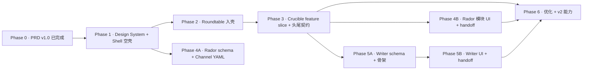

# UI Architecture · Phase 1-6 全量实施计划

> 外部团队在 `MHSDC-GC-SSE` 分支直接接手。本计划承接 PRD v1.0，**不重议已决事项**。所有新决策汇总到附录 5 提交老卢[^1]终审。

[^1]: 老卢 = 结构立主人（PRD 主审）。老张 = 概念拆解人。老杨[^2] = 架构调度人（OldYang / OldYang SSOT）。
[^2]: 本计划由 CE 团队起草，老杨调度，外部团队接手实施。

---

## 总纲（3 行）

1. **两大第一公民**：Pluggable Slot Architecture（三层 Slot）+ Cross-Module Handoff Contract（四段流转）—— 贯穿 Phase 1-6，任务索引见附录 3 表 2。
2. **两大工程纪律**：所有业务 API 挂 `requireWorkspace` middleware；下游产物 O(1) 回溯源头（`OriginBreadcrumb` Shell 级原语）。
3. **执行节奏**：Phase 1 建底座 → Phase 2/3 装主力业务（Roundtable / Crucible）→ Phase 4/5 铺粗轮廓（Rador / Writer）→ Phase 6 优化 + v2 能力释放。

---

## Phase 依赖 DAG（mermaid）



**并行窗口**：
- Phase 4A（Rador schema + `mindhikers.channel.yml` 落地）可在 Phase 2/3 进行中并行启动（只依赖 Phase 1 的 schema 目录）。
- Phase 5A（Writer schema + 骨架）可在 Phase 3 中后期并行启动（依赖 `Thesis` schema 固化）。
- Phase 4B / 5B 的 UI 必须等 Phase 3 Handoff 契约端到端跑通后才能对接。

---

## 基本假设（7 条）

1. **分支**：外部团队直接在 `MHSDC-GC-SSE` 分支工作，不另起仓库；不在 `main` 开发；每 Phase 结束合并回 `main` 前由老杨验收。
2. **代码基座**：SSE 为研发前线，SaaS 为预发阵地；rules.md 101-109 规定底座单向同步（SaaS → SSE），遇到底座冲突以 SaaS 版为准，业务以 SSE 版为准。
3. **Railway 域名**：SSE 功能先在 `golden-crucible-saas-sse.up.railway.app` 验证，绝不直接触碰 SAAS 生产域名。
4. **工时约定**：任务档位 **S**（≤半天）/ **M**（1-3 天）/ **L**（3-5 天）；不做人日精确估算。
5. **PRD 为准**：凡与 PRD v1.0 冲突，一律以 PRD 为准；新盲点进附录 5，不自行拍板。
6. **视觉参考**：以 `demos/ui-north-star/` 四屏 demo 为视觉终局锚点；`tokens.css` 为 token 单一来源。
7. **外部团队接入**：按附录 1 的启动清单执行；**老杨为统一指挥**，所有未明确约定先经老杨裁决。
8. **SaaS 底座冻结**（老卢 2026-04-17 定）：Phase 1-6 全程 SaaS 线不推新底座迭代，保障 SSE 一气呵成；不触发 rules.md #102 的回灌流程（附录 4 R5 因此降级为不触发）。

---

## Phase 1 · Design System 工程化 + Shell 空壳

### A. 目标与范围
建底座：Token 工程化、组件原语库、ShellLayout 三栏、React Router v6、React Query + Zustand、ErrorBoundary 分层、`requireWorkspace` middleware、URL scheme、Shell 级 Slot 注册骨架（不含业务数据）。本 Phase 结束后 Shell 可独立启动、空态正常、所有 Slot registry 就绪待装载。

### B. 任务分解

#### P1.T1 · tokens.css 工程化为 CSS vars + Tailwind 映射
- **目标**：把 `demos/ui-north-star/styles/tokens.css` 升格为前端 token 单一来源
- **输入**：`demos/ui-north-star/styles/tokens.css` + `DESIGN_TOKENS.md`
- **产出物**：`src/styles/tokens.css`（根入口）、`tailwind.config.ts`（`theme.extend` 映射 `--gc-*` 到工具类）、`src/styles/fonts.css`（Fraunces/Instrument Sans/JetBrains Mono 加载）
- **验收**：`rg "var\(--gc-"` 所有命中都能解析；Storybook 首屏字体正确加载；无回落到系统字体
- **工时**：M
- **前置**：无

#### P1.T2 · 组件原语库第一批（通用）
- **目标**：落地 `COMPONENTS.md` 通用原语层
- **输入**：`demos/ui-north-star/COMPONENTS.md` + `app.css`
- **产出物**：`src/components/primitives/{Button,IconButton,Input,Textarea,Card,Panel,Badge,Avatar,Chip,Divider,Skeleton,Kbd,Tooltip,Dialog,Toast}.tsx` + 各自 `.module.css` 或 `cva` 变体表
- **验收**：每个原语有 hover/focus/disabled/error/empty/loading 状态；axe-core 零 violation；在 Storybook/ladle 里能独立渲染
- **工时**：L
- **前置**：P1.T1

#### P1.T3 · Shell 级原语（ModuleTab / SidebarItem / Stage / Rail / ArtifactDrawer）
- **目标**：落地 Shell 骨架原语
- **输入**：demo 屏 1-4 + `COMPONENTS.md` Shell 部分
- **产出物**：`src/shell/primitives/{ModuleTab,SidebarItem,Rail,Stage,ArtifactDrawer,ConversationStream,MessageRenderer}.tsx`
- **验收**：三栏骨架可渲染空态；`ArtifactDrawer` 折叠/展开状态正确；Rail 宽度按 demo
- **工时**：M
- **前置**：P1.T2

#### P1.T4 · OriginBreadcrumb Shell 级原语
- **目标**：落地 §4.4 + §8.3 的可回溯面包屑通用组件
- **输入**：PRD §4.4 / §8.3；屏 4 `.paper__crumb` 实例
- **产出物**：`src/shell/primitives/OriginBreadcrumb.tsx`（接口：`origin: { module, sessionId, extras? }`，支持 `.paper__crumb` 样式 override）
- **验收**：点击跳转 `router.push('/m/:module/s/:sessionId?highlight=...')`；源头归档时切换"历史只读"态；Paper 上下文下字体 serif + hover 赭橙
- **工时**：S
- **前置**：P1.T3

#### P1.T5 · React Router v6 切换 + URL scheme
- **目标**：放弃 `useHashRoute`，切 BrowserRouter，落 §7.1 URL scheme
- **输入**：PRD §7.1；现有 `src/App.tsx` + `src/SaaSApp.tsx` 共 4 处调用点
- **产出物**：`src/router.tsx`（nested route：`/m/:moduleId/s/:sessionId?artifact=&highlight=`）；`src/App.tsx` 切 `<RouterProvider>`；`useHashRoute` 调用点全部删除
- **验收**：4 处调用点替换完毕；分享链接刷新后正确恢复；OAuth 回调不丢参；`/auth/*` 保留 Better Auth 路径
- **工时**：M
- **前置**：P1.T3；**风险**见附录 4 R1

#### P1.T6 · React Query v5 + Zustand 骨架
- **目标**：落 §7.2 三态切分
- **输入**：PRD §7.2
- **产出物**：`src/state/queryClient.ts`（QueryClient + 默认策略）；`src/state/shellStore.ts`（Zustand：drawerOpen / activeModule / scrollRestore）；`src/state/providers.tsx` 包裹 App
- **验收**：`useShellStore` 可切抽屉；React Query devtools 挂上；无跨 store 泄漏
- **工时**：S
- **前置**：P1.T5

#### P1.T7 · ErrorBoundary 分层
- **目标**：落 §10.1 App/Shell/Module/Feature/Component 五层
- **输入**：PRD §10.1
- **产出物**：`src/boundaries/{AppErrorBoundary,ShellErrorBoundary,ModuleErrorBoundary,FeatureErrorBoundary,ComponentErrorBoundary}.tsx`；Shell 层与 Router 集成
- **验收**：故意抛错验证降级；Sentry tag 按层级打（先占位，Phase 6 接 SDK）
- **工时**：S
- **前置**：P1.T6

#### P1.T8 · requireWorkspace middleware 落地
- **目标**：落 §4.8 全局 workspace 鉴权
- **输入**：PRD §4.8；现有 `server/auth/index.ts` + `server/auth/workspace-store.ts`
- **产出物**：`server/auth/workspace-middleware.ts`；`server/index.ts` 注册；`server/routes/` 目录骨架（每模块一个文件的约定）
- **验收**：未登录 401、无 workspace 403；现有接口加挂后回归测试全绿；附录 4 R4 降级策略文档化
- **工时**：M
- **前置**：无；**注意**附录 4 R4（breaking 风险）

#### P1.T9 · ModuleRegistry + Slot Registry 骨架
- **目标**：落 §2.3 + §3.6 "新 Module / Slot 几步能跑"契约骨架（不含业务 manifest）
- **输入**：PRD §2.3 / §3.1-3.6；老卢 A11 决策
- **产出物**：`src/modules/registry.ts`（`ModuleManifest` + `registerModule()`）；`src/slots/{channelRegistry,personaRegistry,skillRegistry}.ts`（接口 + 空实现）；`docs/02_design/channels/.keep` + `personas/.keep` + `docs/02_design/skills/.keep`
- **A11 预埋**：三个 Slot manifest schema 一律加 `visibility: z.enum(['workspace']).default('workspace')`（v1 枚举仅一项，v2 扩展为 `'organization' | 'public'`）
- **验收**：Shell 左栏上模块切换器的渲染源是 Registry（当前仅注册 `crucible` 占位）；Registry 支持 hot-add；三层 Slot 的 `visibility` 字段在 schema 存在且默认 `workspace`
- **工时**：M
- **前置**：P1.T3

#### P1.T10 · Shell 空壳 E2E + 响应式验证
- **目标**：Shell 空壳端到端可启动，三断点行为正确
- **输入**：PRD §5.6 / §9.1
- **产出物**：`src/hooks/useResponsiveLayout.ts`；Shell 在 1280/768 断点降级正确；Playwright E2E 空壳冒烟
- **验收**：`npm run dev` 启动无红；a11y landmarks 齐全；键盘方向键可遍历模块切换器
- **工时**：S
- **前置**：P1.T3 ~ T9

#### P1.T11 · Handoff 原语占位
- **目标**：`HandoffButton` / `HandoffPanel` 视觉原语落地（逻辑占位，Phase 2 起接业务）
- **输入**：PRD §4.2 / §4.7；demo 屏 3
- **产出物**：`src/shell/primitives/{HandoffButton,HandoffPanel,HandoffArrow,HandoffChecklist}.tsx`；`gcDash` 动画 keyframe
- **验收**：Storybook 下屏 3 仪式屏能 1:1 复刻；动画 280ms 只用 opacity + translate ≤ 8px
- **工时**：S
- **前置**：P1.T2

### C. Phase 1 验收 checklist
- [ ] `npm run build` + `npm run typecheck` 双绿
- [ ] Shell 空壳能在三断点启动（1280 / 768 / mobile）
- [ ] `useHashRoute` 调用点 0 残留（4 → 0）
- [ ] `tokens.css` 变量 100% 被引用侧覆盖（`rg "var(--gc-"` 无悬挂）
- [ ] `requireWorkspace` 已注册，现有接口回归通过
- [ ] axe-core 零 violation（空壳范围）
- [ ] Storybook/ladle 覆盖原语 ≥ 80%
- [ ] `golden-crucible-saas-sse.up.railway.app` 部署冒烟通过

### D. 风险与降级
- **视觉还原偏差**：若 Tailwind 映射导致像素 drift，回退到纯 CSS vars + BEM，Tailwind 仅做布局工具类（不参与 token）。
- **React Router v6 迁移 breaking**：见附录 4 R1。
- **font 加载阻塞首屏**：`font-display: swap` + 预加载关键字重。

---

## Phase 2 · Roundtable 入壳

### A. 目标与范围
把 RT 仓库 `origin/sse-export` 的业务代码（engine / spike-extractor / deepdive / proposition-sharpener / persona-loader / personas/*.json / 业务组件）文件级迁入 SSE，适配新 Shell。**不搬 `Sidebar.tsx` / `App.tsx`**。补 `appendSpikesToCrucibleConversation` + 类型 union 扩展。所有 `/api/roundtable/*` 挂 `requireWorkspace`。落 `Roundtable → Crucible` handoff 的服务端产出（消费方在 Phase 3）。

### B. 任务分解

#### P2.T1 · 扫雷清单执行：persistence 类型 union + backport 两函数
- **目标**：执行 `docs/dev_logs/2026-04-16_persistence-diff-scan.md` §启动操作清单
- **输入**：扫雷报告 §Backport 操作清单；RT `server/crucible-persistence.ts` L890-961 / L963-1035
- **产出物**：SSE `server/crucible-persistence.ts` 4 处 union 扩展 `| 'spike' | 'deepdive'`；`appendSpikesToCrucibleConversation` + `appendDeepDiveToCrucibleConversation` 两函数拷入；默认构造补齐 SSE 字段（`accessMode: 'platform'` 等）
- **验收**：`npm run typecheck:full` 零错误；现有 SSE 测试全绿；新函数单测覆盖追加/去重/index 更新
- **工时**：M
- **前置**：Phase 2 启动日再跑一次扫雷确认无新分叉

#### P2.T2 · Persona schema 升格 + persona-loader 迁入 + A3 映射表
- **目标**：把 `src/schemas/crucible-soul.ts` 的 `SoulProfile` 抽取升格为全局 `PersonaManifest`；按老卢 A3 决策合并两份名册
- **输入**：PRD §3.3.1；RT `server/persona-loader.ts`；`soul_registry.yml`；老卢 A3 决策
- **产出物**：
  - `src/schemas/persona.ts`（`PersonaManifestSchema`，含 `extractionTrace` 占位 + A11 的 `visibility` 字段）
  - `server/persona-loader.ts`（从 RT 迁入，适配 SSE 路径）
  - `personas/*.json` **9 个文件落位**（Core 2 = 老卢 + 老张；Philosopher 7 = 苏格拉底 + 尼采 + 维特根斯坦 + 伯林 + 罗尔斯 + 阿伦特 + 波普尔）
  - `src/slots/personaRegistry.ts` 接入 loader
  - **A3 映射表**：`docs/02_design/persona-id-mapping.md` 枚举 `crucible_*` → `persona_*` 全量对应；`server/persona-id-resolver.ts`（读取映射表，历史对话里的 `crucible_oldlu` 自动翻译为 `persona_oldlu`）
- **验收**：启动时 registry 可枚举 Core 2 + Philosopher 7；历史 crucible conversation 能正常打开（映射表翻译生效）；**老卢 / 老张 / 9 位人格本身语义 100% 保留**；`soul_registry.yml` 与新 schema 一致性校验通过
- **工时**：M
- **前置**：P1.T9
- **注**：A3 映射表保留过渡一个 Phase（到 Phase 3 结束）后删除 `soul_registry.yml`；此时历史数据由老杨统一清洗

#### P2.T3 · Roundtable 业务后端迁入
- **目标**：从 RT `origin/sse-export` 迁入 engine 层
- **输入**：`roundtable-engine.ts` / `spike-extractor.ts` / `deepdive-engine.ts` / `proposition-sharpener.ts` / `roundtable-types.ts`
- **产出物**：SSE `server/roundtable-*.ts`（5 个文件）；路径适配；`server/index.ts` 引用
- **验收**：SSE 流端到端可跑（mock 单 Persona）；DeepDive 可触发；Spike 提取能产出
- **工时**：L
- **前置**：P2.T1、P2.T2

#### P2.T4 · RoundtableSession + Spike handoff schema 落地
- **目标**：§4.3.2 schema 工程化
- **输入**：PRD §4.3.2
- **产出物**：`src/schemas/handoff/roundtable-session.ts` + `src/schemas/handoff/spike.ts`；后端序列化/反序列化 helper
- **验收**：schema 与 engine 产出字段一致；`origin` 可回溯字段冷冻正确
- **工时**：S
- **前置**：P2.T3

#### P2.T5 · `/api/roundtable/*` 挂 requireWorkspace
- **目标**：§4.8 全量补鉴权；填 §6.1 "鉴权改造"纪律
- **输入**：PRD §4.8；P1.T8 的 middleware
- **产出物**：`server/routes/roundtable.ts`（独立路由文件）；所有 RT endpoint 挂 middleware；body/path 里的 id 做 workspace 归属校验
- **验收**：跨 workspace 访问 403；自 workspace 正常；SSE 流鉴权成功后开流
- **工时**：M
- **前置**：P2.T3、P1.T8

#### P2.T6 · Roundtable 业务前端组件迁入 + 适配 Shell
- **目标**：从 RT 迁入业务组件，不搬 Sidebar/App
- **输入**：RT `src/components/roundtable/*` + `useRoundtableSse`
- **产出物**：`src/modules/roundtable/components/{RoundtableView,DirectorControls,PropositionInput,SpikeLibrary,ThinkingIndicator}.tsx`；`src/modules/roundtable/hooks/useRoundtableSse.ts`；`src/modules/roundtable/index.tsx`（入口 slice）
- **验收**：挂入 Shell 中栏后多 Persona 发言流畅；导演指令（止/投/深/换/？/可）可用；视觉符合 demo 屏 2
- **工时**：L
- **前置**：P2.T3、P1.T3

#### P2.T7 · Roundtable Module 注册 + Session 列表
- **目标**：接入 `ModuleRegistry`，左栏 Session 列表按 §5.2 语义
- **输入**：PRD §5.2；P1.T9 的 registry
- **产出物**：`src/modules/roundtable/manifest.ts`（`ModuleManifest`）；`GET /api/roundtable/sessions?workspace=current` 实现；`SessionListItem` 接口映射
- **验收**：左栏中栏 Session 列表正确显示；aria-current 态；状态 pill 与 §5.2 一致
- **工时**：S
- **前置**：P2.T6、P1.T9

#### P2.T8 · Handoff 服务端接口：`POST /api/roundtable/sessions/:id/send-to-crucible`
- **目标**：写 Handoff 出口（消费侧在 Phase 3.T4）
- **输入**：PRD §4.3.2；P2.T1 的 `appendSpikesToCrucibleConversation`
- **产出物**：路由 + 事务：冷冻 `participants[].personaSnapshot`，写入 Crucible conversation 的 spike presentable；返回新 Crucible session id
- **验收**：集成测试：RT session → 发 spike → Crucible conversation 出现 `type: 'spike'` presentable；`origin.sessionId` 正确
- **工时**：M
- **前置**：P2.T1、P2.T4、P2.T5

#### P2.T9 · Handoff 按钮接入（屏 2 底部"送入坩埚"）
- **目标**：前端触发 P2.T8
- **输入**：demo 屏 2
- **产出物**：Roundtable 视图底部 `HandoffButton`；点击乐观跳转 + 埋点 `handoff.roundtable_to_crucible`（见 §10.2，Phase 6 接 SDK 前先本地 console.info）
- **验收**：点击到新 session 可见 ≤ 800ms；失败回滚态与 Toast
- **工时**：S
- **前置**：P2.T8、P1.T11

### C. Phase 2 验收 checklist
- [ ] Roundtable 完整流程走通：输入命题 → 多 Persona 辩论 → Spike 提取 → 送入 Crucible
- [ ] `appendSpikesToCrucibleConversation` 单测 + 集成测通过
- [ ] `/api/roundtable/*` 全部挂 `requireWorkspace`
- [ ] `soul_registry.yml` 与 `PersonaManifestSchema` 校验无冲突（冲突进附录 5 A5）
- [ ] Sidebar.tsx / App.tsx（RT 侧）未被迁入（`rg` 验证）
- [ ] Railway SSE 域名冒烟通过

### D. 风险与降级
- **persona-loader 与 SSE soulRegistry ID 冲突**：见附录 4 R2。
- **RT 迁入字段在 SSE 字段集下兼容性问题**：见附录 4 R3；降级策略：新字段走默认值，不触发 SSE MIN-135 已有字段。

---

## Phase 3 · GoldenCrucible 包装为 feature slice

### A. 目标与范围
把现有 Crucible 主工作流（四段式 `topic_lock / deep_dialogue / crystallization / thesis_finalization`）包装为 feature slice 入壳。实现 `Roundtable → Crucible` 完整消费链（头衔接）+ `Crucible → Writer` 产出链（尾衔接）。`OriginBreadcrumb` 全局原语正式投产（Paper 视图 `.paper__crumb` 实例）。Crucible 所有 API 挂 `requireWorkspace`。`Thesis` schema 固化。

### B. 任务分解

#### P3.T1 · Crucible 业务组件迁出到 feature slice 目录
- **目标**：现有 Crucible UI 从 `src/components/crucible/*` 重整为 `src/modules/crucible/*` slice 结构
- **输入**：现有 `src/components/crucible/` 全量 + `src/components/crucible/sse.ts`
- **产出物**：`src/modules/crucible/{components,hooks,state}/*`；`sse.ts` 抽取到 `src/shell/hooks/useSseStream.ts`（shell-level 复用，见 PRD §7.4）
- **验收**：import 路径全更新；原有 Crucible 功能零回归；SSE 流仍可解析
- **工时**：M
- **前置**：P1 全部 + P2 完成

#### P3.T2 · Thesis schema 落地 + `finalize-thesis` 接口
- **目标**：§4.3.3 schema 工程化 + 尾段 API
- **输入**：PRD §4.3.3；现有 `SkillOutputPayloadSchema`
- **产出物**：`src/schemas/handoff/thesis.ts`；`POST /api/crucible/sessions/:id/finalize-thesis`；持久化 `Thesis`（新建表 or JSON 文件，决策见附录 5 A8）
- **验收**：Crucible 四段走到 `thesis_finalization` 能产出 `Thesis`；`origin.sessionId` + `finalizedRoundIndex` 正确；元数据冷冻
- **工时**：M
- **前置**：P3.T1

#### P3.T3 · Crucible 所有 API 挂 requireWorkspace
- **目标**：§4.8 合规
- **输入**：现有 `server/crucible*.ts` 所有 endpoint
- **产出物**：`server/routes/crucible.ts`（如未分离先分离）；middleware 全量挂载；body/path id 归属校验
- **验收**：跨 workspace 403；现有 SaaS staging 回归通过
- **工时**：M
- **前置**：P3.T1、P1.T8

#### P3.T4 · Roundtable → Crucible handoff 消费侧完整闭环
- **目标**：从 P2.T8 写入的 spike presentable 读出来，Crucible 从 `topic_lock` 起步
- **输入**：P2.T8 产出；PRD §4.3.2
- **产出物**：Crucible session 创建时读 `type: 'spike'` presentables 作为 topic_lock 输入；`RoundtableSession` snapshot 可回溯
- **验收**：端到端：RT 送入 → Crucible 自动在 topic_lock 显示来源 spike 列表；`OriginBreadcrumb` 显示"来自圆桌 · {命题}"
- **工时**：L
- **前置**：P3.T1、P3.T2、P2.T8

#### P3.T5 · OriginBreadcrumb 全局投产
- **目标**：P1.T4 的 Shell 级原语在 Paper / Crucible session 顶部正式使用
- **输入**：PRD §4.4 / §8.3
- **产出物**：Crucible session 顶部面包屑："返回原圆桌 · {命题}"；Paper 视图 `.paper__crumb` 实例；`?highlight=turnIndex:X` 跳转定位
- **验收**：点击面包屑 O(1) 跳回 RT session + 滚动定位到相关 turn；归档态"历史只读"灰态正确
- **工时**：S
- **前置**：P3.T4、P1.T4

#### P3.T6 · Crucible Session 列表 + Module Manifest
- **目标**：§5.2 Crucible 列表项；挂入 `ModuleRegistry`
- **输入**：现有 `GET /api/crucible/conversations`
- **产出物**：`src/modules/crucible/manifest.ts`；`SessionListItem` 映射（含 `originBadge` 如果来自 RT）
- **验收**：左栏中栏 Crucible Session 列表符合 demo；来自 RT 的 session 带 originBadge
- **工时**：S
- **前置**：P3.T1

#### P3.T7 · Skill Manifest schema + 现有 5 skill 补 manifest
- **目标**：§3.4 落地，不改 skill 业务逻辑
- **输入**：PRD §3.4；`server/crucible-orchestrator.ts` + `server/crucible.ts#performCrucibleExternalSearch/performCrucibleFactCheck`
- **产出物**：`src/schemas/skill.ts`；`docs/02_design/skills/{socrates,researcher,fact_checker,thesis_writer}.skill.yml`；`src/slots/skillRegistry.ts` 聚合加载；Crucible 右栏 "Loaded Skills" 面板
- **验收**：Crucible 右栏正确显示 4 个激活 skill；`moduleBindings` 与实证匹配；Roundtable 侧 `SpikeExtractor` / `PropositionSharpener` / `DeepDive` 也挂 manifest（见 P2.T3 产出）
- **工时**：M
- **前置**：P3.T1、P2.T3、P1.T9

#### P3.T8 · `send-to-writer` 服务端占位 + 按钮
- **目标**：§4.3.3 handoff 出口；Writer 模块 Phase 5 实装前，此接口先"双写"到占位存储
- **输入**：PRD §4.3.3
- **产出物**：`POST /api/crucible/thesis/:id/send-to-writer` 路由；按钮在 Paper 视图底部（屏 4）；埋点 `handoff.crucible_to_writer`
- **验收**：按下产出 `Thesis.status: 'sent_to_writer'` + 占位 Writer session 记录（供 Phase 5 消费）
- **工时**：S
- **前置**：P3.T2

### C. Phase 3 验收 checklist
- [ ] 端到端链：RT 命题 → 辩论 → Spike → 送入 Crucible → 炼制四段 → Thesis → 送入 Writer（占位）
- [ ] `OriginBreadcrumb` 在 Crucible session + Paper 视图生效，点击 O(1) 跳回
- [ ] Crucible 所有 API 挂 `requireWorkspace`
- [ ] 4-5 个 Skill 有 manifest；"Loaded Skills" 面板按 demo 渲染
- [ ] `Thesis` schema 通过 zod 校验所有 Crucible 产出
- [ ] 两大第一公民链条打通：Slot 三层注册 + 两个 handoff 闭环（RT→Crucible、Crucible→Writer 占位）

### D. 风险与降级
- **Thesis 存储选型未决**：附录 5 A8，降级为文件 JSON 先跑通。
- **Session 列表性能**：workspace 下 session 数 > 500 时分页；默认 20/页。

---

## Phase 4 · GoldenRador 粗轮廓

### A. 目标与范围
Rador 模块骨架 + `TopicCandidate` schema + Channel Spirit 注入筛选 + `mindhikers.channel.yml` 落地 + `Rador → Roundtable` handoff。本 Phase 不实现真正的信息抓取（那是 Rador 专项 PRD 的事），仅实现"手工录入 / mock 源 → 筛选 → 送入 Roundtable"完整骨架。

### B. 任务分解

#### P4.T1 · Channel Spirit schema + mindhikers YAML
- **目标**：§3.2 落地
- **输入**：PRD §3.2.1 / §3.2.2
- **产出物**：`src/schemas/channel-spirit.ts`；`docs/02_design/channels/mindhikers.channel.yml`；`src/slots/channelRegistry.ts` 加载器；workspace config 存当前激活 Channel
- **验收**：启动读 YAML + registry 可枚举；左栏下 Config 区显示 "mindhikers" 徽章（只读，v2 开放切换）；注入到 Crucible system prompt 前缀
- **工时**：M（可在 Phase 2/3 并行启动）
- **前置**：P1.T9

#### P4.T2 · TopicCandidate schema + 存储
- **目标**：§4.3.1
- **输入**：PRD §4.3.1
- **产出物**：`src/schemas/handoff/topic-candidate.ts`；存储选型同 Thesis（见附录 5 A8）；`POST /api/rador/topics`（手工录入） + `GET /api/rador/topics`
- **验收**：CRUD 通过；`channelAtCuration` 冷冻；`curatedBy` 支持 user/skill
- **工时**：S
- **前置**：P4.T1

#### P4.T3 · Rador Module 骨架 + UI 列表
- **目标**：Rador slice 挂入 Shell
- **输入**：demo 屏 1 左栏 Rador 示意；PRD §6.0 / §5.2
- **产出物**：`src/modules/rador/*`；`src/modules/rador/manifest.ts`；Topic 列表视图（item 单位，带 "3h 前收入" 样式）；手工录入表单
- **验收**：左栏模块切换器 Rador 激活；列表 + 录入流畅
- **工时**：M
- **前置**：P4.T1、P4.T2、P1.T3

#### P4.T4 · Channel 驱动的筛选逻辑（mock 级）
- **目标**：展示 `topicFilters` / `topicAntiFilters` 语义上的筛选
- **输入**：PRD §3.2.1 `spirit.topicFilters/AntiFilters`；当前 mindhikers
- **产出物**：`src/modules/rador/filters.ts`（tag 匹配 + 简单排序）；列表展示 tag chip
- **验收**：带反向 tag 的 item 降序；正向 tag 加分；切换 Channel 后列表重排（v2 触点预埋）
- **工时**：S
- **前置**：P4.T3

#### P4.T5 · Rador → Roundtable handoff（屏 1 "送入圆桌"）
- **目标**：§4.3.1 闭环
- **输入**：P4.T2、P2.T5 RT 侧入口
- **产出物**：`POST /api/rador/topics/:id/send-to-roundtable`（挂 middleware）；Roundtable 消费 `TopicCandidate` 作为 `proposition` 种子；RT session 的 `origin.topicCandidateId` 赋值
- **验收**：Topic → RT → 可回溯面包屑显示 "来自 Rador · {title}"；埋点 `handoff.rador_to_roundtable`
- **工时**：M
- **前置**：P4.T2、P2.T5、P2.T7

#### P4.T6 · Persona 萃取引擎接口预留（§3.3.4）
- **目标**：仅落接口 + 返回 501，UI 灰态
- **输入**：PRD §3.3.4
- **产出物**：`src/schemas/persona-extraction.ts`；`POST /api/personas/extract` + `GET /api/personas/extract/:jobId` + `POST /api/personas/extract/:jobId/approve`（全 501）；`/settings/personas` 的"从语料中萃取"按钮（disabled + Tooltip "v2 开放"）
- **验收**：接口响应 501 Not Implemented；UI 灰态正确
- **工时**：S
- **前置**：P2.T2

### C. Phase 4 验收 checklist
- [ ] Rador 模块从手工录入 → 筛选 → 送入 Roundtable 完整走通
- [ ] `mindhikers.channel.yml` 生效，注入 Crucible/Writer prompt
- [ ] `OriginBreadcrumb` 在 RT session 正确显示 "来自 Rador"
- [ ] Persona 萃取接口 501 + UI 灰态就绪
- [ ] `/api/rador/*` 全挂 `requireWorkspace`

### D. 风险与降级
- **信息抓取未做**：本 Phase 不涉及；Rador 专项 PRD 落地后再接 Curator / WebSearch skill。
- **Channel 切换 UX 未开放**：v1 只读；附录 5 A6。

---

## Phase 5 · GoldenQuill（Writer）粗轮廓

### A. 目标与范围
GoldenQuill 模块骨架 + `Crucible → GoldenQuill` handoff 消费闭环 + `Copy` schema 占位。**命名锁定**（老卢 A1 定）：对外 UI 文案 = **GoldenQuill**；代号 / 路由 / schema / api path 保持小写 `writer`（跨代码一致性考虑）。不实现多格式产出的完整业务逻辑（等 GoldenQuill 专项 PRD）。

### B. 任务分解

#### P5.T1 · Copy schema + Writer Session 存储
- **目标**：§4.3.4 占位 schema 落地
- **输入**：PRD §4.3.4
- **产出物**：`src/schemas/handoff/copy.ts`；`WriterSession` schema（内部）；存储同 Thesis（附录 5 A8）
- **验收**：zod 校验通过；`origin.sourceThesisId` 字段链路打通
- **工时**：S
- **前置**：P3.T2

#### P5.T2 · Writer Module 骨架 + UI
- **目标**：Writer slice 挂入 Shell
- **输入**：PRD §6.3；demo 无 Writer 独立屏，参考屏 4 Paper 视图后续
- **产出物**：`src/modules/writer/*` slice；`src/modules/writer/manifest.ts`；`POST /api/writer/sessions` + `GET /api/writer/sessions`；简单文本编辑区 + "改写风格"占位面板
- **验收**：左栏模块切换器 Writer 激活；Session 列表 + 详情可用
- **工时**：M
- **前置**：P5.T1、P1.T3

#### P5.T3 · Crucible → Writer handoff 消费侧
- **目标**：接住 P3.T8 的占位产出
- **输入**：P3.T8、P5.T2
- **产出物**：Writer session 创建时拉取 `Thesis.markdown` 作为初始 content；`origin.sourceThesisId` 正确链；`OriginBreadcrumb` 显示 "来自 Crucible · {thesis title}"
- **验收**：端到端 RT → Crucible → Thesis → Writer 回溯面包屑 3 级完整
- **工时**：M
- **前置**：P5.T2、P3.T8

#### P5.T4 · Writer skill manifest 占位
- **目标**：§3.4.2 的 Writer skill 占位落 manifest（不实现业务）
- **输入**：PRD §3.4.2
- **产出物**：`docs/02_design/skills/writer.skill.yml`（`moduleBindings: [{ moduleId: 'writer', role: 'primary', defaultActivated: true }]`）；右栏"改写风格"面板骨架
- **验收**：Skill registry 枚举到 writer；UI 面板渲染骨架
- **工时**：S
- **前置**：P5.T2、P3.T7

#### P5.T5 · `/api/writer/*` 全挂 requireWorkspace
- **目标**：§4.8 合规
- **输入**：P1.T8 middleware
- **产出物**：`server/routes/writer.ts` 全量挂载
- **验收**：跨 workspace 403
- **工时**：S
- **前置**：P5.T2

### C. Phase 5 验收 checklist
- [ ] Writer 模块从接收 Thesis → 初始化 Session → 编辑 → 占位产出完整走通
- [ ] 三级回溯面包屑 (Rador → RT → Crucible → Writer) 可点击跳转
- [ ] Writer skill manifest 就绪，"改写风格"面板骨架可见
- [ ] `/api/writer/*` 全挂 middleware

### D. 风险与降级
- **命名未定**：附录 5 A1；UI 文案先用"Writer"，代号 `writer`，专项 PRD 定稿后再改。
- **多格式业务未做**：本 Phase 不涉及；v2 专项再接。

---

## Phase 6 · 持续优化 + v2 能力

### A. 目标与范围
Persona 萃取引擎 §3.3.4 接口落地（从 501 变真实 mock 实现）+ Channel 切换 UX §3.2.3 + 跨 Phase 可回溯 E2E 测试 + a11y 全量 + perf budget 实测 + Sentry/埋点 SDK 接入。

### B. 任务分解

#### P6.T1 · Persona 萃取引擎 mock 实现
- **目标**：从 501 变 mock（实际生成 draft manifest）
- **输入**：P4.T6 接口；PRD §3.3.4
- **产出物**：`server/persona-extractor.ts`（mock：仅从 text_corpus 做简单词频→生成 draft）；审阅页面 `/settings/personas/extract/:jobId`；审阅入池流程
- **验收**：手工触发 → 出 draft → 审阅 → 入 registry；`origin: 'extracted'` + `extractionTrace` 正确
- **工时**：L
- **前置**：P4.T6

#### P6.T2 · Channel 切换 UX
- **目标**：§3.2.3 从只读变可切换
- **输入**：PRD §3.2.3；附录 5 A6 老卢决策
- **产出物**：左栏下 Config → Channel 切换器；副作用：Rador 列表重排 + Crucible/Writer prompt 注入新 tone；已存 Session 不回溯重排
- **验收**：切换后 Rador 列表排序变化；新建 Crucible session 使用新 tone；历史 Session 不变
- **工时**：M
- **前置**：P4.T1、附录 5 A6 拍板

#### P6.T3 · 跨 Phase 可回溯 E2E 测试
- **目标**：PRD §4.4 端到端验证
- **输入**：Phase 2-5 全部产出
- **产出物**：Playwright E2E：从 Rador 创建 → 送入 RT → 送入 Crucible → Thesis → Writer → 每一级点击面包屑 O(1) 跳回 + `?highlight=` 定位
- **验收**：4 级链条全绿；面包屑点击 < 300ms；定位准确
- **工时**：M
- **前置**：Phase 5 完成

#### P6.T4 · a11y 全量 + perf budget 实测
- **目标**：§9 全面对标
- **输入**：PRD §9.2 / §9.3
- **产出物**：axe-core CI 集成（零 violation gate）；Lighthouse CI（LCP/INP/CLS/bundle size）；单模块 chunk < 100KB gzip 验证；`prefers-reduced-motion` 全路径
- **验收**：所有预算达标；CI 红线生效
- **工时**：M
- **前置**：Phase 5 完成

#### P6.T5 · Sentry + 结构化日志（保守档埋点，老卢 A9 定）
- **目标**：§10 全量投产，但**不引第三方埋点 SDK**（保守档）
- **输入**：PRD §10.1 / §10.2 / §10.3；老卢 2026-04-17 A9 决策
- **产出物**：
  - Sentry SDK 接入（前端 + 后端错误分层上报，覆盖 App/Shell/Module/Feature/Component 五层 boundary）
  - 后端 Pino 结构化日志（注入 `requestId / userId / workspaceId`，覆盖 Shell / Slot / Handoff / SSE 四大事件类）
  - 前端关键事件通过 `POST /api/telemetry/events` 写入后端日志（事件字段 schema 对齐 PostHog capture 格式，方便 v2 升级）
  - 告警阈值配置（Sentry issue 规则 + 日志异常关键词告警）
- **验收**：Sentry 收到分层错误；日志可按 `userId` 检索全链路；四大事件类 100% 有日志
- **工时**：M
- **前置**：P1.T7
- **v2 升级路径**：若产品跑出 PMF 信号 → 可在 v2 上 PostHog 自建（Railway 部署，数据不出境）；当前"最小自建"的日志字段格式已对齐 PostHog capture schema，届时只需加 SDK + 镜像发送，**不需回改任何埋点点位**

#### P6.T6 · 归档策略 + Handoff 撤销
- **目标**：兑现附录 5 A7 + A8（老卢拍板后）
- **输入**：附录 5 A7 / A8 决策
- **产出物**：Session 归档 API + 面包屑历史只读态；Handoff 送入后 30s 撤销窗口（带 Toast "反悔"按钮）
- **验收**：归档后回溯仍可访问；撤销能还原到送入前状态
- **工时**：M
- **前置**：附录 5 A7 + A8 拍板

### C. Phase 6 验收 checklist
- [ ] Persona 萃取 mock 端到端可跑
- [ ] Channel 切换 UX 全链路生效
- [ ] 跨 Phase 可回溯 E2E 全绿
- [ ] a11y 零 violation + perf budget 全达标
- [ ] Sentry + 埋点 SDK 投产
- [ ] 归档 + Handoff 撤销上线（依赖老卢拍板）

### D. 风险与降级
- **老卢未拍板事项阻塞 P6.T6**：可先上归档，撤销窗口暂缓。
- **萃取 mock 质量**：本 Phase 不追求效果，仅走通链路；v2 专项做质量。

---

## 附录 1 · 外部团队接入指南

### 仓库与分支纪律
- **路径**：`/Users/luzhoua/MHSDC/GoldenCrucible-SSE`
- **分支**：`MHSDC-GC-SSE`（**不在 main 开发**；每 Phase 收尾由老杨验收后合并）
- **PR 流程**：功能分支 `feature/P{N}.T{M}-xxx` → 本分支 PR → 老杨 review → 合 `MHSDC-GC-SSE` → Phase 收尾再合 `main`
- **Commit 格式**：`refs MIN-94 P{N}.T{M} <简述>`

### 端口治理
- **权威清单**：`~/.vibedir/global_ports_registry.yml`
- **SSE 默认（`MHSDC-GC-SSE` 分支）**：backend **`PORT=3009`** / frontend **`VITE_APP_PORT=5182`**
- **SaaS 端口（禁止外部团队触碰）**：backend `3010` / frontend `5183`（属 `codex/min-105-saas-shell` 分支，与 SSE 资源隔离）
- **worktree 纪律**：并行 worktree 必须独立端口 + 账本登记（rules 65-68）
- ⚠️ **常见错误**：不要把 SaaS 的 3010/5183 用在 SSE 上，会直接撞线上 SaaS staging

### 必备环境变量（从 `.env.example` 核对）
```
# 工作区
PROJECT_NAME=golden-crucible-sandbox
PROJECTS_BASE=/data/projects            # Docker；本地可注释

# 端口 / CORS（SSE 线，不要用 SaaS 的 3010/5183）
PORT=3009
VITE_APP_PORT=5182
VITE_API_BASE_URL=http://localhost:3009
APP_BASE_URL=http://localhost:5182
CORS_ORIGIN=http://localhost:5182

# 会话
SESSION_SECRET=<32+ 随机串>

# Better Auth（生产必填，本地可用默认）
# DATABASE_URL / BETTER_AUTH_SECRET / BETTER_AUTH_URL 见 server/auth/index.ts

# LLM Providers（至少配一个）
OPENAI_API_KEY= / ANTHROPIC_API_KEY= / GOOGLE_API_KEY= / DEEPSEEK_API_KEY= / ZHIPU_API_KEY=

# 媒体（按需）
SILICONFLOW_API_KEY= / ARTLIST_API_KEY=
```
**纪律**：`.env` 只写英文注释（rules.md #4）；修改后必须重启服务（#88）。

### 本地启动
```bash
cd /Users/luzhoua/MHSDC/GoldenCrucible-SSE
npm install
cp .env.example .env.local    # 填 API Key
npm run dev                    # concurrently 启前后端
# 另窗验证
npm run build
npm run typecheck
```

### Railway 部署
- **SSE 线（研发验证）**：`golden-crucible-saas-sse.up.railway.app`
- **SAAS 线（生产）**：禁止外部团队触碰；由老杨在 SSE 功能稳定后发布
- **规则**：SSE 分支成果先在 SSE 域名验证，不得直接覆盖 SAAS（rules.md #90-93）

### 治理文档导航
1. `AGENTS.md`（如存在）/ `CLAUDE.md`
2. `docs/dev_logs/HANDOFF.md` — 当前状态
3. `docs/04_progress/rules.md` — 80+ 条红线（参考附录 2）
4. `docs/plans/2026-04-16_UI_Architecture_PRD_v1.0.md` — 架构主合约
5. 本文件 — 执行总图

---

## 附录 2 · 研发纪律摘要（18 条红线）

| # | 红线 | 出处 |
|---|---|---|
| 1 | **永不修改 `.env` 中的路径**，除非用户明确要求；只用英文注释 | rules #1 / #4 |
| 2 | **Edit 工具修大文件；不用 Write 做部分修复**（>50 行） | rules #7 |
| 3 | **TypeScript 类型导入必须 `import type`**，与普通 import 分离 | rules #15-17 |
| 4 | **新增 CSS token 必须 `rg "var\(--"` 校对全量引用**，防"浅底白字" | rules #19 |
| 5 | **Better Auth `createAuthClient` 不喂相对 baseURL**，必须绝对地址 | rules #20 |
| 6 | **所有业务 API 必须挂 `requireWorkspace`**；跨 workspace 引用禁止 | PRD §4.8 |
| 7 | **Skill 业务逻辑不在宿主**；orchestrator 不做任何业务判断 | rules #6-8 |
| 8 | **SSE 每种后端 type 前端必须有处理**；`error` 必须抛给用户 | rules #23-25 |
| 9 | **LLM / 外部请求必须超时**（30s）+ AbortController | rules #28-30 |
| 10 | **worktree + 分支 + 端口三件套**：并行分支必须独立 worktree + 独立端口 + 账本登记 | rules #68 |
| 11 | **底座同步单向**（SaaS → SSE）；底座冲突以 SaaS 为准，业务以 SSE 为准 | rules #101-109 |
| 12 | **SSE 分支功能先在 SSE 域名验证，不得覆盖 SAAS 生产域名** | rules #90-93 |
| 13 | **`.env` 必须在 `.gitignore`**；敏感日志脱敏 | rules #82-84 |
| 14 | **回灌前备份**：`cp file.ts file.ts.sse-backup`（不入 git） | rules #96 |
| 15 | **修改后必须验证**：typecheck → build → test → 手动测试 | rules #73-75 |
| 16 | **汇报进度前三文件核对**：`dev_progress.md` + 当天 `dev_logs/` + `HANDOFF.md` | rules #14 |
| 17 | **外部 API 返 task_id 必须启动轮询**；超时机制防无限 | rules #55 |
| 18 | **不用 `// TODO: fix later`**，当下修好；高级工程师标准 | rules #42 |

---

## 附录 3 · Phase 间交付物字典 + 第一公民索引表

### 表 1：每 Phase 产出的文件/schema/接口清单

| Phase | 产出类别 | 清单 | 下游消费 |
|---|---|---|---|
| P1 | 原语 / Shell | `src/components/primitives/*`、`src/shell/primitives/*`、`src/router.tsx`、`src/state/*`、`src/boundaries/*`、`server/auth/workspace-middleware.ts`、`src/modules/registry.ts`、`src/slots/{channel,persona,skill}Registry.ts` | P2-6 全部 |
| P2 | Roundtable | `server/roundtable-*.ts`、`server/persona-loader.ts`、`personas/*.json`、`src/schemas/persona.ts`、`src/schemas/handoff/{roundtable-session,spike}.ts`、`server/routes/roundtable.ts`、`src/modules/roundtable/*`、`appendSpikesToCrucibleConversation` | P3.T4 消费 spike；P4.T5 反向 handoff 入口 |
| P3 | Crucible | `src/modules/crucible/*`、`src/shell/hooks/useSseStream.ts`、`src/schemas/handoff/thesis.ts`、`server/routes/crucible.ts`、`docs/02_design/skills/*.skill.yml`、`OriginBreadcrumb` 投产 | P5.T3 消费 Thesis；P6 测试链路 |
| P4 | Rador | `src/schemas/channel-spirit.ts`、`docs/02_design/channels/mindhikers.channel.yml`、`src/schemas/handoff/topic-candidate.ts`、`src/modules/rador/*`、`src/schemas/persona-extraction.ts`（501）、`server/routes/rador.ts` | P2 反向接 topic；P6.T1 萃取 mock |
| P5 | Writer | `src/schemas/handoff/copy.ts`、`src/modules/writer/*`、`docs/02_design/skills/writer.skill.yml`、`server/routes/writer.ts` | P6.T3 E2E |
| P6 | 优化 / v2 | `server/persona-extractor.ts`（mock）、Channel 切换 UX、Sentry/埋点 SDK、归档 + 撤销 API、Playwright E2E | — |

### 表 2：两大第一公民索引

**Pluggable Slot Architecture（三层 Slot）落地任务**：
| 层 | 任务 ID |
|---|---|
| Registry 骨架 | P1.T9 |
| Channel Slot | P4.T1（schema + YAML + registry loader）、P6.T2（切换 UX） |
| Persona Slot | P2.T2（schema 升格 + loader + 7 哲人）、P4.T6（萃取接口预留 501）、P6.T1（萃取 mock） |
| Skill Slot | P3.T7（schema + 现有 5 skill manifest）、P5.T4（Writer skill 占位） |
| 组合矩阵 | P3.T7（moduleBindings 生效）、P3.T4（handoff 时 Slot 快照） |

**Cross-Module Handoff Contract（四段流转）落地任务**：
| 段 | 服务端 | 前端按钮 | 消费侧 | 可回溯 |
|---|---|---|---|---|
| Rador → RT | P4.T5 | P4.T3 | P2（接 `proposition`） | P3.T5 OriginBreadcrumb |
| RT → Crucible | P2.T8 | P2.T9 | P3.T4 | P3.T5 |
| Crucible → Writer | P3.T8 | P3.T8 | P5.T3 | P5.T3（三级链）|
| Writer → Delivery | 占位（v2） | — | — | — |
| 全链 E2E | — | — | — | P6.T3 |

---

## 附录 4 · 全局风险与回滚

### R1 · React Router v6 切换破坏现有 `useHashRoute` 调用点
- **描述**：`src/App.tsx` + `src/SaaSApp.tsx` 共 4 处调用；OAuth 回调、分享链接、PDF 嵌套都可能受影响
- **触发**：P1.T5 上线后
- **影响**：SSE 主流程 / SaaS staging 双向中断
- **回滚**：保留 `useHashRoute` 兼容 shim 到 Phase 2 尾声再删；分支切换工具 `src/router/compat.tsx`
- **早期信号**：路由 404 率 > 0.5% / 登录回调失败率上升

### R2 · RT persona-loader 与 SSE soulRegistry ID 冲突
- **描述**：RT 侧 `personas/*.json` ID（`socrates` 等）可能与 SSE `soul_registry.yml` 的 `crucible_socrates` 语义重复
- **触发**：P2.T2 迁入时
- **影响**：Persona 注册表双写冲突；历史 crucible conversation 里的 persona 引用找不到对应 manifest
- **回滚**：优先以 RT 侧 `persona_*` 为新规范；SSE `crucible_*` 旧引用通过映射表兼容过渡一个 Phase
- **早期信号**：`persona-loader` 启动日志报重复 ID / 历史 conversation 打不开

### R3 · `appendSpikesToCrucibleConversation` 拷入后字段兼容性
- **描述**：SSE 的 `StoredCrucibleConversation` 已有 MIN-135 新增字段（`accessMode` / `decision` / `toolTraces`），RT 版本没有；拷入后默认构造必须补齐
- **触发**：P2.T1 执行时
- **影响**：新建 conversation 缺字段 → 后续 Crucible orchestrator 崩溃
- **回滚**：默认值显式写入（`accessMode: 'platform'`）；单测覆盖新字段；回滚点保留 sse-backup
- **早期信号**：`typecheck:full` 报错 / 创建 conversation 时 zod 校验失败

### R4 · requireWorkspace 全量挂载 breaking 现有未鉴权调用
- **描述**：当前某些开发期调用可能没带 auth cookie（如 curl 测试脚本、某些前端调用未过 Auth context）
- **触发**：P1.T8 注册后
- **影响**：现有测试脚本全挂；SaaS staging 回归不通过
- **回滚**：灰度上线：先在 middleware 里加 `WORKSPACE_BYPASS=true` env 开关，分批转真鉴权；最终版移除开关
- **早期信号**：401/403 率从常态 < 0.1% 飙升到 > 10%

### R5 · 底座同步（SaaS→SSE）—— 本轮不触发（老卢 A10 定）
- **状态**：老卢 2026-04-17 决策：本轮 SSE 一气呵成，SaaS 线在 Phase 1-6 全程**不推新底座迭代**，本风险**不触发**
- **基本假设固化**：已写入总纲"基本假设"第 8 条，外部团队无需为此做预案
- **长期惯例**（保留以备 v2）：rules.md #101-109 的底座单向同步规则保留。若下一轮 SaaS 重启底座迭代，按原方案执行（冻结 → 回灌 → 解冲突 → 恢复，冻结 ≤ 2 工作日）
- **早期信号**：SaaS staging 任何时候进入底座迭代窗口，老杨第一时间广播冻结指令

---

## 附录 5 · 已拍板决策清单（老卢 2026-04-17 终审通过）

> **本附录原为"待老卢决策事项"，v1.1 全部拍板完毕。外部团队实施时以下列决策为准，不再重议。**

| # | 议题 | 决策 | 落地点 |
|---|---|---|---|
| **A1** | Writer 模块命名 | **UI 文案 = `GoldenQuill`；代号 / API / Router / Schema 保持小写 `writer`**（跨代码一致）| Phase 5 全节；`src/modules/writer/*` |
| **A2** | `Rador` 拼写 | **保留 `GoldenRador`**（非字典化品牌路线，与 `GoldenCrucible` / `GoldenQuill` 家族感一致）| Phase 4 全节；`src/modules/rador/*` |
| **A3** | 人格注册表合并 | **合并到 `personas/*.json` + `PersonaManifestSchema`**；老 `soul_registry.yml` 降级为**映射表**过渡一个 Phase 后删除；历史对话里 `crucible_*` ID 靠映射表翻译为 `persona_*`，**不做一次性迁移脚本**。**老卢、老张、苏格拉底等 9 位人格本身 100% 保留**，此决策仅涉及 ID 字符串规范 | P2.T2；`server/persona-loader.ts` 读映射表 |
| **A4** | 前端数据层选型 | **React Query v5（TanStack Query）**；与 Zustand 搭配 | P1.T6；`src/state/queryClient.ts` |
| **A5** | Zustand store 组织 | **Shell 全局 1 个 `shellStore`（drawer / activeModule / theme）** + **每模块 1 个内部 store**；禁跨模块直接访问 | P1.T6；`src/state/shellStore.ts` + `src/modules/*/state/*` |
| **A6** | Hash 路由兼容层 | **保留 compat shim 到 Phase 3 结束**；shim 把旧 `#` 链接 301 到新 path | P1.T5；`src/router/compat.tsx` |
| **A7** | Session 归档策略 | **软归档**：加 `archivedAt` 字段 + **默认 365 天 TTL**（workspace owner 可配置）；`OriginBreadcrumb` 归档态灰显可读 | P6.T6 |
| **A8a** | Handoff 反悔窗口 | **30 秒 Toast 反悔按钮**；点击撤销 → 恢复源头 `status` + 删除下游占位 session；超时固化 | P6.T6 |
| **A8b** | Thesis / TopicCandidate / Copy 存储 | **JSON 文件**（`runtime/crucible/projects/<workspace>/`，与现有 conversation 一致）；DB 化延后到 v2 | P3.T2 / P4.T2 / P5.T1 |
| **A9** | 埋点 SDK 选型 | **保守档：不引第三方 SDK**。只做 Sentry（错误）+ Pino 结构化日志（事件）+ 前端 `POST /api/telemetry/events`。**日志字段 schema 对齐 PostHog capture 格式**，v2 可无缝升级到 PostHog 自建 | P6.T5（已改写） |
| **A10** | SaaS 底座回灌冲突 | **本轮不触发**：SaaS 线在 Phase 1-6 全程冻结底座迭代，SSE 一气呵成。长期惯例保留备 v2 | 总纲基本假设第 8 条；附录 4 R5 降级 |
| **A11** | 跨 workspace 共享能力 | **v1 严格 workspace-scoped** + **schema 预留 `visibility` 字段**（v1 只允许 `workspace`，v2 开放 `organization` / `public`）| P1.T9 + P2.T2 + P3.T7 + P4.T1 的 manifest schema |

### v1.1 决策的工程影响摘要

**必须立即执行（v1.1 合并即生效）**：
1. 全文档 Writer UI 文案替换为 `GoldenQuill`（代码代号仍 `writer`）
2. 附录 1 端口已修正为 SSE 的 3009/5182
3. R5 降级；基本假设第 8 条新增

**实施期固化**：
- A3 映射表实现方案：Phase 2 启动日 CE 产出 `docs/02_design/persona-id-mapping.md`，枚举 `crucible_*` → `persona_*` 全量对应表
- A4 + A5 + A6：Phase 1 严格按本决策落地，不再提出技术选型层面的返工诉求
- A9：P6.T5 任务已按保守档重写，不采购第三方 SDK，v2 升级路径在任务描述中

**留出升级接口**：
- A9 日志 schema 对齐 PostHog capture 格式（字段：`event` / `distinct_id` / `properties` / `timestamp`）
- A11 所有 Slot manifest schema 预留 `visibility: z.enum(['workspace']).default('workspace')`（v1 枚举仅一项，v2 扩展）

---

---

## CE 自查 checklist

- [x] 两大第一公民各有任务块落地（附录 3 表 2 已建）
- [x] 每 Phase 四小节齐全（A 目标 / B 任务 / C 验收 / D 风险）
- [x] 附录 1 足以让外部团队冷启动（路径 / 分支 / 端口 / 环境变量 / 启动 / 部署 / 治理导航）
- [x] 附录 5 均为真盲点 + CE 倾向 + 为什么需要老卢（11 条）
- [x] DAG 体现并行窗口（P4A/P5A 可并行）
- [x] 工时全 S/M/L，无人日估算
- [x] 任务块每块在 10-15 行内（目标/输入/产出物/验收/工时/前置六栏）
- [x] 任务数量在参考区间：P1=11, P2=9, P3=8, P4=6, P5=5, P6=6（共 45）

---

---

## CHANGELOG

### v1.1 · 2026-04-17（老卢终审通过）

**决策合入**（11 条全部拍板，详见附录 5）：
- A1 Writer → **GoldenQuill**（UI 文案）；代号仍 `writer`
- A2 拼写 → **GoldenRador** 保留
- A3 Persona 注册表 → 合并到 JSON + 映射表过渡
- A4 前端数据层 → **React Query v5**
- A5 Zustand → 壳层 1 + 模块各 1，禁跨模块直访
- A6 Hash 路由兼容层 → 保留到 Phase 3 结束
- A7 归档 → 软归档 + 365 天 TTL
- A8a Handoff 撤销 → 30 秒 Toast 反悔
- A8b Thesis/TopicCandidate/Copy 存储 → JSON 文件
- A9 埋点 → **保守档**：Sentry + Pino 结构化日志；schema 对齐 PostHog 以便 v2 升级
- A10 SaaS 底座回灌 → **本轮不触发**（SSE 一气呵成，基本假设第 8 条写死）
- A11 跨 workspace 共享 → schema 预留 `visibility` 字段

**硬性修正**：
- 🔴 **端口纠正**：附录 1 从错误的 `3010/5183`（SaaS 的）改为正确的 `3009/5182`（SSE 的）
- 总纲第 7 条措辞：改为 "老杨为统一指挥"
- 基本假设新增第 8 条（SaaS 底座冻结）
- 附录 4 R5 风险降级为 "本轮不触发"
- Phase 5 章节标题改为 "GoldenQuill（Writer）"
- P1.T9 / P2.T2 / P6.T5 任务块按决策重写

**下一步**：
1. 老杨更新 `HANDOFF.md` → Phase 0 完全收尾
2. 老杨登记 `docs/04_progress/dev_progress.md`
3. 开 Linear issue（MIN-94 子任务：Phase 1.T1 ~ T11）
4. 外部团队按本 v1.1 启动 Phase 1

### v1.0 · 2026-04-17（CE Team 首版草案）

- CE Team 完成 Phase 1-6 全量任务分解（45 任务）
- 附录 5 列 11 条待决议题提交老卢终审
- 老杨自查发现：端口值疑点 + A8 议题耦合 + Phase 2 风险堆叠

---

*编制：CE Team*
*调度：老杨（OldYang）*
*终审：老卢*
*版本：v1.1*
*日期：2026-04-17*
*状态：**approved**，外部团队可据此启动 Phase 1*
