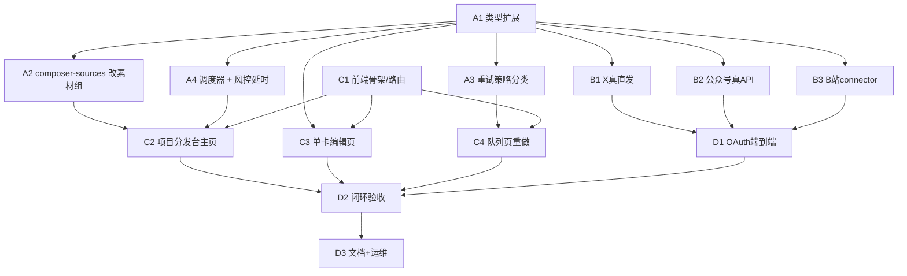
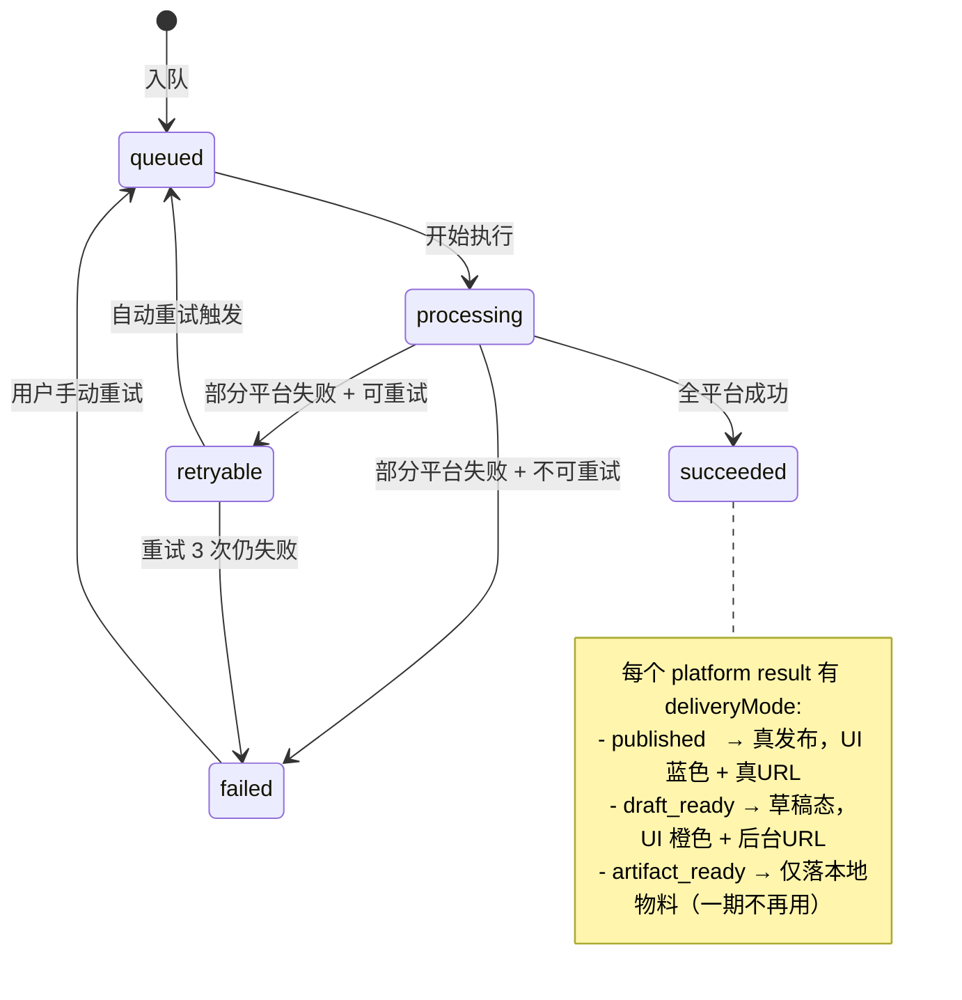

# Distribution Terminal 一期实施计划

> **本文件是外包团队开工 SSOT**。所有产品决策已在 [`prd_v1_distribution_terminal.md`](../02_design/distribution/prd_v1_distribution_terminal.md) 拍板，本计划只回答「如何实现」。
>
> 文档约定：所有路径都是仓库相对路径（如 `server/distribution.ts`），**禁用绝对路径**。所有行号引用必须配上类/函数名以防漂移失效。

---

## 📌 §0 外包团队 Onboarding（必读）

### 0.1 项目快速理解

**Distribution Terminal** 是 MindHikers 创作者工具链的最后一环（"三级火箭"），作用是把上游 Delivery Console（视频导演、写作大师、市场大师）产出的内容资产，发布到 4 个内容平台。

**用户视角的工作流**：

```
打开「项目分发台」
  └─ 选定项目（如 CSET-seedance2）
      └─ 看到该项目可发的所有「发布卡」（按素材组分块）
          ├─ 长文素材组 → X卡 + 公众号卡
          └─ 长视频素材组 → YouTube卡 + B站卡
      └─ 进单卡编辑、修改文案、配置平台高级字段
      └─ 勾选 N 张卡 → 立即发 / 定时发
      └─ 进入队列页看实时执行状态
          ├─ 真直发 → 蓝色已发布徽章 + 真实链接
          └─ 草稿态 → 橙色草稿徽章 + 「打开后台」按钮（关键：用户必须知道还要去后台手动群发）
```

**最关键的产品语义**：**草稿态 (`draft_ready`) ≠ 已发布 (`published`)**。
- 公众号 API 仅支持创建草稿（`/cgi-bin/draft/add`），群发要登录公众号后台手动点
- B站 投稿后要等审核
- 这两类必须在 UI 上**强提示**用户去后台完成最后一步，不能让用户误以为"已经发了"

### 0.2 技术栈

| 层 | 选型 | 版本 |
|---|---|---|
| 前端 | React + Vite + TypeScript + Tailwind v4 (CSS) | React 18.x，Tailwind 4 (token-based) |
| 后端 | Node.js + Express + TypeScript | tsx 运行时 |
| 队列存储 | 内存数组 + JSON 文件持久化 | 不引入 Redis/BullMQ |
| 实时推送 | SSE (Server-Sent Events) | 无需 WebSocket |
| 测试 | Vitest | `npm run test` / `npm run test:run` |
| Lint | ESLint | `npm run lint` |
| 平台 OAuth | googleapis (YouTube 已用)、X API v2 SDK、自实现微信公众号 token | 见各 connector |

### 0.3 启动开发环境

```bash
# 1. 安装依赖
npm install

# 2. 启动开发（前端 + 后端并行）
npm run dev
# 前端：http://localhost:5181
# 后端：http://localhost:3005

# 3. 跑测试
npm run test:run

# 4. 仅启动后端
npm run dev:clean   # 先清旧进程
npx tsx watch server/index.ts
```

**重要环境变量**（在 `.env` 或 shell 里设置，**不要提交到 git**）：

| 变量 | 用途 | 谁负责给值 |
|---|---|---|
| `PROJECTS_BASE` | 项目素材根目录绝对路径 | 老卢提供 |
| `YOUTUBE_CLIENT_ID` / `YOUTUBE_CLIENT_SECRET` / `YOUTUBE_REDIRECT_URI` | YouTube OAuth | 老卢提供 |
| `X_API_KEY` / `X_API_SECRET` / `X_BEARER_TOKEN` | X / Twitter API v2 | 一期开发时由老卢申请并提供 |
| `WECHAT_MP_APP_ID` / `WECHAT_MP_APP_SECRET` | 微信公众号 API | 老卢提供 |
| `BILIBILI_COOKIE` | B站 SESSDATA + bili_jct | 老卢提供（cookie 字符串） |

### 0.4 项目术语对照表

| 术语 | 含义 |
|---|---|
| **Delivery Console** | 项目老名字，与本项目代码库历史有关联，已迁移成 Distribution Terminal |
| **Director / 导演** | 上游模块：视频影视导演 |
| **Writing Master / 写作大师** | 上游模块：长文写作 |
| **Marketing Master / 市场大师** | 上游模块：平台文案适配 |
| **Crucible / 黄金坩埚** | 上游模块：苏格拉底辩论 + 想法熔炉 |
| **Project / 项目** | 一个独立选题（如 `CSET-seedance2`），有固定目录结构 |
| **Project Root** | `${PROJECTS_BASE}/<projectId>/` |
| **Composer Sources** | 从项目目录扫描出来的可用文案 + 标题 + 标签建议 |
| **Connector** | 平台发布器（X / 公众号 / YouTube / B站 各一个） |
| **Delivery Mode** | 平台发布产物类型：`published`（真发）/ `draft_ready`（草稿态）/ `artifact_ready`（仅生成本地物料） |
| **Outbound** | 项目目录下 `06_Distribution/outbound/<platform>/` 用于落盘平台投递物料 |

### 0.5 项目目录约定（用于扫描素材）

每个项目目录下，分发相关的子目录约定如下：

```
${PROJECTS_BASE}/<projectId>/
├── 02_Script/                    # 长文素材（写作大师产出，*.md）
│   └── *.md                      # 含封面图 *.png 同名同目录
├── 04_Video/                     # 长视频成片（影视导演 P4 产出）
│   └── *.mp4
├── 05_Marketing/                 # 平台文案（市场大师产出）
│   ├── youtube.md                # YouTube 文案
│   ├── bilibili.md               # B站 文案
│   ├── x.md                      # X 文案（可选，可从 02_Script 自动转换）
│   └── wechat_mp.md              # 公众号文案（可选）
├── 05_Shorts_Output/             # （一期不做）
└── 06_Distribution/              # 分发系统数据（**程序写**，禁止用户编辑）
    ├── queue.json                # 当前队列
    ├── history.json              # 历史发布
    ├── auth.json                 # 平台账号绑定状态
    └── outbound/<platform>/      # 落盘的发布物料
```

### 0.6 代码规范

- **TypeScript 严格模式**，新增代码不允许 `any`，必须有完整类型
- **命名**：camelCase 用于变量/函数，PascalCase 用于类型/组件，kebab-case 用于文件名
- **注释语言**：中文 OK（项目历史上中英文混用，与现有代码保持一致）
- **测试位置**：后端测试在 `src/__tests__/server/`，前端测试与组件同目录 `*.test.tsx`
- **测试框架**：Vitest（Jest 风格 API）
- **错误处理**：connector 抛 Error → execution-service 捕获 → 转 `DistributionPlatformResult.status: 'failed'`
- **日志**：现有代码用 `console.log` 配 `[timestamp] [module] [stage] STATUS -> detail` 格式（见 `server/distribution.ts:39`）

### 0.7 PR 流程

1. 每个 Implementation Unit **一个分支** + **一个 PR**
2. 分支命名：`feat/dt-phase<X>-unit<N>-<short-name>`，例如 `feat/dt-phaseB-unit2-wechat-real-api`
3. PR 标题格式：`feat(dt): [Unit X.Y] <unit name>`
4. PR 描述必须包含：
   - 关联的 Implementation Unit 编号
   - 修改的文件列表
   - 测试场景验证截图/日志
   - 是否触及 Verification 中的所有项
5. **强制门禁**：`npm run lint` + `npm run test:run` 通过才能合并
6. **不允许合并到 `main`**，必须合并到 `MHSDC-DT` 分支

---

## §1 Overview

把 PRD v1 转化为可被外包独立开发的 14 个 Implementation Units，分 4 个 Phase 推进：

```
Phase A: 后端骨架收口   (4 units, 低风险)  ──┐
                                              ├─→ Phase D: 联调验收 (3 units)
Phase B: Connector 升级 (4 units, 中风险)  ──┤
                                              │
Phase C: 前端重组       (3 units, 中风险)  ──┘
```

**关键收口**：
- 后端骨架 70% 已存在，主要是**扩展类型 + 改造重试 + 扩展素材组扫描**
- Connector 4 个：YouTube 完整可用 / X 升级真直发 / 公众号补真 API / B站 全新
- 前端三大页（首页 / 编辑 / 队列）按 demo 落地为真组件

---

## §2 Problem Frame

见 PRD §1 (用户与节奏) 和 PRD §2 (核心产品决策)。

简言之：独立创作者一周 3-5 次发布，需要按项目维度看到所有发布卡，区分真发布与草稿态，4 平台收敛 (X/公众号/YouTube/B站)，账号健康前置，风控延时可关。

---

## §3 Requirements Trace

PRD 需求 → 本计划 Implementation Unit 映射：

| PRD 需求 | Unit |
|---|---|
| R1.1 项目目录扫描生成发布卡 | A2 |
| R1.2-1.4 卡片显示 + ready 判定 + 置灰 | A2 + C2 |
| R1.5 顶部健康条 | C2 |
| R1.6 Queue 摘要 | C2 |
| R1.7 底部发布栏 | C2 |
| R2.1 单卡编辑路由 | C3 |
| R2.2-2.3 两层字段 + 平台高级 | C3 |
| R2.4 自动预填 | A2 |
| R2.5 编辑不影响上游 | A1 |
| R2.6 草稿态横幅 | C3 |
| R2.7 风控开关 | A4 + C3 |
| R3.1-3.3 多选 + 发布按钮 | C2 |
| R3.4 立即发布 | A4（已有，需补即时延时）|
| R3.5 定时发布 | A4 |
| R3.6 二次确认弹窗 | C2 |
| R4.1-4.3 队列页 SSE + 筛选 | C4 |
| R4.4 已发布 URL | C4 |
| R4.5 草稿态「打开后台」 | C4 |
| R4.6 失败日志 + 重试按钮 | C4 |
| R5.1 重试错误码分类 | A3 |
| R5.2-5.3 失败提示 + 手动重试 | C4 |
| R6.1 X 真直发 | B1 |
| R6.2 YouTube 真直发 | （已有，无需新 unit） |
| R6.3 公众号真草稿 | B2 |
| R6.4 B站 connector | B3 |
| R6.5 账号健康颜色 | C2 |

---

## §4 Scope Boundaries

详见 PRD §7。本计划补充以下**实施侧**边界：

**不做（一期）**：
- 不引入 Redis / BullMQ / 任何外部队列服务（保持内存 + JSON）
- 不引入 React Router 之外的状态管理（不上 Redux / Zustand，沿用现有 hook 风格）
- 不动 `src/index.css` 主题定义（cream 主题已对齐）
- 不修改 Delivery Console 上游代码（写作大师 / 影视导演 / 市场大师等）
- 不动 `server/director-bridge.ts` / `server/expert-actions/` 等无关后端模块
- 不引入新的 UI 组件库（不上 shadcn / antd / Material UI，沿用现有 lucide-react 图标 + Tailwind）

**保持兼容**：
- 旧 `PublishComposer.tsx` / `DistributionQueue.tsx` 在重做期间**保留可用**，不做破坏性删除（C 阶段最后一 unit 标 Beta 旁路）
- 现有 `DistributionTaskAssets`、`DistributionPlatformResult` 顶层结构**只增字段不改名**

---

## §5 Context & Research

### 5.1 关键代码定位（外包必读）

| 文件 | 行数 | 职责 | 改造涉及 |
|---|---|---|---|
| `server/distribution-types.ts` | 191 | 全部类型定义。**草稿态 `deliveryMode` 已在第 73 行** | A1 扩展字段 |
| `server/distribution.ts` | 370 | Express 路由聚合。13 个 REST 端点 | A4 增 1 端点 |
| `server/distribution-store.ts` | 478 | 队列/历史/auth/composer-sources 文件持久化 | A2 改 `getDistributionComposerSources` (323-444) |
| `server/distribution-execution-service.ts` | 304 | 串行执行平台 connector + 发 SSE 事件 | A3 改重试，B1/B2/B3 加 connector dispatch |
| `server/distribution-queue-service.ts` | 78 | 任务 CRUD + 摘要 | A4 改 `createDistributionTask` |
| `server/distribution-events.ts` | 72 | SSE broadcast | 不改 |
| `server/distribution-auth-service.ts` | 176 | 账号状态 CRUD | B3 加 B站 |
| `server/connectors/youtube-connector.ts` | 70 | ✅ 完整真发实现（OAuth + publishAt） | 不改 |
| `server/connectors/x-connector.ts` | 69 | ❌ 当前写本地 JSON 假发 | B1 改真直发 |
| `server/connectors/wechat-mp-connector.ts` | 80 | ❌ 当前写本地 markdown 假草稿 | B2 调真 API |
| `server/connectors/bilibili-connector.ts` | - | 不存在 | B3 新建 |
| `server/youtube-oauth-service.ts` | - | YouTube OAuth token 管理 | 不改（B1/B3 仿照新建） |
| `src/components/PublishComposer.tsx` | 631 | ⚠️ 旧自由发组件 | C5 标 Beta |
| `src/components/DistributionQueue.tsx` | 722 | ⚠️ 旧队列组件 | C4 视觉重做 |
| `src/components/AccountsHub.tsx` | - | 账号管理面板 | C2 新「健康条」复用其 API 调用 |
| `src/__tests__/server/distribution-*.test.ts` | 694 | 5 套后端测试 | 跟随改造扩展 |

### 5.2 视觉规范参考（demo 已完成）

| demo 文件 | 对应 Unit |
|---|---|
| `docs/03_ui/demo/01_landing.html` | C2 项目分发台主页 |
| `docs/03_ui/demo/02_edit.html` | C3 单卡编辑页 |
| `docs/03_ui/demo/03_queue.html` | C4 队列重做 |
| `docs/03_ui/demo/_shared.css` | 视觉 token 基线 |

启动 demo：`python3 -m http.server 8765 --directory docs/03_ui/demo` 然后访问 `http://localhost:8765/01_landing.html`

**严格视觉约束**（C 阶段所有 unit 必须遵守）：
- 颜色不用其它，全部对齐 `src/index.css` cream 主题 token：`--color-bg / --color-surface / --color-surface-alt / --color-module / --color-text` 等
- 草稿态 = 虚线橙徽章 (`#b45309`) + 橙色左边线 + 略深底色 + 「打开后台」按钮
- 已发布 = 实线蓝徽章 (`#1d4ed8`) + 蓝色左边线 + 真实链接
- 失败 = 红色徽章 (`#b91c1c`) + 红色左边线 + 重试计数 (e.g., "2/3")

### 5.3 外部参考

| 平台 | 主要参考 OSS / 文档 | 借鉴层 |
|---|---|---|
| YouTube | [Google YouTube Data API v3](https://developers.google.com/youtube/v3) | 已实现，参考即可 |
| X | [X API v2 docs](https://docs.x.com/x-api) + [Postiz](https://github.com/gitroomhq/postiz-app) | OAuth + POST `/2/tweets` |
| 微信公众号 | [Wechatsync](https://github.com/wechatsync/Wechatsync) + [微信草稿 API](https://developers.weixin.qq.com/doc/offiaccount/Draft_Box/Add_draft.html) | Markdown→草稿、token 管理 |
| B站 | [social-auto-upload](https://github.com/dreammis/social-auto-upload) (Playwright 骨架) | Cookie 注入、表单填充序列 |
| 类型/状态机 | [Mixpost](https://github.com/inovector/mixpost) / [Postiz](https://github.com/gitroomhq/postiz-app) | 队列生命周期已对齐，不改 |

### 5.4 已踩过的坑（项目历史经验）

- ⚠️ `.git` 文件曾指向旧路径 `/Users/luzhoua/DeliveryConsole/`，迁移后已修复指向 `/Users/luzhoua/DeliveryConsole-bk/`。**git 操作失败时先看 `.git` 文件内容**
- ⚠️ 端口策略：前端 5181 / 后端 3005-3008 / demo 8765。**禁用其它端口避免冲突**
- ⚠️ 环境变量 `PROJECTS_BASE` 不能硬编码，必须运行时读取
- ⚠️ Director / Phase 字段与本模块**无关**，不要误改

---

## §6 Key Technical Decisions

| # | 决策 | 替代方案 | 理由 |
|---|---|---|---|
| **K1** | **B站 connector 走 Playwright** (借鉴 social-auto-upload)，cookie 注入式登录 | biliup-rs 子进程 / 直接 HTTP + cookie | OSS 借鉴策略已记录 (`docs/plans/2026-03-22_Distribution_OSS_Borrowing_Map.md`)。Playwright 稳定可调试，biliup-rs 是 Rust 二进制部署成本高 |
| **K2** | **公众号封面图分两步**：先调 `/cgi-bin/material/add_material?type=image` 上传换 `media_id`，再 `/cgi-bin/draft/add` 引用 | 一步 multipart 直传 | 微信 API 强制：草稿接口的 `thumb_media_id` 必须是先上传到永久素材库返回的 ID。无法绕过 |
| **K3** | **重试策略可配置 + 默认按错误码分类** | 一刀切固定间隔 | PRD R5.1 明确分类。配置文件位置 `server/distribution-retry-policy.ts`，默认值见 §K3 详表 |
| **K4** | **定时发布存 UTC ISO 8601**，前端按用户本地时区显示 | 存本地时区字符串 | YouTube/B站 平台 API 都接受 UTC，统一 UTC 后转换链路最短。timezone 字段保留用于显示 |
| **K5** | **新前端用文件级路由**：`src/components/distribution-terminal/` 子目录 + 在 `App.tsx` 添加路由项，不引入 React Router | 全量上 React Router | 项目目前是顶层 tab 切换，引入路由器会破坏现有架构。一期沿用 |
| **K6** | **风控延时改为「即时发布也支持延时 + 用户可关」** | 仅定时发布延时 | 当前代码 (`distribution-queue-service.ts:17`) 仅在 `scheduleTime` 存在时生成 `systemDelayMs`。改造为「`riskDelayEnabled` 默认 true，即时发布也跑延时；可关」 |
| **K7** | **Connector 测试用 nock 拦截 HTTP** | 真实调用外部 API | 测试不能依赖外部服务可用。nock 已是 Node 生态标准 |
| **K8** | **Phase 发布顺序 A → B / C 并行 → D** | 全串行 | A 是契约层，B/C 都依赖 A 但相互独立 |

### K3 详表：重试策略默认值

```
配置文件：server/distribution-retry-policy.ts
默认 export：

{
  maxAttempts: 3,                           // 总尝试次数（含首次）
  classifyError: (err) => 'category',       // 输入 Error/HTTP响应 → 分类
  rules: {
    '4xx_auth':         { retry: false },                          // 401/403 不重试
    '4xx_content':      { retry: false },                          // 422 内容违规不重试
    '4xx_rate_limit':   { retry: true,  delaysMs: [60_000, 300_000, 900_000] },  // 429: 1m/5m/15m
    '5xx_server':       { retry: true,  delaysMs: [5_000, 15_000, 60_000] },     // 5xx: 5s/15s/1m
    'network':          { retry: true,  delaysMs: [3_000, 10_000, 30_000] },     // 超时/连接失败
    'unknown':          { retry: true,  delaysMs: [10_000, 30_000, 60_000] },    // 兜底
  }
}
```

---

## §7 Open Questions

### 7.1 Resolved During Planning

| 问题 | 决议 |
|---|---|
| B站 connector 选型 | K1: Playwright 子进程 |
| 公众号封面图链路 | K2: 分两步（先素材库换 media_id） |
| 重试间隔 | K3: 配置可调，默认按错误码分类 |
| 定时发布时区 | K4: 存 UTC，前端转本地时区显示 |

### 7.2 Deferred to Implementation

| 问题 | 为何延后 |
|---|---|
| X 是否做线程拆分（>280 字符自动切多推） | 需要看 X API 免费 tier 真实调用配额。**B1 单元开始时由实施者跑一次实测决定** |
| 公众号 IP 白名单配置 | 需要老卢提供运营服务器 IP，部署阶段处理（D2） |
| B站 cookie 寿命具体多少天 / 提前多少天告警 | 需要实测。**D2 单元跑 cookie 注入后观察 7-14 天再固化** |
| 是否实现 dryRun 模式（发布前预览不真发） | 一期可推迟。如外包发现实施时遇到调试困难，可单独提需求 |
| 重试策略的具体 HTTP 错误码分类边界（如 422 算 content 还是 auth） | B1/B2/B3 connector 实施者根据各平台 API 返回值调整 |

---

## §8 High-Level Technical Design

> *以下示意图是方向性指引，外包实施者自行决定具体函数签名与实现细节。*

### 8.1 Phase 推进依赖图



### 8.2 一次发布请求的数据流

```
[用户点「立即发布」]
   │
   ▼
[前端 BottomActionBar]
   │ POST /distribution/queue/create
   │ body: { projectId, platforms[], assets, scheduleTime?, riskDelayEnabled }
   ▼
[server/distribution.ts:135 router.post('/queue/create')]
   │
   ▼
[distribution-queue-service.ts createDistributionTask()]
   │ 生成 taskId、计算 systemDelayMs (即时发布也算)、设置 status='queued' 或 'scheduled'
   ▼
[distribution-store.ts saveDistributionQueue()]
   │ 写入 06_Distribution/queue.json
   ▼
[distribution-events.ts broadcastDistributionEvent('job_created')]
   │ SSE 推送给前端
   ▼
[实际执行：scheduler 检测到 status='queued' && 当前时间 >= scheduledAt+systemDelayMs]
   │
   ▼
[distribution-execution-service.ts executeDistributionTask()]
   │ 串行调用 platform connectors，发 SSE
   │
   ├─→ publishToYoutube  → published / 真URL
   ├─→ publishToX        → published / 真URL
   ├─→ publishToWechatMp → draft_ready / 后台URL
   └─→ publishToBilibili → draft_ready / 后台URL
   │
   ▼
[失败的 platform → 走 retry-policy 决策]
   │ 401: 不重试 → 终态 failed
   │ 429: 延迟重试 → reschedule attempt 2 in 60s
   │ 5xx: 立即重试
   ▼
[最终 task.status = 'succeeded' / 'failed' / 'retryable']
   │
   ▼
[appendDistributionHistory + saveDistributionQueue]
```

### 8.3 草稿态 vs 已发布的状态机



---

## §9 Implementation Units

### Phase A：后端骨架收口（4 units）

#### - [ ] **Unit A1：扩展 DistributionTaskAssets 类型增补各平台字段**

**Goal**：为 4 个平台的高级设置字段、素材组分组 ID、风控延时开关，扩展类型层（不改名只增字段）。

**Requirements**：R2.2, R2.3, R2.7, R6.* 全部依赖此 Unit 的字段定义

**Dependencies**：无（先行）

**Files**：
- Modify: `server/distribution-types.ts`
- Test: `src/__tests__/server/distribution-types.test.ts` (**新建**)

**Approach**：

在 `DistributionTaskAssets` 上**追加**以下字段（保持原有字段不变）：

```typescript
// 新增字段（追加到 DistributionTaskAssets 接口）：
materialGroupId?: string;      // 素材组归属，例如 "longform_v2-1" / "video_main"
riskDelayEnabled?: boolean;    // 风控延时开关，默认 true

platformOverrides?: Record<string, {
  title?: string;
  tags?: string[];
  // === X / Twitter ===
  replySettings?: 'everyone' | 'following' | 'mentioned';
  communityUrl?: string;
  madeWithAi?: boolean;
  paidPartnership?: boolean;
  // === Wechat MP ===
  summary?: string;              // ≤120 字
  author?: string;
  originalLink?: string;
  coverImagePath?: string;       // 项目内相对路径
  commentEnabled?: boolean;
  rewardEnabled?: boolean;
  // === YouTube ===
  visibility?: 'private' | 'unlisted' | 'public';
  madeForKids?: boolean;
  category?: string;
  license?: 'youtube' | 'creativeCommon';
  thumbnailPath?: string;
  // === Bilibili ===
  copyright?: 1 | 2;             // 1=原创 2=转载
  tid?: number;                  // 分区 ID
  noReprint?: boolean;
  chargeOpen?: boolean;
  dolby?: boolean;
  hires?: boolean;
  dtime?: number;                // Unix 秒，B站定时
  source?: string;               // 转载来源（copyright=2 必填）
}>;
```

新增 `DistributionPlatformResult` 字段：

```typescript
backendUrl?: string;             // 草稿态平台的「打开后台」URL
errorCategory?:                  // 重试策略分类
  | '4xx_auth' | '4xx_content' | '4xx_rate_limit'
  | '5xx_server' | 'network' | 'unknown';
attemptCount?: number;           // 已尝试次数（1=首次）
nextRetryAt?: string;            // ISO 8601，下次重试时间
```

新增 `DistributionComposerSources` 扩展为分组结构（**注意保留旧字段实现向后兼容**）：

```typescript
// 现有：
export interface DistributionComposerSources {
  suggestedTitle: string;
  suggestedBody: string;
  suggestedTags: string[];
  sourceFiles: DistributionComposerSourceFile[];
  warnings: string[];
}

// 扩展（A2 单元会用到）：
export interface DistributionMaterialGroup {
  groupId: string;                                      // "longform_<basename>" / "video_<basename>"
  groupType: 'longform' | 'video';                      // 长文 / 长视频
  primarySource: DistributionComposerSourceFile;        // 主素材文件
  applicablePlatforms: ('twitter' | 'wechat_mp' | 'youtube' | 'bilibili')[];
  suggestedTitle: string;
  suggestedBody: string;
  suggestedTags: string[];
  // ready 判定的元数据：
  readyState: {
    [platform: string]: {
      ready: boolean;
      missingItems?: string[];   // 例如 ['封面图缺失', '市场大师文案不存在']
    }
  };
  warnings: string[];
}

export interface DistributionComposerSourcesV2 {
  groups: DistributionMaterialGroup[];
  scannedAt: string;
  // 兼容字段（保持旧 API 客户端可用）：
  legacy?: DistributionComposerSources;
}
```

**Patterns to follow**：
- `server/distribution-types.ts` 已有的 `DistributionTaskAssets`（53-68）、`DistributionPlatformResult`（70-79）写法
- 全部 `?: type` 标注可选，不破坏旧 task 反序列化
- 保留 `normalizeDistributionTask()` 函数（154-191），在 V2 数据兼容上扩展

**Test scenarios**：
- Happy path: 反序列化一个**无新字段**的旧 `DistributionTask` JSON，所有字段读取正常，新字段 `undefined`
- Happy path: 反序列化一个**带全部新字段**的 task JSON，类型校验通过
- Edge case: `platformOverrides.bilibili.copyright=2` 但 `source` 缺失 → TypeScript 不强制（运行时 connector 校验）；测试只校验 JSON parse 通过
- Edge case: `materialGroupId` 为空字符串 / undefined / null 三种情况都不报错
- Integration: 扩展后的类型与现有 `executeDistributionTask` 的串行循环兼容（不破坏 platforms[] 解析）

**Verification**：
- `npm run lint` 通过
- `npm run test:run` 全部测试通过（含旧的 5 套测试）
- `git diff` 显示**只有 Add，无 Modify/Delete** 已有字段名

---

#### - [ ] **Unit A2：扩展 composer-sources 返回素材组分组结构**

**Goal**：把单文件返回的 `getDistributionComposerSources` 改造为按素材组返回，支持 N 组素材 → N×平台 张卡的扫描逻辑。

**Requirements**：R1.1, R1.3, R2.4

**Dependencies**：A1（依赖 `DistributionMaterialGroup` 类型）

**Files**：
- Modify: `server/distribution-store.ts:323-444` (`getDistributionComposerSources`)
- Modify: `server/distribution.ts:335-352` (路由 `/composer-sources`，新增 v2 query 参数支持)
- Modify: `src/__tests__/server/distribution-composer-sources.test.ts`

**Approach**：

新增函数 `getDistributionComposerSourcesV2(projectId)`，**保留旧函数不删**（旧 PublishComposer 仍在用）。

扫描逻辑：

1. 扫描 `02_Script/*.md` → 每个 .md 视为一个 **longform 组**，applicablePlatforms = `['twitter', 'wechat_mp']`
2. 扫描 `04_Video/*.mp4` → 每个 .mp4 视为一个 **video 组**，applicablePlatforms = `['youtube', 'bilibili']`
3. 对每个组，进入 `05_Marketing/<platform>.md` 查找平台专用文案：
   - 找到 → 用专用文案的 title/body/tags
   - 未找到 → 回退到主素材的 title/body/tags（沿用旧逻辑 `extractTitleFromStructuredText` 等）
4. 对每个组的每个 platform 计算 `readyState`：
   - **longform→twitter**：主素材 .md 存在即 ready
   - **longform→wechat_mp**：主素材 .md 存在 + 同名 .png 封面图存在 = ready
   - **video→youtube**：主视频 .mp4 存在 + (有 youtube.md 或 02_Script .md) = ready
   - **video→bilibili**：主视频 .mp4 存在 + 有 bilibili.md = ready

路由层：`/distribution/composer-sources?projectId=X&v=2` 走新逻辑，无 `v=2` 走旧逻辑（向后兼容）。

**Patterns to follow**：
- `server/distribution-store.ts:272` `listDistributionAssets` 的目录扫描方式（`fs.readdirSync` + `endsWith` 过滤）
- `server/distribution-store.ts:335-394` 中的 `extractTitleFromStructuredText`、`sortMarketingCandidates` 等私有函数，可复用

**Test scenarios**：
- Happy path: 项目有 1 个 .md + 1 个 .mp4 → 返回 2 组（longform + video），4 张卡
- Happy path: 项目有 2 个 .md + 1 个 .mp4 → 返回 3 组，6 张卡
- Happy path: 项目有 1 个 .md，无封面图 → longform→wechat_mp 的 readyState.ready=false, missingItems=['封面图 cover.png 不存在']
- Happy path: 视频组找到 `05_Marketing/youtube.md` → suggestedTitle 来自 youtube.md 而非 02_Script
- Edge case: 项目目录为空 → 返回 `{ groups: [], scannedAt, warnings: ['项目内未找到可用素材'] }`
- Edge case: `02_Script` 不存在但 `05_Marketing/x.md` 存在 → 仍能扫出 longform→twitter 组（兜底）
- Edge case: .md 文件名包含空格 / 中文 → 返回正确，groupId 用 base64 或 slugify 处理
- Error path: `projectId` 不存在 → 抛 Error，路由返回 404
- Integration: V2 路由返回的 group 结构符合 A1 定义的 `DistributionMaterialGroup` 类型；旧路由（无 `v=2`）继续返回旧结构

**Verification**：
- 测试覆盖**至少 6 个 happy path** + **3 个 edge case** + **1 个 error path**
- 在测试项目 `tests/fixtures/projects/CSET-seedance2/` 下放 1 个 .md + 1 个 .mp4 实测，扫描结果符合预期
- 旧 `PublishComposer.tsx` 调用 `/composer-sources`（无 v=2）行为不变

---

#### - [ ] **Unit A3：重试策略改为按错误码分类**

**Goal**：把 `executeDistributionTask` 的 catch 块从"任意失败标 retryable"改为"按 HTTP 错误码 / 错误类型分类，决定是否重试 + 间隔"。

**Requirements**：R5.1

**Dependencies**：A1（用 `DistributionPlatformResult.errorCategory` / `nextRetryAt` 字段）

**Files**：
- Create: `server/distribution-retry-policy.ts` (~80 行)
- Modify: `server/distribution-execution-service.ts:160-282`（`executeDistributionTask`）
- Create: `src/__tests__/server/distribution-retry-policy.test.ts`
- Modify: `src/__tests__/server/distribution-execution-service.test.ts`（新增分类场景）

**Approach**：

新建 `server/distribution-retry-policy.ts`，导出：

```
classifyError(error: unknown, httpStatus?: number): ErrorCategory
applyRetryPolicy(category: ErrorCategory, attemptCount: number): { shouldRetry: boolean; delayMs?: number }
```

`classifyError` 逻辑：
- error 是 HTTP error 且 status 401/403 → `'4xx_auth'`
- error 是 HTTP error 且 status 422 → `'4xx_content'`
- error 是 HTTP error 且 status 429 → `'4xx_rate_limit'`
- error 是 HTTP error 且 status 5xx → `'5xx_server'`
- error 是 `ETIMEDOUT` / `ECONNREFUSED` / fetch 抛错 → `'network'`
- 其它 → `'unknown'`

`applyRetryPolicy` 查 K3 的 rules 表返回。

修改 `executeDistributionTask` 的 catch 块（line 232-251）：
- 调用 `classifyError(error)` → 写入 `result.errorCategory`
- 调用 `applyRetryPolicy(category, task.attemptCount)` → 决定是否设 `result.nextRetryAt`
- task 的最终 `status`：
  - 任一 platform 的 errorCategory 为 'unknown' / '5xx' / 'network' / '4xx_rate_limit' 且未达 maxAttempts → `'retryable'`
  - 所有失败的都是 `'4xx_auth'` 或 `'4xx_content'` → 直接 `'failed'`
  - 全部成功 → `'succeeded'`

新增**自动重试调度**：在 `server/distribution-execution-service.ts` 暴露 `scheduleAutoRetry(task, retryDelayMs)` 函数，A4 单元会调用它（用 setTimeout 触发）。

**Patterns to follow**：
- `server/distribution-execution-service.ts:125-144` `markDistributionTaskFailed` 写法
- 错误分类不要 throw，全部转 `DistributionPlatformResult.status='failed'`

**Test scenarios**：
- Happy path: HTTP 401 错误 → category='4xx_auth', shouldRetry=false
- Happy path: HTTP 429 错误 + attemptCount=1 → shouldRetry=true, delayMs=60_000
- Happy path: HTTP 429 错误 + attemptCount=2 → delayMs=300_000
- Happy path: HTTP 429 错误 + attemptCount=3 → delayMs=900_000
- Happy path: HTTP 429 错误 + attemptCount=4 → shouldRetry=false（达到 maxAttempts）
- Happy path: 5xx 错误 + attemptCount=1 → delayMs=5_000
- Happy path: 网络超时（`code: 'ETIMEDOUT'`）→ category='network', shouldRetry=true
- Edge case: 自定义 Error 无 status → category='unknown', shouldRetry=true
- Edge case: 同一任务多平台、X 是 401 + YouTube 是 5xx → 整体任务 status='retryable'（因 5xx 可重试）
- Error path: classifyError 输入 null/undefined → category='unknown'（不抛错）
- Integration: executeDistributionTask 的 task 串行执行后，retryable 任务的 platforms 中只剩**未成功 + 可重试**的 platform（已成功的不再重试）

**Verification**：
- `distribution-retry-policy.test.ts` 至少 11 个测试场景全过
- 修改后的 execution-service.test.ts 不破坏现有 252 行测试
- 在控制台手动 trigger 一个会 401 的 X 任务，看 task.status='failed'，errorCategory='4xx_auth'

---

#### - [ ] **Unit A4：定时调度器 + 风控延时改造**

**Goal**：实现两件事：1) 定时发布到点自动执行；2) 风控延时改成"即时发布也走 + 用户可关"。

**Requirements**：R3.4, R3.5, R2.7

**Dependencies**：A1, A3

**Files**：
- Create: `server/distribution-scheduler.ts` (~120 行)
- Modify: `server/distribution-queue-service.ts:3-35`（`createDistributionTask`）
- Modify: `server/index.ts`（启动时 init scheduler）
- Modify: `server/distribution.ts`（新增 1 个端点 `POST /queue/:taskId/reschedule`，可选）
- Create: `src/__tests__/server/distribution-scheduler.test.ts`

**Approach**：

**改造 `createDistributionTask`**（`distribution-queue-service.ts:3`）：

```
新签名输入增加 riskDelayEnabled?: boolean (默认 true)

逻辑：
- 计算 systemDelayMs:
  - 如果 riskDelayEnabled === false → systemDelayMs = 0
  - 否则 → 2-8 分钟随机（120000-480000 ms）
- 计算 effectiveStartAt:
  - 如果有 scheduleTime → effectiveStartAt = scheduleTime + systemDelayMs
  - 否则 → effectiveStartAt = now + systemDelayMs
- 写入 task: { effectiveStartAt, riskDelayEnabled, systemDelayMs, ... }
- status:
  - effectiveStartAt > now → 'scheduled'
  - 否则 → 'queued'
```

**新建调度器** `server/distribution-scheduler.ts`：

```
导出：
- initScheduler(): 启动后台 setInterval，每 30 秒扫一次队列
- stopScheduler(): 测试用
- triggerDueTasks(now: Date): 取出所有 effectiveStartAt <= now 且 status='scheduled' 的任务 → executeDistributionTask
- scheduleAutoRetry(task, delayMs): A3 注入的钩子
```

调度器实现要点：
- 使用 `setInterval(triggerDueTasks, 30_000)` 后台扫
- 重启服务时 `initScheduler()` 检查所有 status='scheduled' 任务，立即触发 effectiveStartAt 已过的
- **不要重复触发**：用 task.status='processing' 做互斥锁

**`server/index.ts`** 修改：
- 在 `app.listen()` 后 + 在 `gracefulShutdown` 注册前，调用 `initScheduler()`
- 在 `gracefulShutdown` 里调 `stopScheduler()`

**Patterns to follow**：
- `server/graceful-shutdown.ts` 的关闭钩子模式
- `server/distribution-events.ts:registerDistributionEventSubscriber` 的订阅模式

**Test scenarios**：
- Happy path: 创建 task 时 `riskDelayEnabled=true` 且无 scheduleTime → systemDelayMs ∈ [120_000, 480_000]，effectiveStartAt = now + delay
- Happy path: 创建 task 时 `riskDelayEnabled=false` 且无 scheduleTime → systemDelayMs=0, effectiveStartAt ≈ now
- Happy path: 创建 task 时有 scheduleTime + riskDelayEnabled=true → effectiveStartAt = scheduleTime + delay
- Happy path: scheduler triggerDueTasks 找到 1 个 effectiveStartAt 已过的 task → 调用 executeDistributionTask 执行
- Edge case: triggerDueTasks 找到 task 但其 status='processing' → 跳过不重复触发
- Edge case: 服务重启后，initScheduler 检测到 effectiveStartAt 已过的 scheduled task → 立即触发
- Edge case: A3 注入的 retry 用 setTimeout 在 delayMs 后触发，不堵塞主流程
- Error path: triggerDueTasks 在 executeDistributionTask 抛错时，**不污染**其它待发任务的循环
- Integration: end-to-end 创建任务 → 等待 effectiveStartAt → executeDistributionTask 自动跑 → SSE 事件正常推送

**Verification**：
- 在测试里用 `vi.useFakeTimers()` 模拟时间推进
- 实测：创建一个 scheduleTime=10秒后的任务，等待 → 看队列里 status 自动变 processing → succeeded（mock connectors）
- 重启 dev server 后，已有的 scheduled 任务到点正常触发

---

### Phase B：Connector 升级（4 units）

#### - [ ] **Unit B1：X / Twitter Connector 升级为真直发**

**Goal**：把当前写本地 JSON 的 `x-connector.ts` 改造为真 OAuth + POST `/2/tweets` 真直发。

**Requirements**：R6.1

**Dependencies**：A1（用新字段）

**Files**：
- Create: `server/x-oauth-service.ts` (~150 行，模仿 `youtube-oauth-service.ts`)
- Modify: `server/connectors/x-connector.ts:49-68`（`publishToX`）
- Modify: `server/distribution.ts:60-76`（`/auth/url` 端点支持 platform=twitter）
- Modify: `server/distribution-auth-service.ts`（X token 持久化）
- Create: `src/__tests__/server/x-connector.test.ts`

**Approach**：

**OAuth 服务**：
- 走 X API v2 OAuth 2.0 with PKCE（详见 https://docs.x.com/x-api/authentication/oauth-2-0/user-access-token）
- scopes: `tweet.read tweet.write users.read offline.access`
- token 持久化到 `06_Distribution/auth.json` 的 `x_token` 字段（参考 youtube-oauth-service 的 `requireYoutubeAccessToken` 写法）
- token 过期时用 refresh_token 自动刷新，刷新失败 → `auth.json` 标 `expired`

**publishToX 改造**：

```
1. 获取 access_token：requireXAccessToken()，失败抛 Error
2. 调用 X API v2 POST https://api.x.com/2/tweets
   payload: { text: postText, reply_settings, ... }
3. 成功 → return {
     platform: 'twitter',
     status: 'success',
     deliveryMode: 'published',     // 注意从 artifact_ready 改为 published
     remoteId: tweet_id,
     url: `https://x.com/i/status/${tweet_id}`,
     publishedAt: created_at
   }
4. 失败 → throw error，让 execution-service 走 retry-policy 分类
```

**关于线程拆分**（PRD 7.2 deferred 问题）：B1 实施者第一次跑通真直发后，决定是否实现自动按 280 字符切线程。如不做，简单 truncate 到 280 字符 + 末尾加 "..."。如做，line-break 优先在句末。

**Patterns to follow**：
- `server/youtube-oauth-service.ts` 完整 OAuth 实现（B1 实施者必读）
- `server/connectors/youtube-connector.ts:34-53` 的 SDK 调用模式
- `server/connectors/x-connector.ts:21-47` 的 `buildXPayload` 字段构造（**保留**，作为输入校验/格式化）

**Test scenarios**：
- Happy path: mock X API 返回 `{data: {id: '1789...', text: '...'}}` → result.deliveryMode='published', url 正确
- Happy path: 长文 textDraft > 280 字符 → 自动 truncate 或拆线程（按实施决定）
- Happy path: tag 数组 `['AI', 'OpenAI']` → 拼成 `#AI #OpenAI` 加入 postText
- Edge case: X API 返回 200 但 data 为空 → 抛 Error 'X API succeeded but no tweet id returned'
- Error path: X API 返回 401 → 抛带 status 的 Error，retry-policy 分类为 4xx_auth
- Error path: X API 返回 429 → 抛带 status 的 Error，retry-policy 分类为 4xx_rate_limit
- Error path: 网络超时 → 抛 ETIMEDOUT，分类为 network
- Edge case: replySettings='following' 字段正确透传
- Integration: 真实跑通一次（D1 单元集成测试时验证）

**Verification**：
- 单元测试 8+ 场景过
- 在 dev 环境用真账号发一条测试推文，看 X 上真实可见
- result 中的 url 可点击跳转到真实 tweet

---

#### - [ ] **Unit B2：微信公众号 Connector 调真草稿 API**

**Goal**：把当前只写本地 markdown 的 `wechat-mp-connector.ts` 改造为真调微信 API：上传封面图换 `thumb_media_id` → 调 `/cgi-bin/draft/add` 创建草稿。

**Requirements**：R6.3

**Dependencies**：A1

**Files**：
- Create: `server/wechat-mp-token-service.ts` (~80 行，access_token 自动刷新缓存)
- Modify: `server/connectors/wechat-mp-connector.ts:56-79`（`publishToWechatMp`）
- Create: `src/__tests__/server/wechat-mp-connector.test.ts`
- Modify: `src/__tests__/server/distribution-execution-service.test.ts`（mock 真实 API 而非本地写文件）

**Approach**：

**Token 服务**：
- 调用 `https://api.weixin.qq.com/cgi-bin/token?grant_type=client_credential&appid=X&secret=Y`
- 返回 access_token 有效期 7200 秒，缓存到 memory（serverless 用 file，本项目用 memory map 即可）
- 提前 600 秒刷新

**publishToWechatMp 改造**：

```
步骤 1: 上传封面图换 thumb_media_id
  - 读 task.assets.platformOverrides.wechat_mp.coverImagePath
  - POST https://api.weixin.qq.com/cgi-bin/material/add_material?access_token=X&type=image
    multipart/form-data, field name=media, file=cover.png
  - 返回 { media_id, url }
  - 失败 → throw

步骤 2: Markdown 转 HTML
  - 用 marked 或简单 regex 转换（公众号草稿要求 HTML）
  - 注意：公众号对 HTML 标签有白名单，不允许 <script>、<iframe>、外链 （必须用素材库 ID）
  - 简化策略：一期只支持 <h1>-<h4> / <p> / <strong> / <em> / <a>

步骤 3: 调用草稿 API
  - POST https://api.weixin.qq.com/cgi-bin/draft/add?access_token=X
  - body: {
      articles: [{
        title: task.assets.title,
        author: platformOverrides.wechat_mp.author || '',
        digest: platformOverrides.wechat_mp.summary || '', // ≤120 字
        content: html,
        thumb_media_id: <step 1 result>,
        content_source_url: platformOverrides.wechat_mp.originalLink || '',
        need_open_comment: platformOverrides.wechat_mp.commentEnabled ? 1 : 0,
        only_fans_can_comment: 0,
      }]
    }
  - 返回 { media_id }  // 这是草稿 ID，不是封面 ID

步骤 4: 同时仍写本地落盘（保留作为 audit log）
  - 路径: 06_Distribution/outbound/wechat_mp/wechat-mp-${taskId}.json
  - 内容: 完整 payload + step 3 返回的 media_id

返回:
{
  platform: 'wechat_mp',
  status: 'success',
  deliveryMode: 'draft_ready',                  // 注意：仍是 draft_ready
  remoteId: <step 3 media_id>,
  backendUrl: 'https://mp.weixin.qq.com/',      // 用户去这里手动群发
  artifactPath: <local audit json path>,
  publishedAt: now,
  message: '草稿已写入公众号后台，请登录 mp.weixin.qq.com 完成群发'
}
```

**特别注意**：
- 公众号 IP 白名单：调 API 的服务器 IP 必须在公众号后台白名单中。**B2 实施者要在 PR 里写部署注意事项**
- access_token 调用频次限制 2000/day，要 cache
- 失败的常见错误码：`40001`（access_token 失效），`40005`（不支持的文件类型），`40007`（media_id 无效）

**Patterns to follow**：
- `server/connectors/wechat-mp-connector.ts:23-30` `buildSummary` 写法保留
- `server/connectors/wechat-mp-connector.ts:32-54` `buildWechatDraft` 字段结构作为输入参考
- 错误抛出参考 `server/connectors/youtube-connector.ts:22, 56` 的 throw 模式

**Test scenarios**：
- Happy path: mock 两个 API 调用都成功 → result.remoteId, deliveryMode='draft_ready', backendUrl 正确
- Happy path: coverImagePath 是相对路径 → 正确解析为 `${PROJECTS_BASE}/${projectId}/${coverImagePath}`
- Happy path: summary 缺失 → 自动从 textDraft 截取前 120 字（沿用现有 buildSummary）
- Edge case: textDraft 含 markdown 代码块 → HTML 转换后剥离掉 (公众号不支持)
- Edge case: textDraft 含外链图片 → HTML 转换后报 warning（一期不上传内文图）
- Error path: 素材库上传返回 40005 → 抛 Error，retry-policy 分类为 4xx_content
- Error path: access_token 失效返回 40001 → 自动刷新一次，二次失败抛 4xx_auth
- Error path: 草稿 API 返回 40007（media_id 无效）→ 4xx_content
- Integration: 真实跑通（需 IP 白名单，D1 验证）

**Verification**：
- 测试 8+ 场景过
- 实际登录 mp.weixin.qq.com 草稿箱看到一篇新草稿，标题/正文/封面正确
- 群发后微信粉丝能正常收到

---

#### - [ ] **Unit B3：B站 Connector 新建（Playwright 子进程）**

**Goal**：从零新建 B站 connector，用 Playwright 自动化注入 cookie 上传视频到 B站后台稿件管理。

**Requirements**：R6.4

**Dependencies**：A1

**Files**：
- Create: `server/connectors/bilibili-connector.ts` (~200 行)
- Create: `server/bilibili-cookie-service.ts` (~80 行)
- Modify: `server/distribution-execution-service.ts:209-211` (新增 dispatch 分支)
- Modify: `server/distribution-auth-service.ts`（B站 cookie 持久化）
- Modify: `server/distribution-types.ts`（PlatformAuthType 加 'cookie' 已有，加 B站 entry）
- Create: `src/__tests__/server/bilibili-connector.test.ts`

**Approach**：

**Cookie 服务**：
- B站 cookie 关键字段：`SESSDATA`, `bili_jct`（CSRF token）, `DedeUserID`
- 用户在「账号」页粘贴整段 cookie 字符串 → 后端 parse → 存到 `auth.json` 的 `bilibili_cookie` 字段
- 健康检查：`GET https://api.bilibili.com/x/web-interface/nav` 携带 cookie，返回 `data.isLogin=true` 即有效

**publishToBilibili 实现**：

借鉴 [social-auto-upload](https://github.com/dreammis/social-auto-upload) 的 `bilibili_uploader/main.py`，但改为 Node + Playwright 实现。

```
步骤 1: 校验 cookie 有效
  - 读 auth.json bilibili_cookie
  - 调 nav 接口，无效 throw 4xx_auth

步骤 2: 启动 Playwright 浏览器（headless）
  - 创建 context，注入 cookies
  - 访问 https://member.bilibili.com/platform/upload/video/frame

步骤 3: 上传视频
  - 等待 input[type=file] 出现
  - setInputFiles(absoluteVideoPath)
  - 等待上传完成事件（监听 XHR /web-interface/archive/preupload）

步骤 4: 填表
  - 标题 input
  - 简介 textarea (description)
  - 分区 selector (tid) - 用 platformOverrides.bilibili.tid
  - 封面 input (thumbnailPath, optional)
  - copyright radio
  - source input (if copyright=2)
  - tags chips
  - 高级开关：noReprint / chargeOpen / dolby / hires / dtime

步骤 5: 提交
  - 点击「立即投稿」按钮
  - 等待 toast 出现「投稿成功」
  - 解析返回页拿 aid (avid)
  - 浏览器关闭

返回:
{
  platform: 'bilibili',
  status: 'success',
  deliveryMode: 'draft_ready',                                  // B站投稿后还要审核
  remoteId: aid,
  backendUrl: `https://member.bilibili.com/platform/upload-manager/article`,
  publishedAt: now,
  message: '稿件已提交 B站，等待审核（约 30 分钟-2 小时）'
}
```

**实施关键**：
- Playwright 首次安装需要 `npx playwright install chromium`，**B3 实施者要在 PR description 里写 setup 步骤**
- 上传过程预计 30-300 秒（视视频大小），要在 execution-service 里发 SSE progress 事件
- B站 反爬会随机改 selector，实施者要测试至少 3 次确保稳定
- headless 默认 true，但开发期可设 `BILIBILI_HEADLESS=false` 看真实窗口调试

**Patterns to follow**：
- `server/connectors/youtube-connector.ts` 整体函数结构
- `server/connectors/wechat-mp-connector.ts:7-11` 的 `ensureDir` 写法
- 进度事件参考 `server/distribution-execution-service.ts:191-201` 的 `uploading_media` 事件

**Test scenarios**：
- Happy path: mock Playwright（用 `@playwright/test` 的 dependencyInjection 或拆封装函数替身）→ result.deliveryMode='draft_ready', remoteId, backendUrl 正确
- Happy path: tid=27 (科技) 字段在表单中正确填入
- Happy path: copyright=1 时 source 字段不填
- Edge case: copyright=2 但 source 字段为空 → 跳过提交直接抛 4xx_content
- Edge case: 视频文件 > 1GB → 上传时间超过默认超时 → 实施者决定超时调到 600s
- Error path: cookie 无效 → 4xx_auth
- Error path: 上传过程中 selector 找不到（页面变了）→ 抛 Error，分类为 unknown
- Integration: 真实跑通 1 次（D1 验证）

**Verification**：
- 测试 6+ 场景过（含 Playwright mock）
- 真实跑通：登录 member.bilibili.com 看到一份新稿件在「待审核」状态
- 审核通过后 `https://www.bilibili.com/video/${remoteId}` 可访问

---

#### - [ ] **Unit B4：Connector dispatch 路由 + execute-service 集成**

**Goal**：把 B1/B2/B3 的新 connector 接入 `executeDistributionTask`，更新 `auth-service` 增加 X / B站 platform entry。

**Requirements**：R6.* 全部

**Dependencies**：B1, B2, B3

**Files**：
- Modify: `server/distribution-execution-service.ts:187-211`（dispatch 分支扩展）
- Modify: `server/distribution-auth-service.ts:18-32`（`createInitialAuthData` 增加 X / B站 entry）
- Modify: `src/__tests__/server/distribution-execution-service.test.ts`（4 平台 dispatch 测试）

**Approach**：

`distribution-execution-service.ts:187-211` 当前的 if-else 链改成 dispatch table：

```typescript
const connectors: Record<string, (task: DistributionTask, platform?: string) => Promise<DistributionPlatformResult>> = {
  youtube: (t, p) => publishToYoutube(t, p || 'youtube'),
  youtube_shorts: (t, p) => publishToYoutube(t, p || 'youtube_shorts'),
  twitter: publishToX,
  wechat_mp: publishToWechatMp,
  bilibili: publishToBilibili,
};

// 在 for 循环里：
const fn = connectors[platform];
if (!fn) {
  results[platform] = buildFailureResult(platform, `Platform connector not implemented: ${platform}`);
  continue;
}
results[platform] = await fn(task, platform);
```

`auth-service.ts createInitialAuthData()`：补上 twitter / bilibili 的初始 entry，方便 `getGroupedAuthStatus()` 一次返回 4 平台状态。

**Patterns to follow**：
- 现有 `server/distribution-execution-service.ts:187-211` 的 if-else 链结构
- 现有 `server/distribution-auth-service.ts:18-32` 的 platforms 配置数组

**Test scenarios**：
- Happy path: task.platforms=['twitter','wechat_mp','youtube','bilibili'] → 4 个 connector 全部被调用一次
- Happy path: connectors map 中不存在的 platform name → 走 fallback，result.status='failed'
- Edge case: task.platforms 顺序固定（按数组顺序串行执行）→ 测试时验证调用顺序
- Integration: 添加 1 个 platform `unknown_platform` → 不破坏其他平台执行

**Verification**：
- 4 平台测试矩阵全过
- `getGroupedAuthStatus()` 返回包含全部 4 个 platform entry

---

### Phase C：前端重组（4 units）

#### - [ ] **Unit C1：前端骨架与共享组件库**

**Goal**：建立 `src/components/distribution-terminal/` 目录、共享组件（Badge/HealthDot/PlatformIcon）、路由项。

**Requirements**：所有 R1.x / R2.x / R3.x / R4.x 的视觉基线

**Dependencies**：A1 类型可用即可

**Files**：
- Create: `src/components/distribution-terminal/` 目录
- Create: `src/components/distribution-terminal/shared/Badge.tsx`
- Create: `src/components/distribution-terminal/shared/PlatformIcon.tsx`
- Create: `src/components/distribution-terminal/shared/HealthDot.tsx`
- Create: `src/components/distribution-terminal/shared/CollapsibleSection.tsx`
- Create: `src/components/distribution-terminal/index.ts`（组件 barrel export）
- Modify: `src/App.tsx`（在主导航 tab 中加「项目分发台」入口）
- Modify: `src/types.ts`（如有共享类型则加入）

**Approach**：

**目录结构**（C2/C3/C4 都会扩展进来）：

```
src/components/distribution-terminal/
├── index.ts                            # barrel export
├── DistributionTerminalHome.tsx        # C2 新建
├── PublishCardEditor.tsx               # C3 新建
├── DistributionQueueView.tsx           # C4 新建（取代旧 DistributionQueue）
├── shared/
│   ├── Badge.tsx                       # 通用徽章（ready/disabled/published/draft/failed/queued/processing）
│   ├── PlatformIcon.tsx                # 4 平台图标组件
│   ├── HealthDot.tsx                   # 健康指示点（ok/warn/err）
│   └── CollapsibleSection.tsx          # 可折叠区
├── platform-fields/                    # C3 用
│   ├── XAdvancedFields.tsx
│   ├── WechatMpAdvancedFields.tsx
│   ├── YoutubeAdvancedFields.tsx
│   └── BilibiliAdvancedFields.tsx
└── hooks/
    ├── useDistributionAuth.ts          # 复用 /auth/status
    ├── useComposerSourcesV2.ts         # 复用新 /composer-sources?v=2
    └── useDistributionEvents.ts        # 复用 SSE
```

**Badge.tsx 实现要点**：

```
type BadgeVariant = 'ready' | 'disabled' | 'published' | 'draft' | 'failed' | 'queued' | 'processing' | 'tag';

视觉对齐 docs/03_ui/demo/_shared.css 中的 .badge-* 类：
- ready: bg=rgba(22,163,74,.10), color=#16a34a
- disabled: bg=rgba(143,125,102,.12), color=#8f7d66
- published: bg=rgba(29,78,216,.10), color=#1d4ed8
- draft: bg=rgba(180,83,9,.12), color=#b45309, border=dashed 1px #b45309
- failed: bg=rgba(185,28,28,.10), color=#b91c1c
- queued: bg=rgba(107,114,128,.12), color=#6b7280
- processing: bg=rgba(217,119,6,.14), color=#d97706
```

用项目现有的 Tailwind v4 token (`var(--color-*)`) 而非硬编码。

**App.tsx 修改**：在现有导航中加 `{ id: 'distribution', label: '项目分发台', icon: Send }`，路由内容是 `<DistributionTerminalHome projectId={selectedProject} />`（项目选择器仍用现有逻辑）。

**Patterns to follow**：
- `src/components/CrucibleHome.tsx` 的整体组件风格
- `src/components/PublishComposer.tsx` 的 hook 使用模式

**Test scenarios**：

Test expectation: 视觉与 demo 锚点一致即可，组件层不强制单元测试（C2/C3/C4 集成测试覆盖）。

如外包认为有必要，可加：
- Happy path: Badge variant='draft' 渲染时 className 含 `border-dashed`
- Happy path: PlatformIcon platform='wechat_mp' 渲染绿色「公」字
- Happy path: HealthDot status='err' 渲染红色 8x8 圆点
- Happy path: CollapsibleSection 默认 closed，点击 head 后 body 显示

**Verification**：
- `npm run dev` 启动后，在主导航看到「项目分发台」tab
- 进入后是空白容器（C2 单元落地后填内容），不报错
- 共享组件可在 React DevTools 中识别

---

#### - [ ] **Unit C2：项目分发台主页 (DistributionTerminalHome)**

**Goal**：实现 demo 01 全部内容：账号健康条 + 项目选择器 + 素材组分块卡 + Queue 摘要 + 底部发布栏。

**Requirements**：R1.1-R1.7, R3.1-R3.6, R6.5

**Dependencies**：A2, A4, C1

**Files**：
- Create: `src/components/distribution-terminal/DistributionTerminalHome.tsx` (~400 行)
- Create: `src/components/distribution-terminal/MaterialGroupBlock.tsx`
- Create: `src/components/distribution-terminal/PublishCardItem.tsx`
- Create: `src/components/distribution-terminal/HealthStrip.tsx`
- Create: `src/components/distribution-terminal/QueueSummaryPanel.tsx`
- Create: `src/components/distribution-terminal/BottomActionBar.tsx`
- Create: `src/components/distribution-terminal/PublishConfirmDialog.tsx`
- Create: `src/components/distribution-terminal/hooks/useDistributionAuth.ts`
- Create: `src/components/distribution-terminal/hooks/useComposerSourcesV2.ts`
- Test: `src/components/distribution-terminal/__tests__/DistributionTerminalHome.test.tsx`

**Approach**：

**整体布局**（demo 01 结构）：

```
[顶部 健康条]
[页头 项目名 + 扫描信息]
[for each materialGroup]
  [素材组标题: 长文 / 视频]
  [grid-2: cards]
    [PublishCardItem × N]
[底部 BottomActionBar (sticky)]

[左侧 sidebar: 项目列表（沿用现有项目选择器）]
[右侧 sidebar: QueueSummaryPanel + 最近活动]
```

**核心交互**：
1. 进入页面 → 调 `/distribution/composer-sources?projectId=X&v=2` + `/distribution/auth/status` + `/distribution/queue?projectId=X`
2. 渲染所有素材组 + 卡片
3. 用户勾选 → 维护 `selectedCardIds: Set<string>` state
4. 卡 ready=false → checkbox disabled
5. 账号红灯的平台 → 该平台所有卡 disabled + 显示 backendUrl 跳转
6. 点「立即发布」 → 弹 PublishConfirmDialog
   - 确认后 → POST `/distribution/queue/create`，每张卡一个 task（共 N 个 POST）
   - 草稿态平台特别标注 ⓘ
7. 点「定时发布」 → 弹日期选择器，scheduleTime 字段填入 ISO

**关键决策**：
- **每张卡一个 task** 还是 **同组多平台合并为一个 task**？→ 推荐**每张卡一个 task**，理由：每个平台独立失败/重试；但要在 UI 上展示为「批量进度」（聚合显示「X 张卡 / 已发布 3 / 失败 1」）
- **风控延时开关**：在 PublishConfirmDialog 暴露一个 toggle，默认 on；存到 task.assets.riskDelayEnabled

**SSE 订阅**：用 `useDistributionEvents(projectId)` hook，收到 `job_succeeded` / `job_failed` 时**重新拉取** `/distribution/queue` 更新右侧 QueueSummaryPanel。

**Patterns to follow**：
- `src/components/PublishComposer.tsx:63-78` 的 useEffect + fetch 模式
- `src/components/DistributionQueue.tsx` 的 SSE 订阅模式
- `docs/03_ui/demo/01_landing.html` 的 DOM 结构作为 JSX 蓝本

**Test scenarios**：
- Happy path: 给定一个 projectId，mock /composer-sources 返回 1 longform + 1 video group → 渲染 4 张卡
- Happy path: 4 卡中 X / YouTube ready=true，公众号 ready=false (缺封面)，B站 disabled (cookie过期) → 视觉正确
- Happy path: 勾选 2 张 ready 卡 → 底部「已选 2 条」
- Happy path: 点立即发布 → ConfirmDialog 出现，确认后 2 个 POST 调 /queue/create
- Edge case: 没有任何 ready 卡 → 「立即发布」按钮 disabled
- Edge case: 项目无任何素材 → 显示 empty state（demo 01 第 174 行模式）
- Edge case: SSE 推送 job_succeeded → 右侧 Queue 摘要计数 +1
- Integration: 选另一项目 → 旧的 SSE 取消 + 重新订阅，卡片刷新

**Verification**：
- 在 dev 环境用真实测试项目 `CSET-seedance2` 跑通完整流程
- 视觉对照 demo 01 截图，差异 ≤ 5%（颜色/间距/字体）
- 8+ 测试场景通过

---

#### - [ ] **Unit C3：单卡编辑页 (PublishCardEditor) + 4 个平台高级字段组件**

**Goal**：实现 demo 02 的编辑页，支持 4 个平台的高级字段差异化展示，加草稿态横幅 + 风控开关。

**Requirements**：R2.1-R2.7

**Dependencies**：A1, C1

**Files**：
- Create: `src/components/distribution-terminal/PublishCardEditor.tsx` (~300 行)
- Create: `src/components/distribution-terminal/DraftModeBanner.tsx`
- Create: `src/components/distribution-terminal/RiskDelayToggle.tsx`
- Create: `src/components/distribution-terminal/platform-fields/XAdvancedFields.tsx`
- Create: `src/components/distribution-terminal/platform-fields/WechatMpAdvancedFields.tsx`
- Create: `src/components/distribution-terminal/platform-fields/YoutubeAdvancedFields.tsx`
- Create: `src/components/distribution-terminal/platform-fields/BilibiliAdvancedFields.tsx`
- Test: `src/components/distribution-terminal/__tests__/PublishCardEditor.test.tsx`
- Test: `src/components/distribution-terminal/platform-fields/__tests__/*.test.tsx`

**Approach**：

**编辑页结构**（demo 02）：

```
[顶部状态条: 平台名 + 草稿态徽章（如适用）]
[草稿态 → DraftModeBanner（仅公众号/B站显示）]
[panel 通用层: 标题 / 摘要(仅公众号) / 正文 / 标签]
[CollapsibleSection 「⚙️ 公众号高级设置」]
  [XAdvancedFields / WechatMpAdvancedFields / ... 按当前 platform 选 1]
[CollapsibleSection 「⚙️ 同组联动编辑」 closed by default]
  [其它平台的 advanced fields，可展开同步编辑]
[panel 风控延时 → RiskDelayToggle]
[底部 ActionBar: 取消 / 保存到队列 / 立即写入草稿|发送]
```

**4 个 PlatformAdvancedFields 组件** 按 PRD §5 各平台字段定义实现表单：

- `XAdvancedFields`: replySettings (radio), communityUrl (input), madeWithAi (checkbox), paidPartnership (checkbox)
- `WechatMpAdvancedFields`: summary (textarea, ≤120 字 + 计数), author, originalLink, coverImage (file picker), commentEnabled, rewardEnabled
- `YoutubeAdvancedFields`: visibility (select), madeForKids, category, license, thumbnailPath
- `BilibiliAdvancedFields`: copyright (radio), tid (select), source (input, when copyright=2), noReprint, chargeOpen, dolby, hires, dtime (datetime picker)

**B站 tid 选择器**：硬编码常用 10 个分区表（PRD 7.2 deferred）：
```
{ tid: 27, name: '科技·野生技能协会' }
{ tid: 28, name: '科技·数码' }
{ tid: 36, name: '知识·人文历史' }
{ tid: 122, name: '知识·野生技术协会' }
{ tid: 124, name: '知识·趣味科普' }
{ tid: 39, name: '生活·搞笑' }
... 等
```

**保存逻辑**：
- 「保存到队列」 → POST `/distribution/queue/create` (status='queued', 不立即执行)
- 「立即写入草稿」/「立即发布」 → POST `/distribution/queue/create` + POST `/distribution/queue/:id/execute`

**Patterns to follow**：
- `src/components/LLMConfigPage.tsx`（如存在）的表单组件模式
- `docs/03_ui/demo/02_edit.html` 的字段标签 / help 文案 / 必填星号

**Test scenarios**：
- Happy path: platform=twitter → 显示 XAdvancedFields，不显示 WechatMpAdvancedFields
- Happy path: platform=wechat_mp → 显示 DraftModeBanner，文案与 demo 02 一致
- Happy path: 修改 summary 字段 → 字数计数实时更新，超 120 字红色警告
- Happy path: 风控开关默认 on → 关闭后点发布，POST body 中 riskDelayEnabled=false
- Edge case: 长文 textDraft 含 markdown 代码块 → 编辑器正常显示，不破坏
- Edge case: B站 copyright=2 但 source 为空 → 「立即发布」按钮 disabled
- Edge case: 公众号 coverImage 未选 → 「立即写入草稿」按钮 disabled，红色提示
- Edge case: 取消按钮 → 跳回 DistributionTerminalHome，不保存
- Integration: 编辑后保存 → 跳回主页 → 卡片显示更新后的 title preview

**Verification**：
- 4 个平台字段组件各跑测试至少 4 场景
- 视觉对照 demo 02
- 在 dev 环境完成一次完整编辑流程（修改→保存→入队）

---

#### - [ ] **Unit C4：队列页重做 (DistributionQueueView) + PublishComposer 标 Beta**

**Goal**：按 demo 03 重做队列页，强制视觉规约（草稿态橙色边线 + 已发布蓝色边线 + 失败红色），加「打开后台」直达按钮。同步把旧 PublishComposer 标 Beta 旁路。

**Requirements**：R4.1-R4.6, R5.2-R5.3

**Dependencies**：A3（用 errorCategory）, C1

**Files**：
- Create: `src/components/distribution-terminal/DistributionQueueView.tsx` (~500 行，取代旧 `src/components/DistributionQueue.tsx` 的 UI 但**不删旧组件**)
- Create: `src/components/distribution-terminal/QueueRow.tsx`
- Create: `src/components/distribution-terminal/QueueFilters.tsx`
- Modify: `src/App.tsx`（队列 tab 指向新组件）
- Modify: `src/components/PublishComposer.tsx`（首行加「⚠️ Beta · 自由发模式（推荐使用项目分发台）」横幅）
- Test: `src/components/distribution-terminal/__tests__/DistributionQueueView.test.tsx`

**Approach**：

**队列页结构**（demo 03）：

```
[左侧 sidebar: 状态筛选 + 平台筛选 + 项目筛选]
[主区]
  [for each statusGroup: 执行中 / 待执行 / 已完成 / 待重试]
    [section title]
    [QueueRow × N]
[底部: 视觉规约说明卡片（仅 dev 环境显示，prod 隐藏）]
```

**QueueRow 视觉规约**（**强制**）：

```
const borderColor = result.deliveryMode === 'published' ? 'var(--status-published)'
                   : result.deliveryMode === 'draft_ready' ? 'var(--status-draft)'
                   : task.status === 'failed' || task.status === 'retryable' ? 'var(--status-failed)'
                   : 'transparent';

const backgroundColor = result.deliveryMode === 'draft_ready' ? 'var(--color-surface-alt)'
                       : 'var(--color-surface)';

style={{ borderLeft: `3px solid ${borderColor}`, background: backgroundColor }}
```

**「打开后台」按钮**（草稿态特有）：
- 公众号: `https://mp.weixin.qq.com/`
- B站: `https://member.bilibili.com/platform/upload-manager/article`
- 这些 URL 来自 result.backendUrl（A1 新增字段）

**重试按钮**：
- task.status === 'retryable' → 显示
- 点击 → POST `/distribution/queue/:taskId/retry`

**SSE 订阅**：实时刷新所有任务状态。

**视觉规约说明卡片**：放底部，dev 环境（process.env.NODE_ENV !== 'production'）显示 demo 03 底部那段视觉说明，作为 contributor 备忘。

**PublishComposer Beta 化**：
- 在文件开头加横幅组件（`src/components/PublishComposer.tsx` 第 50 行附近的 return 内最顶部）：

```tsx
<div className="bg-amber-100 border border-amber-300 rounded-lg p-3 mb-4 text-sm">
  ⚠️ <strong>Beta · 自由发布模式</strong> — 推荐使用左侧导航的「项目分发台」获得完整体验。
  <a href="#distribution-terminal" className="ml-2 underline">前往项目分发台 →</a>
</div>
```

**Patterns to follow**：
- 旧 `src/components/DistributionQueue.tsx` 的 SSE 订阅 + 状态机展示，**对照重写**
- `docs/03_ui/demo/03_queue.html` 的 DOM 结构

**Test scenarios**：
- Happy path: result.deliveryMode='published' → QueueRow 渲染蓝色 borderLeft + 「打开链接」按钮
- Happy path: result.deliveryMode='draft_ready' → QueueRow 渲染橙色 borderLeft + 略深底色 + 「打开后台」按钮
- Happy path: task.status='retryable' → QueueRow 渲染红色 borderLeft + 「立即重试」按钮 + 显示 attemptCount
- Happy path: 状态筛选「草稿态」→ 仅显示 deliveryMode='draft_ready' 的行
- Edge case: 同一 task 多平台部分成功部分失败 → 拆分成多 row 显示（按 platform 拆）
- Edge case: 「打开后台」点击 → window.open(backendUrl, '_blank')
- Edge case: SSE 推送 job_progress → 进度条更新（如有）
- Edge case: 「立即重试」点击 → POST + UI 立即标 queued
- Integration: 真实跑一遍发布流程，看队列页所有状态切换流畅

**Verification**：
- 视觉对照 demo 03，**草稿态视觉差异化必须明显**（这是 PRD D3 的关键落点）
- 8+ 测试场景过
- PublishComposer 顶部 Beta 横幅可见

---

### Phase D：联调验收（3 units）

#### - [ ] **Unit D1：4 平台 OAuth / 账号绑定端到端**

**Goal**：实测 4 平台账号绑定全流程：YouTube OAuth、X OAuth、公众号 token、B站 cookie。

**Requirements**：R6.1-R6.5

**Dependencies**：B1, B2, B3, B4

**Files**：
- Modify: `src/components/AccountsHub.tsx`（如有）/ 新建 `src/components/distribution-terminal/AccountsManager.tsx`
- Create: `docs/02_design/distribution/oauth-setup-runbook.md` (运维手册)

**Approach**：

**AccountsManager 页面**：从 HealthStrip 「管理账号」按钮进入。4 个 platform 各一个面板：
- YouTube: 点「绑定」→ 跳转 `/distribution/auth/url?platform=youtube` → OAuth 回调存 token
- X: 同上
- Wechat MP: 输入 AppID + AppSecret → 后端调 token API 校验 → 存入
- Bilibili: 粘贴 cookie 字符串 → 后端 parse + 调 nav 校验 → 存入

**oauth-setup-runbook.md**：写明 4 个平台开发者后台的申请步骤，包括：
- 在哪里注册 → 拿 ClientID/Secret/AppID
- 重定向 URI 怎么填
- IP 白名单怎么配（公众号）
- Cookie 怎么导出（B站，建议 EditThisCookie 浏览器插件）

**Test scenarios**：
- Happy path: YouTube OAuth 流程跑通，返回 access_token，auth.json 标 connected
- Happy path: X OAuth 流程跑通
- Happy path: 公众号 token 校验通过，标 connected
- Happy path: B站 cookie 注入 + nav 接口返回 isLogin=true，标 connected
- Edge case: cookie 过期（手动改 SESSDATA 为无效值）→ 状态自动变 expired
- Error path: YouTube refresh_token 过期 → 状态变 needs_refresh，UI 显示「重新授权」按钮

**Verification**：
- 4 平台都至少绑定成功 1 次
- runbook 文档可被外包新成员独立按步骤完成
- 健康条 4 平台全绿

---

#### - [ ] **Unit D2：端到端发布闭环验收**

**Goal**：跑完整 4 平台 × 多种状态的发布闭环，验证 PRD 全部验收标准。

**Requirements**：PRD §6 全部验收标准（11 项）

**Dependencies**：所有前置 unit

**Files**：
- Create: `docs/02_design/distribution/acceptance-test-checklist.md`
- Create: `tests/e2e/distribution-flow.spec.ts`（可选，Playwright e2e）

**Approach**：

**手工验收清单**（按 PRD §6 11 项逐项过）：

| # | 验收项 | 验证方式 |
|---|---|---|
| 1 | 选定项目后 N 张卡正确显示 | 用 CSET-seedance2 看 4 张卡 |
| 2 | 健康条 4 平台状态正确 | 故意把 1 个 cookie 改无效，看红灯 |
| 3 | 单卡编辑可改 + 保存到 task.assets | 改完进 queue.json 看字段 |
| 4 | 草稿态：横幅 + 虚线徽章 + 「打开后台」 | 公众号卡发布后看队列页 |
| 5 | 直发：真实 URL 可点击 | YouTube 发布后点链接 |
| 6 | 多选立即发布 | 勾 2 卡发布 |
| 7 | 定时发布按分钟精度 | 设 5 分钟后，等待自动触发 |
| 8 | 队列页 SSE 实时刷新 | 看任务状态秒级变化 |
| 9 | 重试按错误码分类 | 故意 401 → 不重试；故意 429 → 等待递增重试 |
| 10 | 风控延时开关 | 关闭后立即发布，看 systemDelayMs=0 |
| 11 | 4 connector 全部跑通最小成功路径 | 测试项目实际发布 |

**Test scenarios**：

Test expectation: 端到端验证，无单元测试

**Verification**：
- 11 项验收清单全部 ✅
- 老卢亲自走一遍 happy path 确认体验
- 任何 1 项不通过 → 阻塞 D3，回流到对应 phase 的 unit

---

#### - [ ] **Unit D3：文档与运维收尾**

**Goal**：补齐文档：用户手册、外包交接说明、监控/日志、HANDOFF 更新。

**Requirements**：可交付要素

**Dependencies**：D2 通过

**Files**：
- Create: `docs/00_user_manual/distribution-terminal-quickstart.md`（如有 user manual 目录）
- Update: `docs/dev_logs/HANDOFF.md`
- Update: `docs/04_progress/dev_progress.md`（写 v4.0 一期完成里程碑）
- Update: `docs/04_progress/rules.md`（沉淀本期踩坑经验为新规则）
- Update: `README.md`（如分发终端是项目主入口）

**Approach**：

**用户手册**：
- 如何选项目
- 如何编辑卡片
- 草稿态是什么、怎么去后台完成最后一步
- 如何处理失败任务

**HANDOFF**：覆盖写本次最终状态

**rules.md**：补充本期沉淀的规则，例如：
- 「公众号封面图必须先上传素材库换 thumb_media_id」
- 「B站 cookie 寿命约 30 天，UI 提前 7 天告警」
- 「重试策略不能一刀切，必须按错误码分类」

**dev_progress.md**：写 v4.0「Distribution Terminal 一期完成」段。

**Verification**：
- 文档审查（可由老卢或老杨执行）
- 完整发起一次 release commit + tag

---

## §10 System-Wide Impact

| 维度 | 说明 |
|---|---|
| **Interaction graph** | 改动只影响 `server/distribution-*` 模块和 `src/components/distribution-terminal/`。**不触及** Director / Crucible / Marketing / Shorts 等上游模块的 server 路由和组件 |
| **Error propagation** | 各 connector 抛 Error → execution-service 捕获 → classifyError 分类 → result.errorCategory + status='failed'/'retryable' → SSE 推 → 前端 QueueRow 显示。**全链路只在 connector 内部抛 Error**，外层全部转 result，不向上传 throw |
| **State lifecycle risks** | 1) 多 task 并发执行时 `06_Distribution/queue.json` 写入冲突 → 用进程内单一队列锁（A4 scheduler 实现）<br/>2) Scheduler 重启时丢任务风险 → initScheduler 兜底重新触发 effectiveStartAt 已过的<br/>3) Cookie 过期未及时通知用户 → HealthStrip 健康条 + JobFailed SSE 事件双通道 |
| **API surface parity** | `/distribution/composer-sources` 走 query 参数 `v=2` 区分新老协议；旧 PublishComposer 不变；新前端只调 v=2 |
| **Integration coverage** | 4 个 connector 在 D2 端到端测试中真实跑通，单元测试用 nock 覆盖各种错误码分类 |
| **Unchanged invariants** | - `DistributionTask` / `DistributionPlatformResult` 顶层结构不删字段不改名<br/>- 所有现有 SSE 事件类型不变<br/>- 路由 URL 不变<br/>- 旧 PublishComposer / DistributionQueue 不删，仅标 Beta |

---

## §11 Risks & Dependencies

| 风险 | Likelihood | Impact | Mitigation |
|---|---|---|---|
| X API 免费 tier 配额限制（1500 推/月）超出 | Med | High | B1 实施时实测；超额后老卢决定升级付费层级 |
| 公众号 IP 白名单配置不当导致 401 | High | High | 部署 runbook 必须明确步骤；本地开发支持 mock 模式 |
| B站反爬升级导致 Playwright 选择器失效 | Med | Med | B3 实施时建立"selector 健壮性"自检（每次执行先看 DOM 结构再操作） |
| Playwright 在生产服务器上 chromium 安装失败 | Med | High | D3 部署 runbook 明确 chromium 安装命令 + 系统依赖（apt-get install libgbm 等） |
| 微信 access_token 频次限制 2000/day 超限 | Low | Med | wechat-mp-token-service 强制 cache，每天调用 ≤ 100 次实际任务量足够 |
| 发布期间用户关闭浏览器/服务器重启导致任务丢失 | Med | Med | A4 scheduler initScheduler 兜底重新触发；持久化到 queue.json 已能 recovery |
| 4 平台账号管理 UI 与现有 AccountsHub 冲突 | Low | Low | D1 实施时统一在 AccountsManager 中重组，旧 AccountsHub 标 Beta |
| 草稿态用户体验歧义（用户以为已发布） | High（必须管控） | High | C2/C4 视觉强约束 + DraftModeBanner 横幅 + 「打开后台」直达按钮；D2 验收必查 |

---

## §12 Documentation / Operational Notes

### 12.1 部署与运维

- **Chromium 依赖**：B站 connector 需要 Playwright + Chromium，部署服务器 `apt-get install libgbm1 libnss3 libxkbcommon0 libxss1 libasound2 ...`（具体清单见 D3 runbook）
- **公众号 IP 白名单**：在公众号后台「开发 → 基本配置 → IP白名单」加上服务器 IP
- **环境变量管理**：用 dotenv，`.env` 加入 `.gitignore`，提交一份 `.env.example` 含字段说明
- **日志归档**：每个 task 的 SSE 事件落到 `06_Distribution/<projectId>/logs/<taskId>.jsonl`，方便审计和回溯
- **监控**：D3 阶段建议加一个 health endpoint `/distribution/health` 返回 4 平台状态聚合，可用于 uptime 监控

### 12.2 Rollout 策略

- 一期不需要 feature flag（无现有用户，老卢一人 dogfood）
- D2 验收通过后直接合并 main，不灰度
- 旧 PublishComposer 保留至少 1 个月观察期，无人用后再 1 个 PR 删除（二期工作）

### 12.3 文档归档

完成后归档结构：

```
docs/02_design/distribution/
├── _master.md
├── prd_v1_distribution_terminal.md          # 不变
├── code_reuse_map.md                        # 不变
├── oauth-setup-runbook.md                   # D1 产出
└── acceptance-test-checklist.md             # D2 产出

docs/00_user_manual/                         # 一期可推迟到二期
└── distribution-terminal-quickstart.md      # D3 产出（如时间允许）

docs/plans/
└── 2026-04-27-001-feat-distribution-terminal-phase1-plan.md  # 本计划
```

---

## §13 Sources & References

- **Origin document（PRD v1）**: [docs/02_design/distribution/prd_v1_distribution_terminal.md](../02_design/distribution/prd_v1_distribution_terminal.md)
- **Code reuse map**: [docs/02_design/distribution/code_reuse_map.md](../02_design/distribution/code_reuse_map.md)
- **OSS 借鉴策略**: [docs/plans/2026-03-22_Distribution_OSS_Borrowing_Map.md](./2026-03-22_Distribution_OSS_Borrowing_Map.md)
- **Demo 三页**: [docs/03_ui/demo/](../03_ui/demo/)
- **设计总纲**: [docs/02_design/distribution/_master.md](../02_design/distribution/_master.md)
- **平台 API 官方文档**:
  - YouTube Data API v3: https://developers.google.com/youtube/v3/docs
  - X API v2: https://docs.x.com/x-api
  - 微信公众号草稿: https://developers.weixin.qq.com/doc/offiaccount/Draft_Box/Add_draft.html
  - B站 投稿（无官方文档，参考 social-auto-upload）
- **借鉴 OSS**:
  - Postiz: https://github.com/gitroomhq/postiz-app
  - Mixpost: https://github.com/inovector/mixpost
  - Wechatsync: https://github.com/wechatsync/Wechatsync
  - social-auto-upload: https://github.com/dreammis/social-auto-upload

---

## §14 工单清单（外包领走表）

> 把每个 Implementation Unit 转成 Linear 工单，对应估期建议。**强烈建议按 phase 串行 + phase 内部 unit 并行的方式分配人力。**

| Phase | Unit | 工单标题（建议） | 估期 | 前置 unit |
|---|---|---|---|---|
| A | A1 | feat(dt): [A1] 扩展 DistributionTaskAssets 类型增补各平台字段 | 0.5d | - |
| A | A2 | feat(dt): [A2] composer-sources 改造为素材组分组返回 | 1.5d | A1 |
| A | A3 | feat(dt): [A3] 重试策略按错误码分类 | 1d | A1 |
| A | A4 | feat(dt): [A4] 定时调度器 + 风控延时改造 | 1.5d | A1, A3 |
| B | B1 | feat(dt): [B1] X Connector 升级真直发 (OAuth + tweets API) | 2d | A1 |
| B | B2 | feat(dt): [B2] 微信公众号 Connector 调真草稿 API | 2.5d | A1 |
| B | B3 | feat(dt): [B3] B站 Connector 新建 (Playwright) | 3d | A1 |
| B | B4 | feat(dt): [B4] Connector dispatch 路由整合 | 0.5d | B1, B2, B3 |
| C | C1 | feat(dt): [C1] 前端骨架 + 共享组件库 | 1d | A1 |
| C | C2 | feat(dt): [C2] 项目分发台主页 (DistributionTerminalHome) | 3d | A2, A4, C1 |
| C | C3 | feat(dt): [C3] 单卡编辑页 + 4 平台高级字段 | 3d | A1, C1 |
| C | C4 | feat(dt): [C4] 队列页重做 + PublishComposer Beta 化 | 2d | A3, C1 |
| D | D1 | feat(dt): [D1] 4 平台 OAuth / 账号绑定端到端 | 1.5d | B1-B4 |
| D | D2 | feat(dt): [D2] 端到端发布闭环验收 | 1d | C2-C4, D1 |
| D | D3 | docs(dt): [D3] 文档与运维收尾 | 1d | D2 |

**总估期**：单人串行 ~24 天 / 2 人并行 ~14 天 / 3 人并行 ~10 天（受 D 阶段串行限制）

**关键路径**：A1 → (A2/A3/A4 并行) → (B1/B2/B3 并行 + C1) → (C2/C3/C4 并行) → D1 → D2 → D3

---

## §15 给外包项目经理的话

> 以下文字可直接复制给外包团队 PM，作为开工说明。

**项目背景**：
Distribution Terminal 是 MindHikers 创作者工具的"最后一公里"——把上游产出的内容发到 4 个内容平台 (X / 微信公众号 / YouTube / B站)。一期只服务 1 个独立创作者用户（老卢自己），不做 SaaS 多租户。

**这份计划的特点**：
- **70% 代码已存在**：你们的工作主要是「补 connector + 重组主视图」，不是从零造轮子
- **PRD 已定稿**：产品决策在 `prd_v1_distribution_terminal.md`，**不需要再讨论 product**
- **Demo 已就绪**：三个 HTML demo 在 `docs/03_ui/demo/`，**视觉照着 demo 复刻即可**
- **代码资产复用图**：`code_reuse_map.md` 详细列出每个文件的复用度，**让你们知道哪里可以照搬、哪里要小心改造**

**14 个 Unit 的可分配性**：
- A 阶段（4 unit）建议分给最熟悉项目的 1 位高级开发，串行执行（A1 是契约层，必须先稳）
- B 阶段（4 unit）3 个 connector 互相独立，可以分给 3 位开发并行
- C 阶段（4 unit）C1 先行做骨架，C2/C3/C4 可以 3 人并行
- D 阶段（3 unit）必须串行，建议由 1 位资深开发负责验收和文档

**进度沟通**：
- 每个 unit 完成后开 PR + demo 录屏
- 每周 1 次 sync，覆盖该周完成的 unit + blocker
- 任何 unit 有 architectural change（偏离本计划） → 必须先在 PR description 写 RFC 等审批

**Definition of Done**：
- 单元测试覆盖该 unit Test scenarios 全部场景
- `npm run lint` + `npm run test:run` 通过
- 视觉对照 demo 差异 ≤ 5%
- Verification 中所有项目可勾选

---

**计划版本**：v1.0
**作者**：老杨（OldYang）
**审批**：待老卢拍板后转外包

