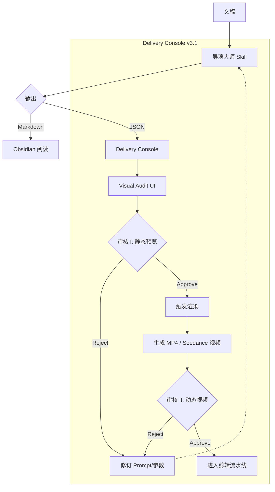

# 视觉审核工作流 (Visual Audit Workflow)

> **版本**: v1.0
> **更新时间**: 2026-02-15
> **核心目标**: 通过"静态预览"与"动态渲染"双重审核，提升视频生产质量与效率。

## 1. 概览

## 2. 详细步骤

### Step 1: 导演大师生成方案
- **输入**: 视频文稿
- **输出**:
    - `phase3_完整执行方案_[项目名].md` (人读)
    - `visual_plan.json` (机读)
- **JSON 规范**: 必须包含时间戳、镜头类型(type)、Prompt/Props、参考图。

### Step 2: 静态审核 (Static Audit)
在 Delivery Console 的 Visual Audit 页面：
- **Remotion**: 查看关键帧截图 (Start/Mid/End)，确认布局与文字无误。
- **Seedance**: 查看 Prompt 文本与参考图 (@Image)，确认风格与语义映射。
- **Artlist**: 查看搜索关键词与样片链接。

### Step 3: 渲染生成 (Render Generation)
- **Remotion**: 点击 "Render"，后台调用 Docker/CLI 生成 MP4。
- **Seedance**: 点击 "Generate"，调用 API 生成视频 (未来集成)。

### Step 4: 动态审核 (Dynamic Review)
在 Timeline 上播放生成的视频片段：
- 检查动态流畅度、转场衔接、音效卡点。

## 3. 异常处理

- **Schema 错误**: 如 `visual_plan.json` 格式不对，Console 报错并提示人工修复 Markdown。
- **渲染失败**: Console 显示错误日志，允许重试。
